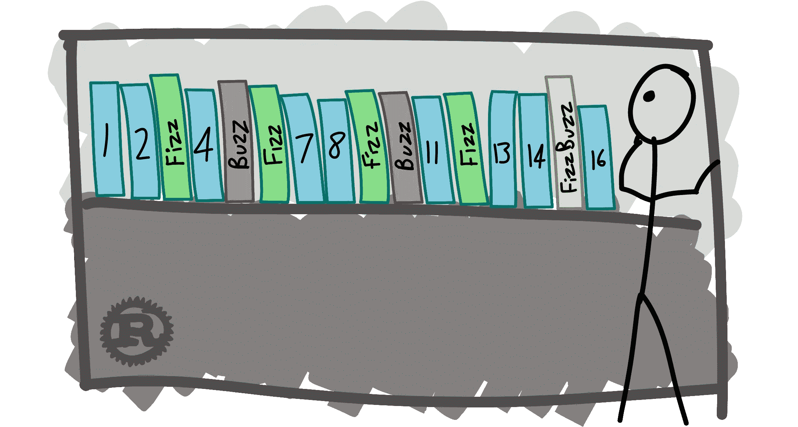

# FizzBuzzBazz:如何回答和不回答

> 原文：<https://itnext.io/fizzbuzzbazz-how-to-answer-and-how-not-to-answer-661fd8842c40?source=collection_archive---------1----------------------->

## 不要让 FizzBuzz 的一个小转折把你带进兔子洞



来源: [www.chrismorgan.info](http://www.chrismorgan.info)

FizzBuzz 是臭名昭著的淘汰编码挑战，一些招聘经理在真正的测试开始前将其作为热身或增强信心的测试。如果你正在读这篇文章，你可能知道这个问题和答案是怎么回事，但我会把它写在这里供再次参考。

> 写一个程序打印从 1 到 100 的数字。但是对于三的倍数打印“嘶嘶”而不是数字，对于五的倍数打印“嗡嗡”。对于同时是 3 和 5 的倍数的数字，打印“FizzBuzz”。

教科书对这个问题的回答如下:

```
const fizzbuzz = () => {
  for (let i = 1; i <= 100; i++) {
    if (i % 3 === 0 && i % 5 === 0) {
      console.log('FizzBuzz');
    } else if (i % 3 === 0) {
      console.log('Fizz');
    } else if (i % 5 === 0) {
      console.log('Buzz');
    } else {
      console.log(i);
    }
  }
}fizzbuzz() // 1, 2, 'Fizz', 4, 'Buzz', 'Fizz', 7 .. 14, 'FizzBuzz', 16, 17 ..
```

关于如何回答 FizzBuzz，我得到的普遍共识是不要耍小聪明，只要按照上面的逻辑继续前进。

让潜在雇主知道你知道 if-else 语句、迭代和将`Hello, World`输出到控制台，然后继续进行真正的*面试。*

然而，面试官可能会给这个问题增加一点麻烦，可能会问你这样的问题:

> 好，现在我想让`fizzbuzz()`处理 7 的倍数。
> 
> 所以如果一个数是 7 的倍数，我想输出' Bazz '
> 
> 对于 7 和 3 的倍数，我想输出‘fizz bazz’
> 
> 对于 7 和 5 的倍数，我想输出“BuzzBazz”
> 
> 对于 3、5 和 7 的倍数，我想输出‘FizzBuzzBazz’。

所以这里要避免的兔子洞是继续添加类似下面这样的`if-else`语句:

```
const fizzbuzz = () => {
  for (let i = 1; i <= 100; i++) {
    if (i % 3 === 0 && i % 5 === 0 && i % 7 === 0) {
      console.log('FizzBuzzBazz');
    } else if (i % 3 === 0 && i % 5 === 0) {
      console.log('FizzBuzz');
    } else if (i % 3 === 0 && i % 7 === 0) {
      console.log('FizzBazz');
    } else if (i % 5 === 0 && i % 7 === 0) {
      console.log('BuzzBazz');
    } else if (i % 3 === 0) {
      console.log('Fizz');
    } else if (i % 5 === 0) {
      console.log('Buzz');
    } else if (i % 7 === 0) {
      console.log('Bazz')
    } else {
      console.log(i);
    }
  }
}fizzbuzz() // 1, 2, 'Fizz', 4, 'Buzz', 'Fizz', 'Bazz'...13, 'Bazz', 'FizzBuzz', 16, 17..
```

我们可以看到，对我们的`fizzbuzz()`函数的一点小小的改动就让我们的 if 语句呈指数级膨胀。如果你真的在白板上写下了以上内容，面试官很可能会问你把 9 和“Bozz”联系起来。

然后，除非你有先见之明，在开始解决问题时，在白板上留出三倍的空间，否则你很可能没有任何工作空间。

# 解决方案:字符串连接

通过利用字符串连接，我们可以如下摆脱`else if`的纠缠:

```
const fizzbuzz = () => {
  for (let i = 1; i <= 100; i++) {
    let output = '';
    if (i % 3 === 0) { output += 'Fizz' };
    if (i % 5 === 0) { output += 'Buzz' };
    if (i % 7 === 0) { output += 'Bazz' };
    if (output === '') { output = i };
    console.log(output);
  }
}
```

对于我们迭代的从 1 到 100 的每个整数，我们将`output`重置为空字符串，然后连接给定循环中与该整数相关的任何字符串值，然后将结果`output`记录到控制台，并移动到下一个整数。

如果一个整数不与任何指定的倍数相关联(比如说`i = 8`，输出将被转换成循环当前正在迭代的整数。

现在，如果面试官想让你处理一个 9 和“Bozz”相关联的案例，我们只需要插入一行额外的`if (i % 9 === 0) { output += 'Bozz'}`，这样我们就可以避免一些排列逻辑的麻烦。

# 优化的(？)解决方案:加入一个散列值

也许在这一点上，面试官可能会抱怨代码太重复，可能会要求你清理代码。

在这种情况下，面试官可能只是微妙地测试你的散列知识，我们可以如下重构我们的代码:

```
const fizzbuzz = () => {
  const fizzHash = {3: 'Fizz', 5: 'Buzz', 7: 'Bazz'}; for (let i = 1; i <= 100; i++) {
    let output = '';
    for (let num in fizzHash) {
      if (i % num === 0) { output += fizzHash[num] }
    }
    if (output === '') { output = i };
    console.log(output);
  }
}
```

这个版本的优点是，如果我们想添加额外的情况，即 9: 'Bezz '，13: 'Lizz' 21: 'Luzz '，我们只需在我们的`fizzHash`常量中添加额外的键值对。

与之前的解决方案相比，这种重现的重复性更低，因为我们没有看到几乎相同的 if 语句块。

话虽如此，在我们的“优化”确定之前的代码*读起来*更好，也更容易理解——尤其是当只处理“嘶嘶”、“嗡嗡”和“巴兹”的时候

如果我们曾经被要求回答经典的 FizzBuzz 问题，并且我们从编写一个涉及到遍历散列的解决方案开始，我们肯定会发现自己处于“可爱”或“过度工程化”的领域。

# 结束语

正如一位资深开发人员的这篇伟大的[帖子](https://hackernoon.com/why-senior-devs-write-dumb-code-and-how-to-spot-a-junior-from-a-mile-away-27fa263b101a)所建议的，首先编写可读且[愚蠢的](https://hackernoon.com/why-senior-devs-write-dumb-code-and-how-to-spot-a-junior-from-a-mile-away-27fa263b101a)代码。如果面试官问的以下问题导致你写了一堆乱七八糟的代码，不要惊慌，后退一步，让面试官知道当前的方法不是很有效，并尝试提出一个更好的解决方案。

在 FizzBuzzBazz 的例子中，摆脱困境并不意味着直接去书架顶层挑选一个新奇的数据结构。(即子数组、映射、集合、散列等的数组。)这只是 if 语句逻辑中的一个小调整，并使用了字符串连接。使用散列只是一个很好的额外接触，取决于你问谁。

我希望你喜欢这篇文章。请随意在下面留下一些掌声！