# 大规模库伯内特集群的车队管理——牧场主车队

> 原文：<https://itnext.io/fleet-management-of-kubernetes-clusters-at-scale-ranchers-fleet-de161cc52325?source=collection_archive---------1----------------------->

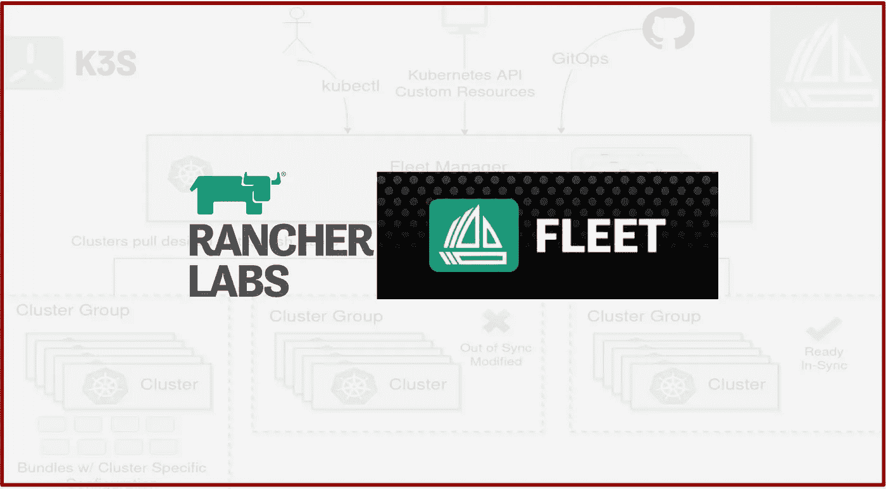

Kubernetes 集群车队控制器

将独立的 Kubernetes 集群部署到边缘位置、异构云平台、本地数据中心等。如今，一种常见的模式是提供一个统一的平台来运行边缘、物联网和多云空间中的应用和服务。此外，在物联网世界中，边缘在空间上分布在内部和云环境中，还有更复杂的运输软件用例。

Rancher 的多集群管理已经支持在多个集群上同时部署和管理应用程序，用户必须从 UI 中专门选择目标集群/站点，这在管理 1000 个集群时无法扩展。现在，随着 fleet 的引入，这种配置可以是无缝的，可以使用部署规范中的配置将群集作为目标。

[Rancher's fleet](https://github.com/rancher/fleet) 使用户能够像管理一个集群一样轻松地管理多个集群。用户可以从一个中心 Kubernetes 集群跨集群部署捆绑包(资源集合),并使用粒度目标/分组配置控制部署。捆绑包不仅包括应用程序部署清单，还包括任何可以被描述为 Kubernetes 资源的东西。

Rancher 已经支持导入已经由任何安装工具设置好的 Kubernetes 集群，方法是部署 Rancher 代理来实现服务器和集群之间的通信。集群所有者可以启用监控和日志记录、启用 Istio for service mesh、配置管道、管理访问等。在导入的集群上。v2.4.0 中增加了将 K3s Kubernetes 集群导入 Rancher 的功能，导入的 K3s 集群可以通过在 Rancher UI 中编辑 K3s 集群规范进行升级，该 UI 提供了从中央控制平面对大量 K3s 集群的集群级管理。Fleet 与 Rancher 和 K3s 相结合，可在集群和应用部署级别提供真正的车队管理。

# 架构和组件

车队由两个主要部分组成。车队控制器和集群代理。在 Kubernetes 集群上部署了一个 fleet-controller 以及所需的 Fleet-CRD，用户可以从这里在组成 fleet-agent 的所有其他注册集群上操作部署(使用传统 API 或 GitOps)。Fleet 是轻量级的，足以在最小的部署上运行，甚至在只管理自身的单节点集群中也有优势。

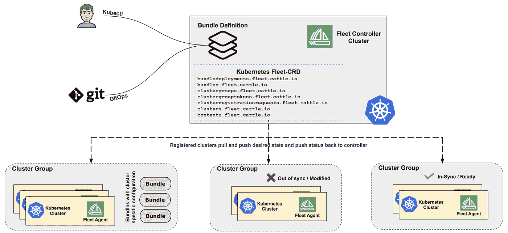

牧场主的舰队——建筑

# 车队经理/管理员:

机群控制器是一组跟踪所有相关机群资源类型的 [Kubernetes 控制器](https://kubernetes.io/docs/concepts/architecture/controller/)，可以在任何标准 Kubernetes 集群上运行。车队管理器公开的唯一 API 是 Kubernetes API，没有为车队控制器定制的 API。车队管理员包括管理 Kubernetes 集群车队所需的 CRD。

车队管理员——库伯内特斯·CRD

**资源类型:**

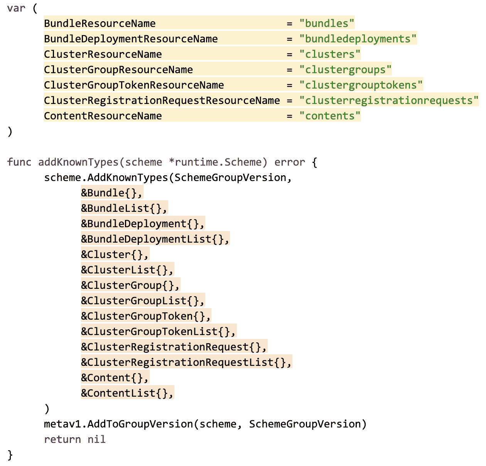

车队控制器—资源类型

# 车队集群代理:

从车队控制器到成员集群的所有通信都是通过部署在相应集群上的车队代理进行的。每个集群中运行一个集群代理，负责与群控制器通信，所有群代理都应该能够访问群控制器(Kubernetes API)以获取和推送更新，所有受管集群都可以在专用网络(NAT 后)中运行，因为群控制器不访问成员集群(只需要连接:代理— ->控制器)。

# 聚类注册

各个集群上的所有机群代理使用集群组令牌安全地注册到机群控制器，并且所有注册的集群拉和推期望的状态，将状态推回控制器。车队控制器动态创建服务帐户，管理它们的 RBAC，然后将令牌分配给集群。必须生成集群组令牌才能将集群注册到群组控制器。默认情况下，此令牌将在 1 周后过期。TTL 是可以改变的。生成的集群组令牌可以在注册新集群仍然有效时反复使用。

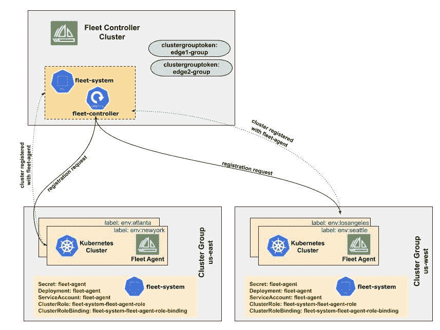

车队-集群注册

集群注册涉及多个控制器，为集群组创建集群组令牌，并且集群组(包含使用公共集群组令牌注册的集群组)可以包含具有不同标签的多个站点(标签可以用于特定于集群的选择)。通过在捆绑包中提供所需的配置，用户可以在 ClusterGroup(在组中的所有单个集群上部署资源)或 ClusterSelector(在组中的单个集群上部署资源)或两者上将集群作为部署资源的目标。

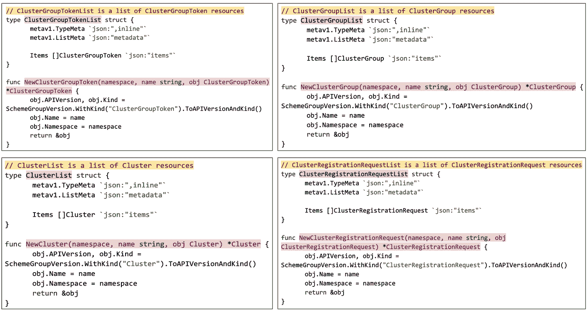

车队-样本集群对象

**样本对象:**

如下所示，为两个'*cluster group ' s '*edge-us-east 和 edge-us-west 创建了两个' *clustergrouptokens'* 。每个集群组包括具有不同标签的两个单独的集群，这些集群使用各自的集群组令牌进行注册。

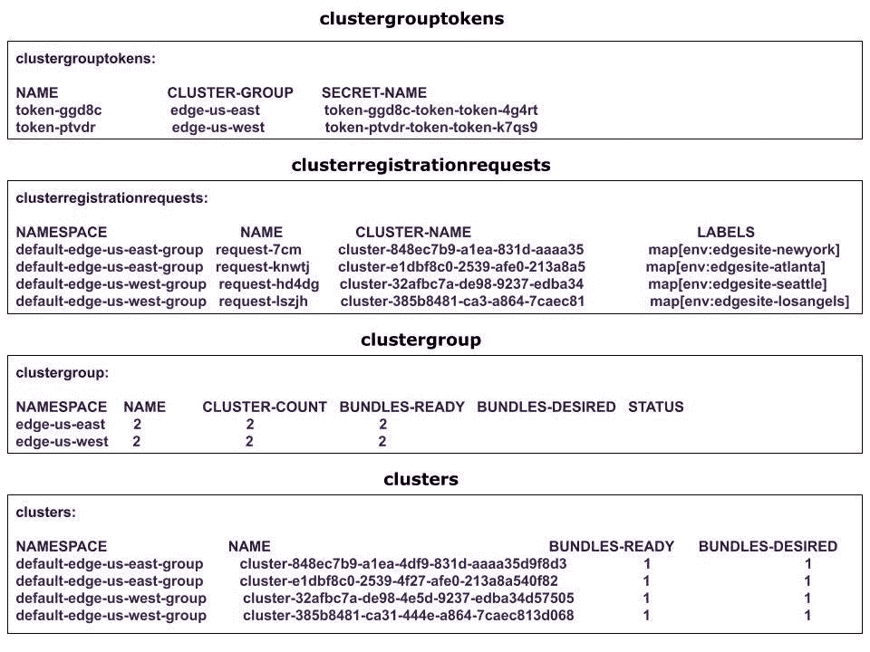

车队-样本集群对象

# 束

捆绑包是资源的集合，包括附加的特定于部署的信息，可以部署到多个集群。每个包都是一个定制资源，完全封装了所有的部署规范。Fleet 使用捆绑包将磁盘上的捆绑包(一组文件)表示为一系列单独的文件，而不是管理一个嵌套了 YAML 文件的大型 YAML 文件，fleet apply 将构建捆绑包资源并将其部署到 fleet controller。

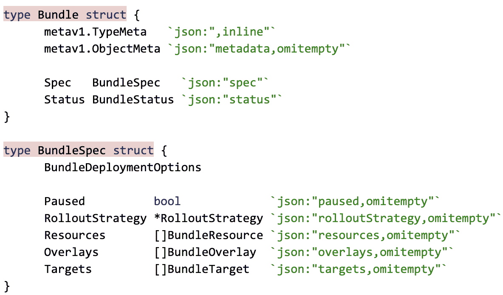

车队—捆绑规格

捆绑包利用多种方式将 YAML 渲染到 Kubernetes 资源:基于 Kubernetes YAML、Helm 或 Kustomize 的方法，以及组合这三种方法的选择。

# 捆绑布局:

捆绑包布局用于在磁盘上供舰队命令读取，也是捆绑包自定义资源中嵌入资源的预期结构。

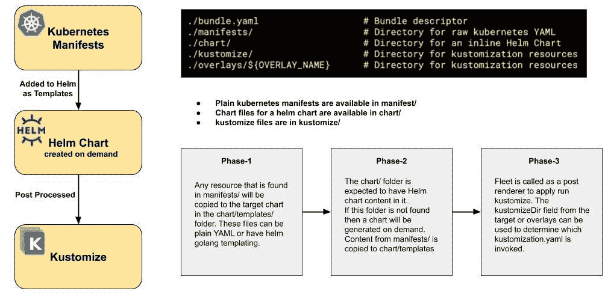

车队—管束布局/组件

# 捆绑策略:

用户可以选择使用普通 Kubernetes YAML，头盔，Kustomize，或三者的组合。

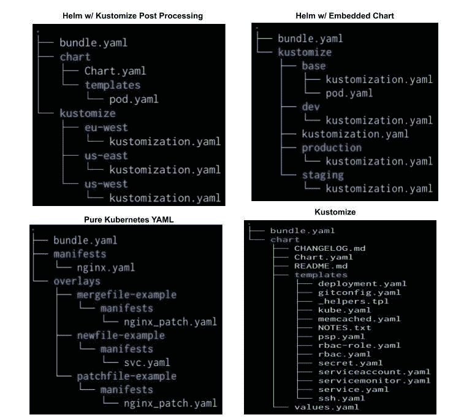

车队捆绑策略

Kustomize 与头盔和覆盖可以提供一个配置，可以跨地区分布，而不必改变标准/基本配置。将 Kubernetes 清单与 Kustomize 和 Overlay 相结合的典型示例如下所示:

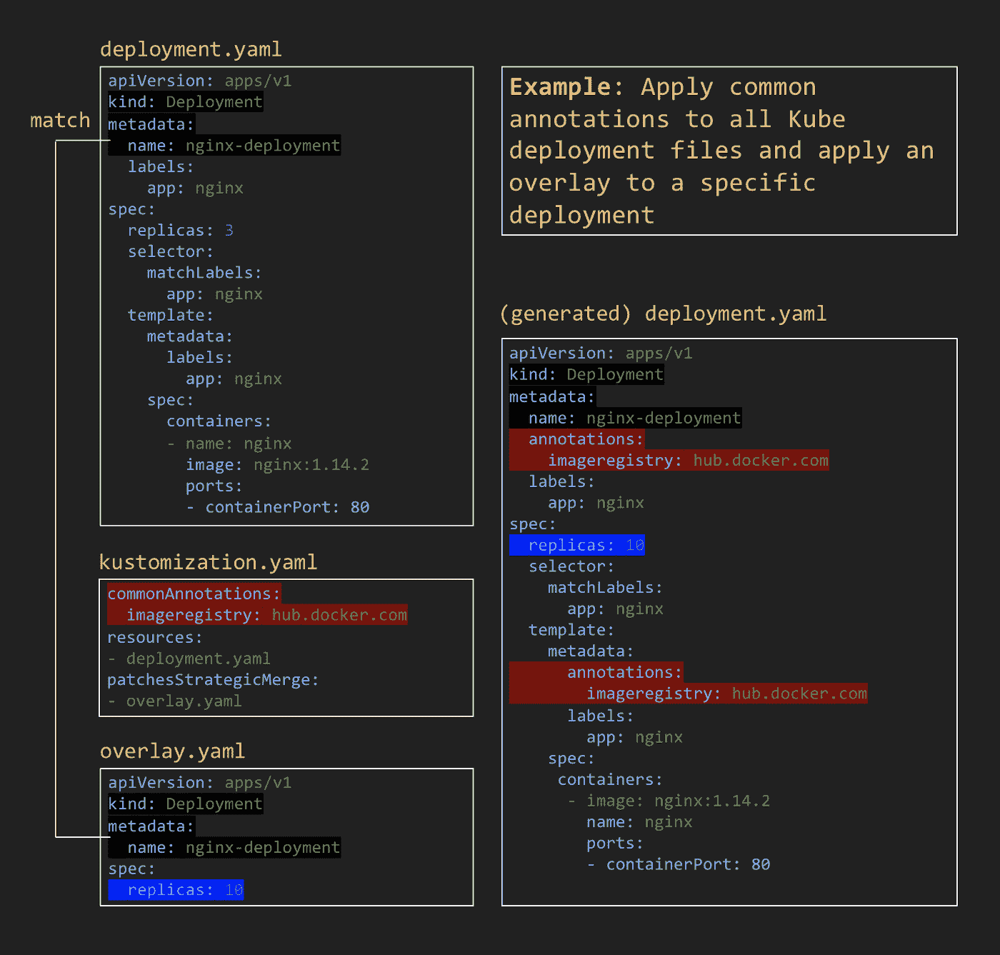

Kustomize —示例配置

# 配置选项— bundle.yaml:

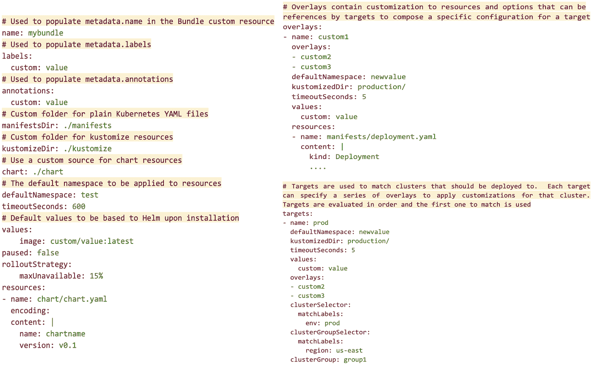

车队—捆绑包配置选项

# 集群目标匹配

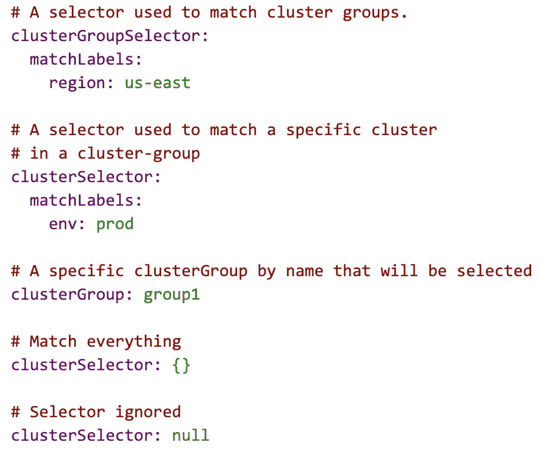

舰队—集群目标配置选项

相同名称空间中所有集群组中的所有集群都被认为是针对所有集群目标评估的。逐一评估目标列表，第一个匹配的目标将用于该集群的捆绑包。如果不匹配，该包将不会部署到集群。有三种匹配聚类的方法。可以使用集群选择器、集群组选择器或显式集群组名称。

# 试用

下面拓扑包含三个集群组，每个集群组有两个集群。集群组' *edge-us-west'* 和' *edge-us-east* '包含两个运行 k3 的集群，每个集群在 Vultr 上跨区域的单个虚拟机上启动。集群组' *edge-onprem-arm64'* 包含两个在 Raspberry Pi-4 上运行 K3s 的集群，这是为了表明成员集群可以通过专用网络在 NAT 后运行。

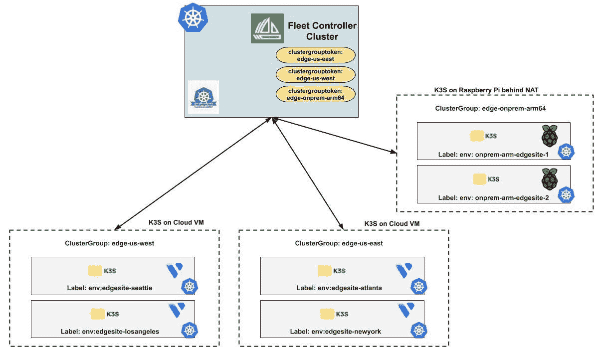

车队—测试拓扑

基于云的 K3s 集群:

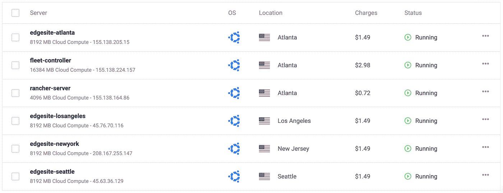

车队—测试拓扑—基于云的集群

# 使用 clusterGroupSelector 部署软件包

bundle 配置中的' *clusterGroupSelector* '允许用户根据集群组标签或集群组名称来匹配集群。

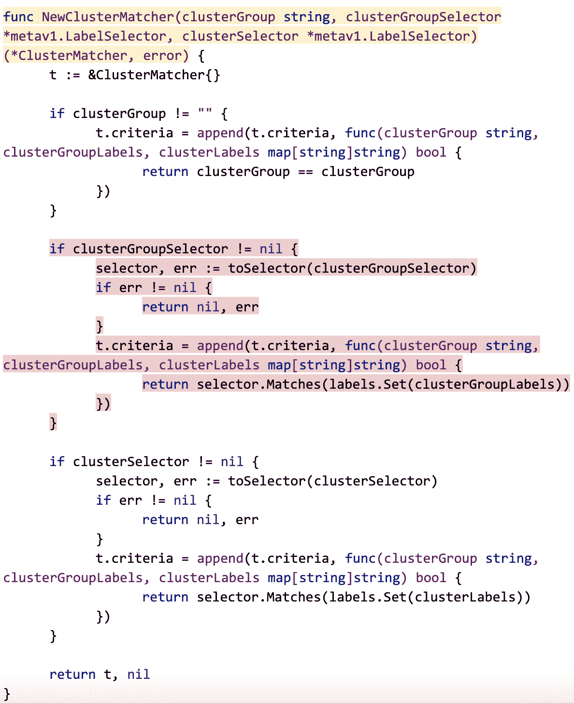

车队-集群组选择器规范

使用 Helm 和 Kustomize(包括清单/模板中的 YAML)的示例捆绑包配置如下所示，使用 fleet 部署，fleet 使用标签和名称分别选择每个集群组。由于拓扑中的每个集群组都有两个集群，因此将跨所有集群创建 6 个 pod，每个 pod 一个。如下所示，kustomize 目录对每种集群类型都有单独的配置，其中添加了带有集群区域的名称前缀。Helm 包含一个样本 pod 模板:“名称:应用程序 pod”。bundle.yaml 由目标部分中的匹配器组成，这些匹配器使用“cluster group selector”(metadata . labels . region)和“cluster group”(metadata . name)对集群组进行分组。

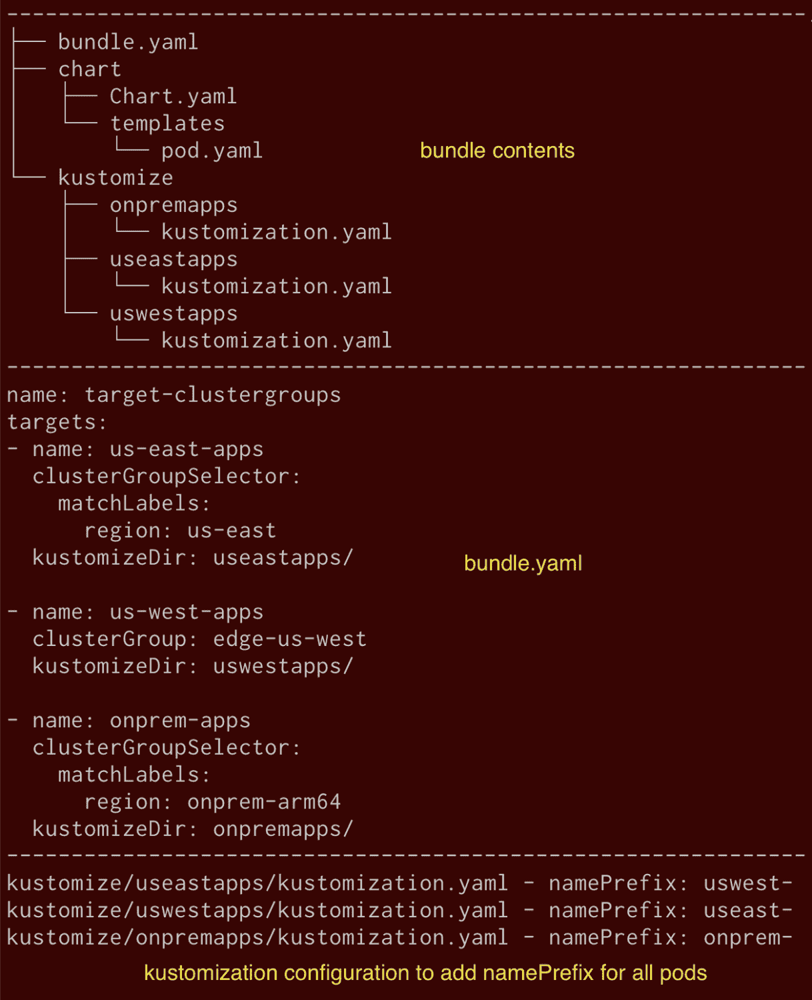

机群—集群组选择器捆绑包配置

如下所示，每个集群组都有一个唯一的名称和与之关联的标签(在本场景中为 region)。最初，在部署以上捆绑包之前，机群显示了所有三个集群组，每个集群上有两个捆绑包(代理相关的控制平面)。

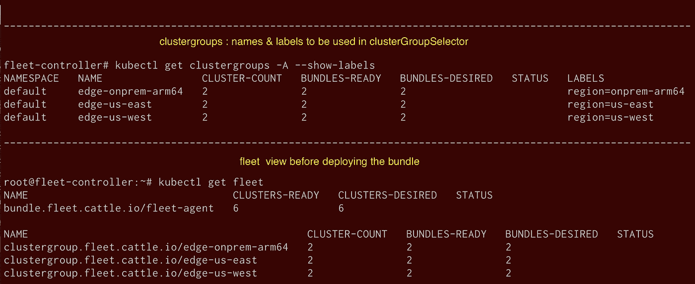

车队-集群组选择器

部署捆绑包“target-clustergroups”在所有集群上部署了该捆绑包。如下所示，一个捆绑包被添加到设备输出中的所有集群，“clusters-desired”显示所有 6 个集群都具有配置中提供的部署，“bundle-deployments”显示每个集群都有一个使用唯一名称(命名空间-集群组名称-集群-**)部署的捆绑包。

车队-集群组选择器

如下所示，使用配置中的 Helm 图表将一个 pod ( <region>-application-pod)部署到所有三个集群组(每个集群有 2 个集群)，并且所提供的 Kustomize 配置为每个 pod 添加了一个名称前缀。类似地，用户可以使用' *clusterGroupSelector'* '来控制跨异构环境(边缘站点、云、专用网络中的设备等)的特定集群上的部署。)基于集群组标签和名称。</region>

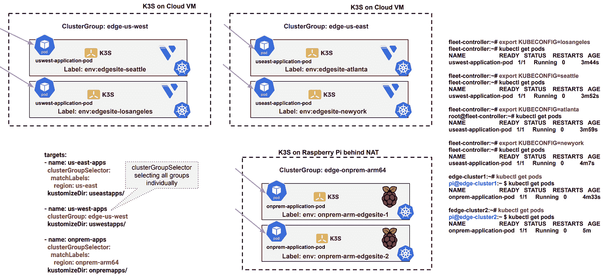

Fleet- clusterGroupSelector 示例部署

可以在目标配置中使用标志“clusterGroup: {}”来在向控制器注册的所有集群上部署应用程序。

# 使用 clusterSelector 部署包

bundle 配置中的' *clusterSelector* '允许用户匹配集群组中的各个集群。此标志使用户能够使用集群注册期间提供的标签唯一匹配/定位分布在集群组中的各个集群。

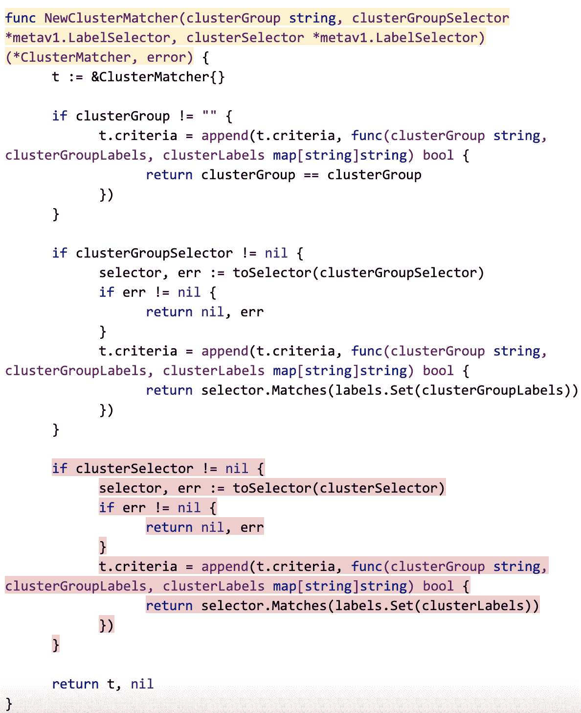

车队-集群组选择器规范

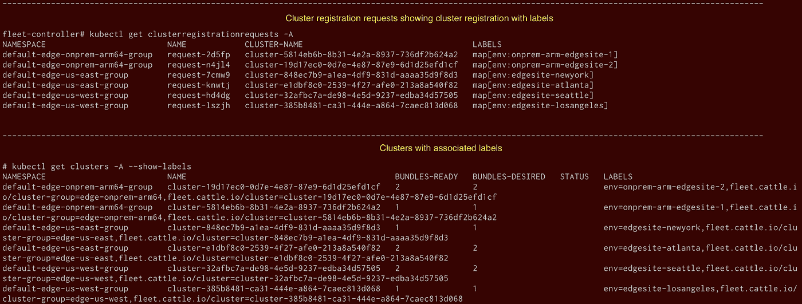

车队分类标签

使用 Helm 和 Kustomize(包括清单/模板中的 YAML)的示例包配置如下所示，使用 fleet 部署，fleet 使用标签分别选择集群组的每个集群部分。如下所示，kustomize 目录对每种集群类型都有单独的配置，其中添加了带有集群区域的名称前缀。Helm 包含一个样本 pod 模板:“名称:应用程序 pod”。bundle.yaml 由 target 部分中的匹配器组成，这些匹配器将使用标签的集群与使用“cluster selector”(metadata . labels . env)注册的集群关联起来。

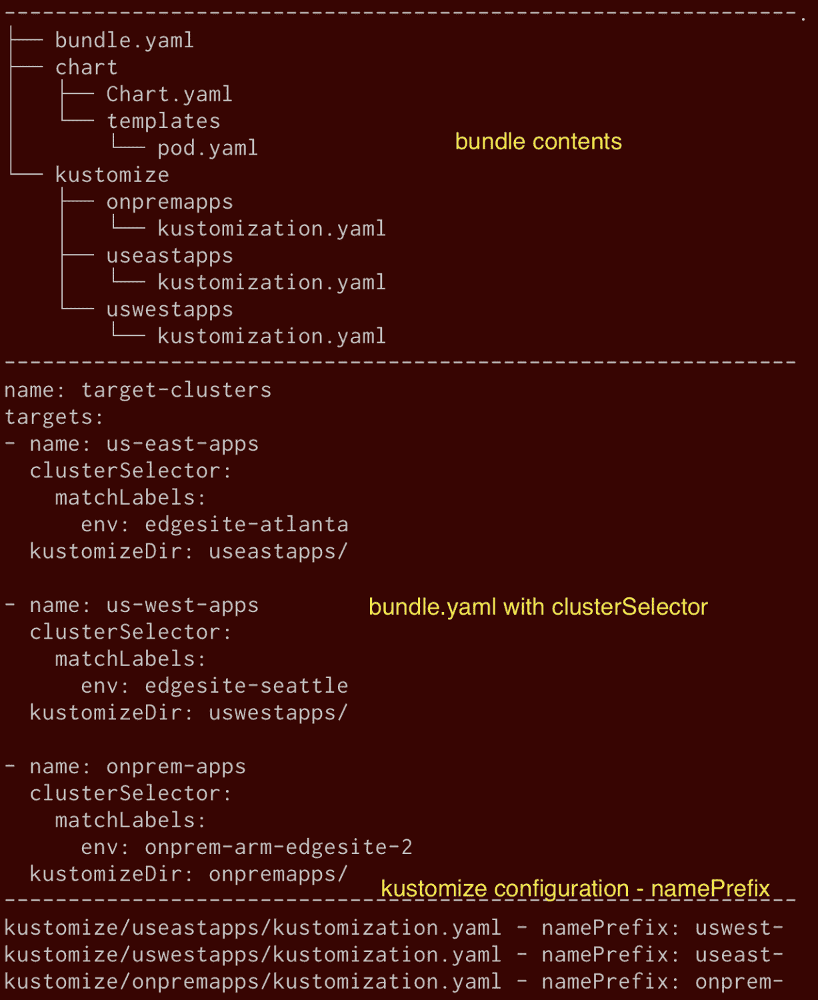

车队-集群选择器示例捆绑配置

部署捆绑包“target-clusters”将该捆绑包部署在三个不同集群组的三个集群部分上。如下所示，一个捆绑包仅添加到在目标配置中选择的三个集群中，“clusters-desired”显示 6 个集群中的 3 个具有配置中提供的部署，“bundle-deployments”显示三个集群具有使用唯一名称(命名空间-集群组名称-集群-**)部署的捆绑包。

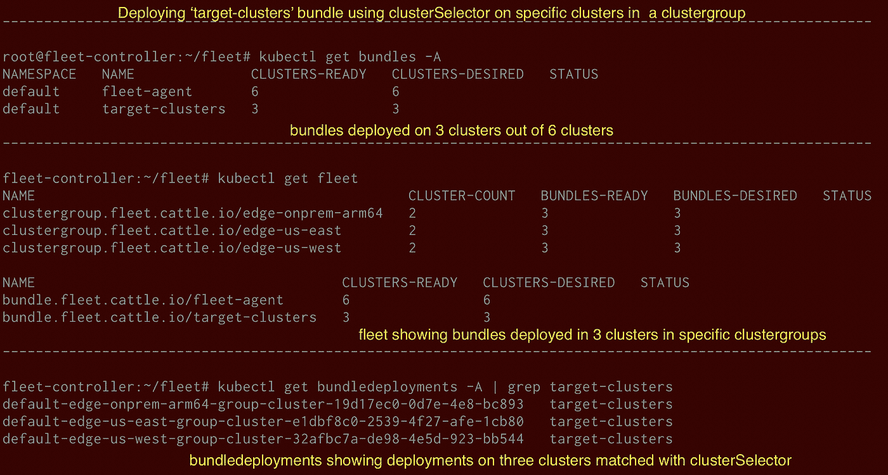

舰队集群选择器示例部署

如下所示，一个 pod ( <region>-application-pod)部署在三个不同集群组的三个集群上。用户可以使用“集群选择器”来选择特定的/单个的集群来部署资源。</region>

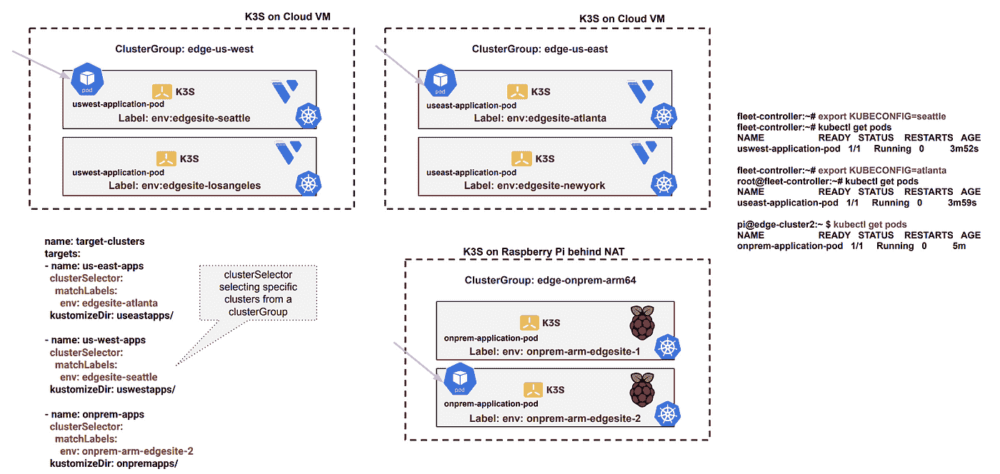

舰队集群选择器示例部署

可以在目标配置中使用标志“clusterSelector: {}”来在向控制器注册的所有集群上部署应用程序。

# 可视化—牧场主用户界面

有了 Rancher 新的[仪表板 UI](https://github.com/rancher/dashboard) ，用户可以导入车队控制器集群，仪表板从 UI 提供了成熟的车队对象可视化和编辑功能。除了设备级别的可视化，仪表盘还为用户提供了添加监控和日志记录的选项。K3s 群集也可以导入，如下所示:

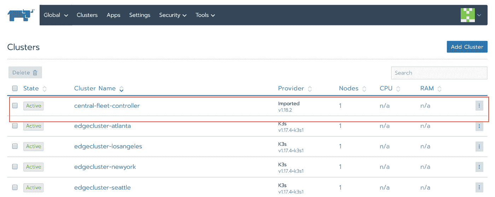

Rancher UI —导入的车队控制器集群和 K3s 集群

车队控制器集群:

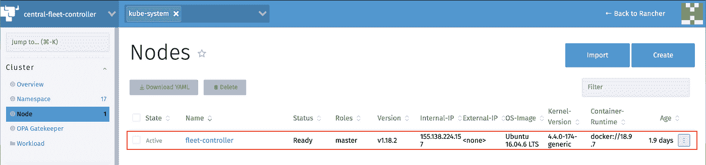

牧场主用户界面—车队控制器集群

为所有三个集群组生成的令牌:

添加替代文本

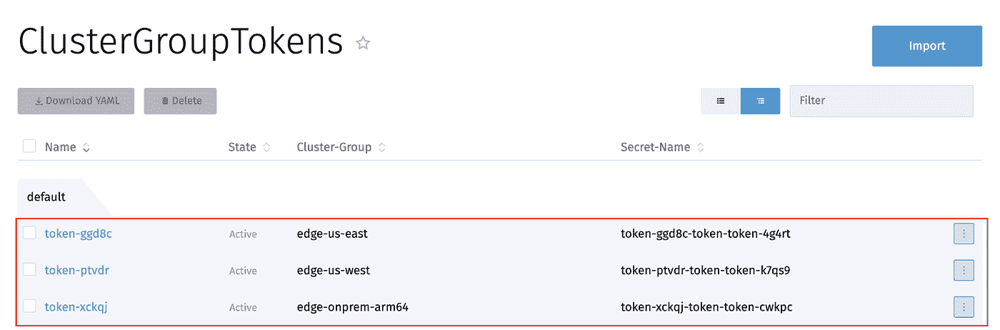

牧场主车队 UI —集群组令牌

三个集群组，每个组有两个集群，以及已部署的捆绑包的就绪/所需状态:

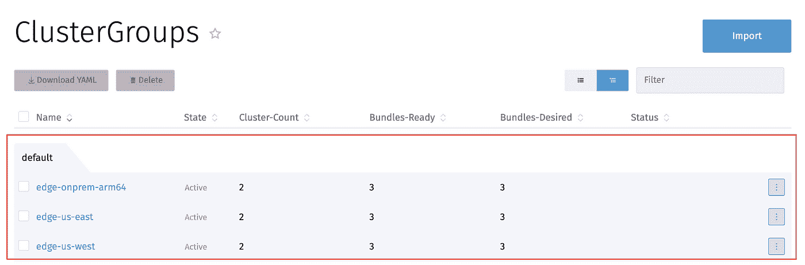

牧场主车队 UI-集群组

集群组式集群注册请求及其各自的标签:

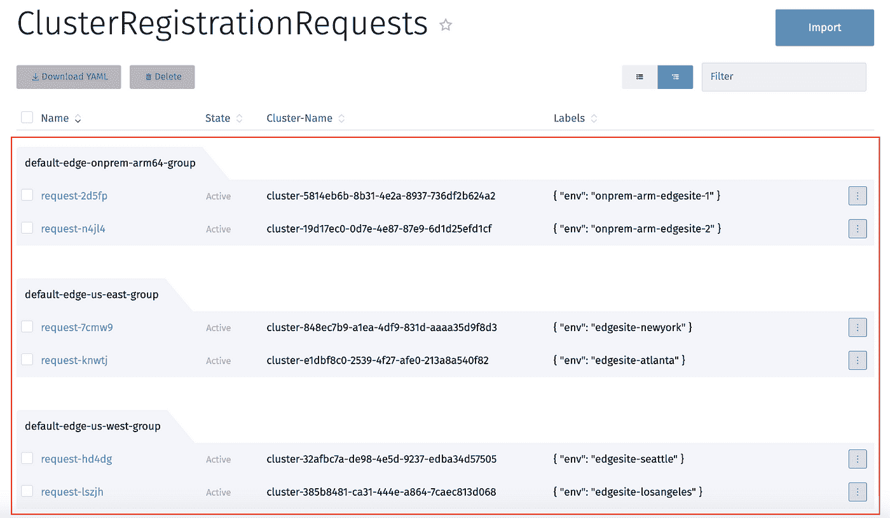

牧场主车队 UI —集群注册请求

在集群组下分组的各个集群以及在集群级别部署的捆绑包的就绪/所需状态:

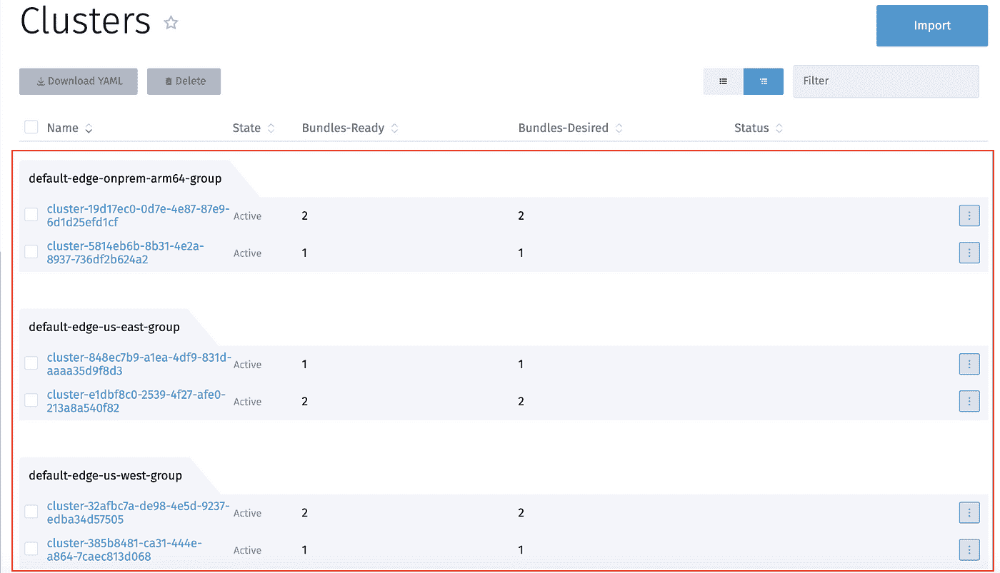

牧场主车队 UI —集群

已部署的捆绑包和可用性状态:

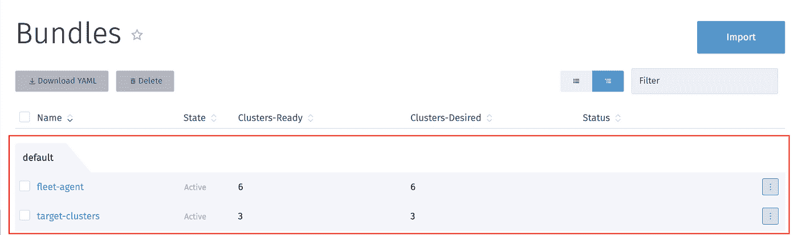

牧场主车队 UI —捆绑包

因为 Fleet 是作为标准的 Kubernetes API 实现的，所以它应该能够很好地集成到现有的生态系统中。随着多集群应用部署，可以容易地实施标准“每个集群必须安装 X 安全工具”或“特定集群组应该具有 GDPR 使能的服务”或“集群组中的特定集群应该具有唯一的应用”等。

部署在机群控制器集群中的 ArgoCD 或 Flux 等工具可以将资源从 Git 复制到机群控制器，然后由机群控制器管理代理集群上的部署，从而实现一个成熟的应用部署管道，该管道可以覆盖数十到数千个集群。

为每个存在点或每个监控摄像头运行 Kubernetes 集群的零售商，或在每辆联网汽车上运行集群的汽车公司，或在联网工业机器人、fleet 以及 Rancher 和 K3s 上运行基于小尺寸 ARM 设备的集群的制造公司，都可以通过将集群管理提升到一个全新的水平，在边缘计算中发挥显著作用。