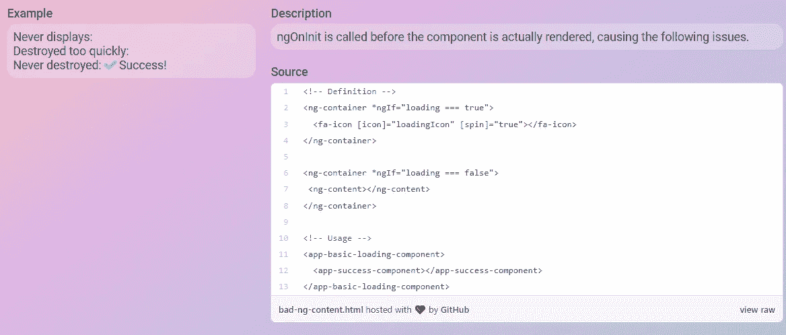

# 柔性角形部件

> 原文：<https://itnext.io/flexible-angular-components-82a5c391c25?source=collection_archive---------1----------------------->

## 使用 ng 模板的内容投影指南

[**源代码🧪**](https://github.com/Everduin94/erxk-article-playground/blob/main/src/app/components/loading.component.ts) **|** [**真人举例🦠**](https://erxk-article-playground.web.app/articles/ngTemplate)

关于[内容投影](https://angular.io/guide/content-projection)如何工作，以及在 Angular 中创建可重用组件的所有方法，有很多很棒的文章。

这篇文章更主观，我们将着眼于减少我们工具箱的“表面积”。—我们将选择使用 **ng-template** 和**ngtemplate outlet***进行所有内容投影。*

*风格-过滤我们的知识，磨练特定的技能/模式*

*参考 [Angular docs](https://angular.io/guide/content-projection) ，在内容投影中，我们可能希望实现三种情况。*

*   *单一时段:单一内容来源*
*   *多时隙:多种内容来源*
*   *有条件:仅在满足条件时呈现内容源*

*我们的例子是一个加载组件。这个加载组件将能够呈现多个状态，并有能力插入每个状态的自定义模板。*

## *单翼缝*

*几件事看起来有些过分。*

*“难道我们不能用 ng-content 达到同样的效果吗？”—是的。*

*"难道我们不能让模板保持无名而使用 TemplateRef 吗？"—是的。*

*在风格上，我更喜欢总是使用 ng-template，并且总是给我的模板命名。尽可能使用相同的范例对我来说很简单。随着复杂性的增加，这也是有利的。稍后将详细介绍。*

## *多槽*

*当我们开始利用多时隙内容投影时，我们只需使用完全相同的范例添加另一个模板。*

## *有条件的*

*当我们实现条件内容投影时。我们使用内容投影的方式没有任何变化。*

## *(附加)嵌套条件*

*我们可以继续利用 ng-template 在组件中嵌套相同的模式。*

*如果组件的用户没有提供模板，我们就使用默认值。*

## *(双倍奖金)通行证内容*

*在外部和默认模板中为我们的模板提供上下文。我们组件的结构没有改变。*

## *ng-内容和生命周期挂钩*

*前面，我提到总是选择 ng 模板而不是 ng 内容。*

*我更喜欢避免 ng-content，因为它会导致意想不到的行为。尽管这种行为已经被很好地记录下来，但是如果您没有阅读过关于 ng-content 的文档，它可能会成为一个耗时的陷阱。*

> *“当组件的消费者提供内容时，该内容总是被*初始化*，即使该组件没有定义`ng-content`元素或者该`ng-content`元素在`[ngIf](https://angular.io/api/common/NgIf)`语句中。”*

*假设我们想在完成加载后显示一条成功消息，时间正好是 4 秒钟。*

**

*根据加载程序花费的时间，ng-content 会产生不同的问题，这些问题可能很难跟踪。*

*   *如果加载时间与销毁时间相同，则不会显示成功*
*   *如果加载时间是销毁时间的一半，则成功会很快被销毁*
*   *如果加载时间比销毁时间长，成功永远不会被销毁*

*使用 ng 模板。success 组件的 ngOnInit 在呈现组件之前不会被触发。*

## *结论*

*我认为一旦你学会了基础知识，作为一名开发人员，学习你的风格和偏好会有很大的好处。就像职业运动员一样，他们因自己的风格而出名；因为他们磨练和专攻的技术。*

> *☁️[flotes](https://flotes.app)——尝试演示，不需要登录。或者免费报名。Flotes 是我记笔记和高效学习的方式，即使在我很忙的时候。*

**

*[flots](https://flotes.app)*