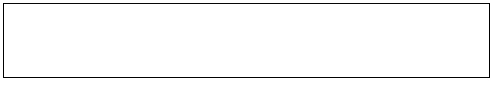
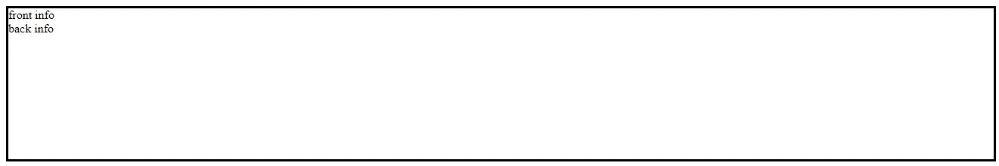
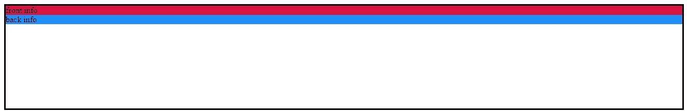
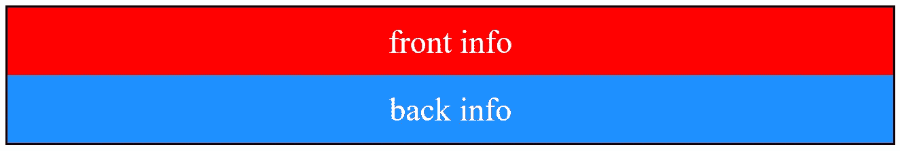
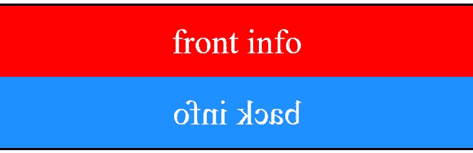
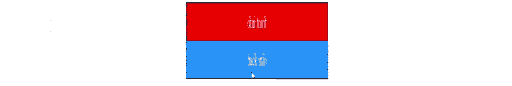
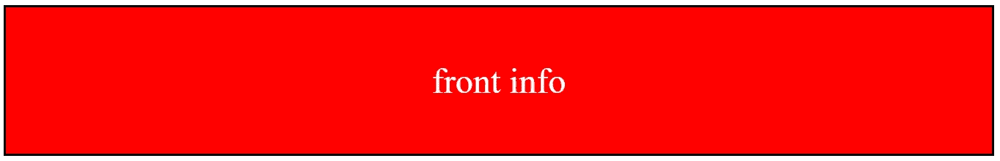
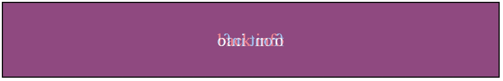
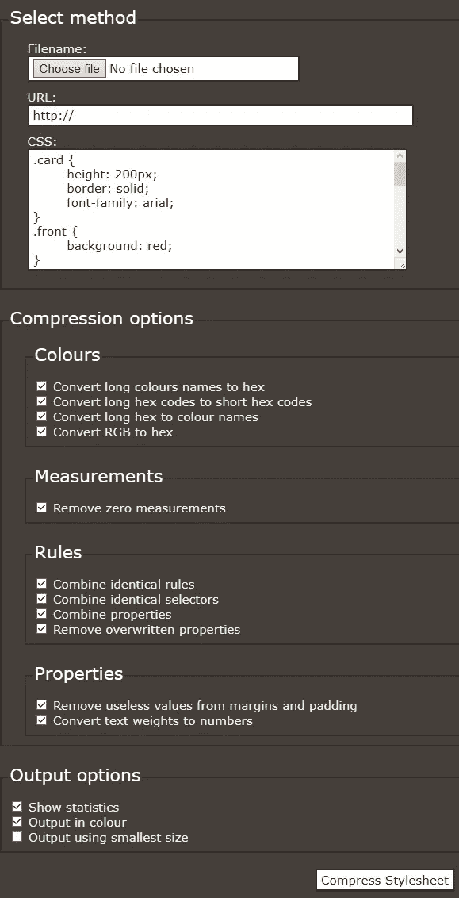
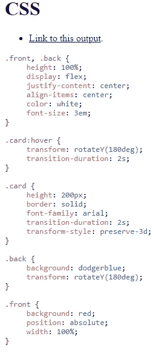

# 可翻转的 CSS 卡——如何创建一个当你悬停时翻转的 CSS 卡

> 原文：<https://itnext.io/flippable-css-card-how-to-create-a-css-card-that-flips-when-you-hover-af1ef763f3d2?source=collection_archive---------5----------------------->


## **什么是 CSS 卡？**

当你访问一个网站时，你可能会看到紧密组合在一起的元素，例如，在一个购物/电子商务网站上，你会看到包含产品图片和标题的框，在一个组合网站上，你会看到类似的东西，但与一个人及其职业有关，等等。

# **如何创建可翻转的 CSS 卡片:**

## **第一步:HTML**

为此，我们需要:

一.我们将使两个元素变得可翻转

二。“可翻转元件的容器”

这两个元素具有的类。正面和。背部

该容器具有的类。卡片

```
<div class="card">
 <section class="front"></section>
 <section class="back"></section>
</div>
```

此时，我们只能在代码中看到它，即当我们使用 **inspect 元素**或在 HTML 文件中。我们在可视化网页中看不到它。我们需要给它一些能见度


空元素没有高度

如果我们不声明宽度和高度，将为这些元素设置默认的宽度和高度。通常在许多浏览器中，空元素的默认高度是 0px。这意味着**我们不会在可视网页中看到**元素(我们只会在代码中看到，即当我们使用 **inspect 元素**时)。

## 第二步:可见性

从上面的截图可以看出，空元素没有高度，所以我们需要设置一个高度和边框

```
.card {
 height:200px; border:solid; 
 }
```

现在，您应该会看到类似这样的内容:



的。卡片元素现在有了固定的高度和边框

卡片的两面需要有一些信息:

```
<div class="card">
 <section class="front">front info</section>
 <section class="back">back info</section>
</div>
```



的。正面和。由于 back 元素不是空的，所以它们具有可见性。让我们用背景色给他们更多的可见度

```
.front {
 background: crimson;
 }
 .back {
 background: dodgerblue;
 }
```



> **增加更清晰的视觉效果**:正面和。back 元素对我个人来说太小了，所以我要这样修改它们:

```
.front, .back {
     /*half of the card's height*/ /* HEIGHT IS TEMPORARY */
     height:50%;
     /*center the text using flexbox*/
     display: flex;
     justify-content: center;
     align-items: center;
     /*white text looks better on a coloured background*/
     color: white;
     /*better font size*/
     font-size: 3em;
}
```



## 第三步:旋转。背部

我们现在需要旋转。使用**转换**属性的 back 元素

```
.back {**transform**: rotateY(180deg);}
```



## 第四步:悬停旋转。卡片

> H 悬停效果通过使用**:悬停**来实现

在这种情况下，我们可以使用:hover with。卡片类别


```
.card:hover {
 transform:rotateY(180deg)
}
```

> 注意:rotateY 不垂直旋转**元素**，它旋转垂直的**轴**，因此元素看起来像被水平翻转

## 第五步:放慢旋转速度

使用**过渡-持续时间**属性，您可以减慢变换属性


```
.card:hover {
 transform:rotateY(180deg;
 transition-duration: 2s 
}
```

> 问题:离开鼠标会使卡片过渡太快，我们希望离开鼠标的过渡时间是一样的

对此的解决方案是使用正常状态**和**的过渡持续时间，如下所示:



```
.card {
 transition-duration: 2s;
 }
```

的转场持续时间属性。卡片和。卡:悬停是平等的

## **第六步:3D'ness —绝对定位+ preserve-3d**

绝对定位会使一个元素(。在这种情况下是前面)保持在这样的位置:

```
.front {position:absolute;}
```


你看不见。前置，因为它停留在一个地方，其他元素覆盖绝对定位的项目(在可视网页中)

如果你想看。前面的元素，把不透明度。放弃

```
 .back {
 opacity:0.5
}
```


**发生了什么**:你看到了。前面**的*到*的**的。背面元素

我们想要的:我们想要看到。**的前元素*顶*的前元素**。背部

的。卡被视为平面对象，因此。正面和。背面元素粘在一起。我们需要把卡片变成一个三维物体

```
.card {
 transform-style:preserve-3d;
}
```


**区别:**在正常状态下，可以看到。在悬停状态下，可以清楚地看到。前面后面

## 第七步:全高。正面和。背部

**在步骤 2** 结束时，我们设置的高度。正面和。回到 50%。这是为了让我们可以直观地看到正在发生的一切。

现在我们已经看到了发生的一切，我们对此感到高兴，是时候设置我们想要的实际高度，也就是卡片的全高。

```
 .front, .back {
            /*FULL of the card’s height*/
            **height:100%;**
 /*center the text using flexbox*/
 display: flex;
 justify-content: center;
 align-items: center;
 /*white text looks better on a coloured background*/
 color: white;
 /*better font size*/
 font-size: 3em;
}
```


## 第八步:全宽。前面

```
.front {width:100%;}
```



正规状态



悬停状态

## **第九步:设置。背面不透明度回 1**

在此步骤中，我们可以移除**。背面{不透明度:0.5；}** 从我们的 CSS 或改变它的不透明度为 1，无论我们选择哪种方法，我们最终在悬停状态的外观:


## 最后你有:


## **补遗:用罗布森 CSS 压缩器更好的 CSS 文件**

现在 CSS 文件看起来像这样

请访问 Robson CSS Compressor，网址为:

[http://iceyboard.no-ip.org/projects/css_compressor](http://iceyboard.no-ip.org/projects/css_compressor)

将 CSS 复制并粘贴到 CSS 框中&取消勾选**使用最小尺寸输出(如果你不想缩小 CSS)**



你会得到这样的结果:



## 附录 2:个性化

您现在可以插入图像，例如头像、文本等。做一张合适的卡片

我创造了这个:


> firefox 问题:任何对 Firefox 有问题的人都应该试着把这个添加到他们的 css 中:

```
.front, .back {
 backface-visibility: hidden;
}
```

**如果你觉得这篇文章有用，请鼓掌或留下评论**

这些都是鼓励你做更多文章的动力

## **谢谢**