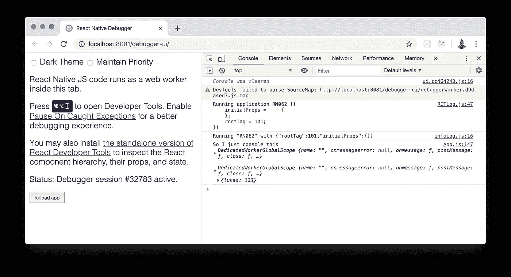
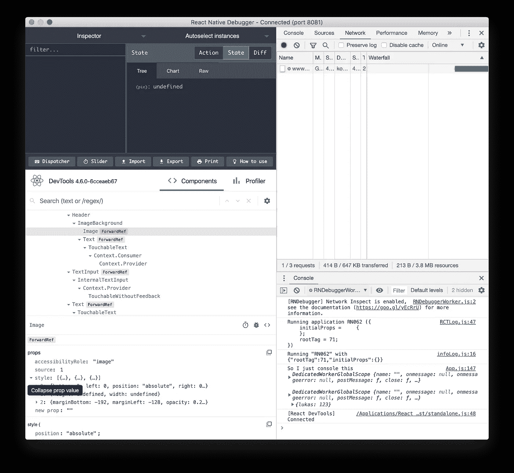
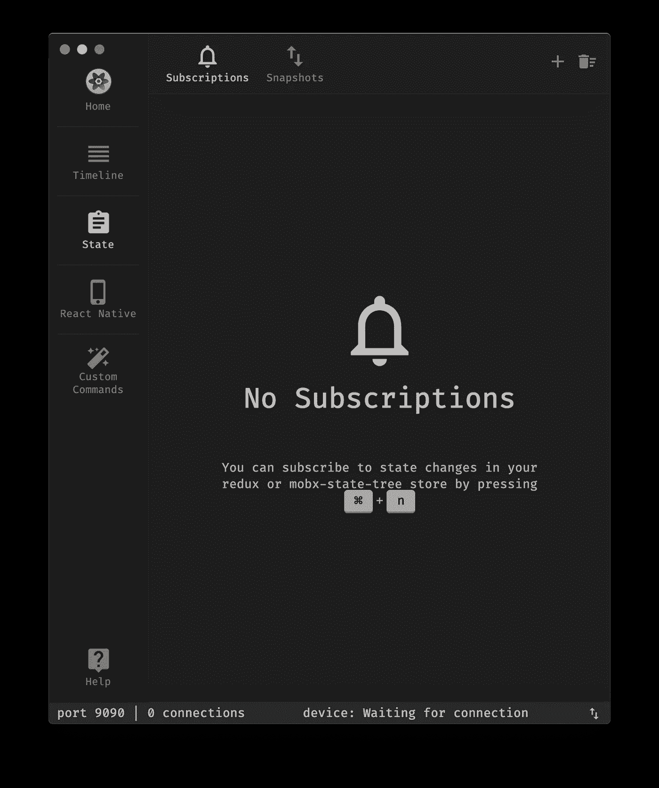
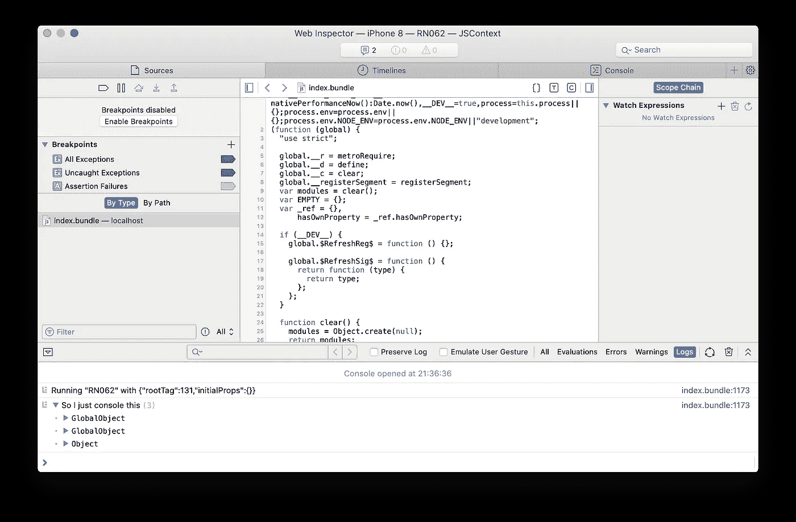
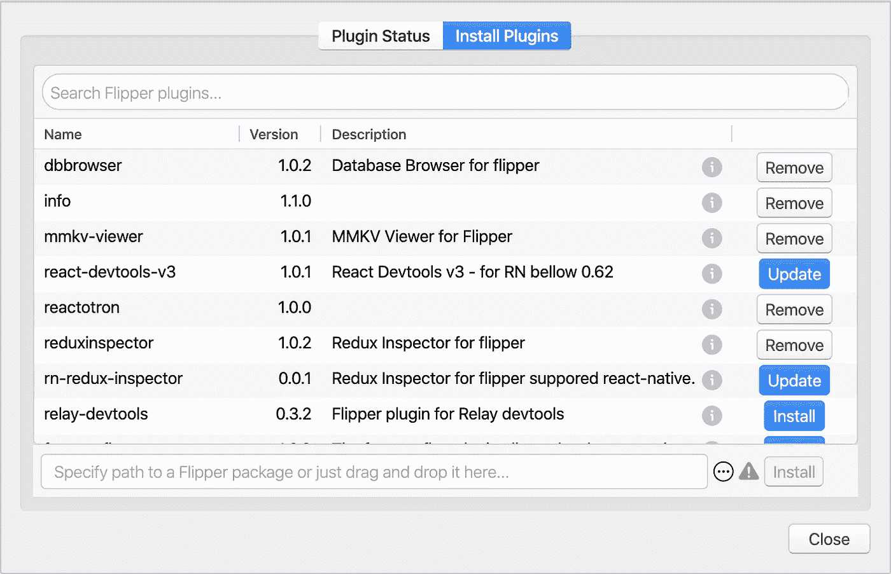
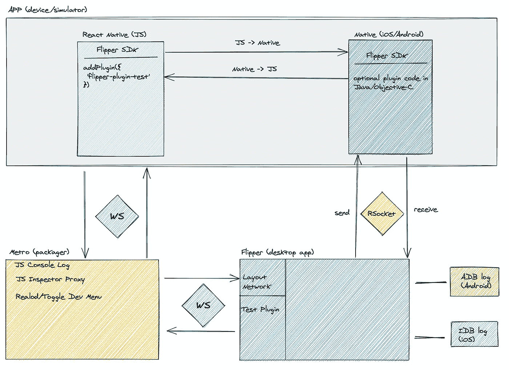
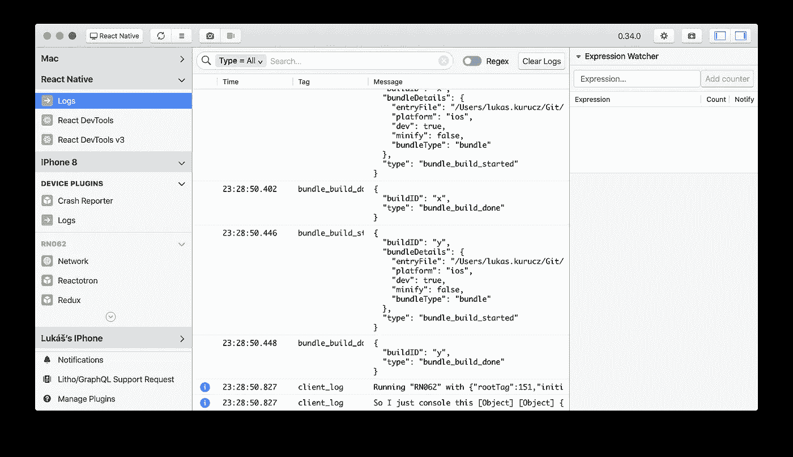

# 鳍状肢——一场反动的本土革命

> 原文：<https://itnext.io/flipper-a-react-native-revolution-4859d6acd685?source=collection_archive---------0----------------------->

我想谈谈最近集成的 React Native 开发工具 Flipper。我成为这个工具的超级粉丝，并相信它将是我们调试 React 本机应用程序的一场革命。

鳍状肢+反应本土= ❤️

在我深入研究 Flipper 本身之前，最好先了解一下我们今天使用的工具。

众所周知，开发者工具的选择非常“丰富多彩”,提供了许多不同的调试方法。

我试着编译我在 RN 应用程序工作中使用的工具。

## React 本地开发人员工具

我的第一个调试 React Native 的小步骤完全是用远程调试选项完成的。它使用 Chrome DevTools 作为调试/记录应用程序的接口。这个工作流程带来了我作为一名前 web 开发人员所希望的完美的开发体验。

使用 Chrome DevTools 进行远程调试

后来我发现，它和普通的网站用的 Chrome DevTools 不完全一样。没有网络日志，我不能使用 devtools 的许多内置功能，我的应用程序变得更慢。我无法检查我的 redux 状态或查看 React 组件树。如果我们回到我在网站上工作的经历，这有点糟糕。

在我寻找更好的工具时，我遇到了看起来非常相似的工具 [**React 原生调试器**](https://github.com/jhen0409/react-native-debugger) 。它使用 Chrome DevTools 的电子版，但它启用了网络标签来记录所有网络请求(在 JS 中调用),并在此基础上添加了 React + Redux DevTools。

React 本机调试器又名 React 本机瑞士刀

这将是我的文章，我们如何找到一个最好的开发工具，很好的结尾。但是我的标题会有点误导，在现实生活中事情并不那么容易发生，不是吗？

## 什么是远程调试？

在使用远程调试一段时间后，我们不得不提出一个问题，问自己它实际上是如何工作的？

总的来说，远程调试的工作方式非常简单，我们只需将 JS 代码的执行转移到不同的引擎上。运行引擎的进程是在我们自己的机器上启动的(不是在模拟器或真实设备中)。

因此，我们将在 Chrome (V8)中运行 JS，而不是使用 JavascriptCore(这是默认的 RN JS 引擎)。并通过 web socket 连接从 JS Native 发送所有命令。

这实际上听起来是一种很酷的调试方式。但是它有一个很大的缺陷，那就是环境本身。我们在一个引擎中运行我们的 JS 代码，它不会被我们的最终用户使用，这是一个很大的风险。迟早会有 bug，我们错误地将它发布到产品中，而没有在远程调试选项关闭时测试代码。

> 请注意，目前正在讨论将社区转移到"[直接调试](https://github.com/react-native-community/discussions-and-proposals/issues/206)"

## 什么是“直接”调试？

如果我们想停止使用远程调试，我们需要从 React 本地应用程序内部创建 web 套接字连接。

> 基本上在这个原则上，当调试运行时没有直接访问时，所有的浏览器 devtools 工作，甚至反应 Devtools。

这种方法的第一个例子是**反应堆晶体管**。它在 app 和 devtool 之间创建自己的 web socket 连接。

电抗器

它有各种各样的工具，涵盖了最基本的用例。我想说这个工具提供了总体上非常愉快的体验。但它缺少一些其他工具，如 React devtools 或更高级的网络日志。

我需要强调的一个想法是自定义命令，它允许用预定义的 UI 扩展 Reactotron。因此，我们可以在我们的应用程序和 Reactotron 之间交换自定义命令。

最后我想提一下尊贵的 devtool，它不太为人所知，但自从 React Native 开始，它就一直伴随着我们。

Safari DevTool (Safari Web 检查器)

它直接连接到 JavascriptCore，所以我们可以访问运行时，所以它不需要远程调试。但是它只支持调试 JS(源代码和概要分析器)和日志值。网络日志不可用。

> 根据我的经验，如果我们允许[内联源代码图](https://blog.nparashuram.com/2019/10/debugging-react-native-ios-apps-with.html)拥有更好的概要信息，整个运行时间将会大大降低，所以收集的数据并没有多大帮助。

最大的难点之一是，每次我们重新加载软件包时，它都会创建一个新的窗口…所以这对于这个工具来说是一个很大的问题。

许多 Safari Devtool 窗口…

这绝对不是我们可以使用的所有工具，Wix 还有令人惊叹的工具[排毒仪器](https://github.com/wix/DetoxInstruments)，以及其他适用于 iOS/Android 的原生工具。

选择最好的工具并不容易。每一种都有它自己的局限性。我们没有简单的方法来开发这些工具。大多数时候，它涉及到派生我们自己的版本，并以“hacky”的方式添加更多的功能。

到目前为止，调试 React Native app 的体验看起来就像一直在不同的工具之间周旋，并试图掌握它们…

引入工具来找出 React 本机应用程序性能中的回归问题

## 鳍状肢

哦耶，它来了。我为冗长的介绍道歉。我相信大多数人都是为了这篇文章而来的。我只是想在介绍 Flipper 时创造正确的视角。

所谓的革命承诺。你可能会觉得我们已经拥有了所有需要的工具，为什么还要再增加一个呢？

让我简单介绍一下它默认包含的所有工具列表:

*   网络日志——与 Chrome 中的非常相似
*   日志—结合了 *console.log* ，本地日志(ADB，IDB)
*   React 开发工具
*   Hermes 调试器——在 Android 上调试 Hermes 的简单方法
*   和 bunch more(主要集中在原生端)。

与我使用的其他工具相比，这个列表已经有所不同了。最棒的是，所有这些都是预装的，所以您不必花时间添加任何内容。它就在那里等着你用。

但是老实说，仅仅是将这些工具结合在一起并不是我所说的革命。

对我来说，革命在于脚蹼的延展性。它有一个非常相似的插件系统，就像我们从可视代码或 Chrome 中知道的那样。

Flipper 插件管理器(FPM)

> 也许将来我们都这样做: **fpm 安装 redux-devtools**

这意味着任何人都可以为 Flipper 贡献和发布插件。这使得这个工具非常强大。它实际上有无限的选择，我们现在可以做什么，并与他人分享。我仍然认为这个工具没有早点出现。当我有机会使用它时，它变得如此有意义。

[Flipper](https://fbflipper.com/docs/features/index.html) 网站已经很好地展示了所有的工具，所以我不会再浪费时间在这里做介绍了。

让我们来看看这个架构，看看我们如何能让这个工具变得更好。

## 体系结构

Flipper 通信快速概述

如果我们看一下上面的图表，我们可以看到三个主要部分。

首先是我们在设备/模拟器上运行的应用程序。App 本身由两部分组成 **Javascript** 和 **Native** (Objective-C，Java)。Flipper 插件既可以和 JS 端通信，也可以和 native 端通信。这取决于插件的类型。大部分时间 React 原生插件会在 JS 环境下运行。

应用程序和 Flipper 桌面之间的所有通信都是通过本机端进行的，它维护 RSocket 连接。

这就把我们带到了 Flipper app 本身，它负责发现所有正在运行的设备/模拟器，并显示插件的 UI。Flipper 应用程序是用 React 编写的，作为电子应用程序运行。它还使用 ADB/IDB 来收集日志并直接与设备通信。另一个沟通渠道是 Metro packager。

地铁打包机是最后一部分。它能够获得控制台。日志和重新加载/切换应用程序中的开发菜单(+一堆其他东西)。

这是 Flipper 架构的一个简要概述。它将帮助您更好地理解这个工具的潜力。

## 脚蹼的未来

现在预测 Flipper 的未来还为时过早，但迄今为止我的期望很高。

我真的迫不及待地想看到有多少新的插件将被添加，并看到反应原生社区的参与，这样我们就可以得到适当维护的插件。到目前为止，插件的体验并不完美，但 Flipper 团队正在努力改善这一点。

Reactotron 背后的团队刚刚发布了它的 Flipper 端口，这是另一个有希望的事实。这发出了一个强烈信号，脚蹼可能会成为一个非常受欢迎的工具。

一定要让我知道，你对脚蹼的第一印象是什么。我可能会写更多关于 Flipper 的文章。例如如何为 React Native 开发插件，介绍每个工具以及扩展它们或做出贡献的方式。

