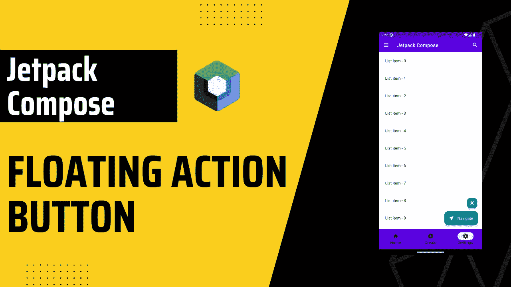
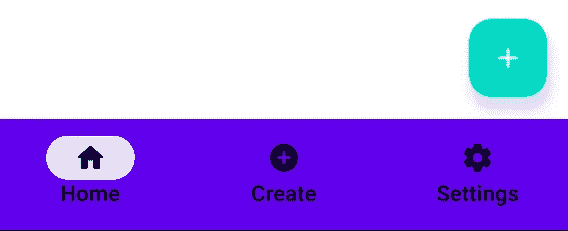
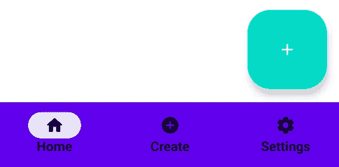
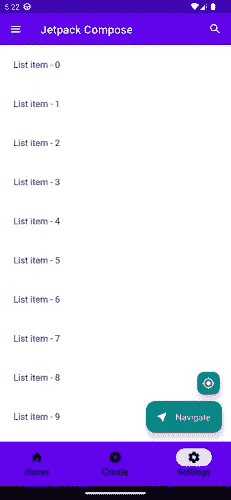
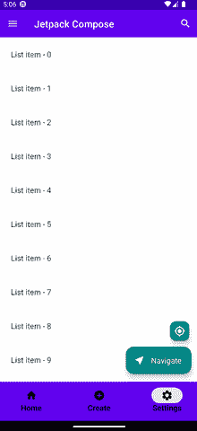

# 喷气背包中的浮动动作按钮由材料 3 组成

> 原文：<https://itnext.io/floating-action-button-in-jetpack-compose-with-material-3-10ba8bff415a?source=collection_archive---------0----------------------->



> 他代表了屏幕上最重要的动作。它使关键行动触手可及。FAB 通常包含一个图标，对于带文本和图标的 FAB，参见`[ExtendedFloatingActionButton](https://developer.android.com/reference/kotlin/androidx/compose/material3/package-summary#ExtendedFloatingActionButton(kotlin.Function0,androidx.compose.ui.Modifier,androidx.compose.ui.graphics.Shape,androidx.compose.ui.graphics.Color,androidx.compose.ui.graphics.Color,androidx.compose.material3.FloatingActionButtonElevation,androidx.compose.foundation.interaction.MutableInteractionSource,kotlin.Function1))`。

# 目录

*   [入门](#714f)
*   浮动动作按钮
    -[FAB](#c409)-
    大型 FAB-
    -[小型 FAB &扩展 FAB](#866b)
*   [FAB with shared view model&lazy column(列表)](#d457)

# 入门指南

首先，让我们添加材料 3 依赖。您可以在[合成材料 3 发布页面](https://developer.android.com/jetpack/androidx/releases/compose-material3)上查看最新的 M3 版本。

```
def material3_version = "1.0.1"
implementation "androidx.compose.material3:material3:$material3_version"
```

可选地，如果你已经在使用材料 2，你可以跟随[这篇博客](https://material.io/blog/migrating-material-3)迁移到材料 3。

# 浮动操作按钮

`FAB`实现非常容易。对于物料 3，我们有 4 种不同的`FAB`选项可供选择。

## 极好的

```
FloatingActionButton(
    onClick = {
        //OnClick Method
    },
    containerColor = MaterialTheme.colors.secondary,
    shape = RoundedCornerShape(16.dp),
) {
    Icon(
        imageVector = Icons.Rounded.Add,
        contentDescription = "Add FAB",
        tint = Color.White,
    )
}
```

`containerColor`，该 FAB 的背景颜色。

`shape`，定义该 FAB 的容器形状。



极好的

## 大型晶圆厂

> `Large FAB`在布局要求清晰突出的主要动作时，以及在较大的覆盖面积有助于用户参与的情况下很有用。例如，当出现在更高和更大的设备屏幕上时。

```
LargeFloatingActionButton(
    onClick = {
        //OnClick Method
    },
    containerColor = MaterialTheme.colors.secondary,
) {
    Icon(
        imageVector = Icons.Rounded.Add,
        contentDescription = "Add FAB",
        tint = Color.White,
    )
}
```



大型晶圆厂。在小屏幕上真的不好看:)

## 小型工厂和扩展工厂

> `Small FAB`用于辅助、支持动作，或替代较小屏幕上的默认 FAB。一个或多个小型制造厂可以与默认制造厂或扩展制造厂配对。
> 
> `Extended FAB`是视觉上最突出的按钮。在具有长滚动视图的屏幕上使用扩展 FAB，这种屏幕需要持续访问某个动作，例如结账屏幕。不要在不能滚动的视图中使用扩展 FAB。

`Small FAB` & `Extended FAB`实现与`FAB`非常相似。唯一不同的是`Extended FAB`有`text`，可选`icon`和`expanded`参数。

`expanded`，控制该 FAB 的扩展状态。在展开状态下，FAB 将显示`icon`和`text`。在折叠状态下，FAB 将只显示`icon`。

你可能已经注意到了，`onClick` & `expanded`正在使用`sharedViewModel`。在下一节中，我们将实现`SharedViewModel`并看看它是如何工作的。



小型工厂和扩展工厂

# 具有 SharedViewModel 和 LazyColumn 的 FAB(列表)

我们先创建`SharedViewModel`，

```
class SharedViewModel: ViewModel() {
    var fabOnClick = mutableStateOf({})
    var smallFabOnClick = mutableStateOf({})

    val expandedFab = mutableStateOf(true)
}
```

现在我们可以创建示例屏幕，

> `derivedStateOf`当你的状态或按键变化超过你想要更新的 UI 时使用。

如果`LazyColumn`中第一个可见项索引为 0，则`expandedFabState`为真，否则为假。当`expandedFabState`发生变化时，`LaunchedEffect`将被触发并更新`sharedViewModel.expandedFab`。

同样，我们使用`LaunchedEffect(key1 = Unit)`一次，当我们进入 Composable 时，它将设置`fabOnClick`和`smallFabOnClick`。我们可以用同样的方法为不同的屏幕设置不同的值。

最后，在`LazyColumn`中，我们设置`state`值来对滚动位置的变化做出反应。

就是这样！我希望它是有用的。👋👋



## 来源:

*   [ [FAB —材料设计 3](https://m3.material.io/components/floating-action-button/overview)
*   [[androidx . compose . material 3 | Android 开发者](https://developer.android.com/reference/kotlin/androidx/compose/material3/package-summary#floatingactionbutton) ]
*   [ [扩展 FAB —材料设计 3](https://m3.material.io/components/extended-fab/overview)
*   [[androidx . compose . material 3 | Android 开发者](https://developer.android.com/reference/kotlin/androidx/compose/material3/package-summary#ExtendedFloatingActionButton(kotlin.Function0,androidx.compose.ui.Modifier,androidx.compose.ui.graphics.Shape,androidx.compose.ui.graphics.Color,androidx.compose.ui.graphics.Color,androidx.compose.material3.FloatingActionButtonElevation,androidx.compose.foundation.interaction.MutableInteractionSource,kotlin.Function1))
*   [kot Lin—Compose:memory()with key vs . derivedStateOf()—堆栈溢出](https://stackoverflow.com/questions/70144298/compose-remember-with-keys-vs-derivedstateof)

你可以联系我，

*   [领英](https://www.linkedin.com/in/burak-fidan/)
*   [Github](https://github.com/MrNtlu)
*   [推特](https://twitter.com/BurakFNtlu)