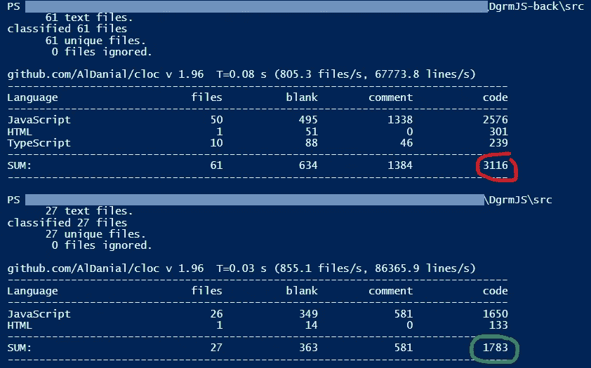
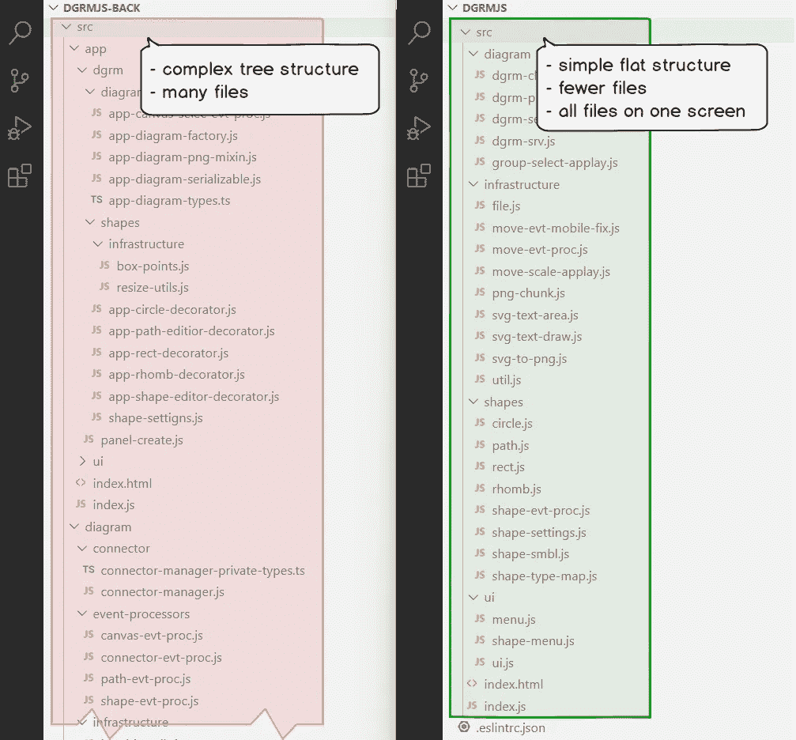

# 流程图编辑 dgrm.net/公告/我把源代码减半

> 原文：<https://itnext.io/flowchart-editor-dgrm-net-announcement-i-halved-the-source-code-e9d94822cd8a?source=collection_archive---------3----------------------->

[dgrm.net](https://dgrm.net/)|[GitHub](https://github.com/AlexeyBoiko/DgrmJS)

只想宣布 dgrm.net 的[被重构了。现在代码是原来的一半。项目结构得到简化。源代码文件如此之少，以至于它们都可以显示在一个屏幕上。](https://dgrm.net/)

代码——代码行数。上面的表格是旧版本，下面的是新版本。新版本的代码少了 2 倍。

60 个文件和复杂的结构。现在:27 个文件和一个简单的结构，所有文件适合在一个屏幕上。