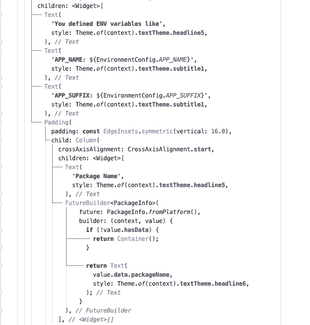
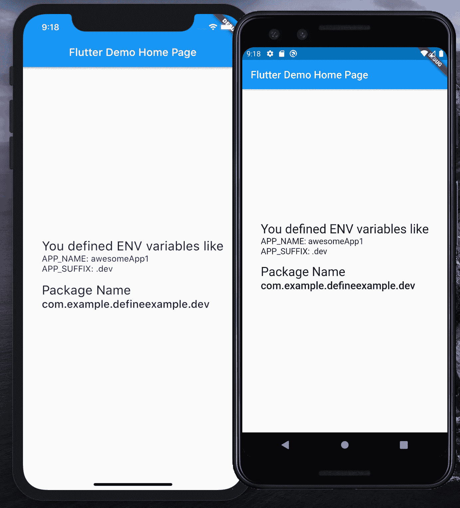
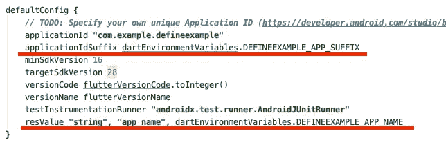
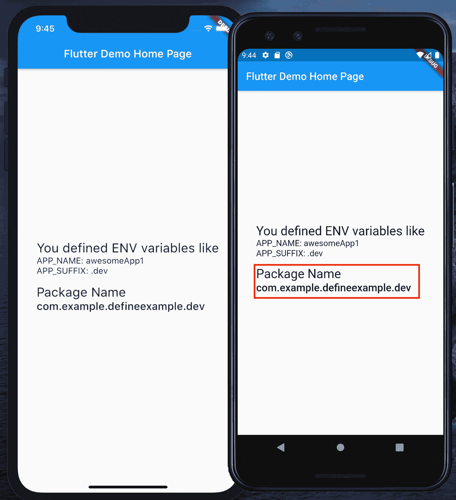
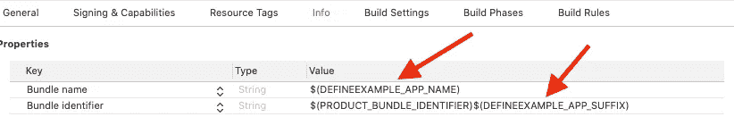
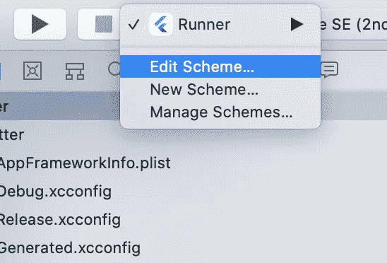
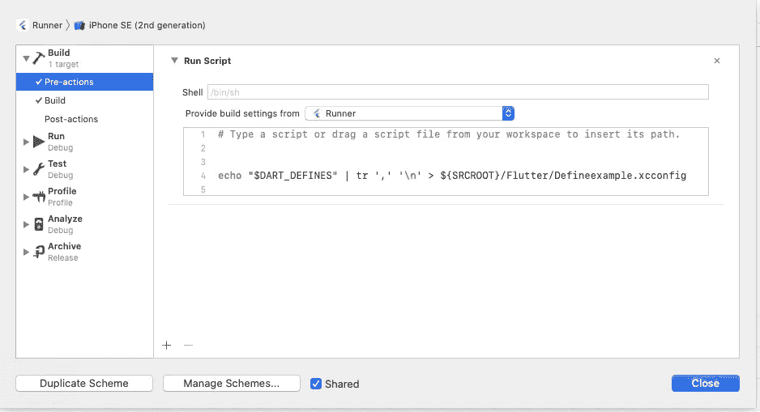
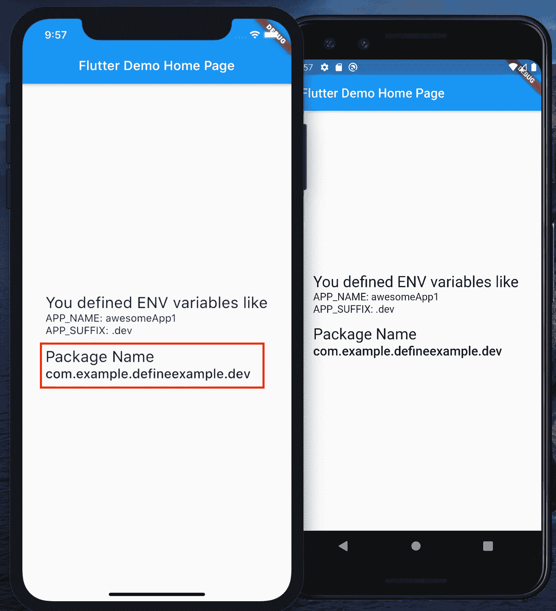

# Flutter 1.17 —不再有味道，不再有 iOS 模式。改变一切的命令参数

> 原文：<https://itnext.io/flutter-1-17-no-more-flavors-no-more-ios-schemas-command-argument-that-solves-everything-8b145ed4285d?source=collection_archive---------0----------------------->

> 就在最近，Flutter 1.17 发布了，它带来了很多很酷的功能。你可以在这里了解更多

[](https://medium.com/flutter/announcing-flutter-1-17-4182d8af7f8e) [## 宣布颤振 1.17

### 包括更快 iOS 性能的金属支持、新材料组件、新网络跟踪工具等！

medium.com](https://medium.com/flutter/announcing-flutter-1-17-4182d8af7f8e) 

它带来了许多性能改进、新的小部件等等。但是，除此之外，这个版本的 Flutter 还有一个很小但非常有用的特性:编译时变量。是的，您听到了，从 1.17 开始，您可以使用预定义的编译时变量构建您的 Android 和 iOS 应用程序，这些变量可用于您应用程序的所有层— Dart、iOS 和 Android。

> **更新 28.05.2020** :追加 ***相关说明。iOS 段落中的 xcconfig** 限制。
> 
> **更新 05.08.2020:** 增加了与 Flutter 1.20 兼容的代码示例。更多关于 Flutter 1.20 的变化，你可以在这里阅读:

[](https://medium.com/@tatsu.ukraine/what-you-should-know-before-you-upgrade-flutter-in-your-project-with-compile-time-variables-3ec3d2e9ba79) [## Flutter 1.20:在升级使用编译时变量的项目之前，您应该知道什么

### Flutter 1.20 中针对原生层的编译时变量使用的突破性变化以及如何解决它们。

medium.com](https://medium.com/@tatsu.ukraine/what-you-should-know-before-you-upgrade-flutter-in-your-project-with-compile-time-variables-3ec3d2e9ba79) 

> **更新 19.05.2021** :新增兼容 Flutter 2.2 的代码示例。更多关于 Flutter 2.2 的变化，你可以在这里阅读:

[](https://medium.com/@tatsu.ukraine/flutter-2-2-dart-defines-and-breaking-changes-here-we-go-again-ce40cfea74fd) [## 扑 2.2，镖定义和突破的变化。又来了…

### 如何为 Flutter 2.2 和新的 Dart 定义格式准备您的项目

medium.com](https://medium.com/@tatsu.ukraine/flutter-2-2-dart-defines-and-breaking-changes-here-we-go-again-ce40cfea74fd) 

# 让我们仔细看看

如果你正在使用 Flutter Web，你可能知道 Flutter 工具参数`--dart-define`。主要是用来启用 Skia 的颤振网络像这样的`--dart-define=FLUTTER_WEB_USE_SKIA=true`。但是您可能不知道，从 1.17 开始，您可以在那里传递多个自定义的键/值对。

例如，如果您使用以下参数运行 flutter 应用程序

`flutter run --dart-define=SOME_VAR=SOME_VALUE --dart-define=OTHER_VAR=OTHER_VALUE`

然后，您可以在 Dart 代码中获得这些值，如下所示

并在整个项目中使用这个类作为特定于环境的配置。

这意味着现在可以摆脱[**environment _ config**](https://pub.dev/packages/environment_config)**这样的包了。**

> 如果你不知道这个包是做什么的，你可以看看这篇文章

[](https://medium.com/@tatsu.ukraine/configure-your-flutter-environment-in-the-proper-way-b81782c79726) [## 以正确的方式配置你的颤振环境

### 摆动多个环境配置，无需复制/粘贴、调整和暴露您的环境凭证…

medium.com](https://medium.com/@tatsu.ukraine/configure-your-flutter-environment-in-the-proper-way-b81782c79726) 

# 我能在本地使用这些变量吗？

简而言之——是的，你也可以在本机中使用这些变量，但是……有点复杂。

如果你很好奇 Flutter 是如何将 **Dart 定义**传递到原生层的，可以看看 [**Flutter 工具包**](https://github.com/flutter/flutter/tree/master/packages/flutter_tools) **。**对于每个平台，它对待 Dart 定义的方式略有不同，但是，我将向您展示 iOS 和 Android 版本的示例。

此外，请记住，在 Flutter 1.20 和 Flutter 2.2 中，Flutter Tool 改变了将 Dart 定义的格式传递给原生层的方式。

为此，我创建了一个 Flutter 项目，它基于 **Dart 定义了**变量，为 Android 和 iOS 定义了应用名称和应用后缀 ID。`master`分支兼容颤振 2.2，`flutter-1.19` —兼容颤振 1.19，`flutter-1.17` —兼容颤振 1.17

[](https://github.com/TatsuUkraine/flutter_define_example) [## tatsu Ukraine/flutter _ define _ example

### 新的颤振应用。运行并定义您定义的 EXAMPLE_APP_NAME 值，如果此参数不是 provider，awesomeApp…

github.com](https://github.com/TatsuUkraine/flutter_define_example) 

# 让我们来探索这个应用程序

这个应用程序只使用两个编译时变量，即`DEFINEEXAMPLE_APP_NAME` 和`DEFINEEXAMPLE_APP_SUFFIX` **。**我建议给每个编译时变量添加一个前缀，以避免与 Flutter 使用的变量冲突。在这个例子中，我使用的是`DEFINEEXAMPLE_*` **。**

## Dart 代码

应用程序非常简单。如果你打开 **main.dart** 你会看到它定义了 [**EnvironmentConfig 类**](https://github.com/TatsuUkraine/flutter_define_example/blob/master/lib/main.dart#L4) ， [**打印它的值**](https://github.com/TatsuUkraine/flutter_define_example/blob/master/lib/main.dart#L93) 。



你可以注意到我使用了`awesomeApp` 作为`DEFINEEXAMPLE_APP_NAME`的默认值。我们将在所有层中使用这个默认值，包括 native。至于`APP_SUFFIX`——我们将从 [package_info](https://pub.dev/packages/package_info) 插件的 FutureBuilder 小部件中获得一个实际的应用程序 ID ( `packageName`)。并且如果`DEFINEEXAMPLE_APP_SUFFIX` 被定义，你会在你的屏幕上看到应用 ID。

> 一个重要的注意事项:确保将环境变量分配给`*const*`字段。目前，如果使用非常数变量，Flutter 有一个[问题](https://github.com/flutter/flutter/issues/55870)。

当您使用如下命令运行这个应用程序时

`flutter run --dart-define=DEFINEEXAMPLE_APP_NAME=awesomeApp1 --dart-define=DEFINEEXAMPLE_APP_SUFFIX=.dev`

接下来您应该会看到:



您可以注意到，它呈现了从参数传递来的`awesomeApp1` **，**，而不是默认的`awesomeApp` **。**和`com.example.defineexample.**dev**` **。**其中`.dev` —定义的后缀。

# Android 配置

好的，所以要将编译时变量传递到 Android 中，我们需要使用 Flavors


别担心！没有味道，没有大量的 iOS 方案，没有多个条目，没有复制/粘贴…嗯，除了不同层的默认值。🤷🏻‍♂

因此，对于 Android，Flutter Tool 将所有 Dart 定义作为单个字符串值传递，用逗号连接。在你的 Gradle 的 Flutter 1.17 中，你会得到一个类似于`DEFINEEXAMPLE_APP_NAME=awesomeApp1,DEFINEEXAMPLE_APP_SUFFIX=.dev`的字符串值

在颤振 1.20 值将是这样:`DEFINEEXAMPLE_APP_NAME%3Dawesome1,DEFINEEXAMPLE_APP_SUFFIX%3D.dev`

在 Flutter 2.2 中，每个变量都用 base64 编码:`REVGSU5FRVhBTVBMRV9BUFBfTkFNRT1hd2Vzb21lMg==,REVGSU5FRVhBTVBMRV9BUFBfU1VGRklYPS5kZXY=`

从 Flutter 1.19 开始，Flutter 工具在 Dart 定义被传递到编译器之前对 URI 符号进行编码，包括`=`这就是为什么在 Dart 定义项中看到的不是这个符号而是`%3D`。

在 Flutter 2.2 中，URL 编码被 Base64 编码所取代。

所以在使用每个键值对之前，我们需要解析它。完整的代码可以在这里找到。用`dart-defines`键通过项目属性中的飞镖定义。对于 Flutter 1.17，解析逻辑将如下所示:

首先，它定义默认值(第 1–4 行)，然后，将一个字符串从`dart-defines` 转换成 Map，并将结果与默认值合并。

对于 Flutter 1.20，我们将需要额外解码每个项目，以便我们可以在键值对上正确地分割它(第 5 行):

而在 Flutter 2.2 中，我们需要使用 Base64 解码，而不是 URL 解码。

现在我们可以定义`resValue`和`applicationIdSuffix`



在我们定义了字符串资源之后，它可以在您的[Android/app/src/main/Android manifest . XML](https://github.com/TatsuUkraine/flutter_define_example/blob/master/android/app/src/main/AndroidManifest.xml#L10)中用于指定应用程序名称。但是基本上你可以在你的项目中的任何地方使用这组值。

现在，如果您在 Android 设备上查看您的应用程序，您会注意到应用程序名称已成功定义:


也称为包名



## iOS 配置

在 iOS 构建过程中，Flutter Tool 会创建几个文件，包括`Generated.xcconfig`和`flutter_export_environment.sh`。它们可以在 **ios/Flutter** 中找到。那些文件默认在 gitignore 中，所以 GitHub 项目不会包含它们。但是在构建之后，你会发现 **Dart 在那些文件中定义了**，对于 Flutter 1.17 是这样定义的:

```
DART_DEFINES=DEFINEEXAMPLE_APP_NAME=awesomeApp1,DEFINEEXAMPLE_APP_SUFFIX=.dev
```

对于 Flutter 1.20，它们将用编码值定义，就像在 Gradle 中一样:

```
DART_DEFINES=DEFINEEXAMPLE_APP_NAME%3Dawesome1,DEFINEEXAMPLE_APP_SUFFIX%3D.dev
```

在 Flutter 2.2 中，这些值用 base64 编码:

```
DART_DEFINES=REVGSU5FRVhBTVBMRV9BUFBfTkFNRT1hd2Vzb21lMg==,REVGSU5FRVhBTVBMRV9BUFBfU1VGRklYPS5kZXZ2
```

由于这种格式不能用于 plist，为了定义应用程序名称和应用程序 ID 后缀，我们需要定义新的变量，基于 **Dart 定义**。那我们开始吧。

## **关于*的重要说明。颤振 1.17 中的 xc config**

iOS ***。xcconfig** 在变量值方面有一些限制。你可以在这里或者谷歌上找到一个可能的解决方案。但基本上，它将序列`//`视为注释分隔符。这意味着你不能像这样指定`API_URL``https://example.com`，因为`//`之后的一切都将被忽略。同时，如果您使用以下参数运行您的构建:

```
--dart-define=https://example.com
```

颤振工具将创建如下行的`flutter_export_environment.sh`文件:

```
...
export "DART_DEFINES=APP_URL=https://example.com"
```

也作`Generated.xcconfig`用如下:

```
...
DART_DEFINES=APP_URL=https://example.com
```

因此，在您的构建**预动作**(您将在下一段中读到它)中，您可以尝试找出一种变通方法，如何获得`DART_DEFINES`的实际值，以提供对`API_URL`的正确解析。

对于 **Flutter 1.20 和 2.2** ，情况将是相似的，因为我们将在解析之前解码值，但是因为 Dart 定义项将被编码(包括`//`)，所以将更容易找出一个解决方法来解析这些项。因为，与 Flutter 1.17 不同，您将实际接收您的 Dart 定义值，所以您不需要考虑如何获得这个值来进行解析。

## 1.使用默认值创建[define example-defaults . xcconfig](https://github.com/TatsuUkraine/flutter_define_example/blob/master/ios/Flutter/Defineexample-defaults.xcconfig)文件:

```
DEFINEEXAMPLE_APP_NAME=awesomeApp
DEFINEEXAMPLE_APP_SUFFIX=
```

## 2.在[调试](https://github.com/TatsuUkraine/flutter_define_example/blob/master/ios/Flutter/Debug.xcconfig)和[发布](https://github.com/TatsuUkraine/flutter_define_example/blob/master/ios/Flutter/Release.xcconfig)配置中导入

此外，让我们导入我们稍后将创建的配置文件:

Debug.xcconfig 和 Release.xcconfig(基本相同)

考虑将`Defineexample.xcconfig` 放在`Defineexample-defaults.xcconfig` **、**之后，这样颤振运行命令的值可以覆盖默认值。

## 3.编辑 plist 文件，从`DEFINEEXAMPLE_APP_NAME` 定义包名，从`DEFINEEXAMPLE_APP_SUFFIX`定义后缀



现在是时候创建 **Defineexample.xcconfig 了。**要创建它，我们需要在 iOS 版本中添加预构建动作。

## 4.编辑架构:



## 5.添加预先操作:



如果您使用 Flutter 1.17，请使用以下命令:

```
echo "$DART_DEFINES" | tr ',' '\n' > ${SRCROOT}/Flutter/Defineexample.xcconfig
```

如果您使用 Flutter 1.20，则使用以下命令:

> 为什么需要这个 bash 脚本的解释可以在本文的[中找到。](https://medium.com/@tatsu.ukraine/what-you-should-know-before-you-upgrade-flutter-in-your-project-with-compile-time-variables-3ec3d2e9ba79)

而对于 Flutter 2.2，你需要使用 base64 解码而不是 URL 解码(第 3 行):

在构建期间，该命令将创建以下 **Defineexample.xcconfig** 文件:

```
DEFINEEXAMPLE_APP_NAME=awesomeApp1
DEFINEEXAMPLE_APP_SUFFIX=.dev
```

> 你可以选择不同的 ***。xcconfig** 文件名，如果你想的话。只要确保它们不会被 Flutter 工具脚本修改。
> 
> 此外，请记住 ***的限制。xcconfig** 如果你需要在解析过程中考虑`//`。

当应用程序将安装到您的设备上时，您会注意到它有一个名称，我们在构建过程中定义了该名称:


也称为包名:



与 Android 一样，现在您可以在项目中的任何地方使用这组值。

差不多就是这样)示例项目可以在这里找到:

[](https://github.com/TatsuUkraine/flutter_define_example) [## tatsu Ukraine/flutter _ define _ example

### 新的颤振应用。运行并定义您定义的 EXAMPLE_APP_NAME 值，如果此参数不是 provider，awesomeApp…

github.com](https://github.com/TatsuUkraine/flutter_define_example) 

`master`分支中的示例针对颤振 2.2，`flutter-1.19` —针对颤振 1.19，`flutter-1.17` —针对颤振 1.17。

感谢您的时间和快乐的编码！