# Flutter 2.2:用 Flutter 创建你的第一个通用 Windows 程序(UWP)

> 原文：<https://itnext.io/flutter-2-2-creating-your-first-universal-windows-program-with-flutter-5e65858b9988?source=collection_archive---------3----------------------->


可以运行 UWPs 的设备示例

通用 Windows 程序(UWP)是可以在所有微软设备上运行的应用程序，从你可能正在阅读本文的 Windows 笔记本电脑，到你客厅里的 Xbox，甚至是 Hololens(可能没有人有)。

Flutter 是谷歌的 UI 工具包，用于从单个代码库为[移动](https://flutter.dev/docs)、[网络](https://flutter.dev/web)、[桌面](https://flutter.dev/desktop)和[嵌入式](https://flutter.dev/embedded)设备构建漂亮的本地编译应用。自 2020 年 9 月以来，Flutter 一直支持创建传统的 Win32 程序，但在 Google I/O 2021 中，这种 Windows 支持终于扩展到了 UWP！

在这篇文章中，我将向你展示如何设置 Flutter 并创建你的第一个 UWP。对于本指南，您必须使用 Windows 10 电脑。所有链接在撰写时都是最新的。

# **第一步:设置 Flutter SDK**

1.  从[这个](https://storage.googleapis.com/flutter_infra_release/releases/dev/windows/flutter_windows_2.3.0-12.1.pre-dev.zip)链接下载最新的 Flutter SDK。
2.  将先前下载的 zip 文件中的“flutter”文件夹解压缩到您想要的安装位置。不要将文件夹放在需要提升权限的文件夹中，例如“C:\Program Files”。
3.  从开始搜索栏，输入‘env’并选择**编辑系统环境变量**。

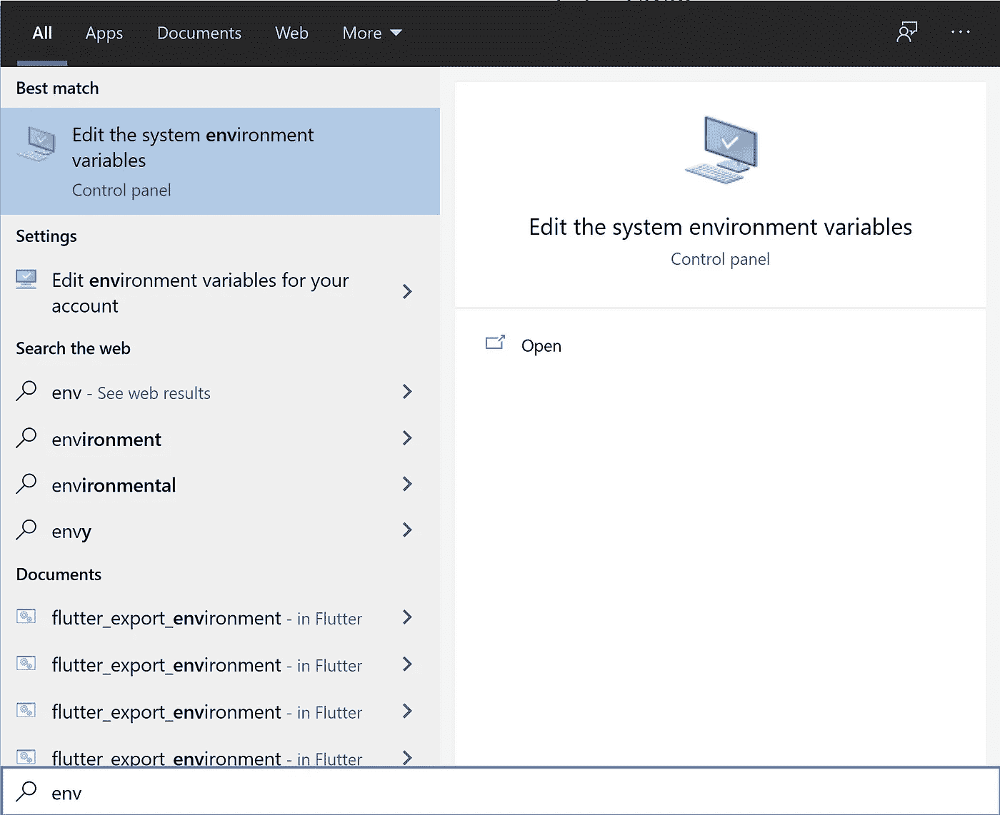

4.在出现的窗口中选择“环境变量”按钮。

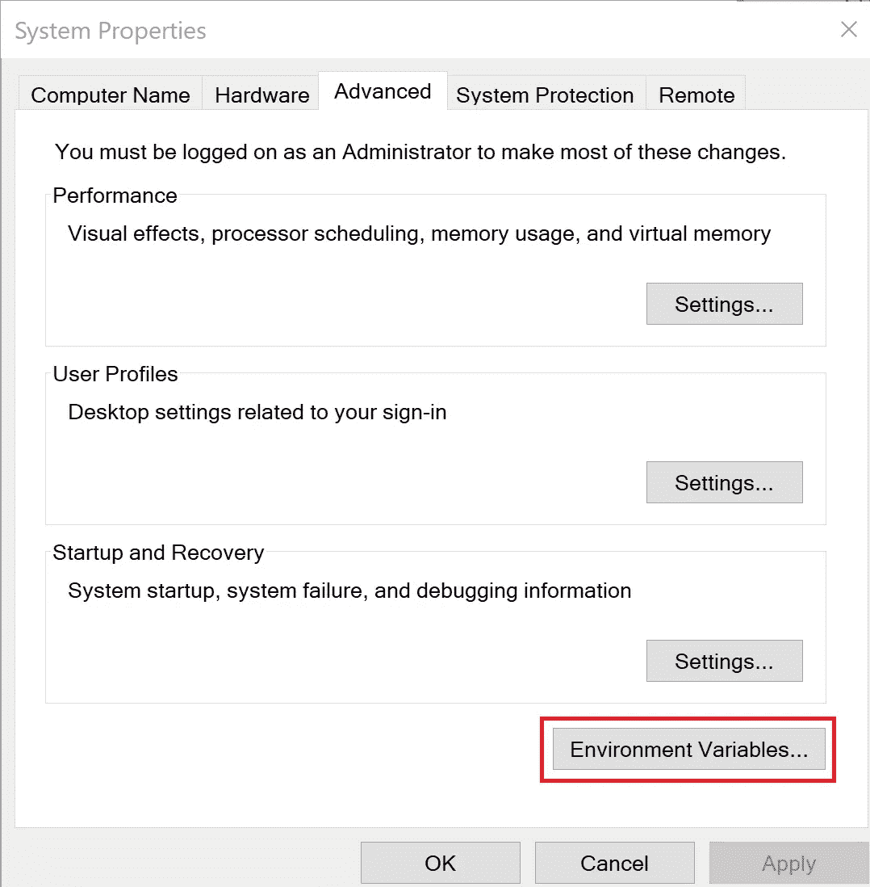

5.双击**用户变量**下的“路径”变量。

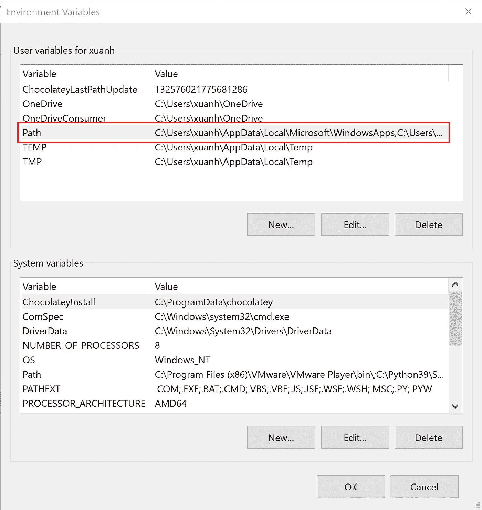

6.点击“新建”按钮，输入“flutter/bin”目录的路径。

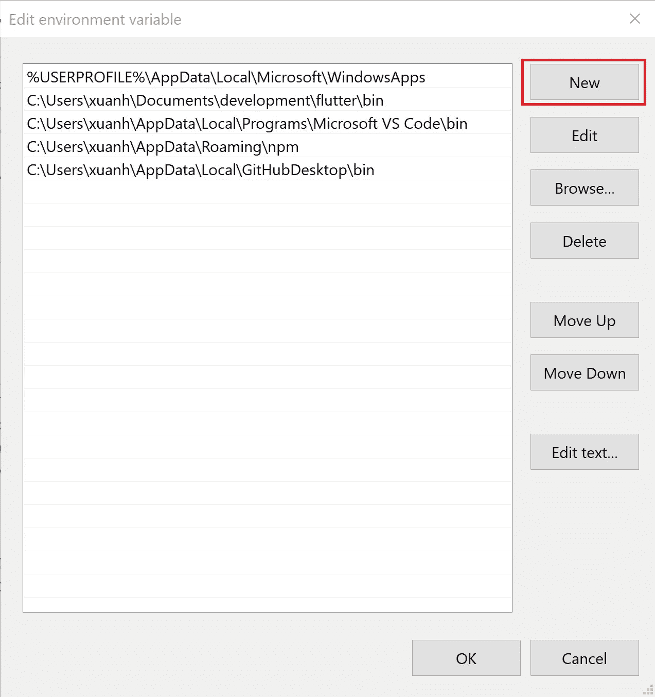

7.按 OK 关闭所有打开的窗口。

8.通过打开一个新的 PowerShell 窗口并运行以下命令来测试新的 flutter 安装:

```
flutter doctor
```

您应该会看到类似这样的内容:

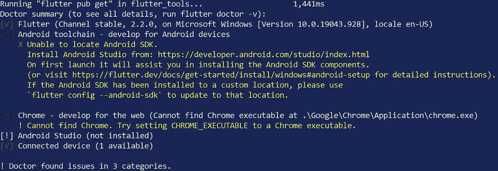

# **为 Windows 开发准备 Flutter SDK**

1.  从[此](https://visualstudio.microsoft.com/thank-you-downloading-visual-studio/?sku=Community&rel=16#)链接下载并安装 Visual Studio 2019 社区，因为它将用于编译和运行您的应用。当询问工作量时，选择“通用 Windows 平台开发”和“C++桌面环境”。

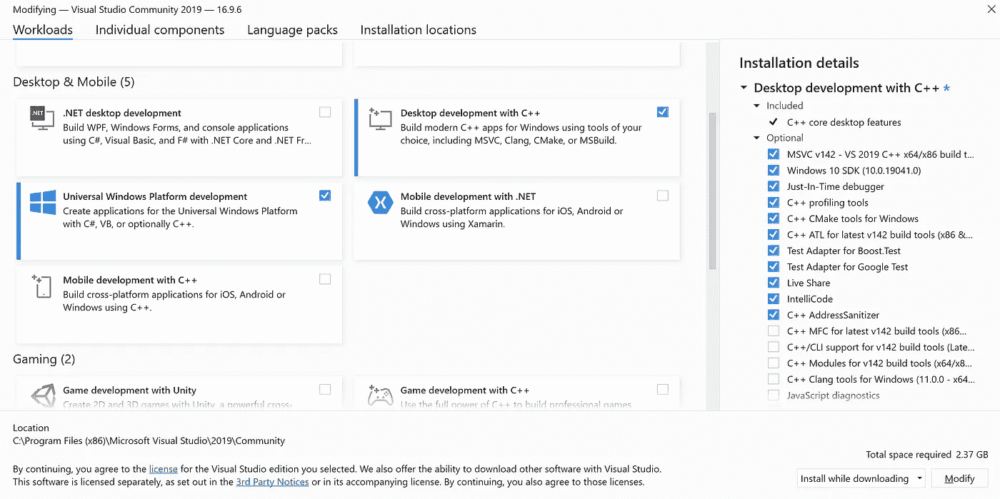

2.在 PowerShell 窗口中运行此命令以启用 UWP 对 Fluttter 的支持:

```
flutter config --enable-windows-uwp-desktop
```

# **安装支持的 IDE**

1.  从[这个](https://code.visualstudio.com/docs/?dv=win)链接下载并安装 Visual Studio 代码。它将用于编写您的 Dart/Flutter 代码。
2.  在 Visual Studio 代码中打开“扩展”面板。

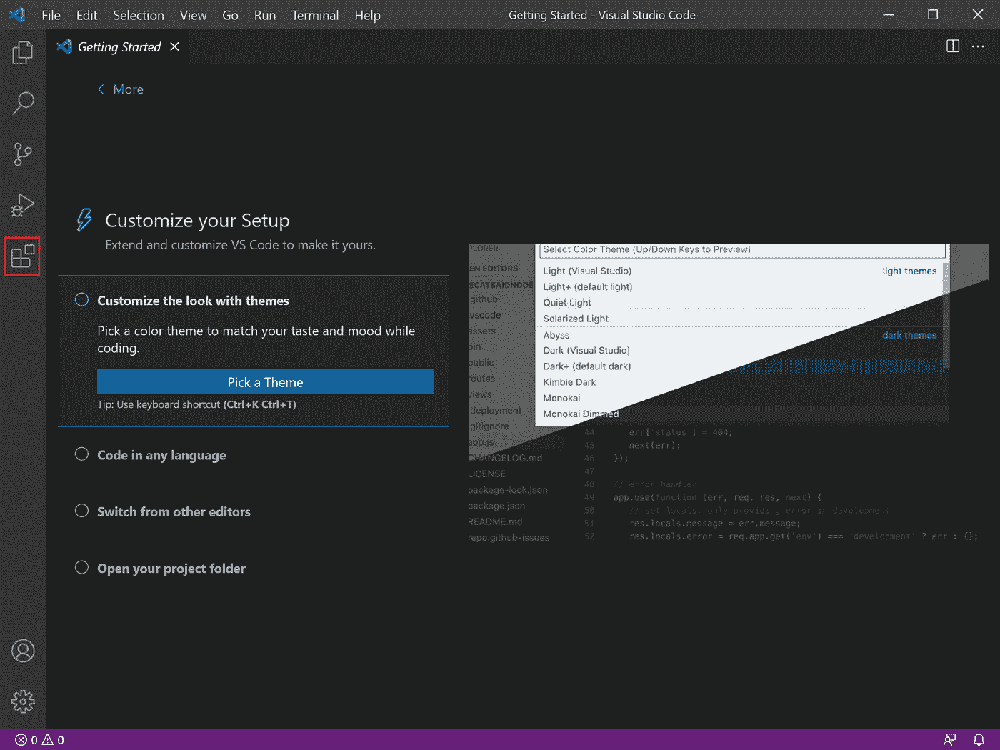

3.搜索“颤振”并安装颤振扩展。

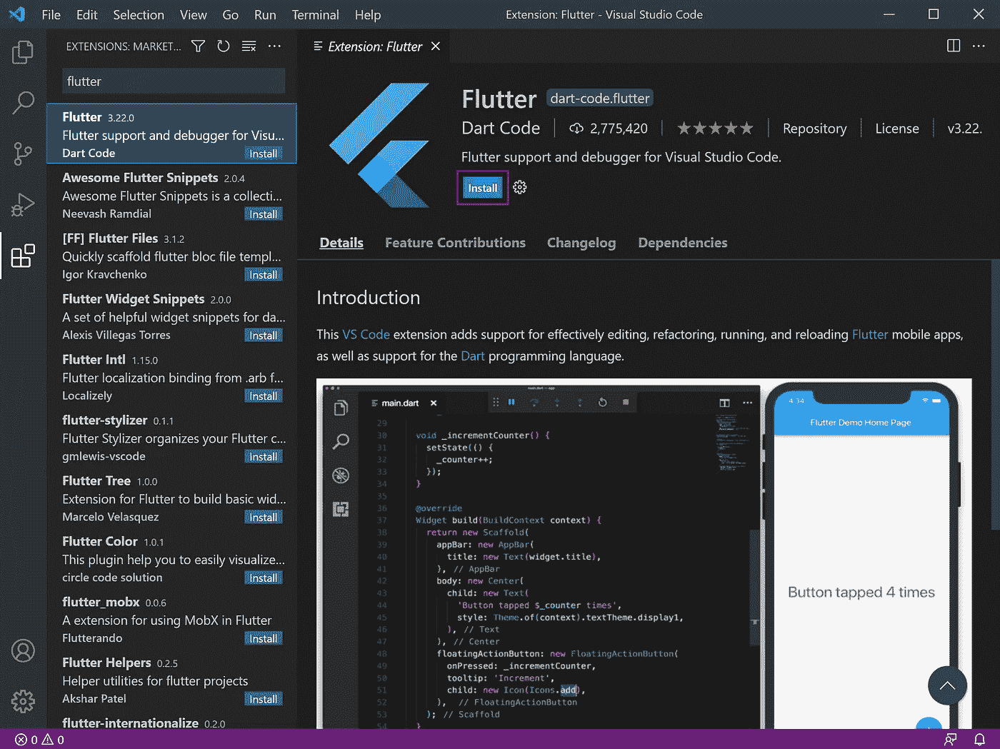

# **创造你的 UWP！**

1.  在 PowerShell 窗口的所需文件夹中键入以下命令。用你的应用程序名称替换<project name="">。</project>

```
flutter create <project name>
```

2.在 Visual Studio 代码中单击“打开文件夹”按钮，并使用您的应用程序名称打开新创建的文件夹。

3.在右下角，点击 Edge (web-javascript)。


4.顶部会出现一个菜单。单击“为此项目启用 windows”。

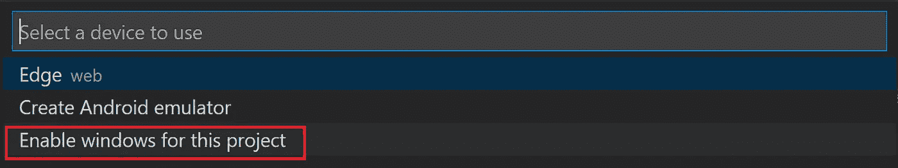

5.运行“颤动创建”按照 Visual Studio 代码的指示。

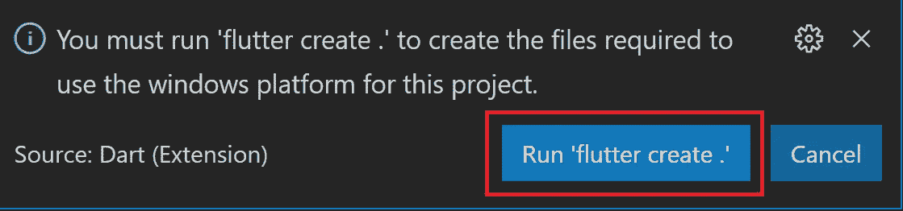

6.再次单击 Edge (web-javascript ),您现在可以单击 Windows UWP 的选项。

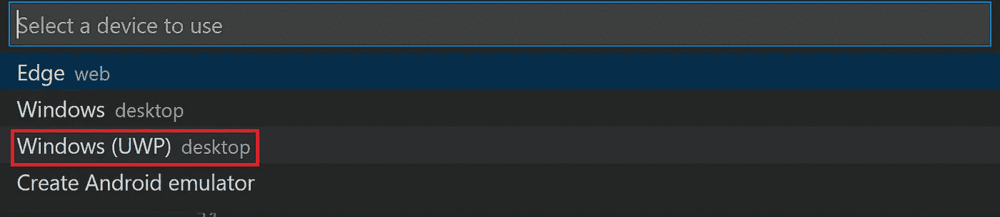

7.现在，您可以在 Visual Studio 代码终端中运行此命令:

```
flutter run
```

8.当提示安装证书时，键入“y”继续。

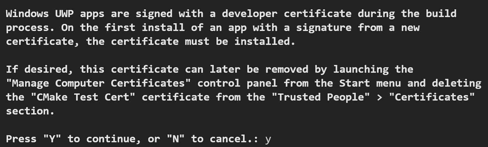

9.现在，您将看到多几行信息。

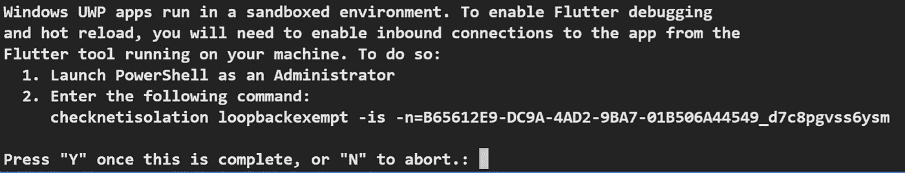

10.右键单击任务栏中的 Windows 徽标，然后单击“Windows PowerShell (Admin)”，打开管理员 PowerShell 窗口

11.从终端运行指令中指定的命令，绕过 UWP 沙盒，并启用热重装和调试。对我来说，是:

```
checknetisolation loopbackexempt -is -n=B65612E9-DC9A-4AD2-9BA7-01B506A44549_d7c8pgvss6ysm
```

完成后，在 Visual Studio 代码终端中键入“y ”,构建过程将结束。保持 PowerShell 窗口打开，否则 Flutter 应用程序将停止。

12.享受你的 UWP 吧！

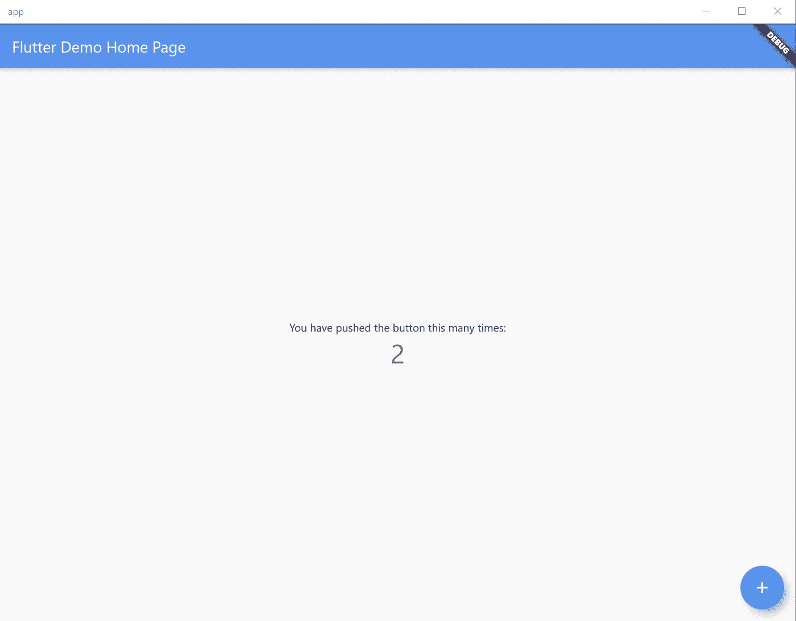

# **接下来是什么？**

在接下来的文章中，我将向您展示如何使用 Flutter 创建漂亮流畅的 UI UWPs。敬请期待！如果你认为这篇文章有所帮助，请给我一个掌声！