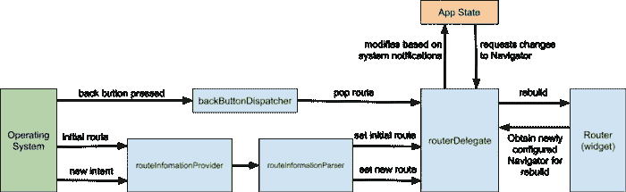
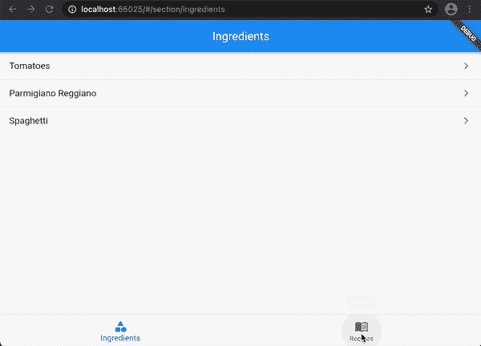

# 颤振:导航器 2.0 的简单实用方法

> 原文：<https://itnext.io/flutter-an-easy-and-pragmatic-approach-to-navigator-2-0-44152e73112f?source=collection_archive---------0----------------------->

## 尽管乍看起来令人生畏，但进化的颤振导航系统可以解决比它看起来更多的问题

在 2020 年下半年，颤振团队推出了一个改进的导航和路由系统，名为 [Navigator 2.0](https://docs.google.com/document/d/1Q0jx0l4-xymph9O6zLaOY4d_f7YFpNWX_eGbzYxr9wY/edit) 。到目前为止，开发人员社区的反应还不是很好:[主要的批评](https://github.com/flutter/flutter/issues/69315)是关于 API 的复杂性和缺少一个用于常见场景的额外抽象层。

约翰·瑞安写的[伟大的文章](https://medium.com/flutter/learning-flutters-new-navigation-and-routing-system-7c9068155ade)深入分析了 Navigator 2.0 的复杂性和完整性

此外，命名一直很糟糕: *Navigator 2.0* 听起来像是一项胜过其前身——*Navigator 1.0*的技术——但事实并非如此。只要你愿意，你仍然可以使用`Navigator.push`。这并不意味着您不会失去新 API 带来的许多优势，例如:

*   一种更为多变的声明式风格；
*   更好地支持屏幕更换；
*   更好地支持多次推送和弹出；
*   全面支持传入网址(如:Flutter Web 和/或 app 深度链接)；
*   使用 Flutter Web 时完全支持浏览器历史。

## 务实的方法

我不想在技术细节上花太多时间，但是我想直接进入一个方便的解决方案。出于学习的目的，我想创建一个带有底部标签和潜在的无限系列页面的应用程序。

## 页面建模

首先，让我们选择一个好的抽象来建模用户可以导航的页面。直接使用 Flutter `Page`会违背抽象过程，所以我将使用一个数据模型，该模型使用由 [frezeed package](https://pub.dev/packages/freezed) 提供的极好的[联合类](https://pub.dev/packages/freezed#unionssealed-classes):

要进一步了解 freezed，请阅读我的另一篇文章， [Flutter: Dart 不可变对象和值](https://levelup.gitconnected.com/flutter-dart-immutable-objects-and-values-5e321c4c654e)

*   `NavigationStackItem.notFound`代表 *404* 页面；
*   `NavigationStackItem.appSection`代表一个选中的底栏标签；
*   `NavigationStackItem.ingredient`代表配料详情页；
*   `NavigationStackItem.recipe`代表菜谱详情页。

## 建模用户动作

反映用户在导航期间可能做出的动作的最佳数据结构是堆栈:

请注意，我们总是希望保留条目列表的副本，因为 Dart 列表不是不可变的

*   `push`对应于推送到导航栈上的新屏幕；
*   `pop`对应从导航栈弹出的一个屏幕；
*   总是可以通过设置`items`属性来替换整个导航栈。这可能有多种原因，如一次弹出或推送多个页面，从深层页面更改底部选项卡选择，甚至在当前屏幕前推送页面。

## 使导航堆栈可访问

主导航堆栈将是顶部应用程序状态的一部分。我选择采用来自 [riverpod 包](https://pub.dev/packages/riverpod)的`ChangeNotifierProvider`,而不是使用单例变量——或者更糟糕的全局变量:

第一个堆栈内容是第一个选定的底部选项卡

一旦正确配置了插件，访问导航栈就很简单了。要从一个小部件推送配料详情页面，很简单，如下所示:

## 将 URL 转换为项目堆栈

Flutter 的`RouteInformationParser`是用来来回转换输入 URL 的对象。

我想用一个格式是这样的 URL:`/section/ingredients/ingredient/1/recipe/2/ingredient/2`(以此类推)。解析它有点简单，因为这是一系列的键值对:

代码有点冗长，但也很简单:

1.  我首先将 URL 分解成它的组件。
2.  我获取键-值对并验证接收到的标识符:如果值有效，我插入正确的`NavigationStackItem`，否则我插入`notFound`。
3.  如果在循环结束时，我没有发现一个`appSection`作为堆栈的第一项(例如:URL 只有`/`，我就把它放在前面。

从`NavigationStack`到 URL 的转换非常简单，因为我们利用了`when`结构，也是从冻结的包:

## 路由！

最后但同样重要的是，我们必须实际引导用户浏览页面。Flutter 的`RouterDelegate`是将`NavigationStack`、`RouterInformationParser`生成的数据和`Navigator`小部件显示给用户的粘合剂。

首先，我们需要能够接触到`NavigationStack`。委托实例将观察它并对它的变化做出响应。

然后，我们实际上通过实现`build`方法将堆栈项目转换为 Flutter 的`Page`实例:我们只需要返回一个`Navigator`小部件，它具有一个固定的`navigatorKey`和通过将堆栈项目映射到`MaterialPage`对象而计算的`pages`数组。`onPopPage`实现——每当用户点击后退按钮时就会被调用——就像从观察堆栈中弹出一个项目一样简单。

如果您还没有识别出 mapIndexed，不要担心:它只是 Iterable 的一个小型智能自定义扩展！

`RouterDelegate`的最后一点告诉应用程序当新路线到来时该做什么，或者如何处理浏览器历史:

传递给`newRoutePath`方法的`configuration`是在解析器中创建的实例:我们替换了托管堆栈中的`items`,一切就绪。

## 最终应用程序

由于我们没有引入新概念，我们可以直接使用`MaterialApp.router`便利法:

就是这样！如果您使用的是 Flutter Web，它甚至可以处理浏览器历史记录:

你可以通过访问 GitHub repo 阅读并下载完整的例子。

## 还有一点

当我在写这个分析的时候，我注意到这些概念是非常通用和可重用的。那么，为什么不为我的(和你的)发布一个包呢？)下一个项目？**我来介绍一下** [***务实 _ 导航***](https://pub.dev/packages/pragmatic_navigation) **。它不是解决与导航 2.0 相关的所有问题的灵丹妙药，而是旨在成为更常见问题的轻量级解决方案的集合。**

这个新包公开的第一组组件将包括本文中描述的概念:

*   `NavigationStack`是一个泛型类，用于保存您需要在应用程序状态时公开的堆栈项目；
*   `NavigationStackRouterInformationParser`是一个通用类，它实现了将 URL 组件解析为堆栈项的策略，反之亦然；
*   `NavigationStackRouterDelegate`是链接堆栈和解析器的通用类。

更多细节请参考[包库主页](https://github.com/muccy/flutter_pragmatic_navigation)，但是如果你读到这里，你会有宾至如归的感觉。