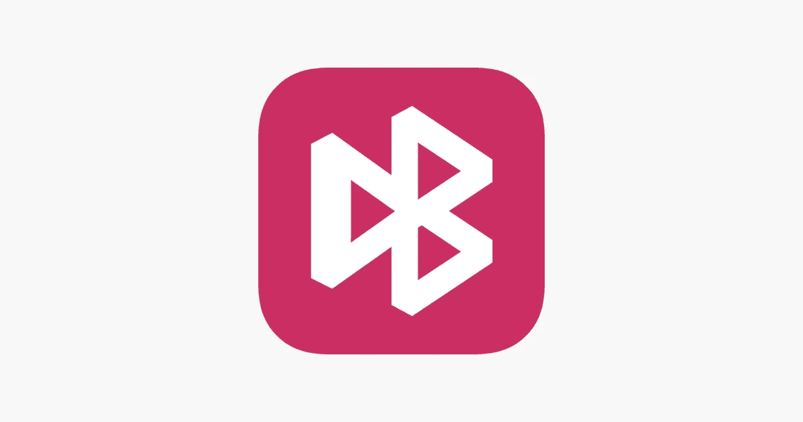
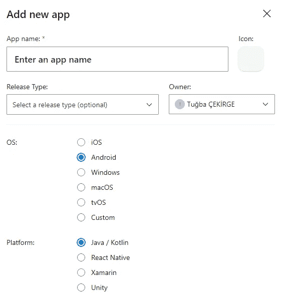
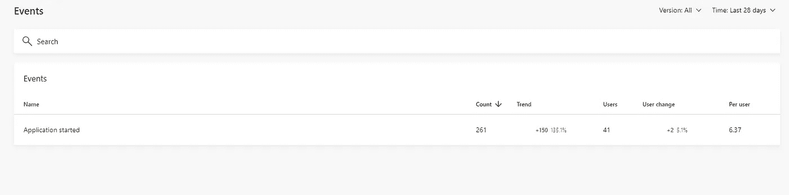
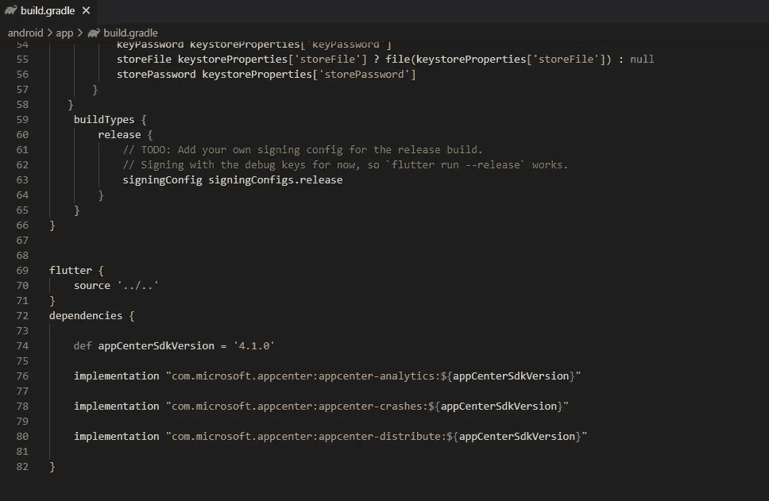
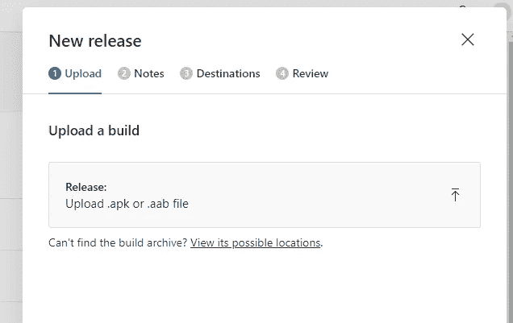

# 使用 Visual Studio AppCenter 进行 Android 应用分发

> 原文：<https://itnext.io/flutter-android-app-distribution-with-visual-studio-appcenter-1b94f3ee8fd1?source=collection_archive---------1----------------------->

大家好，

我叫[图巴](https://www.linkedin.com/in/tugbacekirge/)；我在 [Arkitek R & D](https://www.linkedin.com/company/arkitek-net/) 担任软件开发团队负责人。在 Arkitek 中，我们使用诸如[**【VueJS】**](https://vuejs.org/)[**Flutter**](https://flutter.dev/)**和 [**C#**](https://docs.microsoft.com/en-us/dotnet/csharp/) 等技术构建移动、桌面和网络应用。自 2021 年以来，我们一直在 Flutter 中开发我们的 web/mobile 项目，不用说，Flutter 非常棒。两年后，我们发现了许多诀窍和一些变通方法，只要有机会，我会试着分享。**

**如果你喜欢我的内容，可以[给我买个 p](http://buymeacoffee.com/turtlepile) izza！**

****

**将我们的应用分发到[应用商店](https://www.apple.com/app-store/)或 [play 商店](https://play.google.com/)似乎是接触大量用户的最佳方式，但在某些情况下，我们可能需要走一条不同的道路。比方说，我们为特定客户创建了一个解决方案，但我们不想使用企业解决方案。(为什么？因为它们有点贵，而且在某些情况下不太容易管理)或者我们只是想更频繁、更自由地分发我们的应用程序。**

**在 Arkitek 中，我们使用 [Visual Studio AppCenter](https://appcenter.ms/) 来处理这种情况。使用 [Visual Studio AppCenter](https://appcenter.ms/) 有一些好处。它让您可以自动化和管理 iOS、Android、Windows 和 macOS 应用程序的生命周期。您可以更频繁地分发您的应用程序。您可以连接您的 repo(我没有)并自动化您的构建，在云端的真实设备上测试，将应用程序分发给 beta 测试人员，并使用崩溃和分析数据监控真实世界的使用情况。**

**在这篇文章中，我将尝试一步一步地解释，如何通过 [Visual Studio AppCenter](https://appcenter.ms/) 分发一个 Flutter 应用程序，并强调一些关键点。**

**不要忘记为 Android APK 签名创建你的分发证书 **jks** 文件。**

****1-你好应用中心****

**首先，您需要注册到 AppCenter 并创建您的组织。这很容易，你只要按照步骤做就行了。注册组织后，创建项目应用程序。在这篇文章中，我将只涉及 android，但我也将很快发布 IOS 版本。**

****2-安卓应用****

**创建您的应用程序**

****

****3-激活颤振****

****

**在 Flutter 中，当我们想要使用一个包时，我们只需将它添加到我们的 pubspec.yaml 中，然后导入到我们的 dart 文件(主要是 main)中并使用它。不幸的是，使用 VS-AppCenter，无法将包导入 main.dart。在官方教程中，他们主要是引导你在 runApp 之前将包导入 **main.dart** 和 init AppCenter。**

**我试过了，面对这个美丽的错误:**

> **错误:无法以健全的空安全运行，因为以下依赖项不支持空安全:**
> 
> **包:应用中心**
> 
> **包:应用中心 _ 分析**
> 
> **包:appcenter_crashes**
> 
> **有关解决方案，请参见[https://dart.dev/go/unsound-null-safety](https://dart.dev/go/unsound-null-safety)**
> 
> **失败:构建失败，出现异常。**

**我的问题是我导入的包。他们在零安全状态下工作不正常。(在另一个教程中，有人建议使用 f**lutter run——NO-sound-null-safety**,但这对我来说是一个很大的拒绝，而且即使我这样做了，IOS 也会向我抛出很多错误..)**

**所以，这是我如何做到的:**

****3.1** 进入你的**主活动**。java(如果没有，只需创建一个文件名 MainActivity.java)。它应该在这个路径下:**

*****Android \ app \ src \ main \ Java \ com \ arkitek \ flutter \ project _ name \ main activity . Java*****

**应该是这样的[这个:](https://gist.github.com/turtlepile/1f3c9d0da0e9ccf43fe73ffc66f20cb4)**

**重要说明->您可以在这里看到，在第 14 行，我为我的应用程序启动添加了一个跟踪事件，因此每当用户启动应用程序时，它都会显示在我的事件部分下。您可以在下查看您的所有活动**

*****app center->project name->Analytics->Events*****

****

**事件**

****3.2** 转到你的 **AndroidManifest.xml.****

**应该在这个路径下:***Android \ app \ src \ main \ androidmanifest . XML*****

**并添加这 3 个权限:**

***<用途-权限 Android:name = " Android . permission .****互联网*** *"/ >***

***<uses-permission Android:name = " Android . permission .****REQUEST _ INSTALL _ PACKAGES****"/>***

***<用途-权限 Android:name = " Android . permission .****下载 _ 无 _ 通知*** *"/ >***

****3.3** 转到 **app/build.grade.****

**应该在这个路径下:***Android \ app \ build . gradle*****

**在“依赖项”部分，添加以下几行:**

***依赖关系{***

***def appCenterSdkVersion = ' 4 . 1 . 0 '***

***实现" com . Microsoft . app center:app center-analytics:$ { appCenterSdkVersion } "***

***实现“com . Microsoft . app center:app center-crashes:$ { appCenterSdkVersion }”***

***实现" com . Microsoft . app center:app center-distribute:$ { appCenterSdkVersion } "***

***}***

**您的 build.gradle 应该如下所示:(从第 72 行到第 82 行)**

****

****4-版本控制****

**配置部分完成了。现在，让我们跳到分配。在我们建立我们的 **APK** 之前，我们需要改变我们的 **APK** 版本。通过这样做，我们让 AppCenter 知道我们正在发布更新。假设我们发布的是应用程序的 1.0.20 版本。**

**我们将修改 3 个文件:**

*   **app\build.gradle**
*   **pubspec.yaml**
*   **AndroidManifest.xml**

****4.1 Android \ app \ build . gradle****

**在你的 build.gradle 中，找到"***version code "****和****" version name "***并像下面的例子那样修改:**

***..
安卓{***

***default config {
application id " * * * * * * * * * * "
minSdkVersion 21
targetSdkVersion 30* ***version code 20******version name****【1 . 0 . 20】
}***

**4.2 pubspec.yaml**

**去你的 pubspec.yaml，找到“**version”**键，把它改成:**

****版本** : 1.0.20+1**

****4.3 AndroidManifest.xml****

**转到“Android \ app \ src \ main \ AndroidManifest.xml”下的 Android manifest . XML 文件，找到 **android:versionCode 和 android:versionName** 项，并像下面的示例那样修改它们:**

***<manifest xmlns:Android = " http://schemas . Android . com/apk/RES/Android "* ***Android:version code****= " 20 "* ***Android:version name****= " 1 . 0 . 20 "
package = " com . arkitek . flutter . arki tek***

****5 分配****

**如果你已经到了这一步，那么恭喜你，再过几分钟，你的发布链接就可以为你的用户准备好了！**

****5.1 打造 APK****

**通过以下命令打开您的终端并构建您的 APK:**

*   **扑干净**
*   **颤动的小球**
*   **颤振制造 apk —按 abi 拆分**

**如果成功，您应该会看到如下消息:**

****已建 build \ app \ outputs \ flutter-apk \ app-armea bi-v7a-release . apk(11.6 MB)。****

**继续打开这个文件夹，看到你的**app-armea bi-v7a-release . apk****

**文件应该在这个路径下:***build \ app \ outputs \ flutter-apk \ app-armea bi-v7a-release . apk*****

****5.2 上传到**[**PP center**](https://appcenter.ms/apps)**

**转到应用中心->您的组织->您的应用程序**

*   **在左侧面板中，单击 Distribution 部分。这将打开一个屏幕，你将看到和管理您的所有版本。你可以禁用/删除它，看看下载了多少次。**
*   **点击 N **ew 释放**按钮，它将从屏幕右侧打开一个面板。**
*   **拖放(或点击上传)您刚刚创建的 APK 文件。(注意选择正确的文件-> build build \ app \ outputs \ flutter-apk \ app-armea bi-v7a-release . apk)**

****

*   **单击“下一步”并选择您的通讯组。**
*   **这很重要。如果您选择“公开”，它将生成一个可以公开访问的链接。你只需将链接发送给你的用户，他们就可以下载并安装应用程序。我将此选项用于特定于项目的应用程序。**
*   **如果您想进入一个封闭的测试组，您可以创建一个组并向其中添加用户，然后为您的目的地选择该组。**
*   **我选择了**强制**更新，而**没有选择**“不通知用户”选项。我希望看到“您有新的更新”弹出窗口。**

**并保存。就是这样。这就是我们通过 AppCenter 发布 Android 应用的方式。**

**你可以把你的安装链接发给你的测试人员。如果你想测试发布一个新版本的场景:**

*   **通过 AppCenter 安装链接，将应用程序安装到真实设备上**
*   **转到步骤 5.1，增加版本号**
*   **构建您的 apk**
*   **分发您的新 APK**
*   **在你的设备上打开你的应用。**

**您应该会看到一个弹出屏幕，通知您新版本和发行说明(如果您添加了)**

**在我看来，VS AppCenter 是一个快速可靠的解决方案。过一会儿，分析仪表板会看起来更漂亮，有很多数据，你的适应率，设备型号，每日会话持续时间等。**

**谢谢你看我的文章！如果你有任何问题，你可以在评论区提问，我会尽力澄清。**

**祝您愉快！**