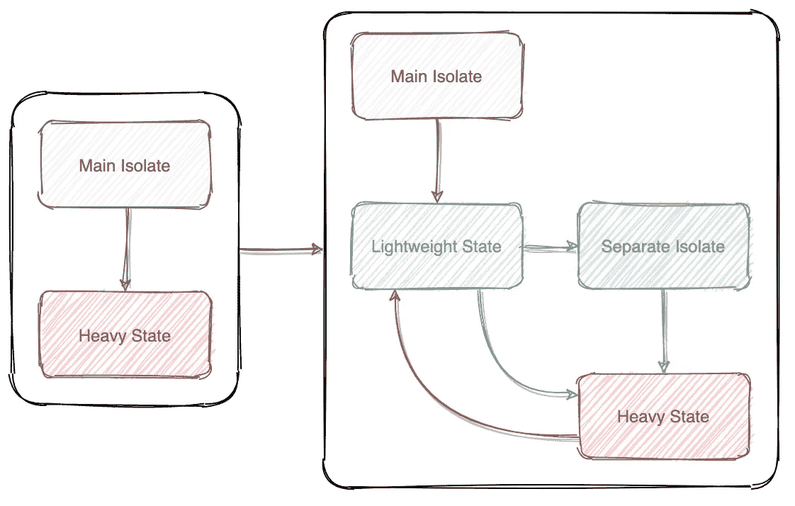
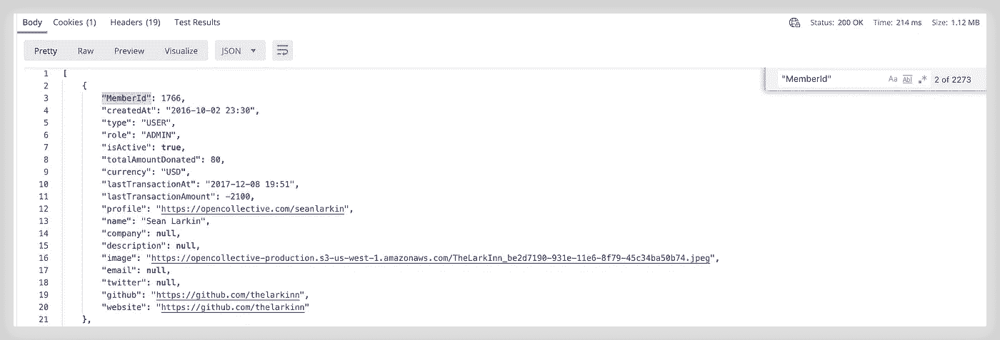
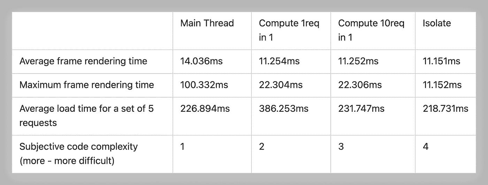
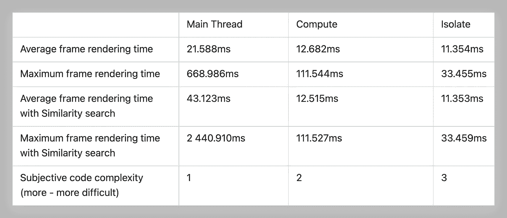
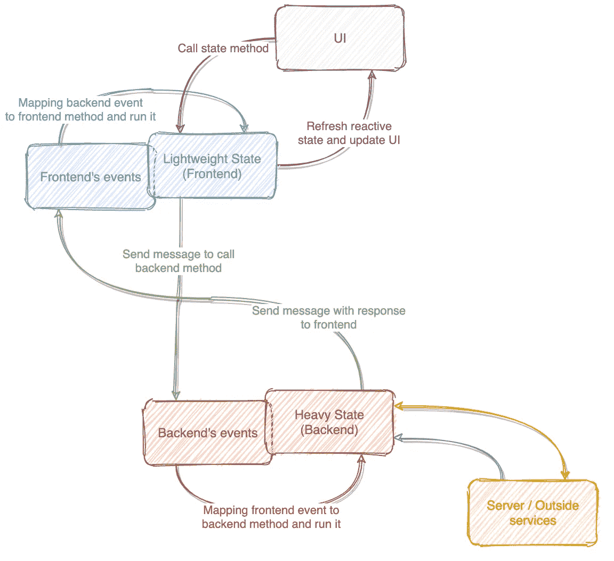
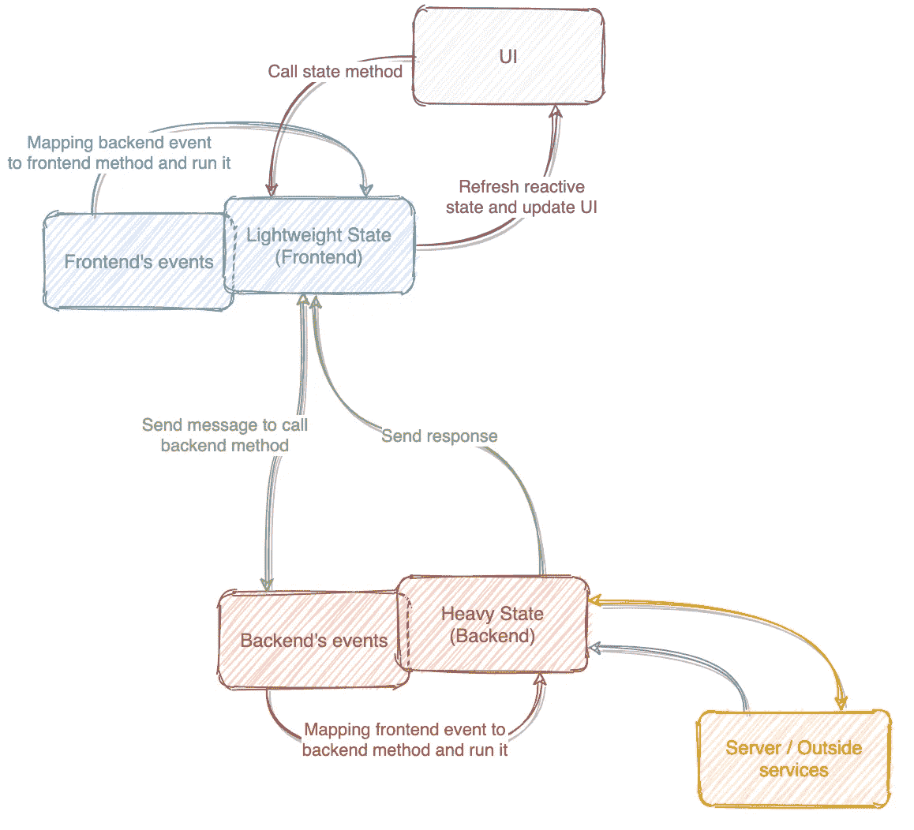

# 孤立状态下的颤振应用程序

> 原文：<https://itnext.io/flutter-apps-state-in-isolate-8fd9828fc1a3?source=collection_archive---------0----------------------->

在 Flutter 中有许多管理状态的方法，但大多数都是在应用程序的主隔离中执行所有逻辑。执行网络请求、使用 WebSocket、潜在的繁重同步操作(如本地搜索)，所有这些通常都在 main isolate 中实现。本文也将展示其他的门。

我只看到了一个旨在将这些操作转移到外部隔离物的包，但最近出现了另一个包(由我编写)。建议你熟悉一下。

在本文中，我将使用两个主要术语— **隔离**和**主线程**。他们不同，使文本不是太同义反复，但本质上的主线也是一个孤立的。此外，在这里你会发现一些表达会伤害耳朵(*或眼睛*)特别敏感的人，所以我提前道歉——对不起。我会用斜体标出所有有疑问的单词(*不只是它们，现在试着弄清楚*)。此外，进一步调用同步操作—我会记住，您将在调用第三方方法的同一个函数中收到结果。异步函数是这样的函数，你不能在一个地方得到结果，而是在另一个地方得到。

## 介绍

隔离旨在在 Flutter 应用程序的非主线程上运行代码。当主线程开始执行网络请求，执行计算，或者做除了它的主要用途——绘制界面之外的任何其他操作时，迟早你会面临这样一个事实，渲染一帧的宝贵时间会开始增加。基本上，您在主线程上执行任何操作的可用时间都被限制在大约 16ms，这是以 60FPS 渲染 2 帧之间存在的窗口。然而，目前有许多手机具有更高的显示频率，因为我只有一个，所以比较一个应用程序使用不同方法执行相同操作的性能会更有趣。这种情况下，窗口已经~11.11ms，显示刷新率为 90FPS。

## 输入条件

假设您需要加载大量数据，您可以通过几种方式来完成:

*   只需在主线程上发出一个请求
*   使用计算功能提出请求
*   对请求显式使用隔离

实验是在一台一加 7 Pro 上进行的，它配有骁龙 855 处理器，屏幕频率强制为 90Hz。该应用程序由颤振运行剖面命令启动。执行了从服务器接收数据的模拟(连续 10 次 5 个同时请求)。

一个请求返回 JSON——一个由 **2273** 个元素组成的数组，其中一个元素显示在屏幕截图中。答案的大小是 1.12Mb。因此，对于 5 个并发请求，我们需要解析 5.6Mb 的 JSON(但应用程序列表中将有 2273 个条目)。

JSON 的要素之一

让我们根据这些参数来比较这三种方法——帧渲染时间、操作时间、组织/编写代码的复杂性。

## **第一个例子:来自主线程的一组请求**

该方法处于被动状态，在主应用隔离中执行。

该方法位于在应用程序的主隔离中执行的反应状态中。当执行上面的代码时，我们得到以下值:

*   一帧的平均渲染时间(FrameRenderingTime)—14.036 毫秒/ 71.25FPS
*   最大 FRT—100.332 毫秒/9.97 帧/秒
*   执行 5 个并发请求的平均时间—226.894 毫秒

查看实际情况:

在主线程中加载项目

## 第二个示例:compute()

在本例中，相同的请求在两个版本中启动:每 10 个连续请求中有 5 个并发请求在各自的计算中启动:

*   平均 FRT—11.254 毫秒/88.86 帧/秒
*   最大 FRT—22.304 毫秒/ 44.84FPS
*   执行 5 个并发请求的平均时间—386.253 毫秒

第二种方式—在一次计算中启动 5 个并发请求的所有 10 个顺序请求:

*   平均 FRT—11.252 毫秒/ 88.87FPS
*   最大 FRT—22.306 毫秒/ 44.83FPS
*   5 个并发请求的平均时间(计算方法是在计算中执行 5 个请求中的全部 10 个，除以 10)—231.747 毫秒

正在 compute()中加载项目

## 第三个例子:隔离

这里值得做一个题外话:在包术语中，一般状态(state)有两个部分:

*   Frontend-state 是一种任意反应状态，它向后端发送消息，处理它的响应，并且还存储数据，在更新之后，UI 被更新，并且它还存储从 UI 调用的轻量方法。这种状态在应用程序的主线程中工作。
*   后端状态(Backend-state)是一种繁重的状态，它从前端接收消息，执行繁重的操作，向前端返回响应，并在单独的隔离中运行。这种状态也可以存储数据(任何你想要的地方)。

由于需要与隔离区通信，第三个选项的代码被分成几个方法。前端方法如下所示:

在这里，您可以看到后端方法，以及我们需要的逻辑:

结果:

*   平均 FRT—11.151 毫秒/89.68 帧/秒
*   最大 FRT—11.152 毫秒/ 89.67FPS

隔离加载项目

## 小计

在应用程序中加载相同数据集进行了三次实验后，我们得到了以下结果:

根据这些结果，可以得出以下结论:

*   颤振能够提供大约 90 帧/秒的稳定速度
*   在应用程序的主线程上发出大量繁重的网络请求会影响其性能——出现延迟
*   编写在主线程上运行的代码就像剥梨一样简单
*   Compute 允许您减少滞后的可见性
*   用 Compute 写代码有一些限制(纯函数，不能传递静态方法，没有闭包等。)
*   使用按操作时间计算时的开销约为 150–160 毫秒
*   隔离完全消除了滞后
*   使用隔离区编写代码更加困难，也有一些限制，这将在后面讨论

让我们进行另一个实验，以确定哪种方法对于所有正在研究的参数是最佳的。

*一切似乎都很清楚*

## 实验二:局部搜索

假设现在我们需要通过输入到输入中的值在加载的数据中找到某些元素。该测试以如下方式实现:有一个输入，其中从项目列表中可用的子串数量中逐字符地输入 3 个 3 字符的子串。搜索数组中的元素数量增加了 10 倍，为 **22730** 个。

搜索以两种模式进行——输入字符串在列表元素中的原始存在，以及使用字符串相似性[算法](https://pub.dev/packages/string_similarity)。

此外，异步搜索选项——计算/隔离——在前一次搜索完成之前不会启动。它是这样工作的——通过在输入字段中输入第一个字符，我们开始搜索，直到搜索完成——数据不会返回到主线程，UI 也不会重绘，第二个字符不会输入到输入字段中。当所有动作完成后，输入第二个字符，反之亦然。这类似于当我们“保存”用户输入的字符，然后只发送一个请求时的算法，而不是对输入的每个字符都发送一个请求，不管它们输入得有多快。

只有在搜索中输入字符时才测量渲染时间，即数据准备操作和不影响收集数据的任何其他操作。

对于初学者、助手函数、搜索函数和其他通用代码:

## 在主线程中搜索

看起来是这样的:

主线程中的简单搜索(隔离)

在主线索中搜索相似性

简单搜索结果:

*   平均 FRT—21.588 毫秒/46.32 帧/秒
*   最大 FRT — 668，986 毫秒/1.50 帧/秒

使用相似性结果进行搜索:

*   平均 FRT — 43，123 毫秒/23.19 英尺/秒
*   最大 FRT — 2 440，910 毫秒/ 0.41FPS

## 使用计算机搜索()

一些 YouTube:

使用 compute()进行简单搜索

在计算机中搜索相似性()

简单搜索结果:

*   平均 FRT—12.682 毫秒/78.85 帧/秒
*   最大 FRT—111.544 毫秒/ 8.97FPS

使用相似性结果进行搜索:

*   平均 FRT—12.515 毫秒/79.90 帧/秒
*   最大 FRT — 111，527 毫秒/8.97 帧/秒

## 用隔离搜索

大量代码:前端

这些是在第三方隔离中运行的后端方法:

简单搜索结果:

*   平均 FRT—11.354 毫秒/ 88.08FPS
*   最大 FRT—33.455 毫秒/29.89 英尺/秒

相似性搜索:

*   平均 FRT—11.353 毫秒/ 88.08FPS
*   最大 FRT—33.459 毫秒/29.89 英尺/秒

*是时候伸展一下手臂了*

## 更多结论

从这个平板电脑和之前的研究可以得出:

*   主线程不应用于大于 16ms 的操作(以提供至少 60FPS)
*   计算在技术上适用于频繁和繁重的操作，但同样会带来 150 毫秒的开销，并且与永久隔离相比，性能更不稳定(这可能是因为每次打开时，操作完成后，隔离会关闭，这也需要资源)
*   隔离是颤振应用中最难实现最高性能的编码方式

# 隔音装置

好吧，看起来隔离是实现结果的理想方式，甚至谷歌建议在所有繁重的操作中使用它们(*这是为了口碑，我还没有找到任何证据*)。但是你要写很多代码。事实上，上面写的所有东西都是使用一开始提供的库得到的结果，没有它，你将不得不写更多的东西。此外，这种搜索算法可以优化—在过滤所有元素后，只将一小部分数据发送到前端—这将占用更少的资源，在其传输后，发送其他所有内容。或者按块发送数据。

我还试验了隔离物之间的通信信道的带宽。为了对其进行评估，使用了以下实体:

结果是这样的——在同时传输 5000 个元素的情况下，复制数据所需的时间不会影响 UI，也就是说，渲染频率不会降低。通过*未来<虚空>，这些元素中的 100 万被分批传输，每次 5000 个，在 8 毫秒的突发传输之间有一个强制暂停。延迟*，而帧率没有降到 80FPS 以下。不幸的是，我在写这篇文章之前很久就做了这个实验，而且没有干燥的数字(如果有请求，它们就会出现)。

许多人可能会发现很难或没有必要处理孤立，人们停止计算。在这里，这个包的另一个功能可以拯救我们，它将 API 等同于计算的简单性，因此，它提供了更多的可能性。

这里有一个例子:

由于这种方法，您可以简单地通过这个函数对应的 ID 来调用后端函数。与方法匹配的 ID 在预定义的 getters 中指定:

因此，我们有两种互动方式:

1.  **通过显式消息传递进行异步通信**

前端使用 *send* 方法向后端发送事件，在消息中传递事件 ID 和可选参数。

这个消息被传递到后端并在那里被处理。

Backend 把结果返回给 Frontend，你就大功告成了！有两种方法可以返回结果——通过使用后端方法返回响应( *return* )(然后响应将使用与接收时相同的消息 ID 发送)，第二种方法是显式调用 send 方法。在这种情况下，您可以使用指定的任何 ID 将任何消息发送到反应状态。主要是处理程序方法是由这些 id 设置的。

示意性地，第一种方式如下:

应用程序中前端和后端之间的异步通信方案

黄色双向箭头—与外部的任何服务交互，例如，某个服务器。紫色从服务器到服务器，这些是来自同一个服务器的消息，例如 WebSocket。

2. ***同步*** 通过其 ID 调用后台函数进行通信

前端使用 *runBackendMethod* 方法，指定一个 ID 来调用与之对应的后端方法，在那里得到响应。这样，你甚至不需要在你前面的任务列表中指定任何东西。同时，如下面的代码所示，您可以在前端覆盖 onBackendResponse 方法，每次前端状态从后端接收消息时都会调用该方法。

后端方法处理传入的事件，并简单地返回结果。在这种情况下，有一个限制——“同步”调用的 back 方法不应该使用它们对应的相同 ID 调用 send 方法。在此示例中，_decrement 方法不应调用 send (Events.decrement)方法。同时，他可以发送任何其他消息。

Схема второго способа похожа на первый, за тем исключением, что во фронте вам не нужно писать обработчики событий, прилетающих с бэка.*(非常抱歉，我正在从 RU 翻译我的文章，看起来翻译器在最不合适的时候坏了*😣 *)*

前端和后端应用内通信的同步方案

*很快，在 0.0.5 版本中，这个功能将起作用并向后——你可以从它的后端以同步模式运行前端的任务。*

## 还有什么要补充的…

要使用这样的包，您需要创建这些后端。为此，*前端<事件类型>* 有一个后端创建机制——init back end 方法。在这个方法中，您需要传递一个工厂函数来创建后端。它应该是一个纯粹的顶级函数(正如 Flutter 文档所说的顶级)，或者是一个静态类方法。创建一个隔离区的时间约为 200 毫秒。

后端零件创建者功能的示例:

## 限制

*   一切都和常规的[隔离](https://api.flutter.dev/flutter/dart-isolate/Isolate-class.html)一样
*   对于每个正在创建的“后端”,它自己的隔离当前正在被创建，如果有太多的后端，它们的创建时间会变得很明显，特别是如果您初始化所有的后端，比如说，当应用程序被加载时。我试验了同时运行 30 个后端——上述手机在发布模式下的启动时间超过了 6 秒。
*   在处理隔离(后端)中出现的错误时存在一些困难。在这里，如果你对这个包感兴趣，你应该更详细地熟悉一下来自*Frontend<event type>*的 initBackend 方法。
*   与仅在主线程中存储逻辑相比，编写代码的复杂性更高

## 使用清单

这里一切都很简单，你**不需要**使用隔离(单独或使用这个包)，如果:

*   在各种操作下，应用程序的性能不会降低
*   对于瓶颈，计算就足够了
*   你不想和隔离者打交道
*   你的应用程序的生命周期如此之短，以至于优化它毫无意义

否则，您可以将注意力转向这种方法和一个[封装](https://pub.dev/packages/isolator)(称为**隔离器**)，它将简化您的隔离工作。

本文中的所有例子都可以在 [GitHub](https://github.com/alphamikle/isolator/tree/master/example) 上找到。

*让我们开始使用分离菌吧！*

