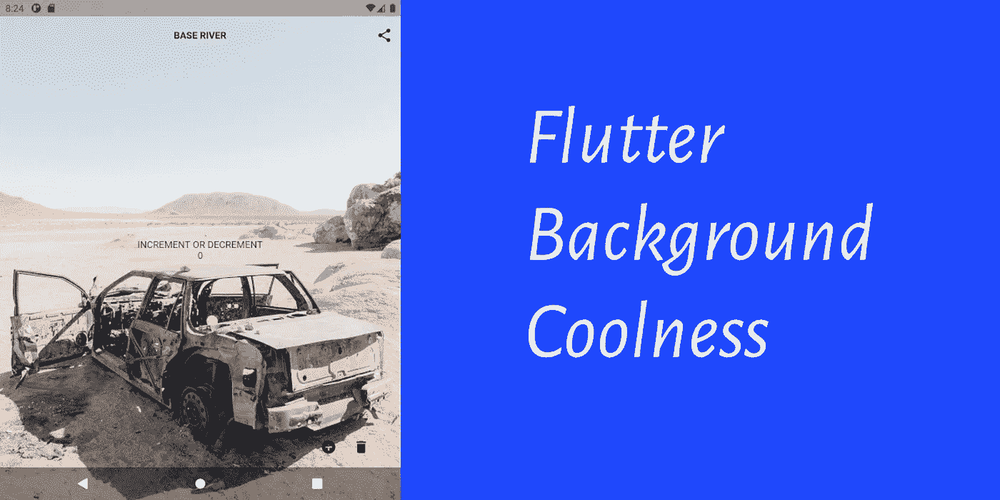
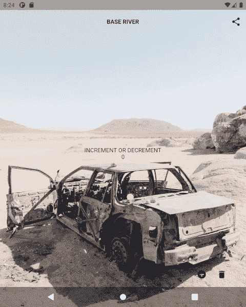

# 颤动背景凉爽

> 原文：<https://itnext.io/flutter-background-coolness-5bfbc6e6ebda?source=collection_archive---------3----------------------->



想要为你的应用程序用户提供酷炫的背景图像和身临其境的用户界面吗？让我来告诉你如何得到那个很酷的用户界面。

# **背景**

Flutter 是一个用户界面工具包，碰巧可以在目标平台上工作，取决于平台，就像一个应用程序播放器，它作为自己的应用程序运行。这意味着有时我们不得不做些修改，让它符合我们在所有平台上想要的审美。

在 android 的情况下，所有的 android 本地应用程序在顶层绘制它们的视图活动，而系统 UI 组件在该层之下绘制。这很好，直到谷歌推出全屏应用程序，然后不得不考虑新的全屏和可折叠形式的底部导航条系统用户界面。

但是，你猜怎么着？每个人都在 stack-overflow 上发帖，了解如何破解错误。是时候向您展示如何使用一些信息来创造一些美丽的东西了。

# 安卓黑客

因为这不是我们将遇到的唯一的 android 黑客；让我给你一些阅读 android hacks 的有用提示。Android 原生 SDK 指定了两个 SDK，最小值和最大值。这意味着，当您看到 IDE 提示说某个方法调用是针对特定 API 级别时，您应该使用 Google 和 stack-overflow 来查找另一个 depreciated 方法调用，因为您仍然需要对其他 API 级别进行 depreciated 方法调用。事实上，这是所有其他关于如何首先解决这个问题的堆栈溢出答案中的一个错误。

现在，让我先给你看看原生黑客。

在 MainActivity.kt:

第一个 if-block 设置 android 原生窗口管理器，根据 flutter 引擎的设置来绘制系统 UI 的系统背景，并确保底部的系统 UI 栏是透明的。

第二个 if 块为底层系统 UI 透明性设置新的方法调用，并为设备 API 级别 30 及更高级别的边缘到边缘设备设置系统 UI 边缘窗口。

现在我们只剩下颤动代码来使它工作。

# 颤动的钩侧

我们使用两个组件:SystemChromeStyle API 调用和 materialApp Scaffold 方法调用。SystemChromeStyle 调用包括:

```
AnnotatedRegion<SystemUiOverlayStyle>(value: SystemUiOverlayStyle.dark.copyWith(statusBarColor: Colors.transparent,systemNavigationBarColor: Colors.transparent,systemNavigationBarDividerColor: Colors.transparent,),child:  ,)
```

儿童旁边的最后一个空白是应用程序第一个屏幕的其余部分。

它将系统用户界面设置为透明背景。结合我们的 Android Kotlin 的变化，将系统界面背景设置为透明。然后我们有 materialApp scaffold 调用来重置偏移，因为 android Flutter engine 应用程序绘制在顶部，而底部的 system-UI-bar 在底部，我们调整 Flutter 应用程序的偏移，以便 system-UI 绘制得像在顶部一样，尽管它不是:

它在 android 27、28、29 和 30 级 API 设备上产生了很好的效果:



# 项目源

注意，项目源代码使用了我参与开发的 Flutter-PlatForm-Widgets 插件和 RiverPod 状态管理系统。我将在接下来的几篇文章中讨论这两个问题。项目回购是:

[https://github.com/fredgrott/base_river](https://github.com/fredgrott/base_river)

此外，请注意，我确实更改了谷歌的默认反演示应用程序 UI，以使用像 FAB 这样的跨平台，而不是 material-app。

# 结论

这是一个必须解决的用户界面问题，以获得一个美观的令人敬畏的颤振应用程序。在我研究如何解决其他 UI 设计问题并撰写相关文章的时候，状态被调整了。

# **资源**

https://github.com/fredgrott/base_river[GitHub](https://github.com/fredgrott/base_river)的 Base River repo

在 GitHub[https://github.com/fredgrott/flutterdeepdive](https://github.com/fredgrott/flutterdeepdive)进行深度回购

一般颤振和飞镖资源；

扑社区资源[https://flutter.dev/community](https://flutter.dev/community)

颤振 SDK[https://flutter.dev/docs/get-started/instal](https://flutter.dev/docs/get-started/instal)

Android Studio IDE[https://developer.android.com/studio](https://developer.android.com/studio)

虚拟系统代码[https://code.visualstudio.com/](https://code.visualstudio.com/)

颤振文件[https://flutter.dev/docs](https://flutter.dev/docs)

dart Docs[https://dart.dev/guides](https://dart.dev/guides)

谷歌 Firebase 移动测试实验室[https://firebase.google.com/docs/test-lab](https://firebase.google.com/docs/test-lab)

# **商标公告**

Google LLC 拥有以下商标:飞镖，颤振，机器人，机器人，诺托。苹果公司拥有 iOS、MacOSX、Swift 和 Objective-C 的商标。苹果公司拥有 SF Pro、Sf Compact、SF mono 和 New York 字体的商标。JetBeans Inc .拥有 JetBeans、IntelliJ 和 Kotlin 的商标。甲骨文公司拥有 Java 商标。微软公司拥有微软视窗操作系统和 Powershell 的商标。Gradle 是 Gradle Inc .的商标。Git 项目拥有 Git 的商标。Linux 基金会拥有 Linux 的商标。智能手机 OEM 自有商标到其手机产品名称。尽我所能，我遵守上述商标的品牌和使用指南。

# **关于弗雷德·格罗特**

我是一个疯狂的 SOB，作为一名前 android 移动开发者，我开始写关于 flutter 移动应用程序开发、设计和生活的文章(见 [Eff 新冠肺炎和共和党](https://fredgrott.medium.com/eff-covid-and-the-gop-e912db0548b8))。我会达到关键的每月 100 万观众大关吗？坐下来看。在[邢](https://www.xing.com/profile/Fred_Grott/cv)、 [LinkedIN](https://www.linkedin.com/in/fredgrottstartupfluttermobileappdesigner/) 、 [Keybase](https://keybase.io/fredgrott) 、 [Twitter](https://twitter.com/fredgrott) 等社交平台上找我。