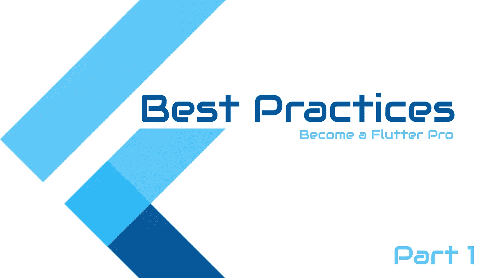

# 颤振最佳实践—第 1 部分

> 原文：<https://itnext.io/flutter-best-practices-part-1-e89467ea4823?source=collection_archive---------0----------------------->



颤振—最佳实践

# 视频教程

颤振最佳实践—第 1 部分

这是颤振最佳实践的第一部分…

[](/flutter-best-practices-part-2-e9e5c79ccb16) [## 颤振最佳实践—第 2 部分

### 让我们开始…

itnext.io](/flutter-best-practices-part-2-e9e5c79ccb16) [](/flutter-best-practices-part-3-747f1bfaec6b) [## 颤振最佳实践—第 3 部分

### 你可以在下面找到这个系列的前两部分

itnext.io](/flutter-best-practices-part-3-747f1bfaec6b) [](/flutter-best-practices-part-4-709e7bceabf) [## 颤振最佳实践—第 4 部分

### 以下是成为专业 flutter 开发者的 5 个最佳实践

itnext.io](/flutter-best-practices-part-4-709e7bceabf) 

# 1.占位符小部件

*使用* ***SizedBox*** *代替* ***容器*** *作为占位符小部件。*

看看下面的使用案例

```
return _loaded ? Container() : YourWidget();
```

SizedBox 是一个 const 构造函数，它创建一个固定大小的盒子。width 和 height 参数可以为空，以指示框的大小不应被约束在相应的维度中。

因此，当我们实现占位符时，应该使用 SizedBox 而不是 Container。

```
return _loaded ? SizedBox() : YourWidget();
```

*更好的*

```
return _loaded ? SizedBox.shrink() : YourWidget();
```

# **2。定义主题**

定义应用程序的主题以及第一优先事项，以避免在未来的更新中改变主题的头痛，设置主题肯定是令人困惑的，但只是一次任务。请你的设计师分享所有主题相关的数据，如颜色，字体大小和重量。

```
MaterialApp(
  title: appName,
  theme: ThemeData(
    // Define the default brightness and colors.
    brightness: Brightness.dark,

    // You can add the color from the separate 
    // class here as well to maintain it well.
    primaryColor: Colors.lightBlue[800], // Define the default font family.
    fontFamily: 'Georgia', // Define the default `TextTheme`. 
    // Use this to specify the default
    // text styling for headlines, titles, bodies of text, and more. textTheme: const TextTheme(
      headline1: TextStyle(
        fontSize: 72.0, 
        fontWeight: FontWeight.bold,
    ),
    headline6: TextStyle(
        fontSize: 36.0, 
        fontStyle: FontStyle.italic
    ),
    bodyText2: TextStyle(
        fontSize: 14.0, 
        fontFamily: 'Hind',
    ),
    ),
  ),
  home: const MyHomePage(
    title: appName,
  ),
);
```

你可以用这个主题做更多的事情，定义你的自定义文本字段，卡片，底部导航栏主题，然后直接在应用程序中使用。

```
class AppTheme {
  AppTheme();

  static AppTheme? _current;

  // ignore: prefer_constructors_over_static_methods
  static AppTheme get current {
    _current ??= AppTheme();
    return _current!;
  }

  static ThemeData? lightTheme = ThemeData(
    scaffoldBackgroundColor: AppColors.screenBackground,
    primaryColor: AppColors.blue,
    colorScheme: const ColorScheme.light(secondary: Colors.white),
    cardColor: Colors.white,
    floatingActionButtonTheme: const FloatingActionButtonThemeData(
      backgroundColor: AppColors.blue,
    ),
}
```

# **3。使用“if”代替三元运算符**

让我们看看下面的例子

```
Row(
  children: [
   Text("Hello Flutter"),
    Platform.isIOS ? Text("iPhone") : SizeBox(),
  ]
);
```

在布局中使用 dart 的内置“if”语句。

```
Row(
  children: [
    Text("Hello Flutter"),
    if (Platform.isIOS) Text("iPhone"),
  ]
);
```

也可以将它用于一系列小部件

```
Row(
  children: [
    Text("Hello Flutter"),
    if (Platform.isIOS) ...[
      Text("iPhone")
      Text("MacBook")
    ],
  ]
);
```

# 4.尽可能使用常量小部件

这里的 **TitleWidget** 不会在每次构建时改变，所以最好让它成为一个常量 Widget。

*优点:构建速度更快，因为****title widget****在构建过程中会被跳过，因为它在构建过程中不会改变。*

```
class MyWidget extends StatelessWidget {
  const MyWidget({Key? key}) : super(key: key);

  @override
  Widget build(BuildContext context) {
    return Scaffold(
      body: Column(
        mainAxisSize: MainAxisSize.min,
        children: const [
          TitleWidget(),
        ],
      ),
    );
  }
}

class TitleWidget extends StatelessWidget {
  const TitleWidget({Key? key}) : super(key: key);

  @override
  Widget build(BuildContext context) {
    return const Padding(
      padding: EdgeInsets.all(10),
      child: Text('Home'),
    );
  }
}
```

# 5.命名规格

类、枚举、类型定义和扩展名应该在 ***大写*** 中。

```
class MyWidget { ... }
enum Choice { .. }
typedef Predicate<T> = bool Function(T value);
extension ItemList<T> on List<T> { ... }
```

库、包、目录和源文件名应该在 ***的 snake_case(小写 _ with _ 下划线)中。***

```
library firebase_dynamic_links;
import 'my_lib/my_lib.dart';
```

变量、常量、参数、命名参数都要用 ***小写*** 。

```
var item;
const cost = 3.14;
final urlScheme = RegExp('^([a-z]+):');
void sum(int price) {
 // ...
}
```

> **更多来了……**
> 
> **敬请期待，成为颤振方面的高手……**
> 
> 请在下面分享您的宝贵意见。
> 
> 更多[教程](https://www.coderzheaven.com/)
> 
> [视频教程](https://www.youtube.com/user/coderzheaven)

[](https://github.com/MrVipinVijayan/flutter_tutorials/blob/flutter_best_practices/README.md) [## flutter_tutorials/README.md 位于 flutter _ best _ practices MrVipinVijayan/flutter _ tutorials

### 颤振教程。在 GitHub 上创建一个帐户，为 MrVipinVijayan/flutter _ tutorials 开发做贡献。

github.com](https://github.com/MrVipinVijayan/flutter_tutorials/blob/flutter_best_practices/README.md)