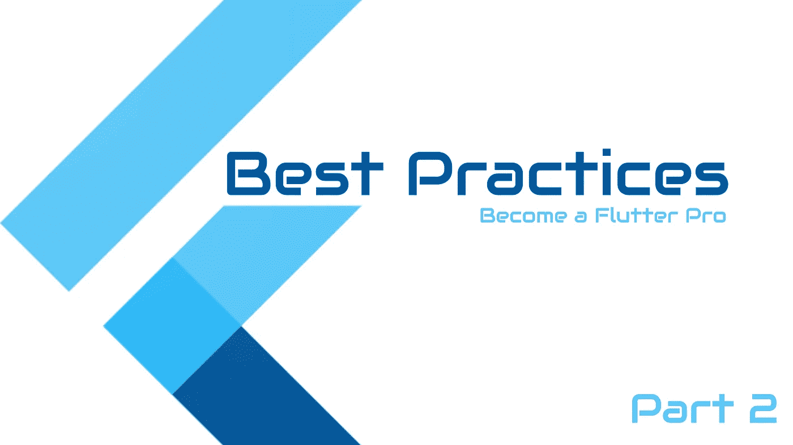

# 颤振最佳实践—第 2 部分

> 原文：<https://itnext.io/flutter-best-practices-part-2-e9e5c79ccb16?source=collection_archive---------0----------------------->

让我们开始…



颤振最佳实践

> 以下是其他几集
> 
> 第一集
> 
> [第三集](https://medium.com/p/747f1bfaec6b)第三集

# 视频教程

颤振最佳实践—第 2 部分

***以下是今天的五个最佳实践***

# 1.避免功能部件

我们通常会遇到这样的情况，我们需要将 UI 代码从小部件中分离出来，但是我们避免创建单独的小部件，而是使用返回小部件的函数。这种做法有一些好处，比如你不需要在你的新部件中传递所有的参数，你有更少的代码和文件。但是当您想要检查小部件时，这种方法可能会引起问题。让我们深入了解一下这一点。

当你使用功能部件时，代码看起来像这样。

```
Widget functionWidget({ Widget child}) {
  return Container(child: child);
}
```

您现在可以将它用作

```
functionWidget(
  child: functionWidget(),
);
```

在这种情况下，小部件树看起来会像这样

```
Container
  Container
```

相反，如果我们使用小部件，我们的小部件看起来像

```
class ClassWidget extends StatelessWidget {
  final Widget child;

  const ClassWidget({Key key, this.child}) : super(key: key);

  @override
  Widget build(BuildContext context) {
    return Container(
      child: child,
    );
  }
}
```

您可以将它用作

```
ClassWidget(
  child: ClassWidget(),
);
```

在这种情况下，小部件树看起来像这样

```
ClassWidget
  Container
    ClassWidget
      Container
```

**优点**:

*   通过使用函数将小部件树分割成多个小部件，您将自己暴露在错误面前，并错过了一些性能优化。
*   不能保证你**使用函数会**有 bug，但是通过使用类，你**保证**不会面对这些问题。
    点击此[链接](https://stackoverflow.com/questions/53234825/what-is-the-difference-between-functions-and-classes-to-create-reusable-widgets/53234826#53234826)了解更多信息。

# 2.指定变量的类型

*不要*

```
var count = 10;
final person = Person();
const timeOut = 6000;
```

*做*

```
final int count = 10;
final Person person = Person();
final String name = 'John Doe';
const int timeOut = 6000;
```

这可能是个人的选择，因为 dart 允许您在赋值时或在函数/类中不指定类型。根据您的个人喜好，您可能会/可能不会想要使用它。如果你在一个类/函数中直接赋值一个变量类型，编译器可能会给你一个警告。在这种情况下，您可以删除类型，但是当变量是全局变量时，最好保留类型。

# 3.用 is 代替 as

*不要*

```
(item as Person).name = 'John Doe';
```

*做*

```
if (item is Person)
item.name = 'John Doe';
```

# 4.如果列表较长，请使用列表中的项目范围

如果您想通过单击按钮或其他方式跳转到特定的索引，ItemExtent 将极大地提高性能。

优点:指定一个 itemExtent 比让孩子决定他们的范围更有效，因为滚动已经知道孩子的范围以节省时间和精力。

```
class MyListView extends StatelessWidget {
  final _scrollController = ScrollController();
  @override
  Widget build(BuildContext context) {
    return Scaffold(
      floatingActionButton: FloatingActionButton(onPressed: () {
        _scrollController.jumpTo(
          _scrollController.position.maxScrollExtent,
        );
      }),
      body: ListView(
        controller: _scrollController,
        children: List.generate(10000, (index) => Text('Index: $index')),
        itemExtent: 600,
      ),
    );
  }
}
```

# 5.使用？？然后呢。。经营者

```
// Don't
bool isValid =  done == null ? false : true;// Do
bool isValid = done ?? false;// Don't
bool isValid = done == null ? null : a.b;

// Do
bool isValid = a?.b;
```

> 感谢阅读…

> **更多来了……**
> 
> **敬请期待，成为颤振中的高手……**
> 
> 请在下面分享您的宝贵意见。
> 
> 更多[教程](https://www.coderzheaven.com/)
> 
> [视频教程](https://www.youtube.com/user/coderzheaven)