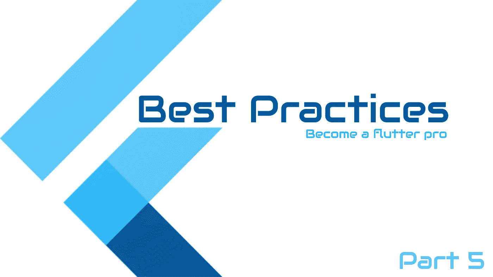

# 颤振最佳实践—第 5 部分

> 原文：<https://itnext.io/flutter-best-practices-part-5-44feacca6264?source=collection_archive---------0----------------------->

这里是另一个 10 个颤振最佳实践的列表



颤振最佳实践

# 看视频家教

颤振最佳实践

# 不要显式初始化变量`null`

在 Dart 中，当没有指定变量的值时，该变量会自动初始化为 null，因此添加 null 是不必要的和多余的。

```
// Don't
int _val = null;

// Do
int? _val;
```

# 使用表达式函数体

对于只包含一个表达式的函数，可以使用表达式函数。= >(箭头)符号用于表达式函数。

```
// Don't
get name {
  return '$firstName $lastName';
}Widget getLoading() {
  return CircularProgressIndicator(
    valueColor: AlwaysStoppedAnimation<Color>(Colors.blue),
  );
}// Do
get name => '$firstName $lastName';Widget getLoading() => CircularProgressIndicator(
      valueColor: AlwaysStoppedAnimation<Color>(Colors.blue),
);
```

# 使用级联运算符

如果我们想在同一个对象上执行一系列操作，那么我们应该使用级联(..)运算符。

```
// Don't
var path = Path();
path.lineTo(0, size.height);
path.lineTo(size.width, size.height);
path.lineTo(size.width, 0);
path.close();  

// Do
var path = Path()
..lineTo(0, size.height)
..lineTo(size.width, size.height)
..lineTo(size.width, 0)
..close();
```

# 使用跨页收藏

当现有项已经存储在另一个集合中时，分散集合语法会导致代码更简单。

```
// Don't
var y = [4,5,6];
var x = [1,2];
x.addAll(y);

// Do
var y = [4,5,6];
var x = [1,2,...y]; // 1,2,4,5,6
```

# 使用文本初始化可增长集合。

```
// Good
var points = [];
var addresses = {};

// Bad
var points = List();
var addresses = Map();

// With type argument

// Good
var points = <Point>[];
var addresses = <String, Address>{};

// Bad
var points = List<Point>();
var addresses = Map<String, Address>();
```

# 在单独的文件中使用颜色

尝试在应用程序的单个类中包含所有颜色，如果您不使用本地化，也可以使用字符串，这样无论何时您想要添加本地化，都可以在一个地方找到所有字符串。

```
class AppColor {
  static const Color red = Color(0xFFFF0000);
  static const Color green = Color(0xFF4CAF50);
  static const Color errorRed = Color(0xFFFF6E6E);
}
```

# 使用 Dart 代码指标

Flutter 代码结构的最佳实践之一是使用 Dart 代码指标。这是提高整体颤振 app 质量的理想方法。DCM (Dart Code Metrics)是一个静态代码分析工具，帮助开发人员监控和改进整体的 Flutter 代码质量。开发人员可以查看的各种指标包括许多参数、可执行代码行等等。在 [Dart 代码度量官方文档](https://dartcodemetrics.dev/)中提到的一些**颤振最佳实践**是:

*   *避免使用 Border.all 构造函数*
*   *避免不必要的* `*setState()*`
*   *避免返回小部件*
*   *优先提取回调*
*   *更喜欢每个文件一个小部件*
*   *首选恒定边界半径*

# 使用 Fittedbox 小部件使 Flutter 布局具有响应性

为了在 Flutter 中实现响应式设计，我们可以利用 FittedBox 小部件。FittedBox 是一个 Flutter 窗口小部件，它限制子窗口小部件在超过一定限制后增长。它根据可用的大小重新调整子组件的大小。例如，我们创建一个容器，用户输入的文本将显示在其中，如果用户输入一个很长的文本字符串，容器将超出其允许的大小。但是，如果我们用 FittedBox 包装容器，它将根据容器的可用大小来适应文本。如果文本超过了使用 FittedBox 设置的容器大小，它会缩小文本大小以适应容器。

# 颤振安全最佳实践

安全性是任何移动应用不可或缺的一部分，尤其是在这个移动优先的技术时代。为了让许多应用程序正常运行，它们需要用户的许多设备权限以及关于他们的财务、偏好和其他因素的敏感信息。开发人员有责任确保应用程序足够安全，以保护这些信息。Flutter 提供了出色的安全措施，以下是您可以使用的最佳 Flutter 安全实践:

## a.代码混淆

代码混淆是一种调整应用程序二进制文件的方法，使人类很难理解它。这样做有助于保护您的应用程序免受逆向工程。这有助于保证 API 键、函数名、类和其他重要字符串的安全。您可以通过代码混淆在编译的 Dart 代码中隐藏这些细节，为试图对您的应用程序进行逆向工程的攻击设置障碍。

**如何在 Flutter 中混淆代码？**

用`--split-debug-info`标志构建`**--obfuscate**` 标志的发布版本。

这样做会看起来像这样:

> *flutter build apk—obfuscate—split-debug-info =/<项目名称> / <目录>*

## b.防止背景快照

一般来说，当你的应用在后台运行时，它会自动在任务切换器或多任务屏幕中显示你的应用的最后状态。当你想在不同的应用程序上查看你最近的活动时，这很有用；然而，在某些时候，你不希望在任务切换中显示屏幕信息。例如，你不希望你的银行账户信息显示在你的应用程序的背景屏幕上。您可以使用[secure _ application](https://pub.dev/packages/secure_application)Flutter 包来保护您的 Flutter 应用程序免受此类问题的影响。

# 如果代码块中没有使用该值，请使用 _(下划线)。

```
//Do
someFuture.then((_) => someFunc());//Do not
someFuture.then((DATA_TYPE VARIABLE) => someFunc());
```

# 前几集

[](/flutter-best-practices-part-1-e89467ea4823) [## 颤振—最佳实践—第 1 部分

### 这是颤振最佳实践的第一部分…

itnext.io](/flutter-best-practices-part-1-e89467ea4823) [](/flutter-best-practices-part-2-e9e5c79ccb16) [## 颤振最佳实践—第 2 部分

### 让我们开始…

itnext.io](/flutter-best-practices-part-2-e9e5c79ccb16) [](/flutter-best-practices-part-3-747f1bfaec6b) [## 颤振最佳实践—第 3 部分

### 你可以在下面找到这个系列的前两部分

itnext.io](/flutter-best-practices-part-3-747f1bfaec6b) [](/flutter-best-practices-part-4-709e7bceabf) [## 颤振最佳实践—第 4 部分

### 以下是成为专业 flutter 开发者的 5 个最佳实践

itnext.io](/flutter-best-practices-part-4-709e7bceabf) 

希望你喜欢这篇文章。请在评论中让我知道。

如果你觉得有用，请鼓掌。

感谢阅读。

[更多教程](https://coderzheaven.com/)

[视频教程](https://www.youtube.com/c/MobileProgrammer)