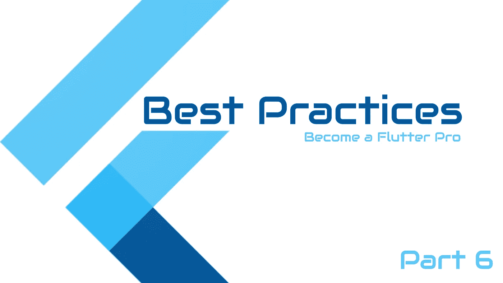
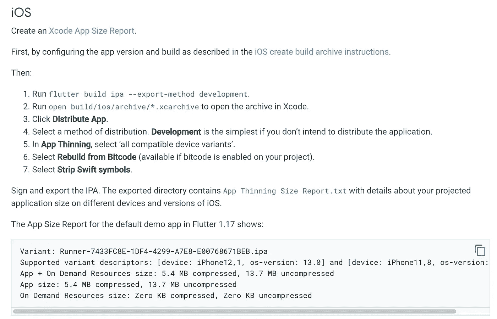

# 颤振最佳实践—第 6 部分

> 原文：<https://itnext.io/flutter-best-practices-part-6-2cc349abcc78?source=collection_archive---------2----------------------->



颤振最佳实践

# 幻数的正确命名

```
// Do not
SvgPicture.asset(
  Images.frameWhite,
  height: 13.0,
  width: 13.0,
);

// Do
final _frameIconSize = 13.0;
SvgPicture.asset(
   Images.frameWhite,
   height: _frameIconSize,
   width: _frameIconSize,
);
```

# 理解颤振中约束的概念

每个 Flutter 应用程序开发人员都需要知道一个 Flutter 布局的经验法则:约束减少，尺寸增加，父元素设置位置。

这里提到的例子可能会非常多。

# 小工具的选择很重要

部件选择不当可能会导致树更大，从而导致更长的构建时间，进而导致性能问题。

# 仅在必要时使用包

当你想加速你的构建过程时，软件包是一个不错的选择，而且 [pub](https://pub.dev/) 有大量的软件包。尽管如此，如果在没有事先研究的情况下使用它们，它们会对你的应用程序性能产生重大影响。

# 林挺

当您使用最新版本的 Flutter 创建项目时，默认情况下会使用官方 lint 规则创建 *analysis_options.yml* 文件。

> 访问 https://flutter.dev/docs/perf/rendering/best-practices 的[](https://flutter.dev/docs/perf/rendering/best-practices)***以获得关于前两点的完整参考，以及更多其他良好实践。***

# *在构建完成后做一些事情可以提高性能*

```
*@override
void initState() {
  super.initState();
  WidgetsBinding.instance.addPostFrameCallback((timeStamp) {
    doSomething();
  });
}*
```

# *使用安全区域*

*SafeArea 小部件通过移除操作系统控件(如状态栏、底部导航按钮，如后退按钮等)所需的填充来插入子控件。*

```
*@override
Widget build(BuildContext context) {
  return Scaffold(
    appBar: AppBar(),
    body: SafeArea(
      child: YourWidget(),
    },
  };
}*
```

# *使用键来提高颤振性能*

*这通过使用键的颤动来更好地识别小部件，从而提供了更好的性能。*

```
*// FROM
return value
   ? const SizedBox()
   : const Placeholder(),
// TO
return value
   ? const SizedBox(key: ValueKey('SizedBox'))
   : const Placeholder(key: ValueKey('Placeholder')),

----------------------------------------------

// FROM
final inner = SizedBox();
return value ? SizedBox(child: inner) : inner,
// TO
final global = GlobalKey();
final inner = SizedBox(key: global);
return value ? SizedBox(child: inner) : inner,*
```

# *分析并减少应用程序规模*

*在开发时，很容易在一个应用程序中使用多个包、代码和小部件。但有时，它需要大量内存来存储所有这些数据，这也会降低应用程序的性能。*

*Flutter 的开发工具提供了减少应用程序大小的优势。在 Gradle 的帮助下，你可以减少颤振应用程序的大小，以优化颤振性能。*

*使用谷歌推出的打包系统，你可以创建 Android 应用的捆绑包。应用捆绑包在很多方面都是有益的。app bundle 的一个主要特性是它允许你从谷歌 Play 商店下载原始代码。谷歌 Play 商店提供与设备兼容的应用程序，并支持平台的架构。*

> *flutter 构建 appbundle*

*iOS:*

**

# *使用图像列表视图时优化内存*

```
*ListView.builder(
  ...
   addAutomaticKeepAlives: false (true by default)
   addRepaintBoundaries: false (true by default)
);*
```

# *精确显示您的图像和图标*

**预缓存*图像以获得更好的性能。*

```
*precacheImage(AssetImage(imagePath), context);*
```

# *使用 SKSL 预热*

```
*flutter run --profile --cache-sksl --purge-persistent-cache
flutter build apk --cache-sksl --purge-persistent-cache*
```

*如果应用程序在第一次运行时有干净的动画，然后对相同的动画变得平滑，这可能是由于着色器编译中的延迟。*

# *不要在列表映射中使用引用*

*不*

```
*List a = [1,2,3,4];
List b;
b = a;
a.remove(1);
print(a);  // [2,3,4]
print(b);  // [2,3,4]*
```

*由于这个原因，每当你试图调用 list a 的任何方法时，list b 都会被自动调用。*

*例如 a.remove(一些)；也将从列表 b 中删除该项目；*

*做*

```
*List a = [1,2,3,4];
List b;
b = jsonDecode(jsonEncode(a));
a.remove(1);
print(a);  // [2,3,4]
print(b);  // [1,2,3,4]*
```

# *不惜一切代价避免绝对定位*

*绝对定位是构建应用程序时最糟糕的事情之一。当只为一个特定的设备编码时，绝对定位似乎并没有那么糟糕。然而，当你在构建一个要在各种不同的设备和操作系统上发布的应用时，绝对定位真的会弄乱界面。尽可能使用适合屏幕大小的值，而不是绝对位置*

***快速提示:***

*   *减少不透明度的使用。(使用渐变/动画不透明度)*
*   *避免将所有的小部件分成不同的方法。*
*   *将代码分成更小的代码以获得更高的性能。*
*   *避免重新构建小部件。*

***官方文件***

*【https://docs.flutter.dev/perf/best-practices *

*使用 DevTools 进行性能测试:*

*[https://docs . flutter . dev/development/tools/dev tools/performance](https://docs.flutter.dev/development/tools/devtools/performance)*

*[https://docs.flutter.dev/perf](https://docs.flutter.dev/perf)*

*[https://API . flutter . dev/flutter/widgets/stateful widget-class . html #性能考虑](https://api.flutter.dev/flutter/widgets/StatefulWidget-class.html#performance-considerations)*

 *[## 不透明度类-小部件库- Dart API

### 使其子窗口部分透明的小部件。这个类将它的子级绘制到一个中间缓冲区中，然后…

api.flutter.dev](https://api.flutter.dev/flutter/widgets/Opacity-class.html#transparent-image)* 

# *前几集*

*[](/flutter-best-practices-part-1-e89467ea4823) [## 颤振—最佳实践—第 1 部分

### 这是颤振最佳实践的第一部分…

itnext.io](/flutter-best-practices-part-1-e89467ea4823) [](/flutter-best-practices-part-2-e9e5c79ccb16) [## 颤振最佳实践—第 2 部分

### 让我们开始…

itnext.io](/flutter-best-practices-part-2-e9e5c79ccb16) [](/flutter-best-practices-part-3-747f1bfaec6b) [## 颤振最佳实践—第 3 部分

### 你可以在下面找到这个系列的前两部分

itnext.io](/flutter-best-practices-part-3-747f1bfaec6b) [](/flutter-best-practices-part-4-709e7bceabf) [## 颤振最佳实践—第 4 部分

### 以下是成为专业 flutter 开发者的 5 个最佳实践

itnext.io](/flutter-best-practices-part-4-709e7bceabf) [](/flutter-best-practices-part-5-44feacca6264) [## 颤振最佳实践—第 5 部分

### 这里是另一个 10 个颤振最佳实践的列表

itnext.io](/flutter-best-practices-part-5-44feacca6264) 

希望你喜欢这篇文章。请在评论中让我知道。

如果你觉得有用，请鼓掌。

感谢阅读。

[更多教程](https://coderzheaven.com/)

[视频教程](https://www.youtube.com/c/MobileProgrammer)*