# Flutter: BLOCs at Scale | 1—状态机

> 原文：<https://itnext.io/flutter-blocs-at-scale-1-the-state-machine-fce5f086d7b9?source=collection_archive---------0----------------------->

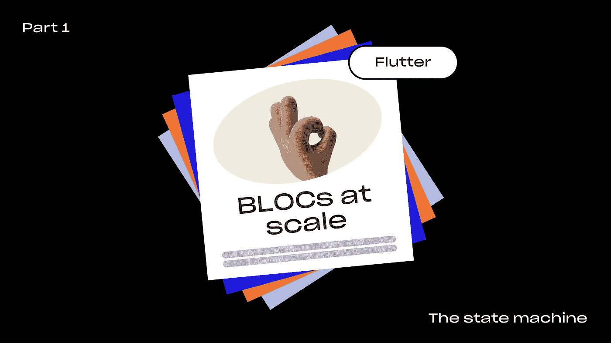

## 介绍

欢迎来到**集团**系列**第一部分**。

> 如果你准备用新的概念提升你的 BLOCs，这将使你的代码更健壮，更结构化，更不容易出错——你在正确的地方！

由于良好的基础总是至关重要的，我们将从谈论可扩展的 BLOC **设计** **原则**开始。这些原则中的一些开始是作为实验，后来帮助设计简单、精简和可读的模块。

这个系列使用的是下面的 [***BLOC 包****(pub . dev)*](https://pub.dev/packages/bloc)。

让我们开始吧！

# 1.**开始把你的 BLOCs 当成有限状态机**

关于如何设计**区块以适应**的一个改变游戏规则的方法是 *(re)* 引入**有限状态机(FSM)** 。

如果你已经熟悉了 BLOC，你可能会说:但是 BLOC 基本上是状态机？你说得对——但是要利用 **FSM** 的力量，你需要**把它们设计好**！

如果你在设计阶段没有意识到这一点，你将会错过很多东西。我们来探索一下。

## 状态机简介

*   固定的状态集。机器一次只能处于一种状态
*   每台机器都有一个初始状态
*   每个状态都有一组转换
*   转换是指从输入状态到输出状态

一个简单的例子是具有 **2 个状态** ***(关/开)*** 和**一个转换*(按压)*** 的灯开关。

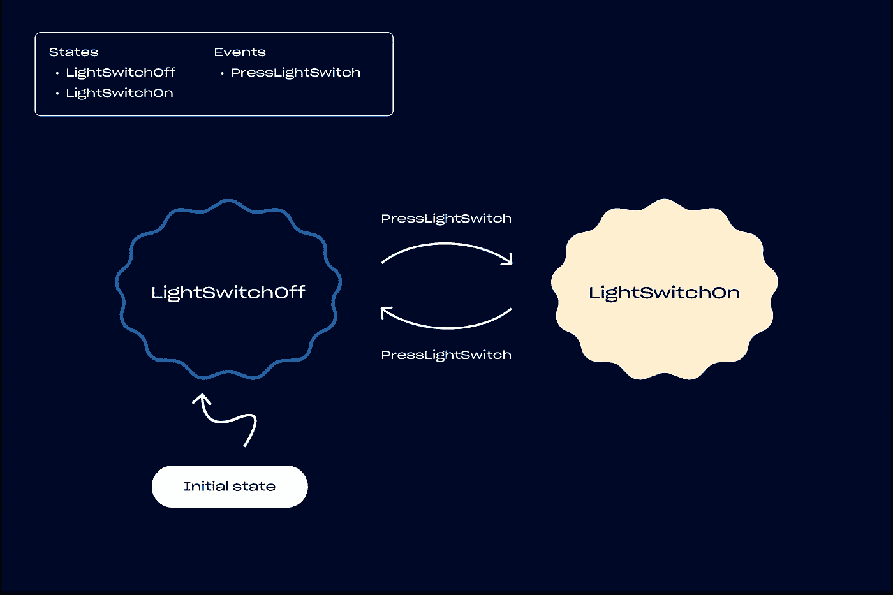

简单状态机的示例状态图。

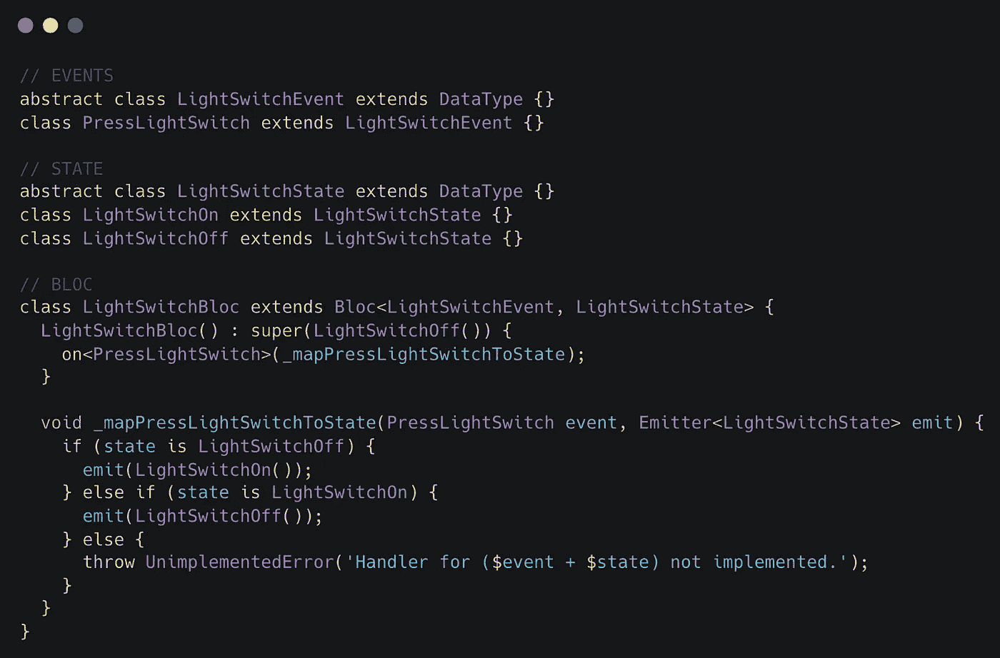

LightSwitch 状态机示例的基本实现。

> ****提示 1:使用状态图表***

**挑战:**

*   过了一段时间，当你回到一个集团时，你会挠头**试图弄清楚它是如何工作的**和**所有的部分是如何组合在一起的**？
*   每次有新的开发人员加入你的团队时，你必须解释特定的团队是如何工作的吗**？**

**解决方案:** 理想情况下，你应该**设计**和**绘制状态图**，甚至在开始你的第一行与 BLOC 相关的代码之前。
不喜欢视觉设计工具？使用像 [**状态机猫**](https://github.com/sverweij/state-machine-cat) 这样的基于代码的工具来创建它们。
确保**将它们检查到源代码控制**和**中，使它们与修改后的块**保持同步。

**结果:** 在我们的团队将这种简单的方法付诸实践后，由于一种**更周到的设计方法**而不是边走边编码和设计，模块的质量和可维护性得到了极大的提高。关于某个集团如何运作的会议几乎再也没有出现过，因为每个人都可以随时查看状态图。作为开发人员，我们永远不应该低估文档的力量——尤其是对于应用程序中最关键的部分！

> 从长远来看，拥有 BLOCs 的可视化蓝图可以加快团队的速度，减少新开发人员的入职时间。

# 2.设计清晰的状态

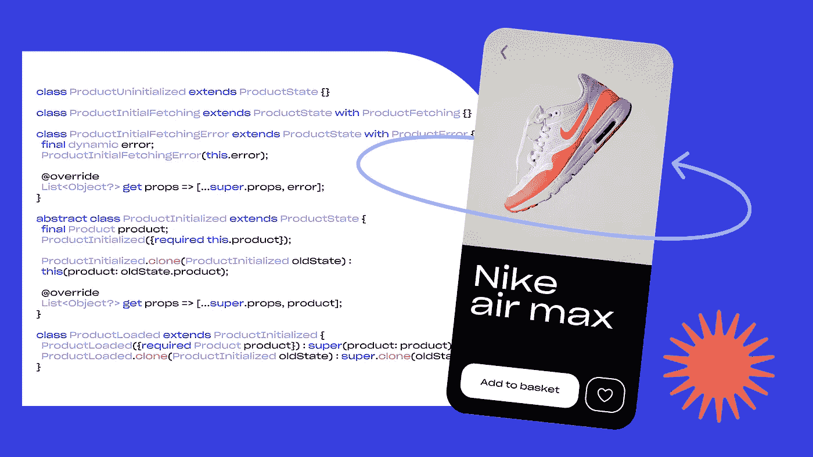

应该以最好地支持**状态消费者**的需求*(例如 UI)* 的方式来定义块的状态。他们应该能够轻松地利用像条件渲染这样的概念，了解潜在的错误和加载状态，并显示它们。

**挑战:**

*   你的集团**没有**很好地代表国家之间的关系吗？
*   你的`**BlocBuilders**` / `**BlocListeners**`是逻辑混乱吗？

**解决方案:** 在设计阶段，你要尽量弄清楚所有状态之间的关系。尝试看看是否有可能**将状态分成多个逻辑组**并使用 **OOP** 概念(如抽象类)将它们分组。这将给你的状态一个逻辑结构，使它们更容易与 BlocBuilder s 一起工作。

**例子:** 为了详细说明所描述的解决方案，我们来做一个例子！

通常，您从一些空状态开始，需要从 API 获取数据来填充状态。您可能已经多次遇到过这个用例。这实际上是练习设计和状态逻辑分离的一个非常好的方法。

以下示例的最终功能展示。

为了这个例子，让我们定义一个`**UserBloc**`的状态，它以一个`**User**`属性的形式保存一些与用户相关的信息*(例如电子邮件、用户名)*。这个阻塞唯一事件是一个试图获取数据的`**FetchUser**`事件。

通常对于这种类型的 BLOCs，您可以从将状态分成两个逻辑部分开始:

1.  **未初始化** →数据**不存在**的状态
2.  **初始化** →数据**已经存在**的状态

现在我们的状态已经大致逻辑分离，让我们开始定义分离的状态。

## **状态设计步骤:**

**1。**先来定义**初始状态**叫做`**UserUninitialized**`。这表示尚未提取远程数据的空状态。

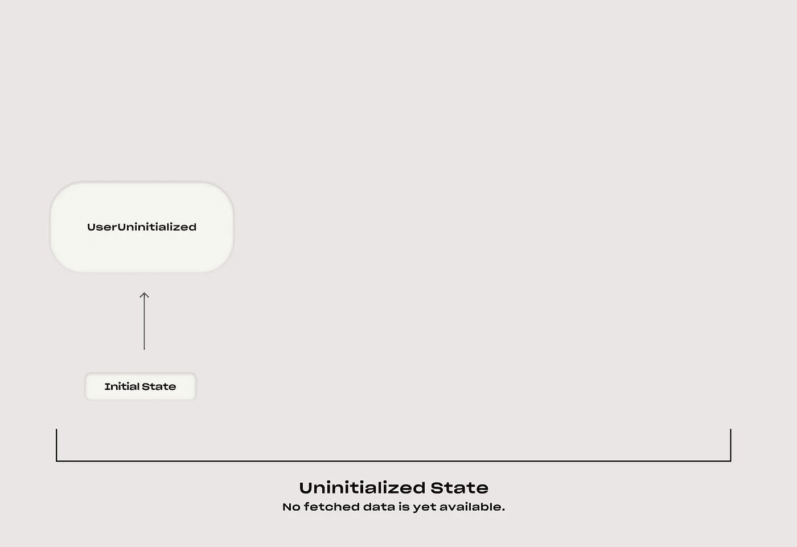

初始状态。

**2。让我们想象在这种状态下调用`**FetchUser**`事件。下一步可以是加载状态，其代表数据获取**期间的**状态。姑且称之为`**UserInitialFetching**`。**

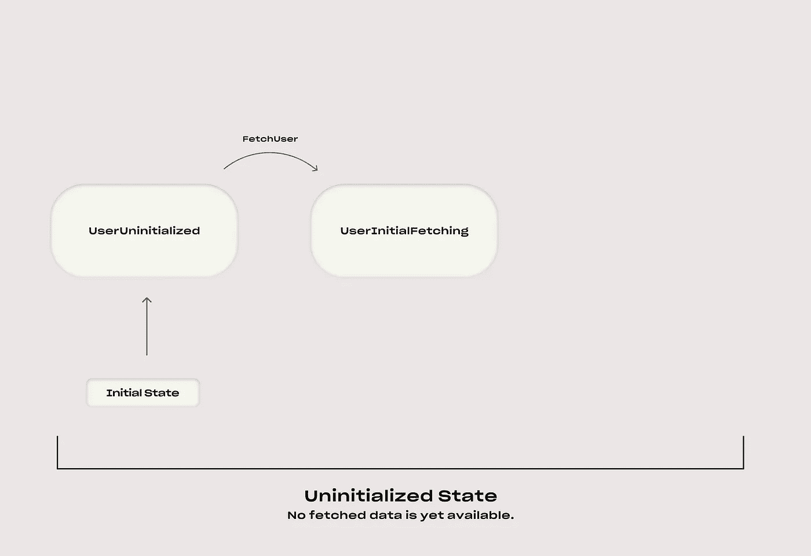

**用户初始提取**表示初始提取正在进行时的状态。

**3。**如果提取失败，让我们定义一个类似`**UserInitialFetchingError**`的**临时状态**，它将**立即**转换回`**UserUninitialized**`状态。

在代码中，这可以写成:

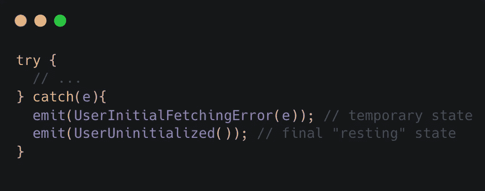

临时**useinitialfetchingerror**状态的示例。

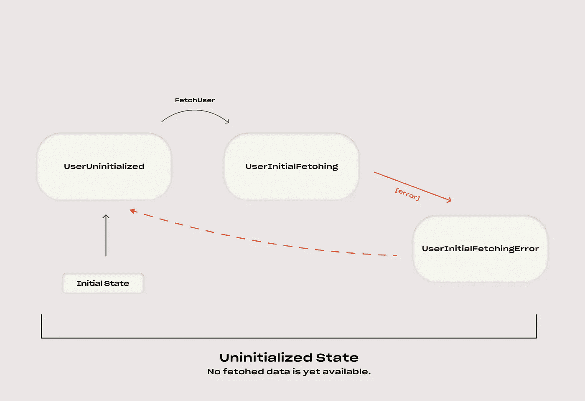

**UserInitialFetchingError**作为临时错误状态。虚线箭头线表示几乎立即的转变。

> **问:**为什么以及什么时候应该使用**临时**状态**状态**？
> 
> **答:** *当* ***状态消费者从中受益*** *。假设 UI 需要显示一个错误* `***SnackBar***` *以防请求失败。在这种情况下，拥有细粒度的临时状态是有益的，这些状态是唯一的，并且易于从 UI 和其他状态使用者那里听到。*

**4。**如果获取成功，BLOC 也可以发出一个临时的`**UserInitialFetchingSuccess**`状态，但是让我们假设还没有消费者依赖它，所以让我们转换到状态的**初始化**部分。

> ***注意:*** *因为*从现在起*所有的状态都有数据可用，创建一个* ***抽象****`*UserInitialized*`****类*** *，所有其他非空状态都将从该类扩展而来，完全有意义。***

**这种抽象可能是这样的:**

**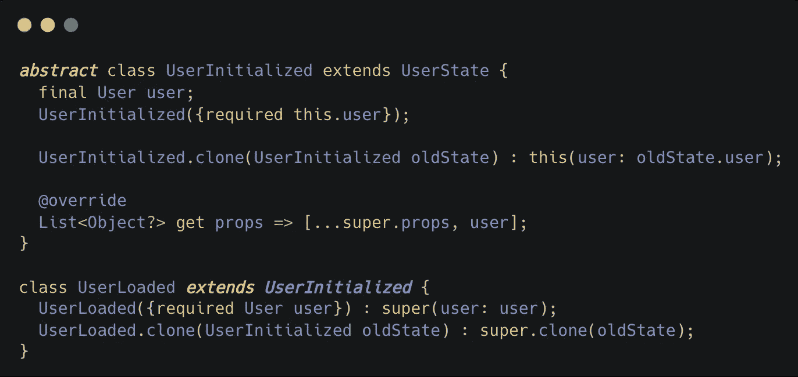**

**与 **UserInitialized** 抽象类逻辑相关的状态可以从它扩展。**

**最后，让我们发射并过渡到这个阶段的`**UserLoaded**`状态。**

**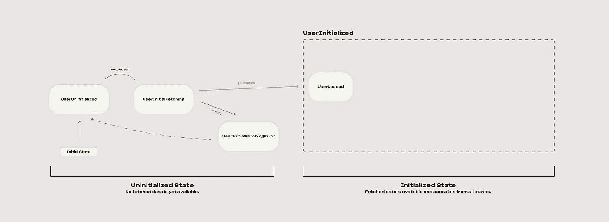**

**一旦获取的数据可用，状态就转换到抽象**用户初始化**状态。从现在开始，所有扩展 **UserInitialized** 抽象类**的状态都有数据可用**。**

****5。**当当前状态为`**UserLoaded**`时，`**FetchUser**`事件会触发数据**重取**。让我们添加一个额外的状态来表示它— `**UserRefetching**`。该状态对于例如在 UI 层上呈现加载指示符也是有用的。**

**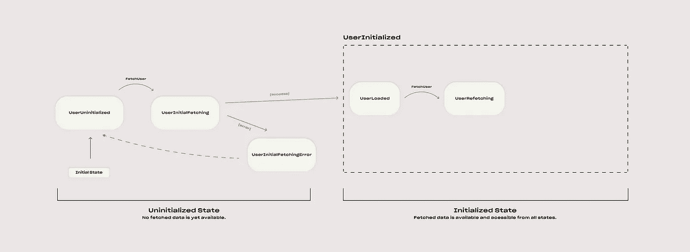**

****FetchUser** 事件在**用户加载**状态下被调用时触发**重取**。**

****6。**类似于步骤 3，在状态返回到`**UserLoaded**` *(在获取失败的情况下，使用其旧数据作为备用数据)*之前，让我们定义一个临时错误状态— `**UserRefetchingError**`，它很容易从 UI 中听到。**

**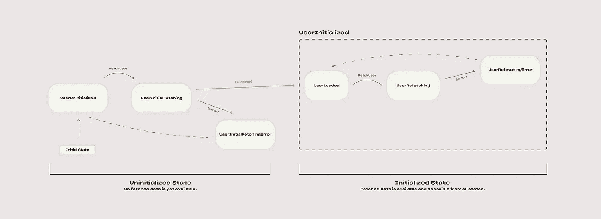**

**当 refetch 失败时，发出临时 **UserRefetchingError** 状态。**

**7.这一次，让我们添加一个临时的成功状态`**UserRefetchingSuccess**`，因为 UI 需要显示一个成功消息。状态切换回带有新获取数据的`**UserLoaded**`状态。**

****

****用户块**状态图的最终结果。**

**就是这样！我们设法以清晰简洁的方式定义了状态机。这种设计 BLOCs 的结构化方法将帮助您轻松使用代码库的其余部分。**

> ******提示 2****:****试着将你的状态分离并抽象成两个或更多的逻辑组*(例如未初始化/已初始化)*并使用临时发出的状态，这样状态消费者就能从中受益。*****

# **3.*奖励:处理 NoOps 和意外状态+事件组合**

****

****挑战:****

*   **当你的一些事件发生时，很难跟踪你的博客处于什么状态？**
*   **没有捕捉到**意外状态+事件**的组合，导致随机错误？**

****解决方案:** 如果你想进一步强化你的 BLOCs 的稳定性和可预测性，它有助于捕捉所有**意外状态+事件组合**。这有助于你在早期发现缺失的处理程序实现*，并在以后避免与 BLOC 相关的错误。***

**让我们在`**UserBloc**`和`**FetchUser**`事件*的实现上演示一下。本文观点)。***

**为了捕捉意外的组合，您可以从向我们的状态处理程序添加一个`**else**`语句开始，如下所示:**

**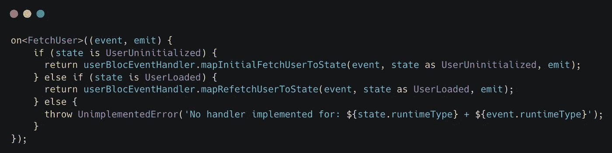**

**预期状态+事件组合，并添加了一个常规意外事件处理程序。**

**简单！如果`**UnimplementedError**`像这样传播到您的主应用程序错误处理程序，您可以很容易地在您的错误报告仪表板*(例如 Crashlytics)* 中看到这些错误。**

****！！！！！！！！！！！！！！！！！！！！！！！！！！！！！！！！！！！！！！！！！！！！！！！！！！！！！！！！！！！！！！！！！！！！！！！
注意:等等！这个实现有一个问题。
！！！！！！！！！！！！！！！！！！！！！！！！！！！！！！！！！！！！！！！！！！！！！！！！！！！！！！！！！！！！！！！！！！！！！！！****

**如果当前状态既不是`**UserUninitialized**` **也不是** `**UserLoaded**`，上面的例子会发生什么？**

> **如果你不想总是抛出一个错误怎么办？**
> 
> ****预计某些状态不会对某些事件做出反应。****

**现在，您可以看到实际上有 3 种类型的案例**需要处理:****

*   ****预期**状态+事件组合✅**
*   ****意外的**状态+事件组合*(错误，缺少处理程序实现)* ✅**
*   *****NEW: NoOps** —预期状态+事件组合与**空处理程序** *(又名无动作应发生)* ❓❓❓**

**现在的目标是在事件处理程序中显式地处理这些，以摆脱抛出不需要的**`**UnimplementedErrors**`**。******

> ****由于可能有许多状态需要被忽略，让我们通过在逻辑上将一些**混合**附加到我们的状态来获得一些帮助，以便于选择。****

****让我们试着看看哪种状态最需要**忽略**:****

*   ******加载/获取** →加载状态期间无需处理新事件****
*   ******暂时错误******
*   ******暂时的成功******

****让我们将这些**3**4**状态类别**定义为**混合**如下:****

****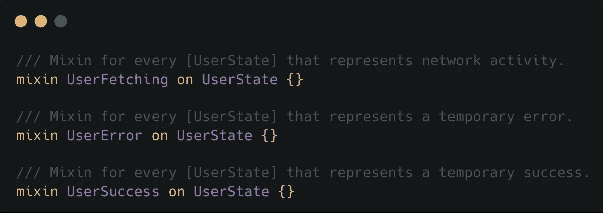****

******可以附加到逻辑对应状态的混合**。****

****现在让我们将它们与相应的状态联系起来:****

********

****示例:通过使用` **with`** 关键字，在逻辑对应的状态类上使用上述**混合**。****

****这现在使我们能够简化 NoOps 定义，并在我们的事件处理程序中轻松地选择它们:****

****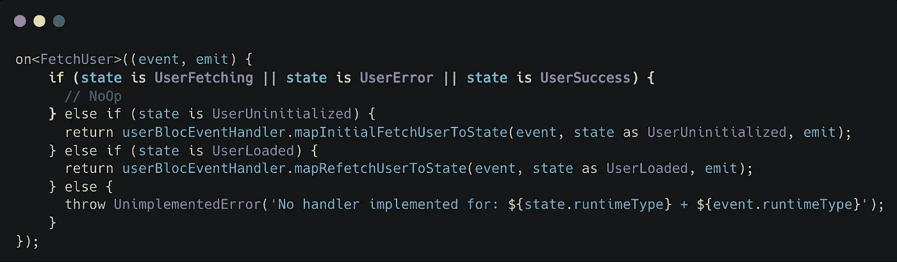****

****借助 **mixins** 在处理程序的开头明确定义 **NoOps** 。****

******结果:** 使用这种方法，您应该能够:****

*   ****增加你的块的稳定性，因为所有的状态+事件组合都是显式处理的*(生产中不再有被遗忘的情况)*****
*   ****使代码尽可能接近设计的状态图****
*   ****通过对 NoOps、预期和意外状态+事件组合的清晰定义，加快对集团运作方式的理解****
*   ****早点抓虫子****

## ****结论****

****感谢您在大规模 BLOCs 的**第 1 部分**中走到这一步！这些设计方法被认为是真正的改变游戏规则的方法。它有助于代码更加稳定、可预测，同时在处理复杂的业务逻辑时使编码更加高效。****

****如果你的博客缺少本文所描述的一些东西，请随意尝试这些方法，并在评论中告诉我进展如何:)****

******如果你想用一些新的概念装备自己并提升你的团体游戏，请继续关注这个系列的剩余部分**。****

## ****本系列文章****

****1 —状态机
2 — [保持区块精简](https://medium.com/@nickjokic/flutter-blocs-at-scale-2-keeping-blocs-lean-1b659536e3ec)
3 —(即将推出)
4 —(即将推出)****

## *****谢谢你****

****给每一个读到这篇文章的人。
如果你想要**更多像这样的文章**，请随意:****

*   ****💬**评论**您自己使用颤振、阻塞和状态管理解决方案的一般经验。****
*   ****👏**发几个拍手**。这将激励我继续分享关于颤振开发的生产准备技巧。****
*   ****➕ **在我的媒介上按下跟随**。****
*   ****🔗**在你的社区内分享**该系列。****