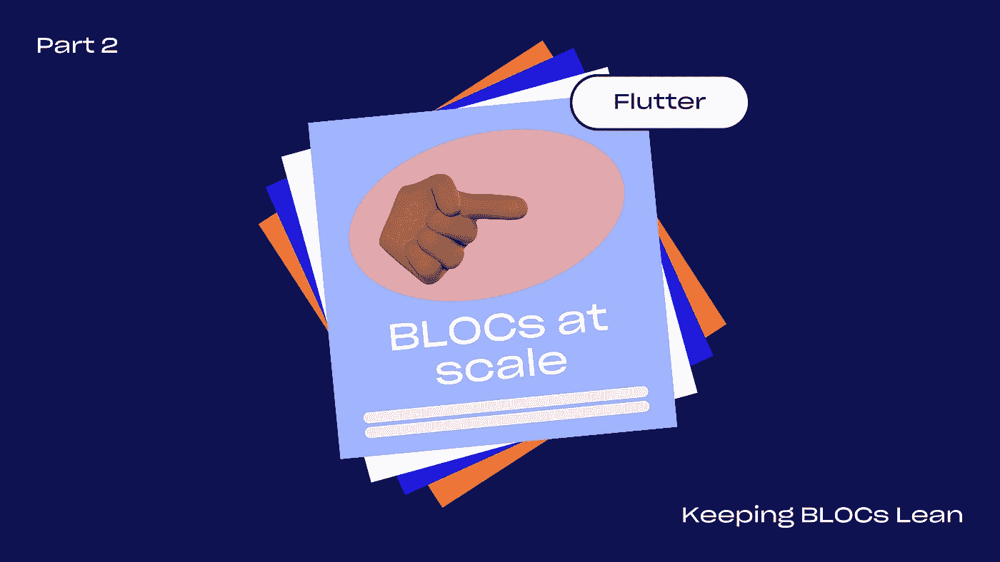
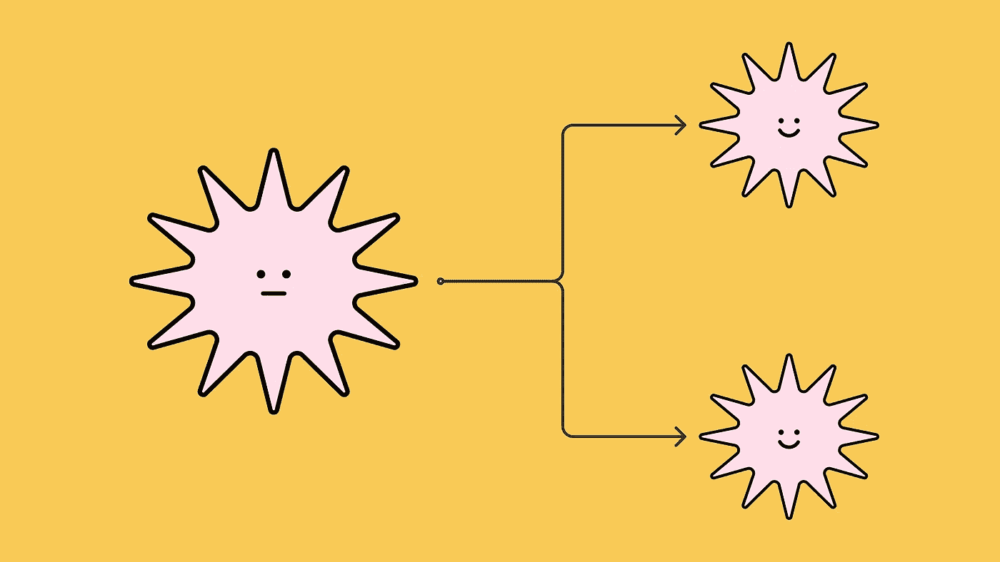
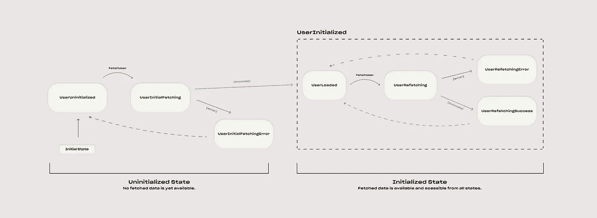
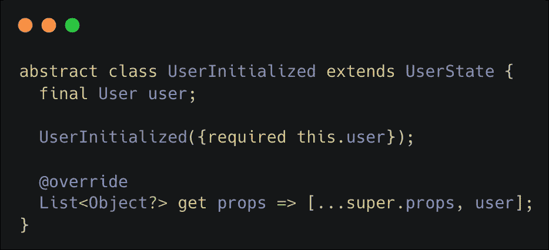
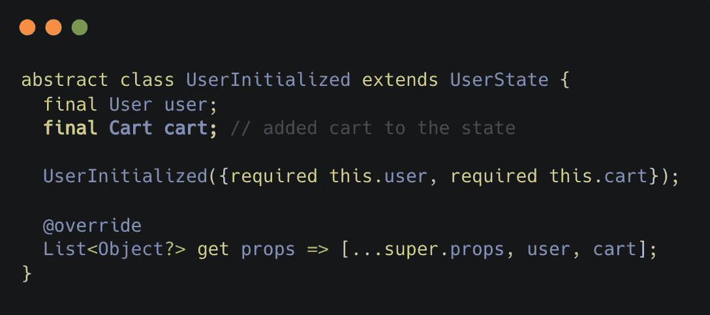
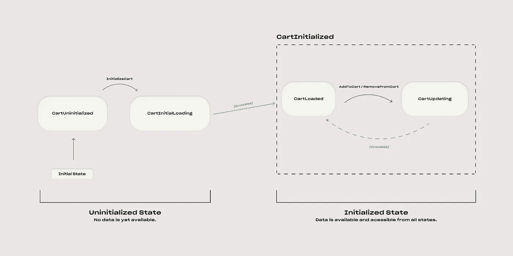
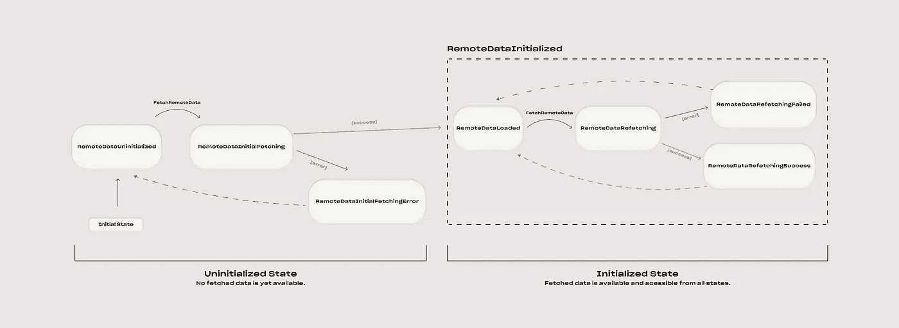
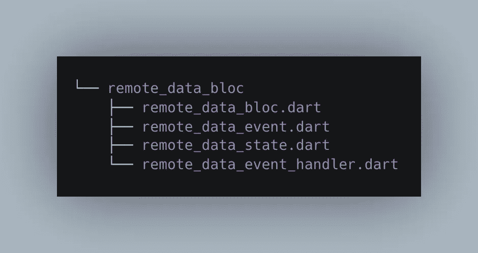

# 颤动:成比例的块| 2-保持块倾斜

> 原文：<https://itnext.io/flutter-blocs-at-scale-2-keeping-blocs-lean-1b659536e3ec?source=collection_archive---------0----------------------->



# 介绍

欢迎来到**集团**系列**第二部**。

> 如果你准备好用新的概念提升你的博客，这将使你的代码更健壮，更结构化，更不容易出错——你在正确的地方！

在 [**上一篇文章**](/flutter-blocs-at-scale-1-the-state-machine-fce5f086d7b9) 中，我们阐述了设计&架构概念，这些概念有助于实现可伸缩的块。对于完整的图片，我强烈建议阅读第 1 部分之前，这一点。

本文主要关注前两个概念，它们将帮助您清理 BLOCs，避免逻辑混乱和代码重复。

这个系列使用的是下面的 [***BLOC 包****(pub . dev)*](https://pub.dev/packages/bloc)**。**

让我们开始吧！

## 1.接吻——保持简单，分开🪓



值得注意的是，一个集团的规模和复杂程度通常表明它可能有太多的责任。

**挑战:**

*   在您的集团中维护或实现新逻辑变得越来越困难了吗？
*   当扩展集团的特性时，需要许多新的状态吗？

**例如:**

让我们用下面的例子来说明这些问题。

为了这个例子，让我们假设我们有一个预先存在的`**UserBloc**`来获取和存储用户相关的信息。如果你已经读过 [**PART1**](/flutter-blocs-at-scale-1-the-state-machine-fce5f086d7b9) ，那么你会记得它，因为我们已经在一步一步的过程中定义了整个状态机。

其状态机图如下所示:



**UserBloc** 状态机图。

保存实际用户相关数据的`**UserInitialized**`抽象状态*(图中右侧虚线边框)*如下所示:



**UserInitialized** 抽象状态实现。在上面的状态机图中，它表示保存数据的状态的右侧虚线边界框。

## 功能请求:假设这是一个电子商务应用程序，用户可以将产品添加到他的购物车 🛒.对于这个用例，有多种方式来表示**用户**和**购物车**的状态。

❌ **选项 1 —(不)使用“添加另一项资产”方法**

一种简单的方法是尝试将购物车的状态添加到`**UserBloc**`中，因为购物车显然与用户相关。让我们向保存用户购物车中当前产品信息的`**UserInitialized**`状态添加一个新的自定义类型`**Cart**`的购物车属性。



**UserInitialized** 状态现在保存用户购物车的信息。

如果我们之前只在`**UserBloc**` *上声明了几个事件(例如* `*FetchUser*` *、* `*UpdateUser*` *)* ，我们现在需要添加相当多的额外事件*(例如* `*AddToCart*` *、* `*RemoveFromCart*` *)* 。这也增加了`**UserBloc**`中可能的事件+状态组合的数量。

如果您在这一点上没有看到这种方法的问题，作为一个练习，尝试用状态机图来表示这样的 BLOC。您将很快注意到，设计一个清晰直观的状态机变得极其困难。

*这是由于逻辑上不相关的内部状态属性(cart)合并到外部“父状态”(用户)中而发生的。*

✅ **选择 2 —(做)把它分成单独的集团**

与其给`**UserBloc**`增加新的职责，不如让它保持原样，创建一个新的集团，其唯一的目的是代表购物车的状态。这使我们能够清晰地设计状态机，并在以后轻松地扩展它。再也不用担心由于第一个例子中出现的逻辑不兼容而增加复杂性。

`**CartBloc**`的一个极简实现*(仅使用本地购物车状态)*可能如下所示:



**CartBloc** 状态机图。

**解决方案:** 如果你的区块处理太多事情，把它们分成多个更小的区块，这样:

*   每个逻辑状态对象都有自己块
*   每个集团都有一个单一的责任

## 2.介绍可重复使用的区块♻️

如果您已经使用 BLOC 完成了一个更大的项目，那么您可能会遇到多个 BLOC，它们的状态机图几乎完全相同。

在本节中，我们将看看如何通过引入**可重用块**来消除块之间的**“代码重复”**。

**挑战:**

*   您是否为行为方式非常相似的不同逻辑域反复编写相同的 BLOC 状态逻辑？
*   你的代码库中有很多重复的块逻辑吗？

**例如:**

让我们再次以`**UserBloc**`为例:


`**UserBloc** State Machine Diagram example from [**Part1**](/flutter-blocs-at-scale-1-the-state-machine-fce5f086d7b9).`

这个块的全部目的是获取一些远程 API 数据，并用它填充状态。这是现代应用程序中非常常见的用例，也可能导致大量代码重复。

假设我们现在想要添加一个`**ProductBloc**`，它负责从远程 API 数据中获取产品，并用它填充状态。

让我们试着想象一下这个`**ProductBloc**`的状态机图:


**ProductBloc** 状态机图。

如你所见，`**UserBloc**`和`**ProductBloc**`的状态机实际上是一样的。在处理大规模应用程序时，这可能会发生多次，这是不必要的代码重复的一个重要标志。

> W 如果我们可以通过引入可重用的**块**来消除状态逻辑的重复会怎么样？

**让我们一起探索吧！**

> 目标是替换`**UserBloc**`和`**ProductBloc**`内部的状态机逻辑副本。这可以通过利用从新创建的可重用块继承的逻辑来实现。

**第一步:设计**
让我们从实现一个抽象`**RemoteDataBloc**`开始，它将负责获取和处理远程数据。

*其状态机图将与* `***UserBloc***` *和* `***ProductBloc***` *的状态机图相对应。*



**远程数据块**状态机图。

实现将由以下文件组成:

*   抽象块类(`remote_data_bloc.dart`)
*   事件(`remote_data_event.dart`)
*   州(`remote_data_state.dart`)
*   事件处理器逻辑(`remote_data_event_handler.dart` ) →分离事件+状态组合的处理器逻辑的帮助文件



可重复使用的 **RemoteDataBloc 的文件夹结构。**

**步骤 2:定义状态**
让我们从实现上面状态机图中的状态(`remote_data_state.dart`)开始:

**remote_data_state.dart** 实现。

**重要提示:**

*   如果你对 mixins 的用途感到好奇，可以随意阅读[**Flutter:BLOCs at Scale | 1—状态机**](/flutter-blocs-at-scale-1-the-state-machine-fce5f086d7b9) **。**简而言之——我们用它来过滤掉**无操作**。
*   为了使 BLOC 可重用，它需要接受任意数据类型。这里，我们通过定义类型`**Data**`的状态类来利用 Dart 的类型功能，如下所示:

```
abstract class RemoteDataState**<Data> ...**
```

第三步:定义事件让我们继续进行事件声明。因为这个块的主要功能是获取远程数据，所以它只保存一个名为`**FetchRemoteData**`的事件。

**步骤 4:事件处理程序逻辑实现**
让我们将事件处理程序实现提取到一个单独的文件中，以保持块的干净。该文件保存了的**逻辑，为**发出每个有效事件+状态组合**的新状态，如上面状态机图所示。**

**重要提示:** 从上面的状态机图可以看出，BLOC 只需要处理
2 种不同的事件+状态组合:

*   初始获取— `**[FetchRemoteData]**event + **[RemoteDataUninitialized]**state`
*   Refetch — `**[FetchRemoteData]**event + **[RemoteDataLoaded]**state`

**第五步:BLOC 实现**
主 BLOC 文件负责:

*   用初始状态定义和初始化块
*   初始化`**RemoteDataEventHandler**` 实例*(或者也可以作为依赖注入)*
*   注册顶级事件处理程序(`**on<eventName>**`关键字)
*   定义顶层事件处理逻辑函数，这些函数调用适当的`**RemoteDataEventHandler**` 函数。这些函数通常被命名为`map<eventName>ToState()` *(例如* `*mapFetchRemoteDataToState()*` *)* 。
*   提取函数的抽象实现*(将被实现块覆盖)*

**remote_data_bloc.dart** 实现。

**重要提示:**

*   **第 9 行:**我们定义一个抽象类`**RemoteDataBloc<Data>**` **。**实现 BLOC*(例如* `***UserBloc***` *)* 以后会扩展这个可重用的抽象 BLOC 类。
*   **第 12–15 行:**我们用初始状态`**RemoteDataUninitialized**` 初始化 BLOC，还初始化`**RemoteDataEventHandler**` ，这使我们能够访问调用事件处理程序的实现。这里也是定义顶级事件及其各自处理函数的地方。
*   **第 17–37 行:**顶层事件处理程序逻辑函数，检测事件+状态组合，并将其传递给相应的`**RemoteDataEventHandler**` 处理程序函数**。**
*   **第 39–55 行:**可选的帮助器函数，以更简洁的方式将事件传递给相应的事件处理程序。
*   **第 61 行:**获取将被实现块覆盖的函数。

**结果:**

在实现了`**RemoteDataBloc**`之后，我们现在可以通过重构`***UserBloc***` *和* `***ProductBloc***` ***来看到它的运行。***

## `UserBloc`

## 产品区块

正如你在上面看到的，由于我们的可重用的`**RemoteDataBloc**` **，这些 BLOCs 的整个实现是 **~15 行代码**。**如果您需要实现另一个块，其主要功能是获取一些远程数据——只需创建一个包含 15 行代码的新文件*(而不是大约 200 行)*并修改`**fetchAndParseData()**`函数。

🏆就是这样！🏆

## 结论

感谢您在 BLOCs in scale 的第 2 部分中走到这一步！

还有很多方法可以让 BLOC 在规模上更精简，我将在 BLOC 系列的第 3 部分与您分享。

如果你的博客缺少本文所描述的一些东西，请随意尝试这些方法，并在评论中告诉我进展如何:)

如果你想用一些新的概念装备自己并提升你的团体游戏，请继续关注这个系列的剩余部分。

## 本系列文章

1 — [状态机](/flutter-blocs-at-scale-1-the-state-machine-fce5f086d7b9)
2 —保持 BLOCs 精简
3 —(即将推出)
4 —(即将推出)

## *谢谢你

给每一个读到这篇文章的人。
如果你想要**更多类似**的文章，请随意:

*   💬**评论**您自己使用颤振、阻塞和状态管理解决方案的一般经验。
*   👏**发几个拍手**。这将激励我继续分享关于颤振开发的生产准备技巧。
*   ➕在我的媒体上按下跟随键。
*   🔗在你的社区内分享这个系列。