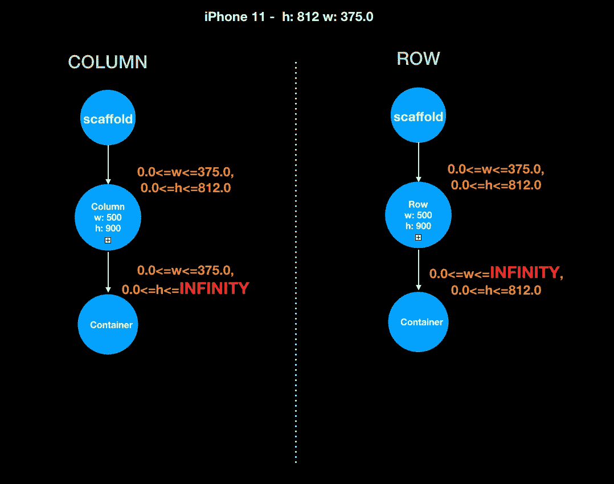
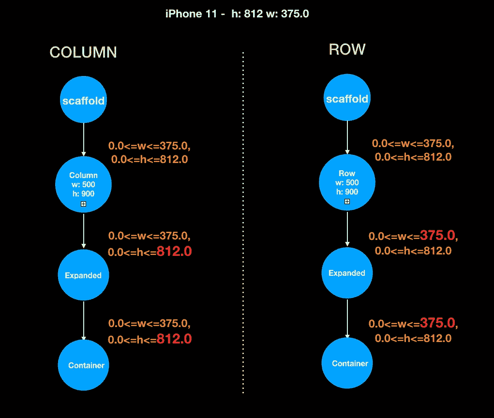

# 颤动框约束:列和行

> 原文：<https://itnext.io/flutter-box-constraints-columns-rows-382dcf82256a?source=collection_archive---------2----------------------->

…还有怪异的主轴约束！

# 摘要

在上一篇文章中，我写了什么是盒子约束，以及它们是如何在非常基础的层面上工作的。在这篇文章中，我将讨论他们如何使用**行**和**列**小部件。

如果你还没有看过之前的帖子，请在继续之前看一下。

 [## 颤振盒约束 101:基础

### 真正简单的解释是…

medium.com](https://medium.com/@sid.310/flutter-box-constraints-101-the-basics-bd0babe650f9) 

# 按列/行传递的约束

从**脚手架**传递到列的约束类似于它们传递到**容器**的方式。**列**传递给子**容器**的约束是不同的，即*沿着主轴*对于**列**，传递给子容器的*最大高度的约束是无穷大*。这真的很重要。

对于**行**，沿着主轴，*传递给子代的最大宽度为无穷大。*

所以，现在如果**列**中的**容器**的高度为无穷大，您将得到下面的溢出错误，因为父**列**没有将约束传递给子**容器**来停止。

> ***BoxConstraints 强制无限高度***

但是为什么 Flutter 框架会有这样的表现呢？

对于响应性，框架为您完成了繁重的工作，但是传入无限高度约束的**列**只是拼图的一半。每次使用**列**或**行**时，您将不得不使用**扩展**或其兄弟**柔性**，这带来了高度限制。如果你不知道什么是**扩展**或**灵活**部件，请看看我解释它如何工作的帖子。

 [## 颤动响应应用:灵活与扩展

### 介绍

medium.com](https://medium.com/@sid.310/flutter-responsive-apps-flexible-vs-expanded-ff8cc92b468f) 

当您用**展开的**小部件包装**容器**时，它会检查父**列**的剩余可用空间，并将该高度分配给**容器**。

如果你有两个**容器**并且你想让框架负责响应，你可以有两个**扩展的** / **灵活的**小部件，它们将负责处理父**列**并给子小部件分配高度。

对于**行**，框架*将负责沿其主轴*的宽度。

注意:通常，在生产场景中，您混合使用**扩展的**和非扩展的小部件。如果你不想使用**扩展的**或**灵活的**，你可以使用 **MediaQuery** 并自己进行计算，但是对于 MVP，*你不必使用那个硬核*并坚持使用**扩展的**和**灵活的**小部件。

在下一篇文章中，我将讨论嵌套的**列/行**和真正奇怪的错误:

> RenderFlex 子级具有非零 Flex，但引入的高度约束是无限制的。

编码快乐，下期见！请继续阅读！

 [## 颤动框约束:嵌套的列和行

### …但是引入的高度限制是无限的！

medium.com](https://medium.com/@sid.310/flutter-box-constraints-nested-column-s-row-s-3dfacada7361) 

检查我用 flutter 创建的本机应用程序。**目前只部署到苹果的 App Store。由于 Covid 延迟，谷歌的 Play Store 需要更多时间进行审查。**

 [## 核对清单:带模板

### 通过将清单保存为模板来提高工作效率。如果需要，安排到期日期和提醒，并获取…

chklist.app](https://chklist.app) 

在 twitter 上与我联系:

 [## 火星山羊

### marsgoat 的最新推文(@marsgoat1)。...来自火星的山羊媒介:https://t.co/BUAZThMhEn

twitter.com](https://twitter.com/marsgoat1)