# Flutter:构建漂亮的 Windows 应用程序——流畅的设计按钮、切换开关、复选框和滑块

> 原文：<https://itnext.io/flutter-building-beautiful-windows-apps-fluent-design-buttons-toggle-switches-checkboxes-and-821b71a29b45?source=collection_archive---------3----------------------->


来源:[微软设计](https://www.microsoft.com/design/fluent/#/)

流畅的设计是微软设计漂亮的 Windows 程序的解决方案。Flutter 最终在 Google I/O 2021 中扩展了对 Windows UWP 的支持，这需要设计良好的 Windows 应用程序。在这篇文章中，我将向你展示如何用 Flutter 创建按钮、复选框和滑块。

本指南最适合 Win32 和 UWP Flutter 应用程序。如果你还没有安装你的 UWP Flutter 应用程序，跟随我的[其他指南](/flutter-2-2-creating-your-first-universal-windows-program-with-flutter-5e65858b9988)去做吧。

我们将使用由 [bdlukaa](https://github.com/bdlukaa) 开发的 [fluent_ui](https://pub.dev/packages/fluent_ui) 包，可在 pub.dev 上获得。如果你想知道如何使用 fluent_ui 包创建一个基本的 fluent 设计应用程序，你可以参考[本指南](/flutter-building-beautiful-windows-apps-fluent-design-structure-and-navigation-e53a394988d2)。

# **按钮类型**

在 Fluent Design 中有四种类型的按钮可用——我们都知道的常规按钮、拆分按钮、切换按钮和单选按钮。

# 纽扣

让我们看看如何制作一个普通的按钮。

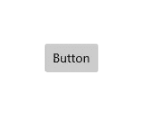

常规按钮示例(来源:[微软设计](https://docs.microsoft.com/en-us/windows/uwp/design/controls-and-patterns/images/controls/button.png)

首先，我们可以创建一个新的 Button()小部件，然后使用 ***子*** 属性指定要在按钮的 Text()小部件中显示的标题。切记使用空白功能或您选择的功能初始化 参数上的 ***。***

```
Button(
   child: Text("Click Me!"),
   onPressed: () {},
)
```

按钮的 ***样式*** 参数允许我们自定义外观。通过将 ***样式*** 参数设置为 ButtonStyle()，我们可以修改文本样式、背景色、前景色等等！

但是，如果将 Color()设置为***background Color***属性，则会出现错误。这是因为 ButtonStyle 需要 ButtonState < Color >，而不仅仅是一种颜色。为了解决这个问题，我们可以将 Color()包装在 ButtonState.all()中。

下面是我的按钮的完整示例:

```
Button(
    child: Text(
      "Click Me!",
      style: TextStyle(color: Colors.white),
    ),
    onPressed: () {},
    **style: ButtonStyle(backgroundColor: ButtonState.all(Colors.blue))**
)
```


我的按钮来自上面的代码

还有一些替代按钮，如 IconButton()，它是一个可单击的图标 OutlinedButton()，它是一个没有填充和轮廓的按钮 TextButton()，它是一个可单击的文本。这些按钮的 ***样式*** 属性的工作方式与普通按钮类似。

以下是这些按钮的一些示例:

1.  图标按钮

```
IconButton(
  icon: Icon(Icons.favorite_border),
  onPressed: () {}
),
```

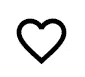

上面代码中的 IconButton

2.大纲按钮

```
OutlinedButton(
  child: Text("Click me!"),
  onPressed: () {}
),
```

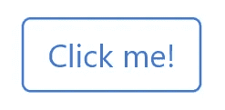

上述代码中的 OutlinedButton

3.文本按钮

```
TextButton(
  child: Text("Click me!"),
  onPressed: () {}
),
```


上面代码中的 TextButton

# 拆分按钮

拆分按钮有两部分，可以分别单击。

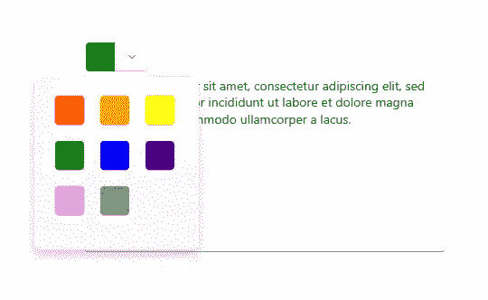

拆分按钮的例子(来源:[微软设计](https://docs.microsoft.com/en-gb/windows/apps/design/controls/buttons))

通常，左边的部分就像一个标准的按钮，调用一个直接的动作。右边的部分通常是一个向下箭头按钮，它调用一个弹出按钮，该按钮包含用户可以从中选择的附加选项。在 RTL 的布局中，排列将被颠倒。

要创建拆分按钮，我们可以使用 SplitButtonBar()小部件。我们必须将 ***按钮*** 参数指定为一系列(通常是两个)Button()小部件。

```
SplitButtonBar(
  buttons: [
    Button(
      child: Container(
          height: 24, width: 24, color: Colors.green),
      onPressed: () {
        //modify colour
      },
    ),
    Button(
      child: Container(
          height: 24,
          width: 24,
          child: Icon(Icons.keyboard_arrow_down)),
      onPressed: () {
        //open dropdown list to select colour
      },
    )
  ],
)
```

与常规按钮类似，SplitButtonBar 的 ***样式*** 参数允许我们定制外观，但是我们将使用 SplitButtonThemeData()来指定样式属性。我们可以使用 ***borderRadius*** 属性自定义圆角半径，使用 ***interval*** 属性自定义两个按钮之间的间距(逻辑像素)。

但是， ***borderRadius*** 等属性会受到按钮属性的影响(即 SplitButtonThemeData 的圆角半径属性可以被 ButtonStyle 的圆角半径属性覆盖)。

下面是我的 SplitButton 的完整示例:

```
SplitButtonBar(
  **style: SplitButtonThemeData(
    interval: 1
  ),**
  buttons: [
    Button(
      child: Container(
          height: 24, width: 24, color: Colors.green),
      onPressed: () {
        //modify colour
      },
    ),
    Button(
      child: Container(
          height: 24,
          width: 24,
          child: Icon(Icons.keyboard_arrow_down)),
      onPressed: () {
        //open dropdown list to select colour
      },
    )
  ],
)
```

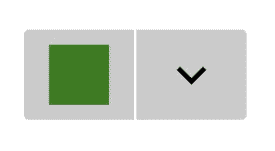

我的 SplitButton 来自上面的代码

# 开关按钮

切换按钮是一种单击时可以启用或禁用的按钮。

启用时，其背景色为蓝色，禁用时，其背景色为灰色。

要创建切换按钮，我们可以使用 Toggle Button()小部件。有三个必需的参数——***子******已检查******已更改*** 。 ***选中的*** 参数是一个布尔值，表示一个按钮是被启用还是被禁用。 ***onChanged*** 参数是每次按下按钮都会调用的函数，这里我们要更新选中 的 ***的值。***

在我的例子中，我创建了一个名为 **checked** 的变量来存储一个关于按钮是否被启用的布尔值。

```
ToggleButton(
  child: Text("Toggle me!"),
  checked: checked,
  onChanged: (newSelection) {
    setState(() {
      checked = newSelection;
    });
  }
),
```

***style*** 参数允许我们指定一个 ToggleButtonThemeData()，它有两个属性——***checkedButtonStyle***和***uncheckedButtonStyle***。这些按钮的名称不言自明，它们都接受 ButtonStyle()。

下面是我的 ToggleButton 的完整示例:

```
ToggleButton(
  **style: ToggleButtonThemeData(
      checkedButtonStyle: ButtonStyle(
          backgroundColor:
              ButtonState.all(Colors.green))),**
  child: Text("Toggle me!",
      style: TextStyle(
          color:
              checked ? Colors.white : Colors.black)),
  checked: checked,
  onChanged: (newSelection) {
    setState(() {
      checked = newSelection;
    });
  }
),
```

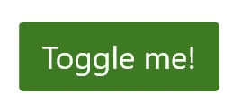

我的 ToggleButton 从上面的代码(启用)

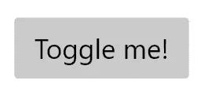

我的 ToggleButton 从上面的代码(禁用)

# 单选按钮

单选按钮允许用户从两个或更多选项中选择一个选项。

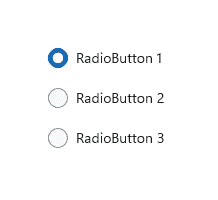

单选按钮示例(来源:[微软设计](https://docs.microsoft.com/en-gb/windows/apps/design/controls/radio-button)

单选按钮总是成组使用，每个选项由组中的一个单选按钮表示。一次只能选择一个组中的一个单选按钮。

要创建单选按钮，我们需要 RadioButton()小部件。有两个必需的参数——选中的*和改变的 上的 ***(更多信息参见切换按钮部分)。在我的示例中，我创建了三个变量——将被分配给相应单选按钮的*检查参数的**检查 1** 、**检查 2** 和**检查 3** 。当第一个单选按钮上的 ***onChanged*** 被调用，并且单选按钮的状态为 true 或 selected 时，我将该单选按钮的 ***checked*** 参数设置为 true，其余设置为 false。*****

```
*RadioButton(
  checked: checked3,
  onChanged: (newSelection) {
    if (newSelection) {
      setState(() {
        checked1 = false;
        checked2 = false;
        checked3 = true;
      });
    }
  }
),*
```

*单选按钮的样式与其他按钮相似。 ***样式*** 参数允许我们指定一个 RadioButtonThemeData()，它允许我们设置***checked decoration***和***unchecked decoration***属性，自定义 RadioButton 选中和未选中时的外观。*

*请注意，这两个属性接受一种 ButtonState <boxdecoration>类型，而不是 BoxDecoration 类型，因此请记住将 BoxDecoration()包装在 ButtonState.all()中。</boxdecoration>*

*下面是我的单选按钮的完整示例:*

```
*RadioButton(
  **style: RadioButtonThemeData(
      checkedDecoration: ButtonState.all(
    BoxDecoration(
      border: Border.all(
        color: Colors.blue,
        width: 4.5,
      ),
      shape: BoxShape.circle,
      color: Colors.white,
    ),
  )),**
  checked: checked3,
  onChanged: (newSelection) {
    if (newSelection) {
      setState(() {
        checked1 = false;
        checked2 = false;
        checked3 = true;
      });
    }
  }
),*
```

**

*我的单选按钮来自上面的代码*

# *拨动开关*

*拨动开关代表一个物理开关，允许用户打开或关闭东西。*

*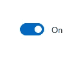*

*拨动开关示例(来源:[微软设计](https://docs.microsoft.com/en-gb/windows/apps/design/controls/toggles))*

*要创建切换开关，我们可以使用 Toggle Switch()小部件。ToggleSwitch 小部件有两个必需的参数——选中的*和更改的**。 ***选中的*** 参数是一个布尔值，表示开关是开还是关。****

*****onChanged*** 参数是每次按下按钮都会调用的函数，这里我们要更新选中 的 ***的值。在我的例子中，我创建了一个名为 **checked** 的变量来存储一个布尔值，该值指示按钮是否被启用。*****

```
**ToggleSwitch(
  checked: checked,
  onChanged: (newSelection) {
    setState(() {
      checked = newSelection;
    });
  }
),**
```

**我们可以用 ***样式*** 参数来设置 ToggleSwitch 的样式。将 ***样式*** 参数设置为 ToggleSwitchThemeData()，我们现在可以设置参数如***animation duration***、***uncheckedtumbdecoration***和***checkedtthumbdecoration***。***animation Duration***属性接受 Duration()类型，而装饰相关属性接受 ButtonState<box decoration>类型。记住对这些属性使用 ButtonState.all(BoxDecoration())而不仅仅是 BoxDecoration()。**

**这是我的 ToggleSwitch 的完整示例:**

```
**ToggleSwitch(
  **style: ToggleSwitchThemeData(
      animationDuration: Duration(milliseconds: 300)),**
  checked: checked,
  onChanged: (newSelection) {
    setState(() {
      checked = newSelection;
    });
  }
),**
```

****

**上面代码中的我的单选按钮(启用)**

**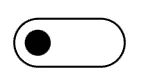**

**上面代码中的我的单选按钮(禁用)**

# **检验盒**

**复选框用于选择或取消选择项目。它可以用于单个项目，也可以用于用户可以从中选择的多个项目的列表。**

**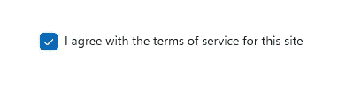**

**复选框示例(来源:[微软设计](https://docs.microsoft.com/en-gb/windows/apps/design/controls/checkbox))**

**要创建复选框，我们可以使用 Checkbox()小部件。CheckBox 小部件与 ToggleSwitch 非常相似，只是它不接受 ***子*** 。有两个必需的参数——勾选 的**、更改** 的 ***。 ***选中的*** 参数是一个布尔值，表示复选框是被启用还是被禁用。但是，在复选框中， ***选中的*** 参数可以为空。这是因为在某些情况下，复选框可能处于“不确定”状态。*****

**

*处于“不确定”状态的复选框示例*

****onChanged*** 参数是每次按下按钮都会调用的函数，这里我们要更新选中 的 ***的值。在我的例子中，我创建了一个名为 **checked** 的变量来存储一个指示按钮是否被启用的布尔值。****

```
*Checkbox(
  checked: checked,
  onChanged: (newSelection) {
    setState(() {
      checked = newSelection!;
    });
  },
),*
```

*使用 ***样式*** 参数可以设置复选框的样式。 ***样式*** 参数允许我们指定一个 CheckboxThemeData()，它接受很多参数，比如***checkedIconColor***、***uncheckedIconColor***和***thirdstaticoncolor***。同样，这些属性接受一种类型的 ButtonState < T >，所以记得在 ButtonState.all()中包装你的颜色和盒子装饰。*

*下面是我的复选框的完整示例:*

```
*Checkbox(
  **style: CheckboxThemeData(
      checkedIconColor: ButtonState.all(Colors.white)),**
  checked: checked,
  onChanged: (newSelection) {
    setState(() {
      checked = newSelection!;
    });
  },
),*
```

*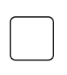*

*我的复选框从上面的代码(禁用)*

*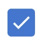*

*我的复选框来自上面的代码(启用)*

# *滑块*

*滑块是一种控件，用户可以通过沿轨道移动滑块控件从一系列值中进行选择。*

*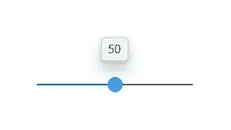*

*滑块示例(来源:[微软设计)](https://docs.microsoft.com/en-us/windows/uwp/design/controls-and-patterns/images/controls/slider.png)*

*要创建滑块，我们可以使用 Slider()小部件。滑块部件没有固定的宽度，因此我们需要使用容器或扩展部件来限制它的宽度。滑块有四个必需的参数—***【min】******max******value***和 ***onChanged*** 。 ***min*** 参数指定滑块的最小值，而 ***max*** 参数指定滑块的最大值。 ***值*** 参数指定滑块的当前值，而 ***onChanged*** 参数是一个函数，每次滑块值改变时都会调用该函数，然后使用该函数更新滑块的当前值。*

*在我的例子中，我创建了一个名为 **currentValue** 的变量来存储滑块的当前值。*

```
*Container(
  width: 200,
  child: Slider(
    min: 0,
    max: 100,
    value: currentValue,
    onChanged: (newValue) {
      setState(() {
        currentValue = newValue;
      });
    },
  ),
),*
```

*为了更好地定制滑块，我们可以使用额外的参数，如*，这将为滑块中的值创建“捕捉点”。此外， ***样式*** 参数可用于对滑块进行更多主题化。向***【style】***参数中传递 SliderThemeData，我们可以使用指定拇指颜色的 ***thumbColor*** 等属性和指定轨道和拇指颜色的 ***activeColor*** 等属性自定义拇指颜色、轨道颜色等。**

**下面是我的滑块的完整示例:**

```
**Container(
  width: 200,
  child: Slider(
    **style: SliderThemeData(
      activeColor: Colors.green,
    ),
    divisions: 5,**
    min: 0,
    max: 100,
    value: currentValue,
    onChanged: (newValue) {
      setState(() {
        currentValue = newValue;
      });
    },
  ),
),**
```

**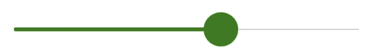**

**我的滑块来自上面的代码**

# **结论**

**这就是本文的全部内容，我希望你现在能够用 Flutter 创建这些流畅的设计输入部件。和往常一样，对于本文中提到的小部件，我还没有介绍更多的属性供您探索。如果你觉得这篇文章有用，请鼓掌！**

**在下一篇文章中，我将向你展示如何设计流畅的内容对话框、日期选择器和时间选择器。到时候见！**