# Flutter:构建漂亮的 Windows 应用程序——流畅的设计内容对话框、日期选择器和时间选择器

> 原文：<https://itnext.io/flutter-building-beautiful-windows-apps-fluent-design-content-dialogs-date-pickers-and-time-d0de282c2f23?source=collection_archive---------2----------------------->


来源:[微软设计](https://www.microsoft.com/design/fluent/#/)

流畅的设计是微软设计漂亮的 Windows 程序的解决方案。Flutter 最终在 Google I/O 2021 中扩展了对 Windows UWP 的支持，这需要设计良好的 Windows 应用程序。在这篇文章中，我将向你展示如何用 Flutter 创建内容对话框、日期选择器和时间选择器。

本指南最适合 Win32 和 UWP Flutter 应用程序。如果你还没有安装你的 UWP Flutter 应用程序，跟随我的[其他指南](/flutter-2-2-creating-your-first-universal-windows-program-with-flutter-5e65858b9988)去做吧。

我们将使用由 [bdlukaa](https://github.com/bdlukaa) 开发的 [fluent_ui](https://pub.dev/packages/fluent_ui) 包，可在 pub.dev 上获得。如果你想知道如何使用 fluent_ui 包创建一个基本的 fluent 设计应用程序，你可以参考[本指南](/flutter-building-beautiful-windows-apps-fluent-design-structure-and-navigation-e53a394988d2)。

# 内容对话框

对话框是提供上下文应用程序信息的模态 UI 覆盖图。它们会阻止与应用程序窗口的交互，直到被明确取消。他们经常要求用户采取某种行动。


内容对话框示例(来源:[微软设计](https://docs.microsoft.com/en-us/windows/apps/design/controls/dialogs-and-flyouts/dialogs)

为了显示对话框，我们将调用 showDialog()函数。将属性 ***context*** 设置为构建函数的上下文，并设置 ***builder*** 属性以返回一个 ContentDialog()小部件。

```
**showDialog(
  context: context,
  builder: (context) {
    return ContentDialog();
  }
);**
```

在 ContentDialog 小部件中，我们将能够指定一些额外的属性来定制对话框的外观及其内容。例如， ***标题*** 属性应该设置为包含对话框标题的 Text()小部件。类似地， ***content*** 属性也接受一个小部件，它通常是包含您的消息的 Text()小部件。下面是一个简单的内容对话框示例:

```
showDialog(
  context: context,
  builder: (context) {
    return ContentDialog(
      **title: Text("This is a content dialog"),
      content: Text("Dialogs are modal UI overlays that provide contextual app information. They block interactions with the app window until being explicitly dismissed. They often request some kind of action from the user."),**
    );
  }
);
```

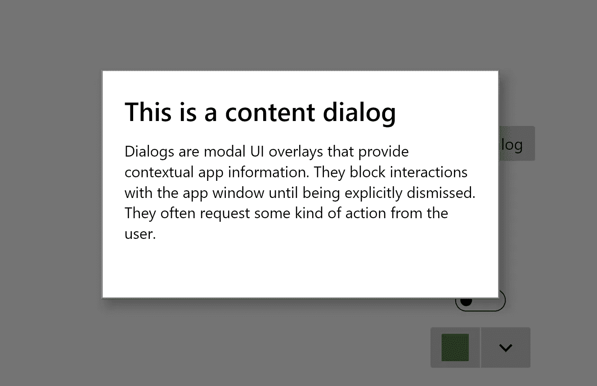

上面代码中的简单内容对话框

***动作*** 属性接受一个小部件列表，它应该由 Button()小部件组成。这些小部件出现在对话框的底部，是您希望用户在查看您的对话框后执行的操作。对于我的例子，我添加了一个标题为“OK”的按钮()来关闭对话框。要消除内容对话框的动作，只需调用 *Navigator.pop(context)* 。这是我的一个带有动作的内容对话框的例子。

```
showDialog(
  context: context,
  builder: (context) {
    return ContentDialog(
      ...
      **actions: [
        Button(child: Text("OK"), onPressed: (){
          Navigator.pop(context);
        },)
      ],**
    );
  }
);
```


上面代码中带有一个动作的内容对话框

***样式*** 属性允许用户定制内容对话框的外观和设计。它接受一个 ContentDialogThemeData()，该属性用于设置标题和正文(或内容)的样式和填充。对于我的对话框，我将 ***titleStyle*** 属性设置为 TextStyle()，将标题文本的字体大小设置为 40，颜色设置为黑色，粗细设置为粗体。

```
showDialog(
  context: context,
  builder: (context) {
    return ContentDialog(
        ...
        **style: ContentDialogThemeData(
            titleStyle: TextStyle(
                fontSize: 40,
                color: Colors.black,
                fontWeight: FontWeight.bold))** );
  }
);
```

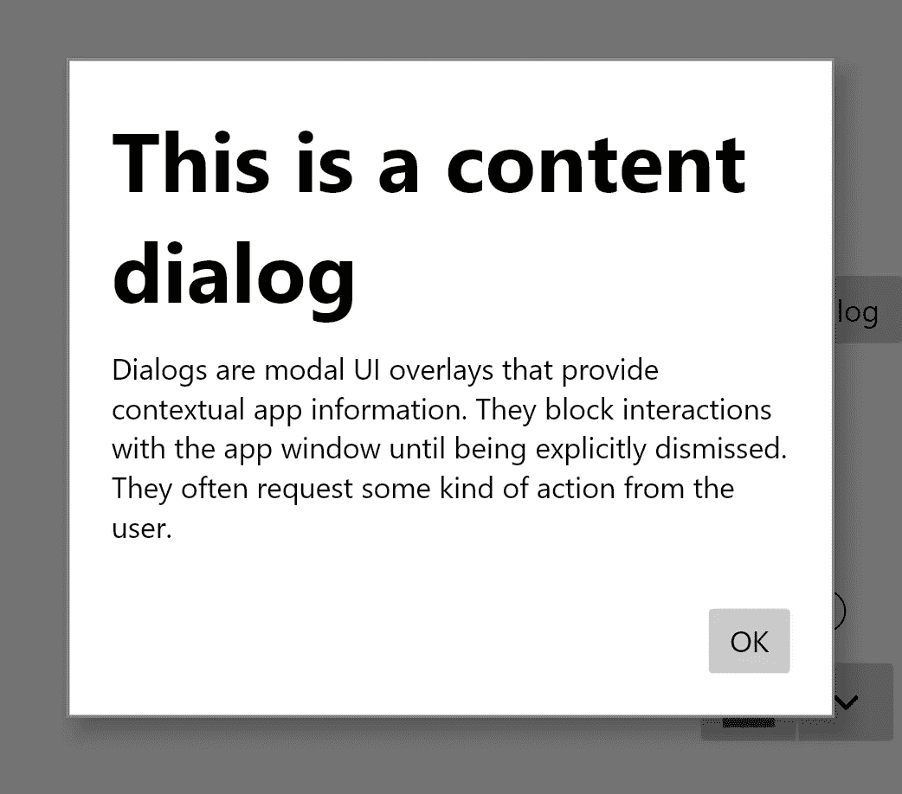

从上述代码中添加了自定义内容的内容对话框

# 日期选择器

日期选取器为您提供了一种标准化的方式，让用户使用触摸、鼠标或键盘输入来选取本地化的日期值。

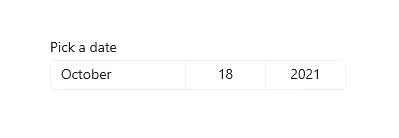

日期选择器示例(来源:[微软设计](https://docs.microsoft.com/en-us/windows/apps/design/controls/date-picker)

要创建一个基本的日期选择器，我们首先必须约束日期选择器的宽度。将 DatePicker()小部件包装在 SizedBox()或 Container()中，并将宽度设置为固定值。现在我们准备开始定制我们的日期选择器！

DatePicker()的两个必需属性是*和 ***onChanged*** ，分别是选择的日期和选择新日期时运行的函数。因此，我们需要创建一个 DateTime 变量，并将其设置为当前选择的日期。我将名为 **date** 的变量添加到我的类的顶部，并将其默认设置为 DateTime.now()(当前日期)。*

*然后，我将 **date** 变量设置为 DatePicker 的 ***selected*** 属性的值，并将 **date** 的值更改为所选日期的函数设置为 ***onChanged*** 属性。下面是代码的样子:*

```
***DateTime date = DateTime.now();**
...
**SizedBox(
  width: 300,
  child: DatePicker(
    selected: date,
    onChanged: (newdate) {
      setState(() {
        date = newdate;
      });
    },
  )
),***
```

**

*上述代码中的基本日期选择器*

*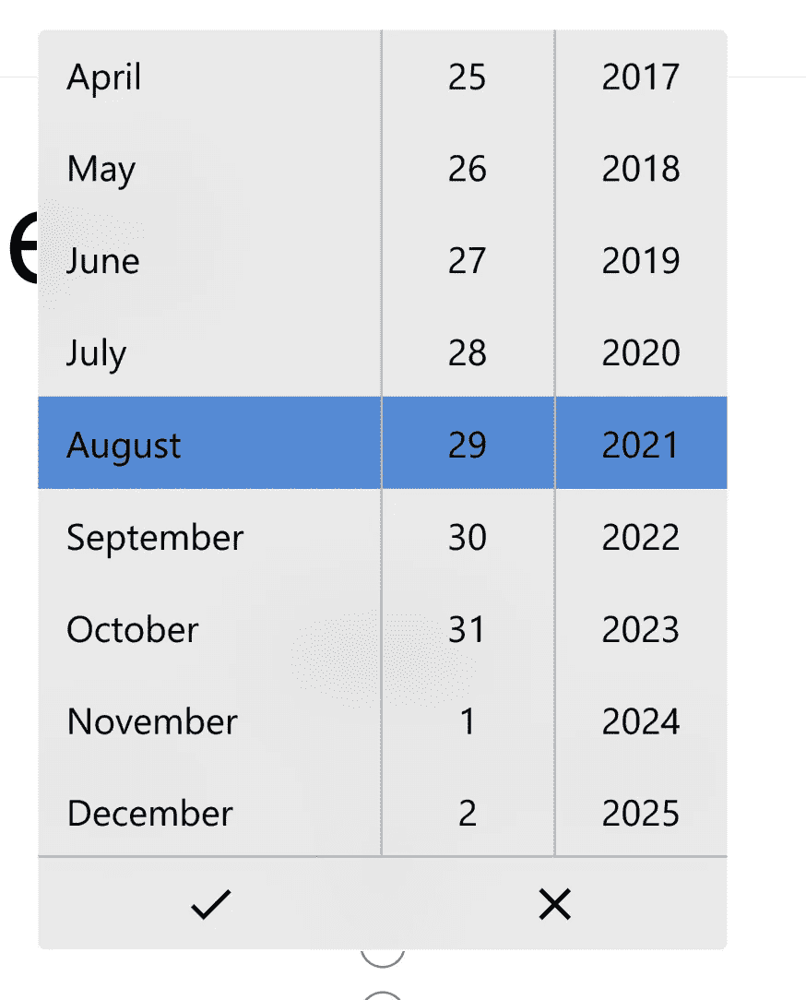*

*单击日期选择器时显示的日期选择菜单*

*此外，通过将日期选择对话框设置为 ***onCancel*** 属性，也可以在没有选择日期的情况下关闭日期选择对话框时运行一个功能。*

```
*SizedBox(
  width: 300,
  child: DatePicker(
    ...
    **onCancel: (){
      print("no date selected");
    },**
  )
),*
```

****表头*** 属性是一个字符串，显示在 DatePicker 上面。可以使用 ***标题样式*** 属性自定义标题的样式。*

```
*SizedBox(
  width: 300,
  child: DatePicker(
    ...
    **header: "Pick a date",
    headerStyle: TextStyle(fontWeight: FontWeight.bold),**
  )
),*
```

*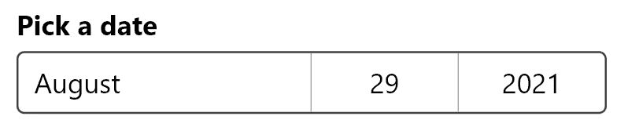*

*上面代码中带有自定义标题的日期选择器*

*属性 ***showDay*** 、 ***showMonth*** 和 ***showYear*** 接受一个布尔值，该值指示是否应该在 DatePicker 中分别显示日、月和年。*

```
*SizedBox(
  width: 300,
  child: DatePicker(
    ...
    **showYear: false,**
  )
),*
```

*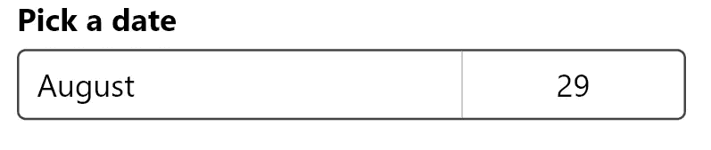*

*上面代码中隐藏了年份的日期选取器*

****startYear*** 和 ***endYear*** 属性从日期选择器中指定最早可选年份和最晚可选年份。根据我的经验，您应该将您的 ***起始年*** 设置为实际起始年的前一年，因为日期选择器不会显示起始年。*

```
*SizedBox(
  width: 300,
  child: DatePicker(
    ...
    **startYear: 2016,
    endYear: 2022,**
  )
),*
```

*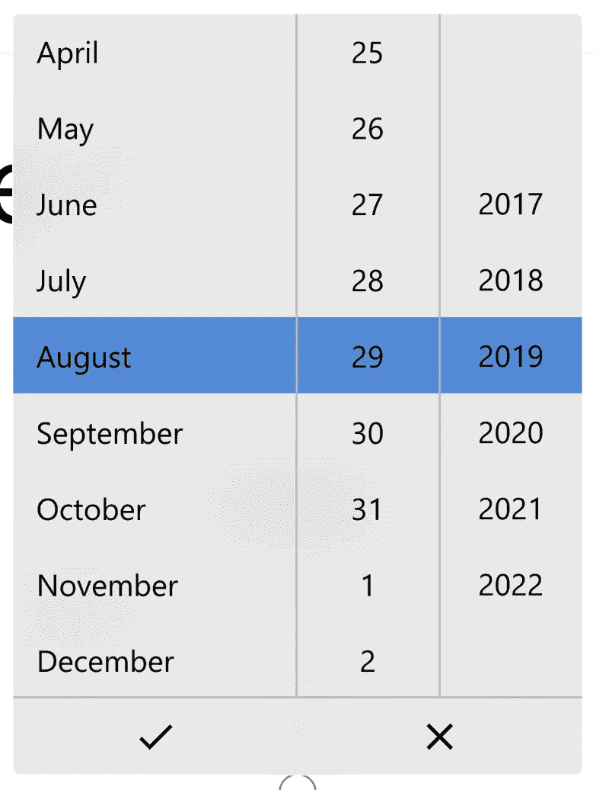*

*根据上面的代码，日期选择菜单现在仅限于 2017 年到 2022 年*

*最后，日期选择菜单的高度也可以用 ***popupHeight*** 属性指定。*

```
*SizedBox(
  width: 300,
  child: DatePicker(
    ...
    **popupHeight: 200,**
  )
),*
```

# *时间选择器*

*时间选择器为您提供了一种标准化的方式，让用户使用触摸、鼠标或键盘输入来选择时间值。这个时间选择器应该只用于让用户选择单个时间值，而不是不同时间之间的范围。*

*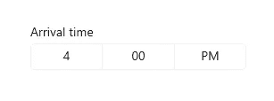*

*时间选择器示例(来源:[微软设计](https://docs.microsoft.com/en-us/windows/apps/design/controls/time-picker))*

*时间选择器的工作方式与日期选择器非常相似。就像日期选择器一样，要创建一个基本的时间选择器，我们首先必须约束时间选择器的宽度。将 TimePicker()小部件包装在 SizedBox()或 Container()中，并将宽度设置为固定值。*

*TimePicker()的两个必需属性也是 ***selected*** 和 ***onChanged*** ，分别是选择的时间和选择新时间时运行的函数。我将重用 DatePicker 中的**日期**变量，因为两者都使用日期时间变量。*

*像往常一样，我将 **date** 变量设置为 TimePicker 的 ***selected*** 属性的值，并将 **date** 的值更改为在 ***onChanged*** 属性中选择的时间。下面是代码的样子:*

```
***SizedBox(
  width: 300,
  child: TimePicker(
    selected: date,
    onChanged: (newdate) {
      setState(() {
        date = newdate;
      });
    },
  )
),***
```

*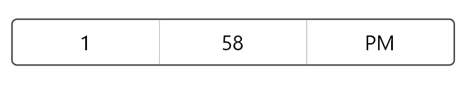*

*上面代码中的基本时间选择器*

*其他属性如 ***header*** 、 ***headerStyle*** 、 ***onCancel*** 、 ***popupHeight*** 等与日期选取器的属性类似，因此请参考本文的日期选取器部分以了解更多信息！*

```
*SizedBox(
  width: 300,
  child: TimePicker(
    ...
    **header: "Pick a time",
    headerStyle: TextStyle(fontWeight: FontWeight.bold),**
  )
),*
```

*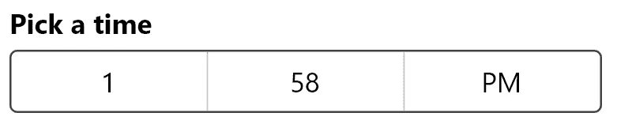*

*上面代码中带有自定义标题的时间选择器*

*还有一些特定于时间选择器的其他属性，如***hour placeholder***，***minute placeholder***， ***amText*** ， ***pmText*** 和***minute increment***。如果没有选择时间(或者**日期**变量为空)，则 ***小时占位符*** 允许小时字段的占位符，如果没有选择时间，则 ***分钟占位符*** 允许分钟字段的占位符。 ***amText*** 和 ***pmText*** 属性可用于覆盖右侧的默认 AM/PM 指示器。*

****分钟增量*** 参数允许您设置时间选择对话框的分钟部分的增量，当您单击时间选择器时，会显示该对话框。默认情况下，它设置为 1。*

```
*SizedBox(
  width: 300,
  child: TimePicker(
    ...
    **minuteIncrement: 5,**
  )
),*
```

*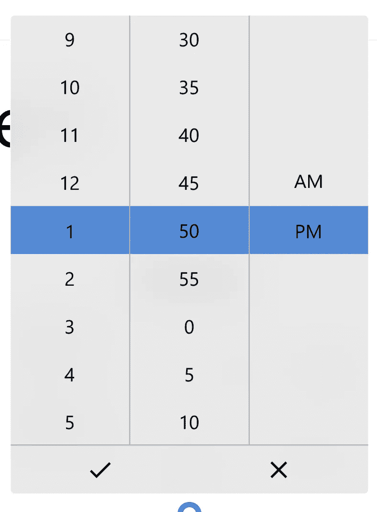*

*时间选择对话框，从上面的代码开始以 5 分钟为增量*

# *结论*

*这就是本文的全部内容，我希望您现在能够创建漂亮的内容对话框、日期和时间选择器。如果你喜欢这篇文章，请给它一些掌声，并在评论区留下你的想法！*

*在下一篇文章中，我将向您展示如何制作各种流畅的设计表单，如文本框、自动建议框和组合框。到时候见！*