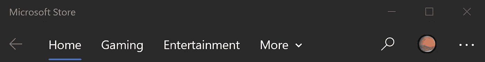
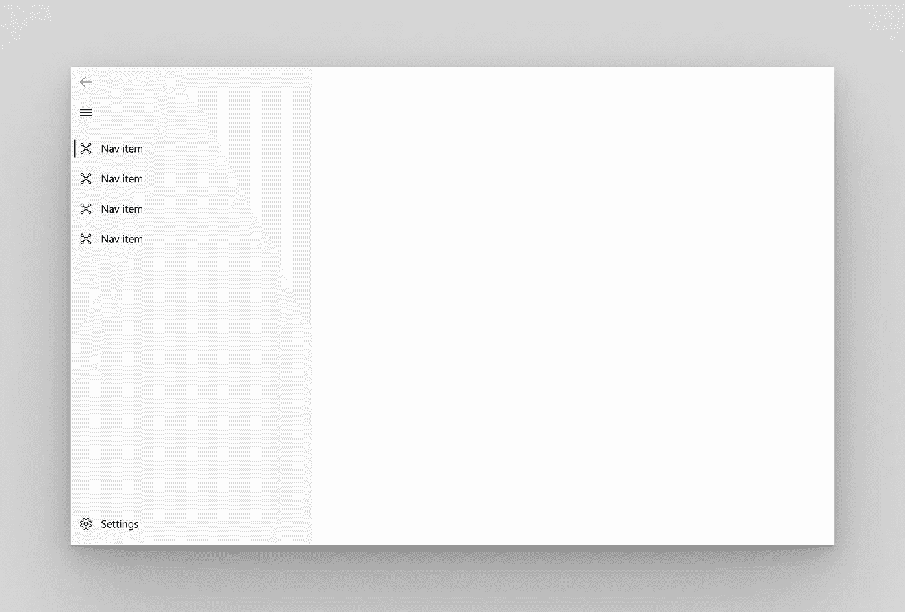
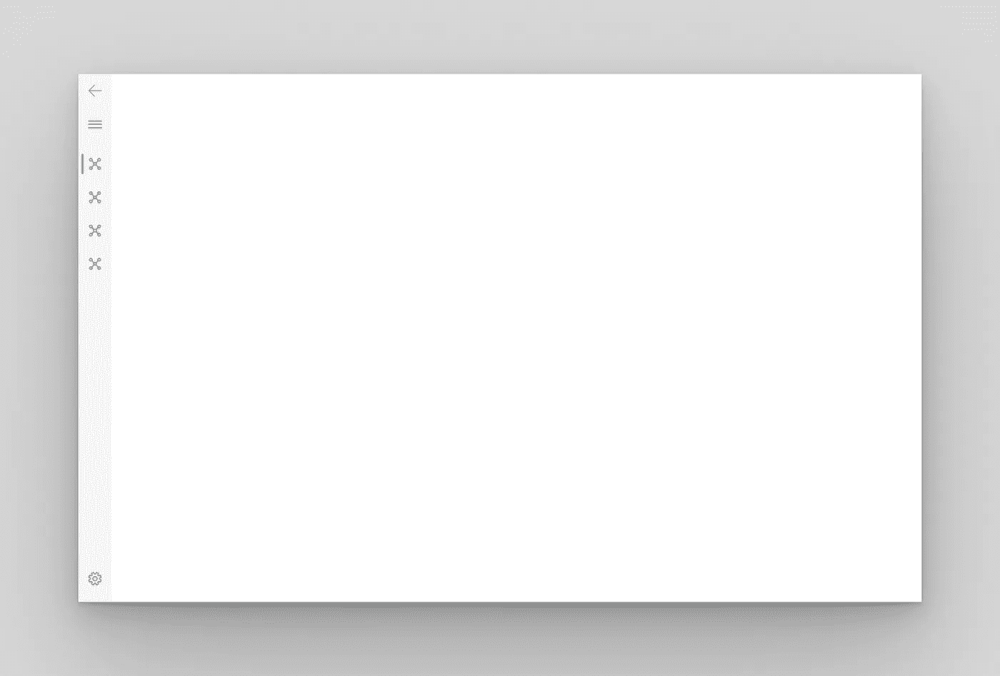
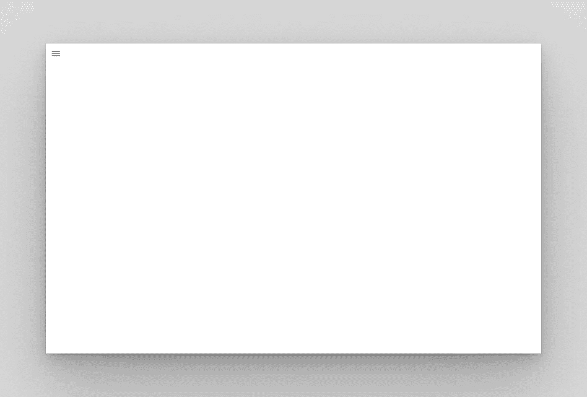
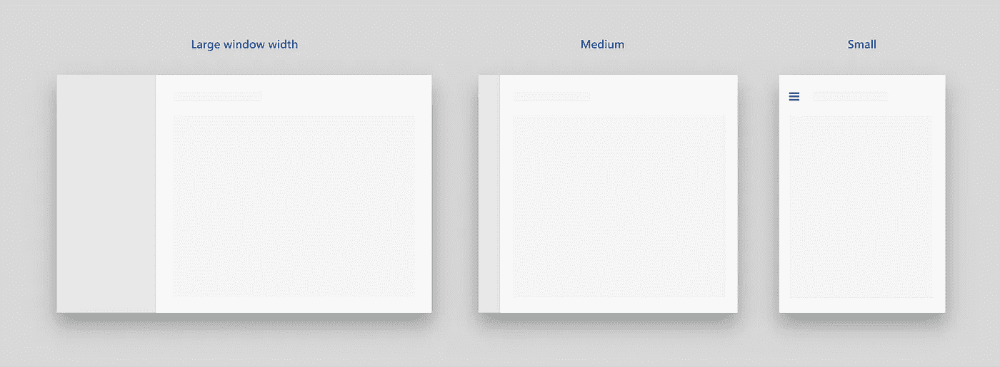
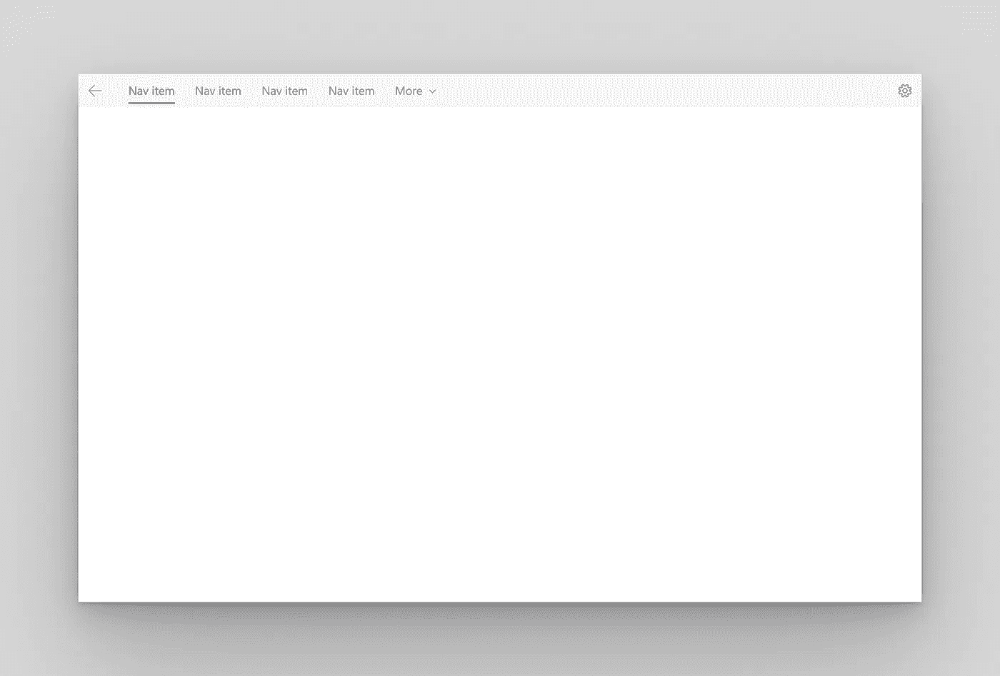
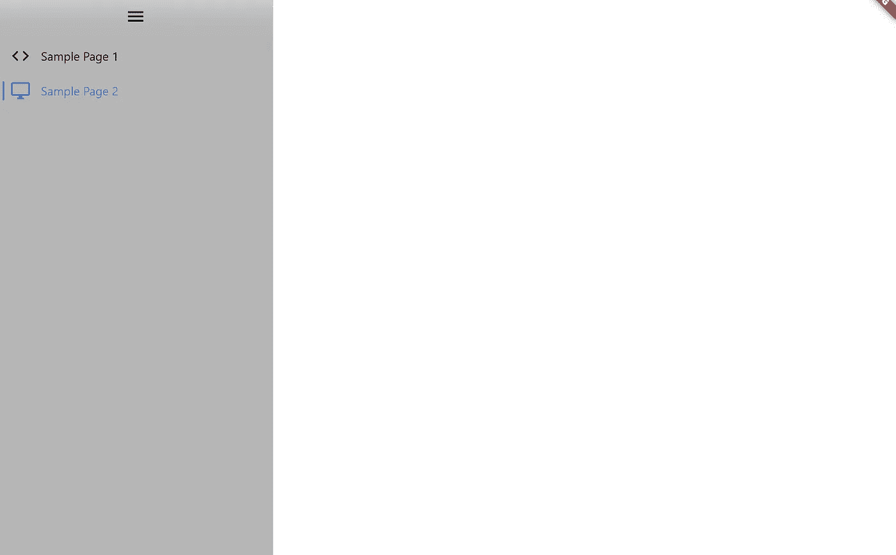
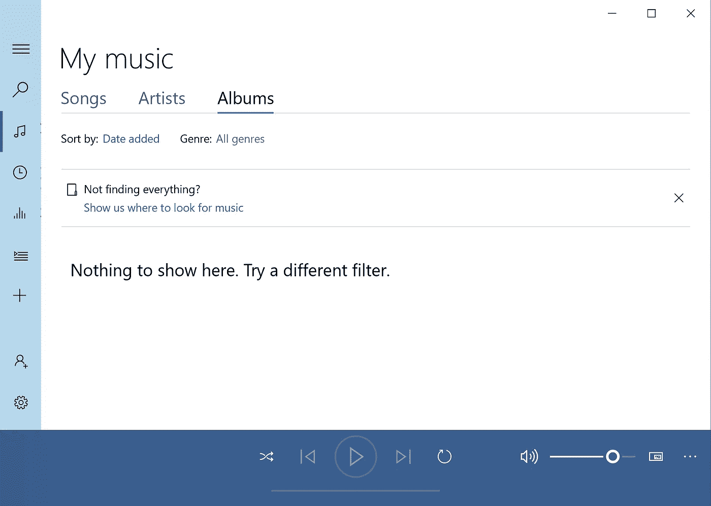
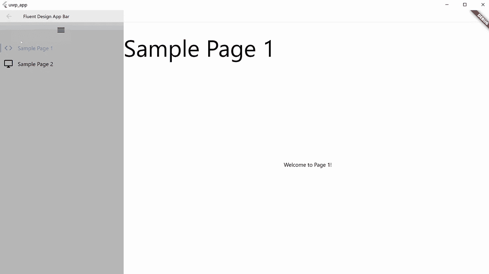

# Flutter:构建漂亮的 Windows 应用程序——流畅的设计结构和导航

> 原文：<https://itnext.io/flutter-building-beautiful-windows-apps-fluent-design-structure-and-navigation-e53a394988d2?source=collection_archive---------0----------------------->


来源:[微软设计](https://www.microsoft.com/design/fluent/#/)

流畅的设计是微软设计漂亮的 Windows 程序的解决方案。Flutter 最终在 Google I/O 2021 中扩展了对 Windows UWP 的支持，这需要设计良好的 Windows 应用程序。在本文中，我将向您展示如何使用 Flutter 创建一个基本的 Fluent 设计应用程序。

本指南最适合 Win32 和 UWP Flutter 应用程序。如果你还没有安装你的 UWP Flutter 应用程序，跟随我的[其他指南](/flutter-2-2-creating-your-first-universal-windows-program-with-flutter-5e65858b9988)去做吧。

# **添加所需的包**

第一步是由 [bdlukaa](https://github.com/bdlukaa) 安装 [fluent_ui](https://pub.dev/packages/fluent_ui) 包。

在应用程序文件夹内的命令行中，键入以下命令:

```
flutter pub add fluent_ui
```

现在，是时候开始创建我们的流畅设计应用程序了！

# **FluentApp**

在 main.dart 中，导入 fluent_ui 包:

```
import 'package:fluent_ui/fluent_ui.dart';
```

然后，在 build 函数中创建一个 FluentApp 小部件(您可能希望替换默认的 Flutter 模板代码)。这是你流畅应用的基础。

```
return FluentApp();
```

您的代码现在应该如下所示:

```
import 'package:fluent_ui/fluent_ui.dart';void main() {
  runApp(MyApp());
}class MyApp extends StatefulWidget {
  @override
  State<StatefulWidget> createState() {
    // TODO: implement createState
    return MyAppState();
  }
}class MyAppState extends State<MyApp> {
  @override
  Widget build(BuildContext context) {
    // TODO: implement build
    return FluentApp();
  }
}
```

与 MaterialApp 类似，FluentApp 也有一个 ***主题*** 属性，它接受一个 ThemeData()并让你定制应用的外观。您也可以使用 ***darkTheme*** 属性来设置单独的暗主题。

ThemeData()的一些关键属性是 ***accentColor*** ，这是突出显示元素的颜色，以及***scaffoldBackgroundColor***，这是应用程序的背景颜色。当然，还有很多其他属性如 ***iconTheme*** ， ***buttonTheme*** 和***contentDialogTheme***，可以让你分别自定义图标、按钮和对话框的外观。

下面是一个在 FluentApp 中使用主题的例子:

```
return FluentApp(
      **theme: ThemeData(
          scaffoldBackgroundColor: Colors.white,
          accentColor: Colors.blue,
          iconTheme: const IconThemeData(size: 24)),
      darkTheme: ThemeData(
          scaffoldBackgroundColor: Colors.black,
          accentColor: Colors.blue,
          iconTheme: const IconThemeData(size: 24)),**
);
```

# **导航视图**

NavigationView 控制流畅设计页面之间的移动。向 Fluent 应用程序的 ***主页*** 属性添加一个 NavigationView，如下所示:

```
return FluentApp(
        theme: ThemeData(
            scaffoldBackgroundColor: Colors.white,
            accentColor: Colors.blue,
            iconTheme: const IconThemeData(size: 24)),
        darkTheme: ThemeData(
            scaffoldBackgroundColor: Colors.black,
            accentColor: Colors.blue,
            iconTheme: const IconThemeData(size: 24)),
        **home: NavigationView()**
);
```

应用程序栏常见于许多 Windows 应用程序中，可以通过 ***应用程序栏*** 属性中的 NavigationAppBar 实现到 NavigationView。

```
home: NavigationView(
          appBar: NavigationAppBar(
                 title: Text("Fluent Design App Bar")
          ),
      ) 
```



在微软商店应用程序的顶部可以看到一个应用程序栏

# **导航窗格**

接下来，可以将 NavigationPane 添加到 NavigationView 中，以便在页面之间导航。有五种不同的 ***显示模式*** (样式)可供选择:

1.  打开:窗格被展开并放置在内容的左侧。每个类别或页面必须有一个图标。



来源:[微软设计—控件和模式](https://docs.microsoft.com/en-us/windows/uwp/design/controls-and-patterns)

2.紧凑:窗格放在内容的左侧，在展开之前只显示图标。



来源:[微软设计—控件和模式](https://docs.microsoft.com/en-us/windows/uwp/design/controls-and-patterns)

3.Minimal:在窗格展开之前，只显示菜单按钮。展开时，它被放置在内容的左侧。



来源:[微软设计—控件和模式](https://docs.microsoft.com/en-us/windows/uwp/design/controls-and-patterns)

4.自动:该模式根据窗口的宽度在最小、紧凑和打开之间动态选择。



来源:[微软设计—控件和模式](https://docs.microsoft.com/en-us/windows/uwp/design/controls-and-patterns)

5.顶部:窗格位于内容上方。这对于不能用图标表示的类别或页面非常有用。



来源:[微软设计—控件和模式](https://docs.microsoft.com/en-us/windows/uwp/design/controls-and-patterns)

要创建 NavigationPane，我们可以使用 NavigationView 的 ***窗格*** 属性。然后，我们可以将 ***显示模式*** 设置为 PaneDisplayMode.auto、PaneDisplayMode.open、PaneDisplayMode.compact、PaneDisplayMode.minimal 或 PaneDisplayMode.top

```
home: NavigationView(
          appBar: NavigationAppBar(
            title: Text("Fluent Design App Bar")),
          **pane: NavigationPane(
            displayMode: PaneDisplayMode.auto, 
          ),**
      )
```

接下来，我们需要在 NavigationPane 中指定项目。我们可以将 ***项*** 属性设置为 PaneItems 列表。每个 PaneItem 接受一个图标和一个标题。以下是我的例子:

```
pane: NavigationPane(
            displayMode: PaneDisplayMode.auto,
            **items: [
              PaneItem(
                icon: Icon(Icons.code),
                title: Text("Sample Page 1")
              ),
              PaneItem(
                icon: Icon(Icons.desktop_windows_outlined),
                title: Text("Sample Page 2")
              )
            ]** 
          ),
```



我做的导航窗格。它有两个 PaneItem 小部件。

现在，在您的 MyAppState 类中创建一个名为 **index** 的类型为 *int* 的变量。这将负责管理从 NavigationPane 中选择的页面。

```
class MyAppState extends State<MyApp> {
  **int index = 0;**
```

现在，我们将链接该索引作为 NavigationPane 的选定索引。将 NavigationPane 的 ***选中*** 属性设置为**索引**。

```
pane: NavigationPane(
            **selected: index,**
...
```

为了在选定的 PaneItem 发生变化时更新**索引**变量，我们需要指定 ***onChanged*** 属性。

```
pane: NavigationPane(
            selected: index,
            **onChanged: (newIndex){
              setState(() {
                index = newIndex;
              });
            },**
...
```

可选:要在 NavigationPane 中添加丙烯酸透明效果，我们可以在 NavigationView 中将 ***useAcrylic*** 属性设置为 *true* 。

```
home: NavigationView(
          appBar: NavigationAppBar(
            title: Text("Fluent Design App Bar")),
          **useAcrylic: true,**
...
```

# **导航体**

NavigationBody 用于实现到导航视图的页面转换，并在页面之间切换时进行相关的转换。

我们可以将 NavigationBody 设置为我们的 NavigationView 的 ***内容*** 属性。

```
home: NavigationView(
          **content: NavigationBody(),**
...
```

接下来，我们需要将 ***索引*** 属性指定为 NavigationPane 的选中索引。我们可以将它设置为我们的**索引**变量。

```
home: NavigationView(
          content: NavigationBody(
            **index: index**
          ),
...
```

接下来，我们需要将 ***子属性*** 指定为包含小部件的列表，以显示每个 PaneItem。注意: ***子属性*** 中部件的顺序必须与 PaneItem 部件的顺序相同。

通常，这些小部件是 ScaffoldPage 小部件。下面是我的 ***子*** 属性的一个例子:

```
content: NavigationBody(
            index: index,
            **children: [
              ScaffoldPage(),
              ScaffoldPage(),
            ],**
          ),
```

# **脚手架页面**

脚手架页面是材料脚手架的流畅设计等价物。

***表头*** 属性指定顶栏。

```
ScaffoldPage(
      **header: Text(
        "Sample Page 1",
        style: TextStyle(fontSize: 60),
      ),**
    ),
```



标题文本“我的音乐”出现在 Grove 音乐应用程序中

***内容*** 属性指定 ScaffoldPage 中的其他小部件，类似于材质 Scaffold 中的 ***正文*** 属性。

```
ScaffoldPage(
      header: Text(
        "Sample Page 1",
        style: TextStyle(fontSize: 60),
      ),
      **content: Center(
        child: Text("Welcome to Page 1!"),
      ),**
    );
```

以下是我的应用程序目前的样子:



# **导航器.推送&导航器.弹出**

FluentApp 支持与 MaterialApp 相同的导航功能，这一点我们都很喜欢。然而，当在 FluentApp 中的页面之间导航时，我们使用 FluentPageRoute，而不是 MaterialPageRoute。

```
Navigator.push(context, FluentPageRoute(builder: (context) => Page2()));
```

# 结论

这就是本文的全部内容，我希望你现在能够用 Flutter 创建基本的流畅设计应用程序。如果你觉得这篇文章有用，请鼓掌！

在下一篇文章中，我将向你展示我们如何制作流畅的 UI 按钮、复选框和文本框。到时候见！