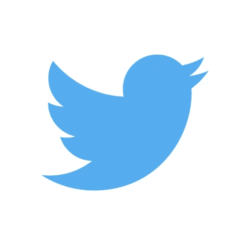
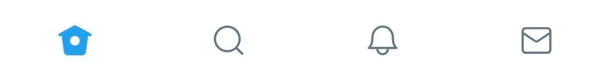
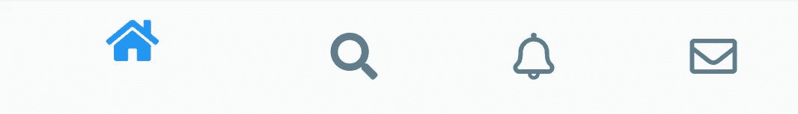
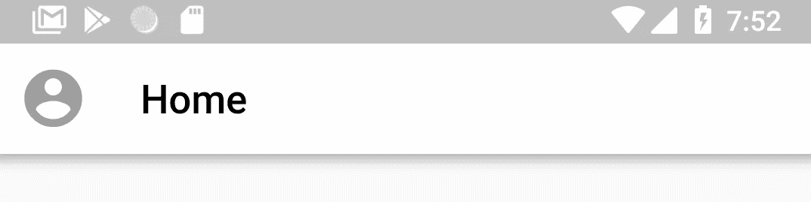
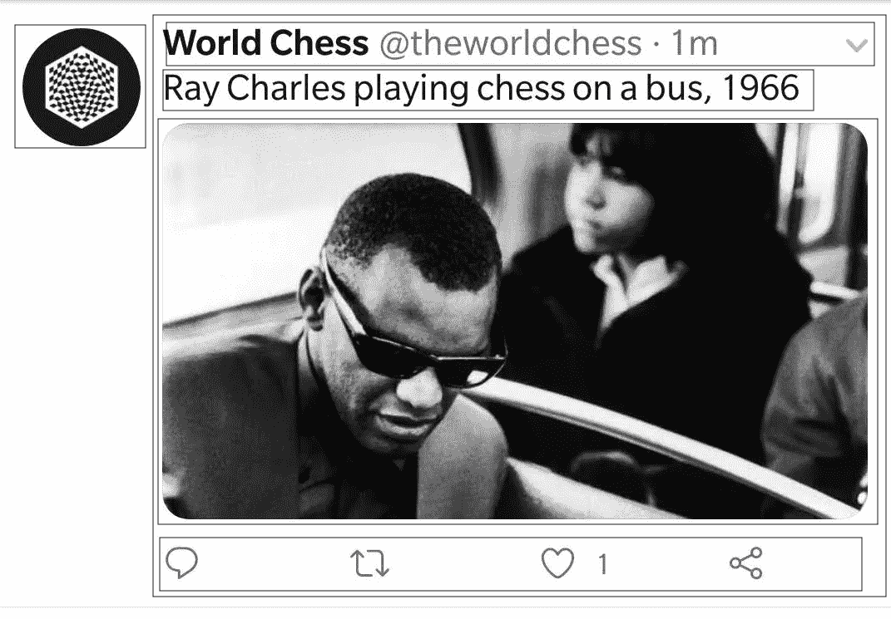

# 颤振挑战:Twitter

> 原文：<https://itnext.io/flutter-challenge-twitter-a1cb17f1e21b?source=collection_archive---------5----------------------->



Flutter Challenges 将尝试在 Flutter 中重新创建特定的应用程序 UI 或设计。

这项挑战将尝试 Twitter Android 应用程序的主屏幕。请注意，重点将放在 UI 上，而不是实际从后端服务器获取数据。

## 了解应用程序结构


Twitter 应用程序有 4 个主页面，由底部导航栏控制。

它们是:

1.  主页(在你的订阅源中显示推文)
2.  搜索(搜索人员、组织等)
3.  通知(通知和提及)
4.  消息(私人消息)

BottomNavigationBar 有四个选项卡，可以转到其中的每个页面。

在我们的应用程序中，我们将有四个不同的页面，当点击 BottomNavigationBar 上的一个项目时，我们将改变页面。

## 设置项目

创建一个 Flutter 项目(我将其命名为 twitter_ui_demo)后，清除项目中的默认代码，直到剩下以下代码:

```
**import 'package:flutter/material.dart'**;

**void** main() => runApp(**new** MyApp());

**class** MyApp **extends** StatelessWidget {
  *// This widget is the root of your application.* @override
  Widget build(BuildContext context) {
    **return new** MaterialApp(
      title: **'Flutter Demo'**,
      theme: **new** ThemeData(
        primarySwatch: Colors.*blue*,
      ),
      home: **new** MyHomePage(),
    );
  }
}

**class** MyHomePage **extends** StatefulWidget {

  @override
  _MyHomePageState createState() => **new** _MyHomePageState();
}

**class** _MyHomePageState **extends** State<MyHomePage> {

  @override
  Widget build(BuildContext context) {
    **return new** Scaffold(
      body: **new** Center(
      ),
    );
  }
}
```

主页将有一个支架，将举行我们的主要底部导航栏和任何网页目前是活跃的。

## 入门指南

因为底部的导航栏是用于导航的主要部件，所以让我们先试试。

下面是 BottomNavigationBar 的外观:



因为我们没有在应用程序中使用的确切图标，我们将使用[字体颤动真棒包](https://pub.dartlang.org/packages/font_awesome_flutter)。在 pubspec.yaml 中添加依赖项，并添加

```
**import 'package:font_awesome_flutter/font_awesome_flutter.dart'**;
```

到文件。

BottomNavigationBar 代码归结为:

```
bottomNavigationBar: BottomNavigationBar(items: [
  BottomNavigationBarItem(
    title: Text(**""**),
    icon: Icon(FontAwesomeIcons.*home*, color: **selectedPageIndex** == 0? Colors.*blue* : Colors.*blueGrey*,),
  ),
  BottomNavigationBarItem(
    title: Text(**""**),
    icon: Icon(FontAwesomeIcons.*search*, color: **selectedPageIndex** == 1? Colors.*blue* : Colors.*blueGrey*,),
  ),
  BottomNavigationBarItem(
      title: Text(**""**),
      icon: Icon(FontAwesomeIcons.*bell*, color: **selectedPageIndex** == 2? Colors.*blue* : Colors.*blueGrey*,)
  ),
  BottomNavigationBarItem(
      title: Text(**""**),
      icon: Icon(FontAwesomeIcons.*envelope*, color: **selectedPageIndex** == 3? Colors.*blue* : Colors.*blueGrey*,),
  ),
], onTap: (index) {
  setState(() {
    **selectedPageIndex** = index;
  });
}, currentIndex: **selectedPageIndex**)
```

将此添加到主页。

注意，当我们设置图标的颜色时，我们检查图标是否被选中，然后分配颜色。在 twitter 应用程序中，选中的图标是蓝色的，让我们将未选中的图标设置为蓝灰色。

我们定义了一个名为 selectedPageIndex 的整数来存储所选页面的索引。在 onTap 函数中，我们将变量设置为新的索引。它被包装在 setState()调用中，因为我们需要刷新页面来重新呈现 AppBar。

这是我们的底部导航栏:



## 设置页面

让我们设置四个基本页面，当点击相应的图标时将显示这四个页面。

我们设置了四个页面(在不同的文件中)，如下所示:

对于用户订阅源(主页)页面:

```
**import 'package:flutter/material.dart'**;

**class** UserFeedPage **extends** StatefulWidget {
  @override
  _UserFeedPageState createState() => _UserFeedPageState();
}

**class** _UserFeedPageState **extends** State<UserFeedPage> {
  @override
  Widget build(BuildContext context) {
    **return** Container();
  }
}
```

同样，我们设置了搜索、通知和消息页面。

同样，在基础页面中，我们导入所有这些页面，并设置这些页面的列表。

```
**var pages** = [
  UserFeedPage(),
  SearchPage(),
  NotificationPage(),
  MessagesPage(),
];
```

在脚手架上，我们

```
body: **pages**[**selectedPageIndex**],
```

它设置显示页面的主体。

到目前为止，这是我的主页基本部件:

```
**class** _MyHomePageState **extends** State<MyHomePage> {

  **var selectedPageIndex** = 0;

  **var pages** = [
    UserFeedPage(),
    SearchPage(),
    NotificationPage(),
    MessagesPage(),
  ];

  @override
  Widget build(BuildContext context) {
    **return new** Scaffold(
      body: **pages**[**selectedPageIndex**],
      bottomNavigationBar: BottomNavigationBar(items: [
        BottomNavigationBarItem(
          title: Text(**""**),
          icon: Icon(FontAwesomeIcons.*home*, color: **selectedPageIndex** == 0? Colors.*blue* : Colors.*blueGrey*,),
        ),
        BottomNavigationBarItem(
          title: Text(**""**),
          icon: Icon(FontAwesomeIcons.*search*, color: **selectedPageIndex** == 1? Colors.*blue* : Colors.*blueGrey*,),
        ),
        BottomNavigationBarItem(
            title: Text(**""**),
            icon: Icon(FontAwesomeIcons.*bell*, color: **selectedPageIndex** == 2? Colors.*blue* : Colors.*blueGrey*,)
        ),
        BottomNavigationBarItem(
          title: Text(**""**),
            icon: Icon(FontAwesomeIcons.*envelope*, color: **selectedPageIndex** == 3? Colors.*blue* : Colors.*blueGrey*,),
        ),
      ], onTap: (index) {
        setState(() {
          **selectedPageIndex** = index;
        });
      }, currentIndex: **selectedPageIndex**,),
    );
  }
}
```

现在，我们将重新创建页面本身。

## 创建用户摘要页面


页面中有两个元素:AppBar 和 tweets 列表。

首先让我们制作 AppBar。它有一个用户资料图片和一个白底黑字的标题。

```
appBar: AppBar(
  backgroundColor: Colors.*white*,
  title: Text(**"Home"**, style: TextStyle(color: Colors.*black*),),
  leading: Icon(Icons.*account_circle*, color: Colors.*grey*, size: 35.0,),
),
```

我们将使用图标而不是个人资料图片。



重新创建的 AppBar

现在，我们需要创建推文列表。为此，我们使用 ListView.builder()。

让我们来看看列表项。



首先，我们将有一个列，在底部有一行和一个分隔线。

在行内，我们将有用户图标和另一列。

该列将包含一行 tweet 信息、一个包含 tweet 本身的文本、一个图像和另一行对 tweet 采取的操作(比如，评论等)。).

为了简洁起见，我们现在将排除图像，但是添加它就像在一行中添加一个图像一样简单。

```
**return** Column(
  children: <Widget>[
    Padding(
      padding: **const** EdgeInsets.all(4.0),
      child: Row(
        crossAxisAlignment: CrossAxisAlignment.**start**,
        children: <Widget>[
          Padding(
            padding: **const** EdgeInsets.all(8.0),
            child: Icon(Icons.*account_circle*, size: 60.0, color: Colors.*grey*,),
          ),
          Expanded(
            child: Column(
              mainAxisAlignment: MainAxisAlignment.**start**,
              children: <Widget>[
                Padding(
                  padding: **const** EdgeInsets.only(top: 4.0),
                  child: Row(
                    mainAxisAlignment: MainAxisAlignment.**spaceBetween**,
                    children: <Widget>[
                      Expanded(
                        child: Container(child: RichText(
                          text: TextSpan(
                            children: [
                              TextSpan(text:tweet.**username**, style: TextStyle(fontWeight: FontWeight.*w600*, fontSize: 18.0, color: Colors.*black*),),
                              TextSpan(text:**" "** + tweet.**twitterHandle**,style: TextStyle(fontSize: 16.0, color: Colors.*grey*)),
                              TextSpan(text:**"** ${tweet.**time**}**"**,style: TextStyle(fontSize: 16.0, color: Colors.*grey*))
                            ]
                          ),overflow: TextOverflow.**ellipsis**,
                        )),flex: 5,
                      ),
                      Expanded(
                        child: Padding(
                          padding: **const** EdgeInsets.only(right: 4.0),
                          child: Icon(Icons.*expand_more*, color: Colors.*grey*,),
                        ),flex: 1,
                      ),
                    ],
                  ),
                ),
                Padding(
                  padding: **const** EdgeInsets.symmetric(vertical: 4.0),
                  child: Text(tweet.**tweet**, style: TextStyle(fontSize: 18.0),),
                ),
                Padding(
                  padding: **const** EdgeInsets.all(8.0),
                  child: Row(
                    mainAxisAlignment: MainAxisAlignment.**spaceEvenly**,
                    children: <Widget>[
                      Icon(FontAwesomeIcons.*comment*, color: Colors.*grey*,),
                      Icon(FontAwesomeIcons.*retweet*, color: Colors.*grey*,),
                      Icon(FontAwesomeIcons.*heart*, color: Colors.*grey*,),
                      Icon(FontAwesomeIcons.*shareAlt*, color: Colors.*grey*,),
                    ],
                  ),
                )
              ],
            ),
          )
        ],
      ),
    ),
    Divider(),
  ],
);
```

在创建了一个用于提供简单 tweets 的 helper 类并添加了一个简单的 FloatingActionButton 之后，结果如下:


重建的 Twitter 应用程序

这是为 Twitter 用户提要重新创建的页面。事实上，在 Flutter 中重新创建任何 UI 都是快速而容易的，这同时证明了它的开发速度和可定制性。这两件事很少能联系在一起。

完整的例子存放在 Github 上。

Github 链接:[https://github.com/deven98/TwitterFlutter](https://github.com/deven98/TwitterFlutter)

感谢你阅读这个挑战。请随意提及您可能想要在 Flutter 中重新创建的任何应用程序。如果你喜欢，一定要留下一些掌声，下次再见。

不要错过:

[颤振中的中 App](https://blog.usejournal.com/flutter-challenge-the-medium-app-5f64a0f3c764)

[飘起的 WhatsApp](https://medium.com/@dev.n/flutter-challenge-whatsapp-b4dcca52217b)