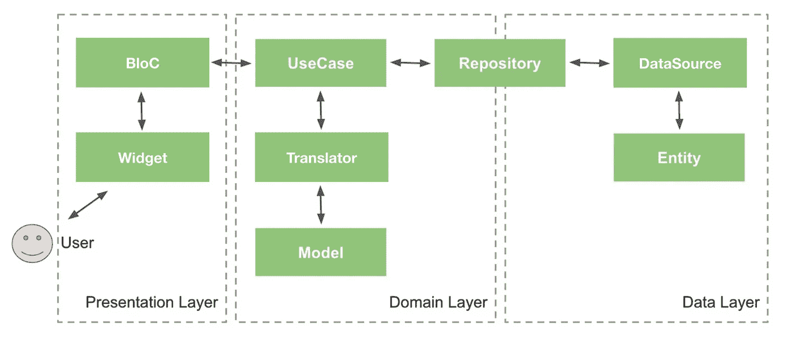

# 颤振 x 清洁建筑

> 原文：<https://itnext.io/flutter-clean-architecture-b53ce9e19d5a?source=collection_archive---------0----------------------->

> 在本文的范围内，我假设您已经知道什么是干净的架构，以及我们为什么要使用它。

# 。/ Flutter 干净的架构

可以看到，主要有三层:**展现**、**域**和**数据**。

> R **ole 及各层描述:**

## **一、陈述**

*该层没有业务逻辑处理，因此仅用于显示 UI 和处理事件。*

**1。小工具(页面)**

*   通知 BloC 事件，如屏幕显示和用户触摸事件，并监听 BloC 发出的事件。

**2。阻塞**

*   从视图接收事件，必要时根据事件执行用例。
*   将从 UseCase 接收的数据发出以供查看。
*   BloC 根本不了解 View。

## 二。领域

*这一层负责业务逻辑。*

**1。用例**

*   描述用例所需的逻辑处理。
*   直接使用存储库。

**2。译者**

*   将模型转换成实体以便向服务器端请求，或者将实体转换成模型用于表示层。

**3。型号**

*   一个模型将不依赖于从服务器端获取的数据。
*   模型用于表示层。

## 三。数据

*这一层负责与服务器端和数据管理逻辑通信。*

**1。数据源**

*   描述获取和更新数据的过程。
*   这是决定是从服务器端获取数据还是使用数据库或缓存中的数据的地方。

**2。实体**

*   一个实体将依赖于从服务器端获取的数据。
*   实体不用于表示层。

**3。储存库**

*   数据层和领域层之间的桥梁。
*   我们将在存储库中使用翻译器来转换数据。

# 。/练习

*为了更好地理解，我将演示一个流程，它接收来自小部件的动作，处理它，从服务器端请求/接收数据，最后将数据显示给小部件。*

> **源代码:**[*https://github.com/dubydu/fluttourII*](https://github.com/dubydu/fluttourII)

**1。数据层**

*   创建一个**实体。**

> 在[*API _ client _ type . dart*](https://github.com/dubydu/fluttourII/blob/master/lib/data/api/api_client/api_client_type.dart)中，定义一个 **HTTP 请求**如下:

*   然后，打开你的终端，运行这个命令:`make gen`，[，*改型*，](https://pub.dev/packages/retrofit)将承担剩下的责任。您也可以通过编辑这个 [*Makefile*](https://github.com/dubydu/fluttourII/blob/master/Makefile) *来自定义命令行。*
*   定义**数据源。**

*   实现**存储库。**

**2。领域层**

*   创建**模型。**

*   定义**译者。**

*   执行**用例。**

**3。表示层**

*   定义**区块。**

*   实现**小部件。**

**4。迪**

> 让我们的代码变得更加模块化。😎

*   创建**配置模块。**

*   创建**客户端模块。**

*   创建**数据源 _ 模块。**

*   创建**储存库 _ 模块。**

*   创建**用例模块。**

*   将**用例**注入到 [my_app.dart](https://github.com/dubydu/fluttourII/blob/master/lib/my_app.dart) 中的 **BloC** 中，符合所有模块。

仅此而已，运行项目，看看会发生什么！

# 陷阱

为了运行这个项目，您需要在特定的环境中运行。

*   发展:`flutter run -t lib/main_dev.dart`
*   生产:`flutter run -t lib/main_prod.dart`

## 2022 年 6 月 29 日更新

*   使用 [**面向协议的编程**](https://github.com/dubydu/fluttourII/commit/7a8bea0be7c1b891749e15a30a6e26dc815635ae) 代替[服务定位器模式](https://github.com/dubydu/fluttourII/commit/f6d581fbf6c788b7579aef9a5073fbe72f011180)。

## 2022 年 7 月 31 日更新

*   实现了 [**GraphQL 客户端**](https://github.com/dubydu/fluttourII/tree/graphql)