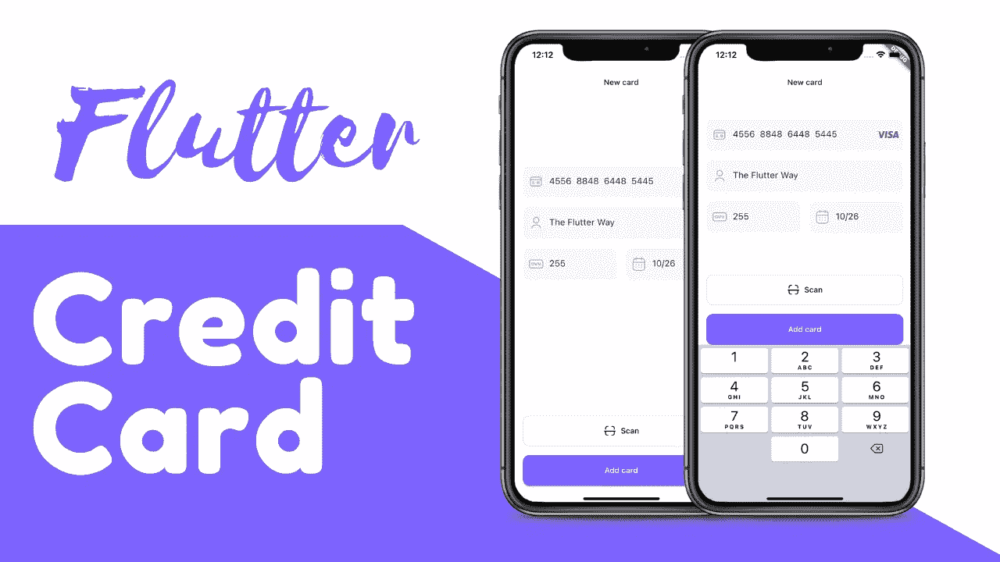
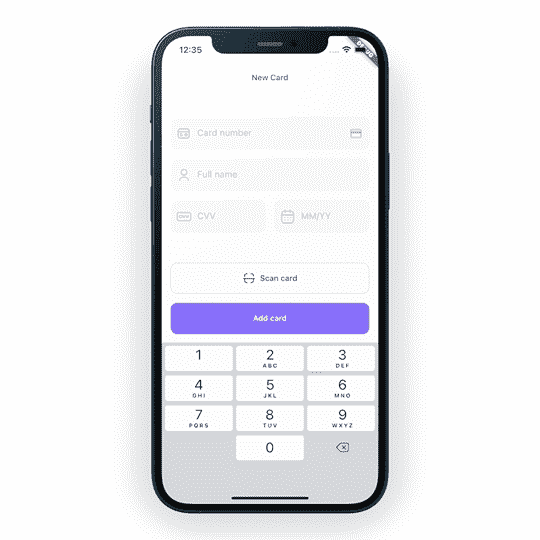
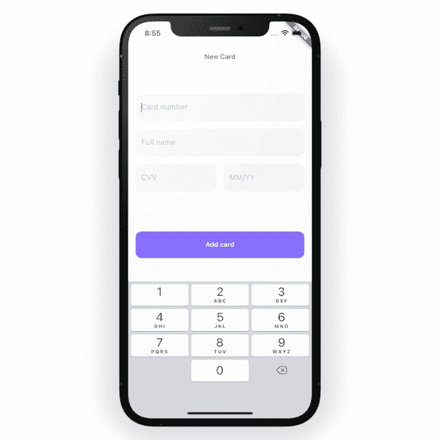
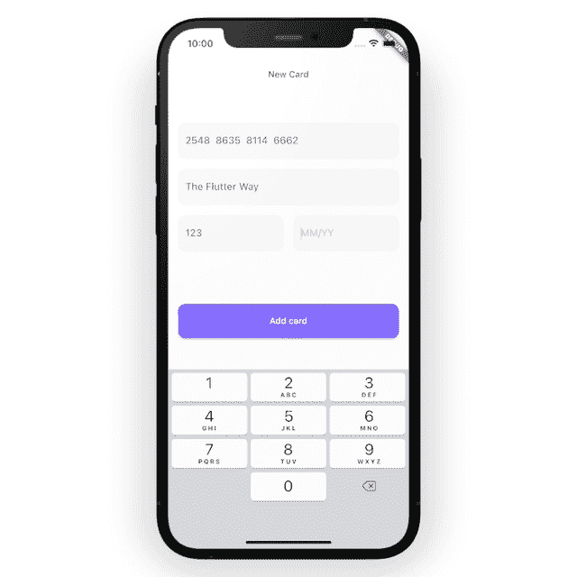
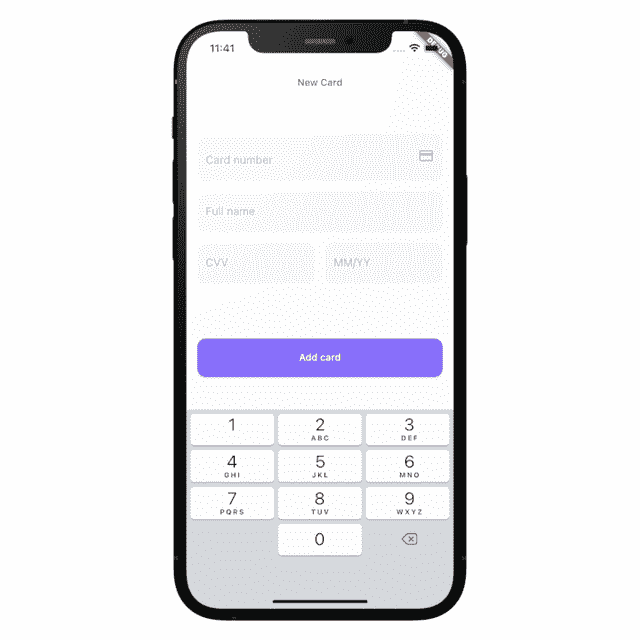

# Flutter 信用卡输入表单—无包

> 原文：<https://itnext.io/flutter-credit-card-input-form-1a1e0b1ec040?source=collection_archive---------0----------------------->

在将信用卡表单添加到 Flutter 时，使用第三方包是很常见的。我将向您展示一种在 Flutter 上添加信用卡表单的简单方法，无需使用任何第三方软件包。



您将学习如何识别卡的类型，是 visa 卡还是
万事达卡，以及如何在四位数字后添加空格，在月份后添加斜线。您还将学习如何验证卡号。如果你想看的话，这里有[完整的源代码](https://cutt.ly/QXEbXeI)。



让我们开始吧，这个屏幕相当简单，有几个文本字段和一个按钮。

由于卡尚未创建，因此卡类型会出现错误。

```
enum CardType {
  Master,
  Visa,
  Verve,
  Discover,
  AmericanExpress,
  DinersClub,
  Jcb,
  Others,
  Invalid
}
```

当您输入信用卡号时，您会注意到它在第四位数字后添加了空格。允许我们在 Flutter 上做这样的事情。现在让我们创建自己的`CardNumberInputFormatter`。

```
class **CardNumberInputFormatter** extends **TextInputFormatter** {
  [@override](http://twitter.com/override)
  TextEditingValue formatEditUpdate(
      TextEditingValue oldValue, TextEditingValue newValue) {
    var text = newValue.text;if (newValue.selection.baseOffset == 0) {
      return newValue;
    }var buffer = StringBuffer();
    for (int i = 0; i < text.length; i++) {
      buffer.write(text[i]);
      var nonZeroIndex = i + 1;
      if (nonZeroIndex % 4 == 0 && nonZeroIndex != text.length) {
        buffer.write('  '); **// Add double spaces.**
      }
    }var string = buffer.toString();
    return newValue.copyWith(
        text: string,
        selection: TextSelection.collapsed(offset: string.length));
  }
}
```

然后返回信用卡文本字段，将`CardNumberInputFormatter`添加到`inputFormatters`。

```
...
TextFormField(
  controller: creditCardController,
  keyboardType: TextInputType.number,
  validator: CardUtils.validateCardNum,
  **inputFormatters**: [
    FilteringTextInputFormatter.digitsOnly,
    LengthLimitingTextInputFormatter(19),
    **CardNumberInputFormatter(),**
  ],
  decoration: InputDecoration(hintText: "Card number"),
),
```

让我们来看一下预告👇



带空格的卡号

我们需要为到期日期做一些类似的事情，但是我们需要一个斜杠来代替空格。

```
class **CardMonthInputFormatter** extends **TextInputFormatter** {
  [@override](http://twitter.com/override)
  TextEditingValue formatEditUpdate(
      TextEditingValue oldValue, TextEditingValue newValue) {
    var newText = newValue.text;if (newValue.selection.baseOffset == 0) {
      return newValue;
    }var buffer = StringBuffer();
    for (int i = 0; i < newText.length; i++) {
      buffer.write(newText[i]);
      var nonZeroIndex = i + 1;
      **if (nonZeroIndex % 2 == 0 && nonZeroIndex != newText.length) {
        buffer.write('/');
      }**
    }var string = buffer.toString();
    return newValue.copyWith(
        text: string,
        selection: TextSelection.collapsed(offset: string.length));
  }
}
```

在`inputFormatters`下，定义`CardMonthInputFormatter`。

```
TextFormField(
  keyboardType: TextInputType.number,
  **inputFormatters**: [
    FilteringTextInputFormatter.digitsOnly,
    LengthLimitingTextInputFormatter(4),
    **CardMonthInputFormatter(),**
  ],
  decoration: const InputDecoration(hintText: "MM/YY"),
),
```



带“/”的过期日期

下一步是识别卡的类型，是 Visa，Mastercard，还是其他。很想把它放在`CardUtils`下。

```
class **CardUtils** {static CardType **getCardTypeFrmNumber**(String input) {
    CardType cardType;
    if (input.startsWith(RegExp(
        r'((5[1-5])|(222[1-9]|22[3-9][0-9]|2[3-6][0-9]{2}|27[01][0-9]|2720))'))) {
      cardType = CardType.Master;
    } else if (input.startsWith(RegExp(r'[4]'))) {
      cardType = CardType.Visa;
    } else if (input.startsWith(RegExp(r'((506(0|1))|(507(8|9))|(6500))'))) {
      cardType = CardType.Verve;
    } else if (input.startsWith(RegExp(r'((34)|(37))'))) {
      cardType = CardType.AmericanExpress;
    } else if (input.startsWith(RegExp(r'((6[45])|(6011))'))) {
      cardType = CardType.Discover;
    } else if (input.startsWith(RegExp(r'((30[0-5])|(3[89])|(36)|(3095))'))) {
      cardType = CardType.DinersClub;
    } else if (input.startsWith(RegExp(r'(352[89]|35[3-8][0-9])'))) {
      cardType = CardType.Jcb;
    } else if (input.length <= 8) {
      cardType = CardType.Others;
    } else {
      cardType = CardType.Invalid;
    }
    return cardType;
  }}
```

知道了信用卡的类型，展示它的标志就相当容易了。

```
class CardUtils {...static Widget? **getCardIcon**(CardType? cardType) {
    String img = "";
    Icon? icon;
    switch (cardType) {
      case CardType.Master:
        img = 'mastercard.png';
        break;
      case CardType.Visa:
        img = 'visa.png';
        break;
      case CardType.Verve:
        img = 'verve.png';
        break;
      case CardType.AmericanExpress:
        img = 'american_express.png';
        break;
      case CardType.Discover:
        img = 'discover.png';
        break;
      case CardType.DinersClub:
        img = 'dinners_club.png';
        break;
      case CardType.Jcb:
        img = 'jcb.png';
        break;
      case CardType.Others:
        icon = const Icon(
          Icons.credit_card,
          size: 24.0,
          color: Color(0xFFB8B5C3),
        );
        break;
      default:
        icon = const Icon(
          Icons.warning,
          size: 24.0,
          color: Color(0xFFB8B5C3),
        );
        break;
    }
    Widget? widget;
    if (img.isNotEmpty) {
      widget = Image.asset(
        'assets/images/$img',
        width: 40.0,
      );
    } else {
      widget = icon;
    }
    return widget;
  }
}
```

为了改善用户体验，我们在卡号的 4 位数字后使用双空格。卡号需要没有那些双空格，所以我们将定义一个名为`getCleanedNumber`的方法。

```
class CardUtils {...static String **getCleanedNumber**(String text) {
    RegExp regExp = RegExp(r"[^0-9]");
    return text.replaceAll(regExp, '');
  }
}
```

在`AddNewCardScreen`中，定义一个方法，让我们知道卡的类型并相应地更新它。

```
void **getCardTypeFrmNumber**() {
    if (cardNumberController.text.length <= 6) {
      String input = CardUtils.getCleanedNumber(cardNumberController.text);
      CardType type = CardUtils.getCardTypeFrmNumber(input);
      if (type != cardType) {
        **setState(() {
          cardType = type;
        });**
      }
    }
  }
```

每当信用卡文本字段改变时，我们必须运行`getCardTypeFrmNumber`方法。您可以通过向`initState`上的`cardNumberController`添加一个监听器来实现这一点。

```
[@override](http://twitter.com/override)
  void initState() {
    cardNumberController.**addListener**(
      () {
        **getCardTypeFrmNumber**();
      },
    );
    super.initState();
  }
```

别忘了处理掉它。

```
[@override](http://twitter.com/override)
  void dispose() {
    **cardNumberController.dispose**();
    super.dispose();
  }
```

回到信用卡文本字段，从`InputDecoration`中移除`const`并添加代表卡类型标志的`suffix`。

```
TextFormField(...

  decoration: **InputDecoration(**
    hintText: "Card number",
 **suffix: CardUtils.getCardIcon(cardType),**
  ),
),
```



信用卡类型标志

我们还没有验证信用卡，这是最重要的一步。

```
class CardUtils {.../// With the card number with Luhn Algorithm/// https://en.wikipedia.org/wiki/Luhn_algorithm static String? **validateCardNum**(String? input) {
    if (input == null || input.isEmpty) {
      return "This field is required";
    }input = getCleanedNumber(input);if (input.length < 8) {
      return "Card is invalid";
    }int sum = 0;
    int length = input.length;
    for (var i = 0; i < length; i++) {
      // get digits in reverse order
      int digit = int.parse(input[length - i - 1]);// every 2nd number multiply with 2
      if (i % 2 == 1) {
        digit *= 2;
      }
      sum += digit > 9 ? (digit - 9) : digit;
    }if (sum % 10 == 0) {
      return null;
    }return "Card is invalid";
  }
}
```

需要验证的不只是卡号；这也是 CVV 和到期日。

```
class CardUtils {... static String? **validateCVV**(String? value) {
    if (value == null || value.isEmpty) {
      return "This field is required";
    }if (value.length < 3 || value.length > 4) {
      return "CVV is invalid";
    }
    return null;
  }static String? **validateDate**(String? value) {
    if (value == null || value.isEmpty) {
      return "This field is required";
    }int year;
int month;if (value.contains(RegExp(r'(/)'))) {
      var split = value.split(RegExp(r'(/)'));

      month = int.parse(split[0]);
      year = int.parse(split[1]);
    } else {

      month = int.parse(value.substring(0, (value.length)));
      year = -1; // Lets use an invalid year intentionally
    }if ((month < 1) || (month > 12)) {
      // A valid month is between 1 (January) and 12 (December)
      return 'Expiry month is invalid';
    }var fourDigitsYear = convertYearTo4Digits(year);
    if ((fourDigitsYear < 1) || (fourDigitsYear > 2099)) {
      // We are assuming a valid should be between 1 and 2099.
      // Note that, it's valid doesn't mean that it has not expired.
      return 'Expiry year is invalid';
    }if (!hasDateExpired(month, year)) {
      return "Card has expired";
    }
    return null;
  }
}
```

只需将这些验证器添加到文本字段中，我们就完成了。这里有一些**奖励🥳** 的方法可能对你有帮助。

```
/// Convert the two-digit year to four-digit year if necessary
static int **convertYearTo4Digits**(int year) {
  if (year < 100 && year >= 0) {
    var now = DateTime.now();
    String currentYear = now.year.toString();
    String prefix = currentYear.substring(0, currentYear.length - 2);
    year = int.parse('$prefix${year.toString().padLeft(2, '0')}');
  }
  return year;
}static bool **hasDateExpired**(int month, int year) {
  return isNotExpired(year, month);
}static bool **isNotExpired**(int year, int month) {
  // It has not expired if both the year and date has not passed
  return !hasYearPassed(year) && !hasMonthPassed(year, month);
}static List<int> **getExpiryDate**(String value) {
  var split = value.split(RegExp(r'(/)'));
  return [int.parse(split[0]), int.parse(split[1])];
}static bool **hasMonthPassed**(int year, int month) {
  var now = DateTime.now();
  // The month has passed if:
  // 1\. The year is in the past. In that case, we just assume that the month
  // has passed
  // 2\. Card's month (plus another month) is more than current month.
  return hasYearPassed(year) ||
      convertYearTo4Digits(year) == now.year && (month < now.month + 1);
}static bool **hasYearPassed**(int year) {
  int fourDigitsYear = convertYearTo4Digits(year);
  var now = DateTime.now();
  // The year has passed if the year we are currently is more than card's
  // year
  return fourDigitsYear < now.year;
}
```

这里是 [**源代码**](https://cutt.ly/QXEbXeI) 如果你想看看的话。

这是取自 **FlutterShop** — **的另一个屏幕，这是一个完全可定制的商店 UI 套件。如果你喜欢，你可以看看这个工具包👇**

[](https://theflutterway.gumroad.com/l/fluttershop) [## Flutter shop-Flutter 的高级电子商务 UI 套件

### Chrome 或 Brave 浏览器推荐预览 Live 预览 FlutterShop 是一个高级电子商务 UI 套件，您可以使用…

theflutterway.gumroad.com](https://theflutterway.gumroad.com/l/fluttershop) 

如果我做错了什么？欢迎发表评论。我很想进步。

感谢您阅读这篇文章。拍手声👏如果你觉得有用的话。