# 颤振自定义错误信息—闪光信息

> 原文：<https://itnext.io/flutter-custom-error-message-flash-message-c2ea430c595?source=collection_archive---------0----------------------->

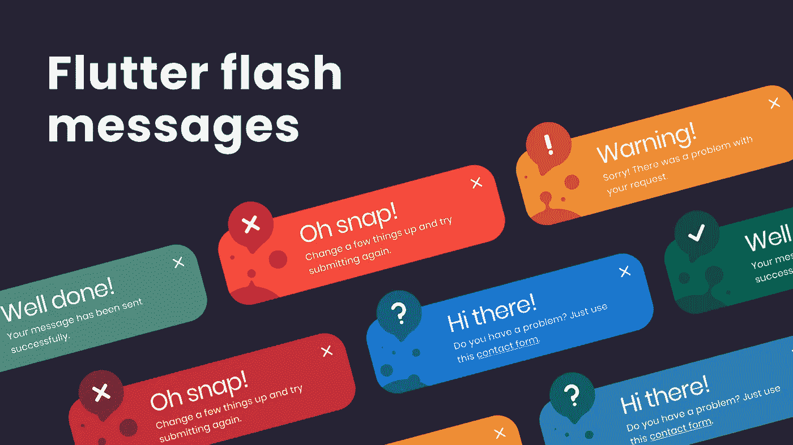

我将向你展示如何创建一个自定义的 flash 消息，或者在 Flutter 上，它被称为小吃店。非常方便地向用户显示错误、成功或任何警告消息。

录像

## 项目设置

如果你喜欢跟随我，下载[开始项目](https://cutt.ly/bHld9X0) (c [完成项目](https://cutt.ly/YHwNBh2))。assets 目录包含我们所有的资产&lib 目录包含 main.dart 和 flash_message_screen.dart

## 开始编码

FlashMessageScreen 什么都不是，只是一个简单的屏幕，有一个中心按钮。

FlashMessageScreen.dart

我们在 Flutter 上已经有了一个`SnackBar`小部件来显示这样的错误或警告消息。使用`ScaffoldMessenger`显示。在 SnackBar 中，内容是一个简单的文本。

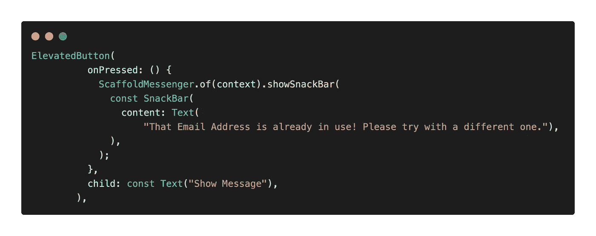

如果你点击显示消息按钮。在底部，它显示了一个小吃店。我知道这看起来很简单，但是别担心，我们会做得很好的。

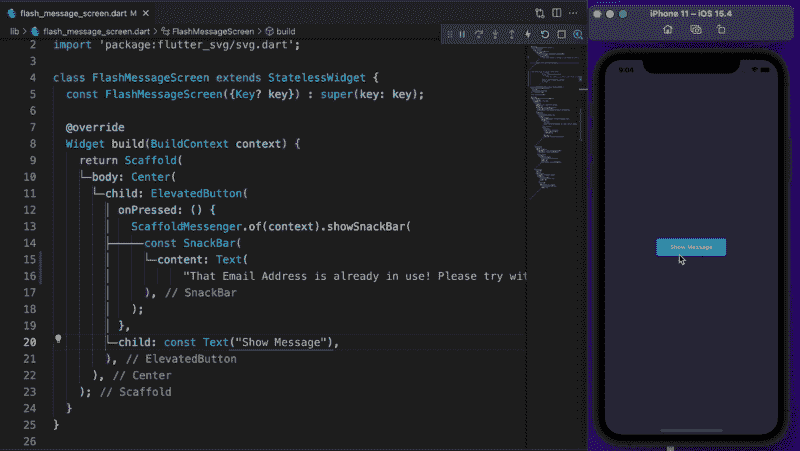

首先，让我们把行为改为`SnackBarBehavior.floating`。用`Container`包裹`Text`小工具，然后设置高度为 90，颜色为红色。向容器中添加 16 的填充物。要使角变圆，应用 20 边界半径。

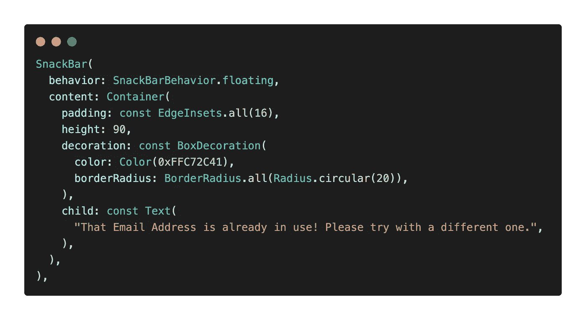

点击按钮预览，但这不是我们所期望的！

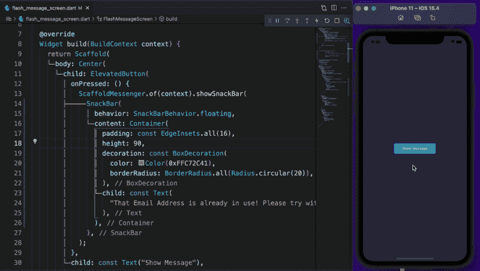

要解决这个问题，需要将 SnackBar `background`颜色设置为透明，并将`elevation`设置为 0。

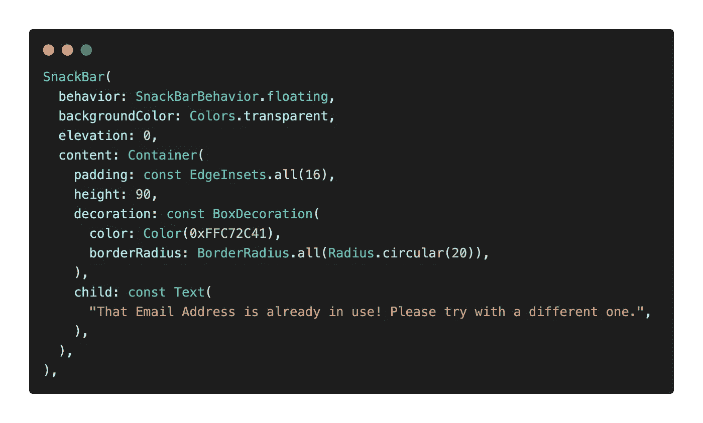

一切都没了。现在没有阴影或白色边框。

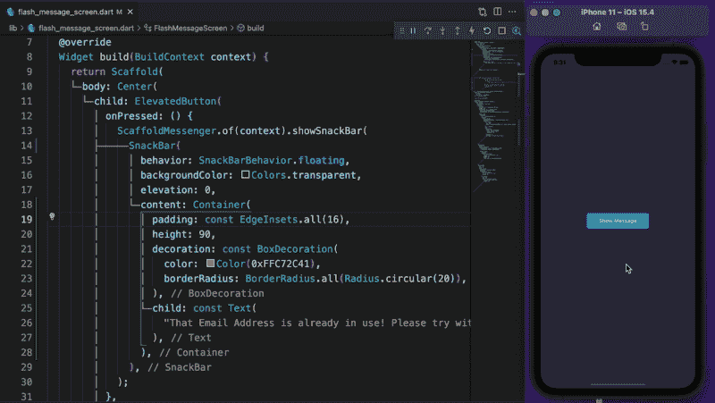

现在用一个`Column`包装文本小部件，添加另一个文本，将`fontSize`设置为 18，将`color`设置为白色。下一个也一样，字体颜色是白色的&字体大小是 12 最后但并非最不重要的是，将有 2 行文本的最大值。另外，将溢出设置为`TextOverflow.ellipsis`。将`crossAxisAlignment`设置为`CrossAxisAlignment.start`。

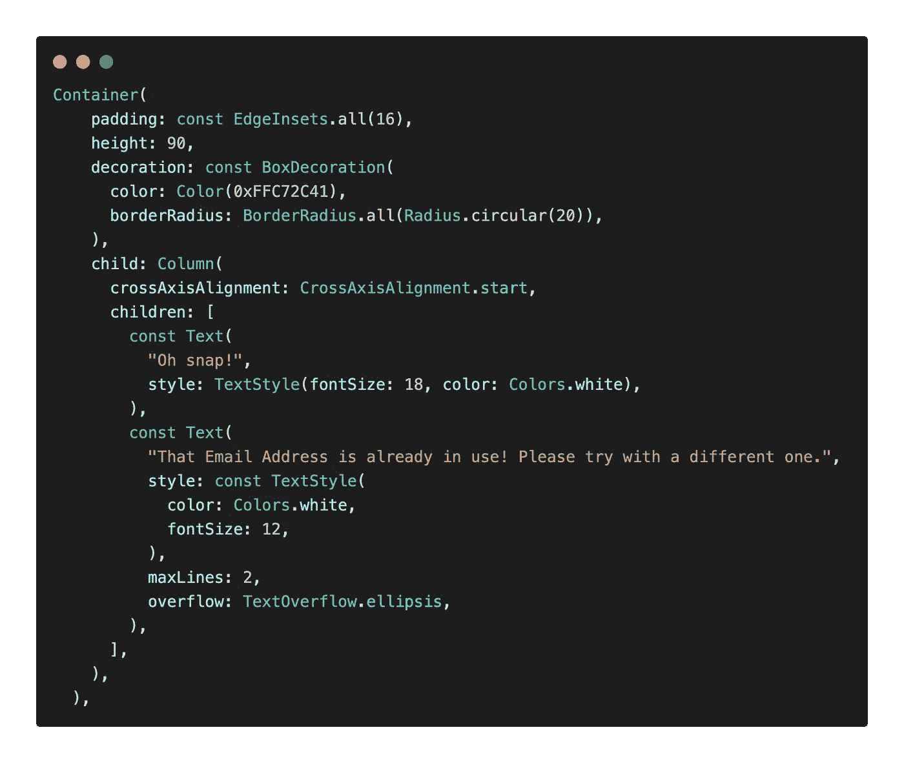

我们需要在左侧的自由空间放置气泡和关闭图标。用一个`Row`包住`Column`，定义一个`SizedBox`并将宽度设置为 48。此外，用一个`Expanded`小部件包装该列。

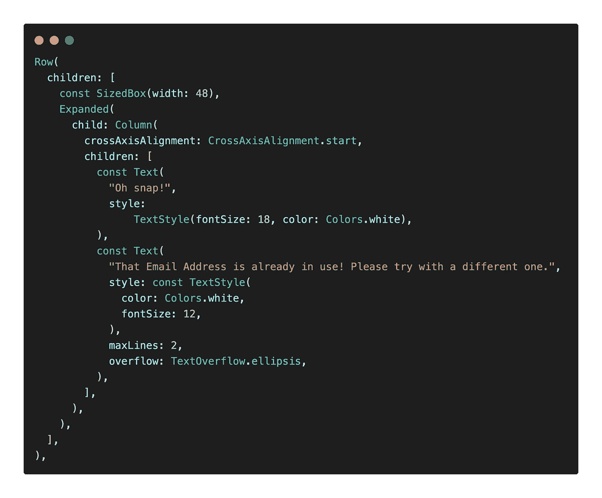

现在我们在左侧有了大量的空闲空间。

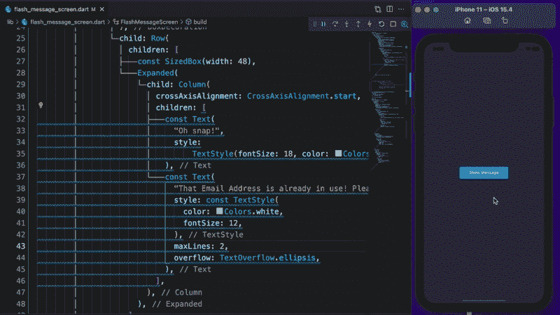

要放置气泡，用一个`Stack`小部件包裹整个`Container`。气泡是一个简单的 SVG 图像，但是 Flutter 默认不支持 SVG。我已经将 [flutter_svg](https://pub.dev/packages/flutter_svg) 包添加到起始项目中。现在复制图像路径，然后将其添加到`Container`小部件之后。

将高度设置为 48，宽度设置为 40，颜色设置为更深的红色。我们希望我们的气泡在底部左侧，用`Positioned`小部件包裹它，并将底部设置为 0。让我们通过设置左下角的边界半径为 20 来使它变圆。

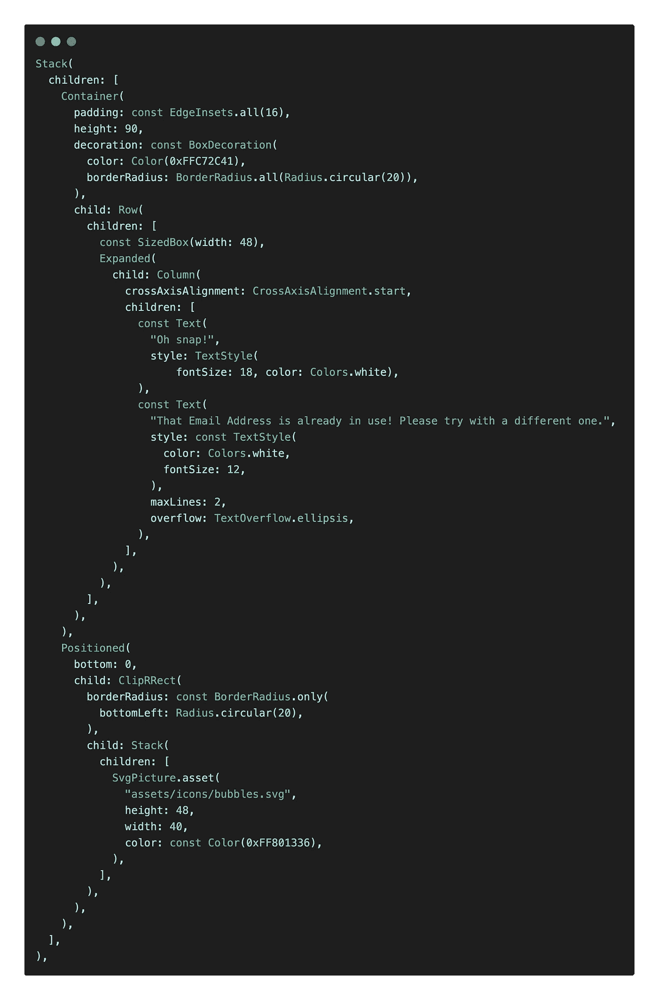

太好了，我们快到了！

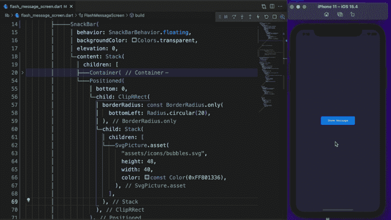

最后，添加另一个名为 failed 的 SVG 图像。SVG，并将高度设置为 40。我们希望它在左上角。为了让它发生，用`Positioned`小部件包装图像，并将顶部设置为-20 & left 0。还将堆栈 clipBehavior 设置为`Clip.none`。

要在这个顶部气泡上放置一个关闭图标，用一个`Stack`小部件将它包裹起来。在里面，孩子们添加了一个名为 close 的 SVG 图像。SVG，并将高度设置为 16。右上角的关闭图标使其居中，将堆栈对齐设置为`Alignment.center`。尽管如此，它还是不居中，现在用`Position`小部件包装关闭的 SVG 图像，然后 set top 等于 10。

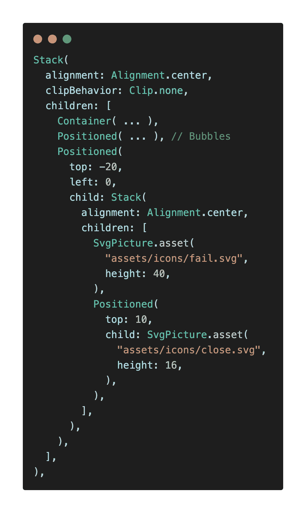

我们差不多完成了。

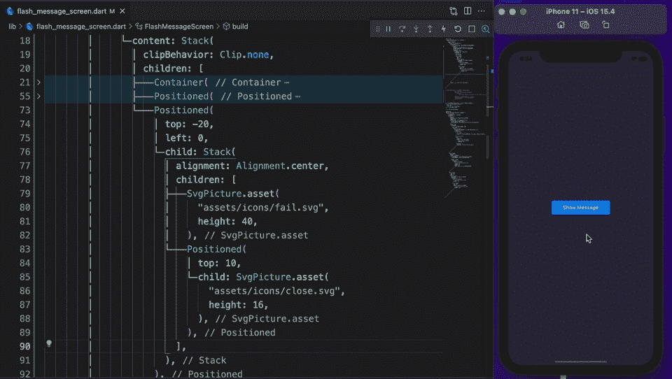

我们已经在 Flutter 上完成了自定义的 flash 消息。你需要在任何应用程序的许多地方使用这个 flash 消息。为了使其可重用，让我们提取小吃店的内容。我准备叫它`CustomSnackBarContent`。为错误文本创建一个必需的参数，然后传递错误。

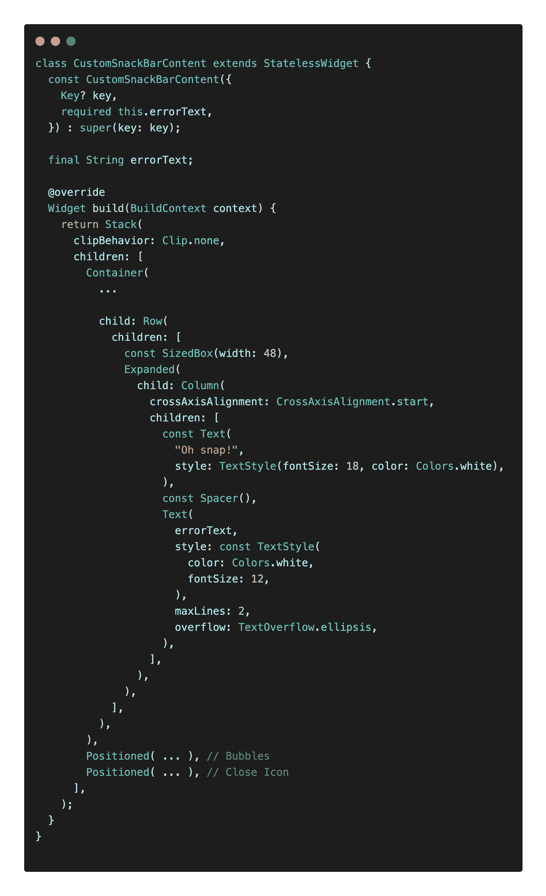

CustomSnackBarContent

现在，我们可以很容易地在我们的应用程序中的任何地方使用它！

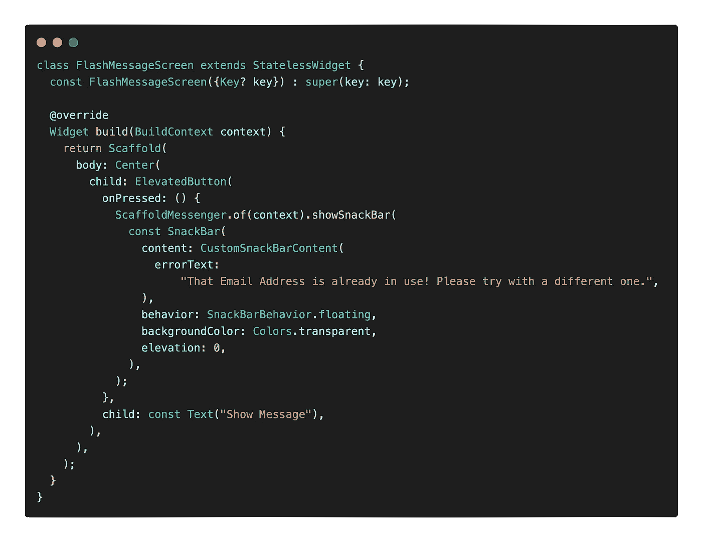

**源代码:** [颤振自定义错误信息](https://cutt.ly/YHwNBh2) (Patreon)

🔥奖金🔥Flutter UI 套件— 100 多个屏幕|明暗主题

 [## Flutter shop-Flutter 的高级电子商务 UI 套件

### Chrome 或 Brave 浏览器推荐预览 Live 预览 FlutterShop 是一个高级电子商务 UI 套件，您可以使用…

切切地](https://cutt.ly/jHVvcLC) 

谢谢，祝您愉快！