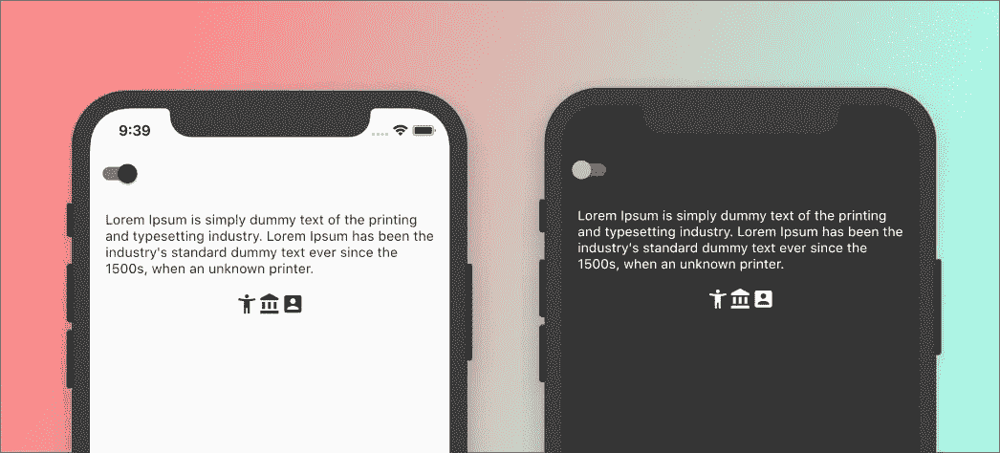
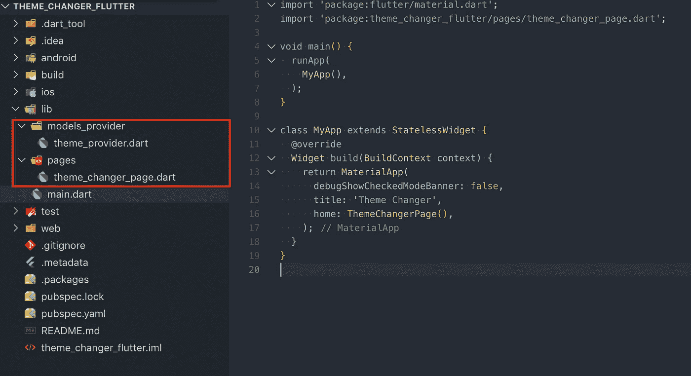
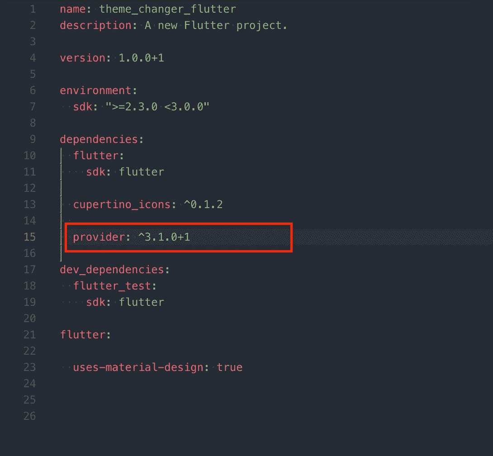
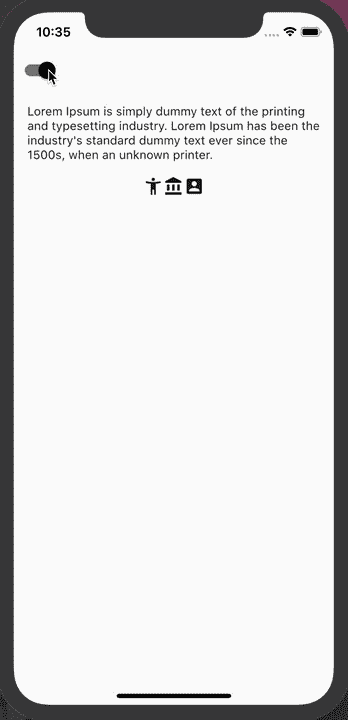

# 使用提供程序使黑暗与光明主题飘动

> 原文：<https://itnext.io/flutter-dark-light-theme-using-provider-5f7c8c06529f?source=collection_archive---------3----------------------->

最近出现了一股围绕黑暗主题应用的热潮，尤其是在 Instagram 和 Twitter 等流行的社交媒体平台上。科技消费者是痴迷于另一种趋势，还是它有实用目的？

独家新闻来了！使用深色主题对眼睛来说更舒服，提高了弱视用户和对强光敏感的用户的可见度；它在光线昏暗的环境中也能很好地工作。然而，并不是每个人都喜欢“黑暗面”，任何精明的开发者在开发他们的应用程序时都会将这一点考虑在内。

在本文中，我们将使用 provider 包为整个应用程序实现一个明暗主题。

虽然这个设计不是最美观的，但它很好地诠释了这个概念。

# 让我们编码！

创建一个新的 flutter 项目:flutter create——清除 main.dart 的内容，如下图所示。此外，创建突出显示的文件夹和文件。

在 pubspec.yaml 文件中添加依赖关系**提供者:^3.1.0+1**

在 theme_provider.dart 文件中，我们将添加:

将 notifyListeners()视为“设置状态”,无论何时调用它，它都会更新 UI。setThemeData(bool val)用于在亮暗主题之间切换，getThemeData 将返回当前主题。

现在，我们需要为浅色和深色主题提供主题数据。

完整的 theme_provider.dart 文件。

为了让 ThemeProvider 工作，我们需要修改 main.dart 用 ChangeNotifyProvider()包装 MyApp()

**最终主镖**

**theme_changer_page.dart**

该开关用于将主题从灯光切换到飞镖；所有内容都保存在 theme_provider.dart 中

# 最终用户界面

# 结论

Flutter 使得在你的应用中实现 dart 和 light 主题变得非常容易，使用 provider 包使它变得一帆风顺！

当然，在这种情况下，每当应用程序重新启动时，主题都会被重新放置。您可以使用 [hive](https://pub.dev/packages/hive) 或 [shared_preferences](https://pub.dev/packages/shared_preferences) 在本地持久化主题。

源代码: [*GitHub 链接*](https://github.com/UrAvgDeveloper/theme_changer_flutter)

如果这有帮助，请给我鼓掌，这让我保持动力:)