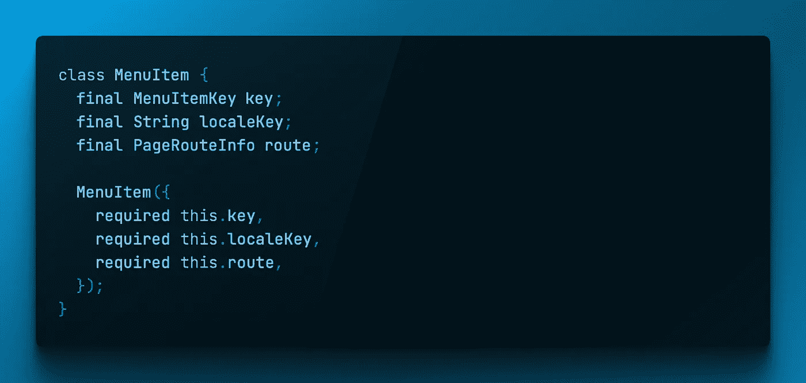

# 颤振:数据测试

> 原文：<https://itnext.io/flutter-data-testing-362957f561c1?source=collection_archive---------5----------------------->



在之前的一篇文章中，我们讨论了使用`find.byPredicate`进行更加精确和可靠的小部件测试。

[颤振:升级您的测试游戏](https://remelehane.dev/posts/up-your-testing-game/)

在这篇文章中，我们将快速浏览同样的逻辑，但是是针对数据相关的单元测试。

对于我的 95%的数据模型，我会使用冻结的[和](https://pub.dev/packages/freezed)，这是一个奇妙的包，当涉及到数据类时，它使我们的生活变得更加简单，包括添加一些实用方法以及通过处理等式来简化单元测试，这是我以前手动实现的，并得到了 [equatable](https://pub.dev/packages/equatable) 的一些帮助。

然而，当使用`freezed`时有一点样板文件，因为它与代码生成一起工作。

```
enum MenuItemKey {logout, dashboard}

class MenuItem {
  final MenuItemKey key;
  final String localeKey;
  final PageRouteInfo route;

  MenuItem({
    required this.key,
    required this.localeKey,
    required this.route,
  });

  static List<MenuItem> menuItems = [...]

  static List<MenuItem> itemsToDisplay(List<MenuItemKey> excludedKeys) {
    return menuItems
        .where((element) => !excludedKeys.contains(element.key))
        .toList();
  }
}
```

以这个类为例，添加`freezed`会很简单，增加 2 或 3 行代码和一个额外生成的文件，然而对我来说这是不必要的，因为这是我创建的一个简单管理导航列表的模型，没有数据要测试，与 API 无关，不需要等式或实用方法，等等。

在我的应用程序中有一个菜单，它提供了`menuItems`列表，我用它生成导航项目。

然而，我仍然希望能够准确地测试`itemsToDisplay`，这个类的 1 位逻辑，默认情况下，所有项目都基于生成函数，然而不是所有的屏幕都有所有的导航项目。例如，登录屏幕不需要注销按钮。

# 测试…

与小部件一样，我们可以使用`predicate`作为 expect 函数的一部分，深入数据模型，并将结果与定义的值进行比较。

```
test('should return only logout menu item', () async {
    //act
    final result = MenuItem.itemsToDisplay([
      MenuItemKey.dashboard,
      MenuItemKey.support,
      MenuItemKey.profile,
    ]);
    //assert
    expect(
      result,
      predicate(
        (List<MenuItem> items) =>
            items.length == 1 && items.first.key == MenuItemKey.logout,
      ),
    );
  });
```

在上面的例子中，我们在`menuItems`列表中有 4 个条目，并决定过滤掉除`logout`之外的所有条目。

为了验证我们的函数正在工作，我们使用了`predicate`,它将一个函数作为一个期望，我们将我们期望的数据类型传递给它，然后返回一个产生布尔结果的检查。

在这种情况下，我们有一个包含 4 个菜单项的列表，我们排除了其中的 3 个，所以我们验证我们的列表中只有 1 个项目，为了确保正确的项目仍然存在，我们验证列表中的第一个(唯一的)项目具有键`MenuItemKey.logout`，这是分配给导航项目的枚举值。

# 结论…

正如你现在所看到的，`find.byPredicate`和`predicate`是两个非常有用的方法，我们作为测试人员在编写测试时应该牢记在心。它们可以帮助不太标准的用例，并允许我们编写更高质量的测试。

我希望您对此感兴趣，如果您有任何问题、评论或改进，请随时发表评论。享受你的颤振发展之旅:D

如果你喜欢，一个赞就太棒了。

感谢阅读。

希望继续单元测试的话题，请看:

[](/widget-testing-dealing-with-renderflex-overflow-errors-9488f9cf9a29) [## 小部件测试:处理 Renderflex 溢出错误

### 在单元测试中处理“一个 RenderFlex 被…溢出”的简单方法…

itnext.io](/widget-testing-dealing-with-renderflex-overflow-errors-9488f9cf9a29) [](/up-your-testing-game-ae40cb5d4449) [## 升级您的测试游戏

### 今天我们来看看 Flutter 测试提供的一个很棒的工具。

itnext.io](/up-your-testing-game-ae40cb5d4449) 

*原载于 2022 年 5 月 9 日*[*https://remelehane . dev*](https://remelehane.dev/posts/flutter-data-testing/)*。*