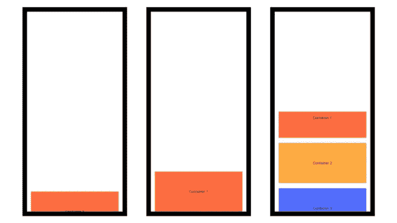
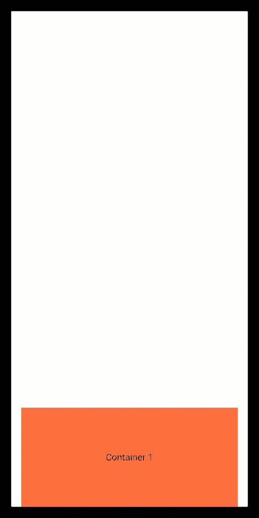

# 飘动:可拖动的可滚动工作表

> 原文：<https://itnext.io/flutter-draggablescrollablesheet-c396edcc86be?source=collection_archive---------2----------------------->



DraggableScrollableSheet 概览|作者提供的图片

## 又一个升级应用程序 UX

## 权威指南

DraggableScrollableSheet 是一个可以通过滑动手势进行拖动、调整大小和滚动的小部件。

它的最初印象可能看起来像是 [BottomSheet](https://api.flutter.dev/flutter/material/BottomSheet-class.html) 小部件。

好吧，等等！这个小工具怎么会是一个真正的 UX 助推器或简单地认为。我知道，在作出这样的假设之前，我们开车通过将是伟大的。那我们走吧。

来源|[giphy.com](https://giphy.com)

附注:我已经在最后说明了 DraggableScrollableSheet。如果你赶时间，可以直接跳到最后。

# DraggableScrollableSheet 的参数

```
const DraggableScrollableSheet({
 Key key,
 this.initialChildSize = 0.5,
 this.minChildSize = 0.25,
 this.maxChildSize = 1.0,
 this.expand = true,
 @required ScrollableWidgetBuilder this.builder,
})
```

参数有自己的默认值。然而，你总是可以覆盖这些参数的值，记住**它不能为空**。

在`const`中，提到的参数值，即`initialChildSize`、`minChildSize`和`maxChildSize`，表示它将从其父微件占据的高度的百分比。

现在，让我们在所有这些参数使 DraggableScrollableSheet 成为一个更高级别的小部件之后，演示其中的每一个。

## ***建造者:***

*   DraggableScrollableSheet 必须要求`ScrollableWidgetBuilder`，在子窗口小部件中显示可滚动和可拖动的内容。

```
DraggableScrollableSheet(
  builder: (BuildContext context, myscrollController) {
    return Container(
      margin: EdgeInsets.symmetric(horizontal: 15.0),
      child: SingleChildScrollView(
        controller: myscrollController,
        child: Column(
          children: [...
```

*   构建器使用`BuildContext`和`ScrollController`作为参数，它应该返回 ScrollableWidget，如`[**SingleChildScrollView**](https://api.flutter.dev/flutter/widgets/SingleChildScrollView-class.html)`、`[**ListView**](https://api.flutter.dev/flutter/widgets/ListView-class.html)`、**、**或`[**GridView**](https://api.flutter.dev/flutter/widgets/GridView-class.html)`。
*   如果建造者的孩子不使用所提供的`ScrollController`，则根据`initialChildSize`该表将保持不变。现在，什么是`initialChildSize`？

**初始孩子大小:**

*   它决定了 DraggableScrollableSheet 的一部分最初应该在屏幕上可见。用户可以通过它开始与整个工作表内容进行交互。

```
DraggableScrollableSheet(
  initialChildSize: 0.2,
  builder: (BuildContext context, myscrollController) {...
```

*   例如`initialChildSize = 0.2`，最初工作表将采用其父窗口小部件的`20%`高度来显示子窗口小部件内容。

## ***minChildSize :***

*   它声明当用户向下拖动小部件时，DraggableScrollableSheet 的部分应该可见。
*   使用这个可以强制显示最少的内容，即使用户已经浏览完内容或者试图向下滑动页面。

```
DraggableScrollableSheet(
  minChildSize: 0.1,
  builder: (BuildContext context, myscrollController) {...
```

*   例如`minChildSize = 0.1`，一个表单将至少采用其父窗口小部件的`10%`高度来显示其子窗口小部件的内容。

## ***max childsize:***

*   用户可以设置当用户向上滑动小部件时，DraggableScrollableSheet 应该可见的最大部分。

```
DraggableScrollableSheet(
  maxChildSize: 0.5,
  builder: (BuildContext context, myscrollController) {...
```

*   例如`maxChildSize = 0.5`，DraggableScrollableSheet 会占用其父 widget 高度的`50%`来显示其子 widget 内容。此后，可以以可滚动的方式访问子部件的内容。
*   可以根据`minChildSize`和`maxChildSize`的值拖动 DraggableScrollableSheet 小部件并调整其大小。

## **展开:**

*   它基本上决定了小部件是否应该扩展以填充其父部件中的所有可用空间。

> "如果父页面想要根据其占用的空间来定位页面，则扩展属性可以根据 [*设置为 false "*](https://api.flutter.dev/flutter/widgets/DraggableScrollableSheet-class.html)*"。*

```
DraggableScrollableSheet(
  expand: true,
  builder: (BuildContext context, myscrollController) {...
```

*   这个属性的值大部分是真的。

现在，我们准备编码，让我们把所有这些东西放在一起，并说明 DraggableScrollableSheet。

# 我们来编码吧！

[https://gist . github . com/parth 2107/176473 a 8357896 AC 110 f 138d 9 c 43 ab 98](https://gist.github.com/parth2107/176473a8357896ac110f138d9c43ab98)

瞧啊。在这里，一个可拖动的滚动床单！



DraggableScrollableSheet 的演示

# 结束语

我敢肯定，你可能已经在这里或那里发现了类似的东西，信不信由你，这是 UX 的愿望。

在其他一些平台上，构建这样的东西可能是具有挑战性的任务。说到这里，让我们为这个看似简单的项目鼓掌。

全部完成！感谢阅读。

# 资源

 [## DraggableScrollableSheet 类

### 一个可滚动的容器，它通过调整可滚动的大小直到达到一个限制来响应拖动手势，并且…

api.flutter.dev](https://api.flutter.dev/flutter/widgets/DraggableScrollableSheet-class.html)