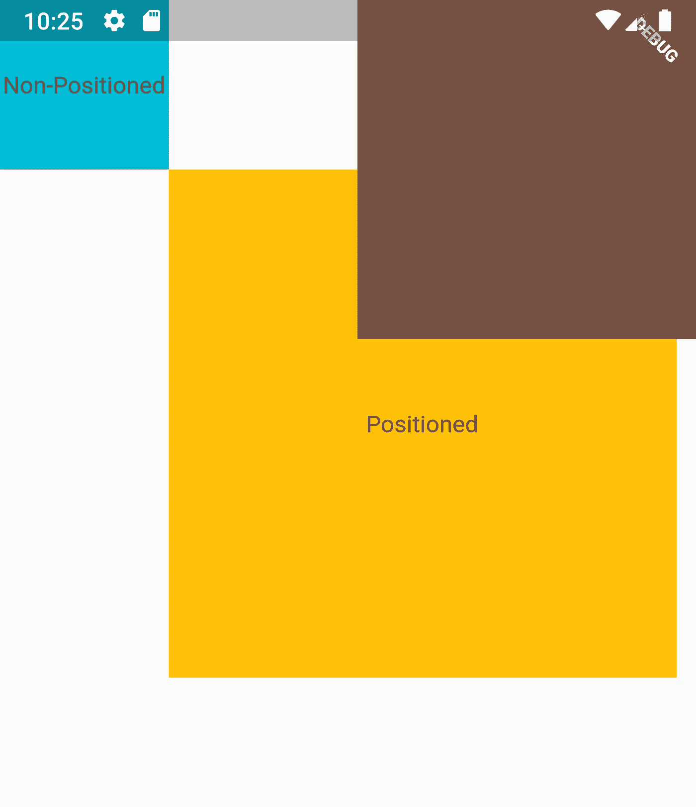
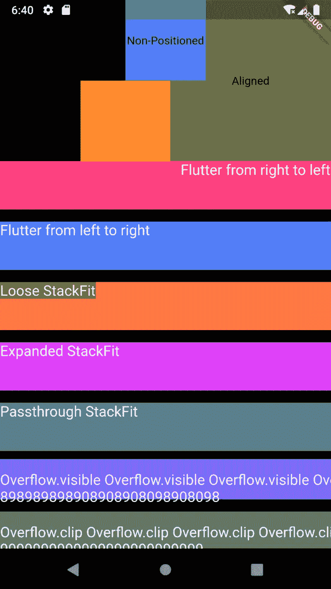

# 颤振:关于栈的一切..

> 原文：<https://itnext.io/flutter-everything-about-stack-48fe809874e9?source=collection_archive---------1----------------------->


照片由[思想目录](https://unsplash.com/@thoughtcatalog?utm_source=medium&utm_medium=referral)在 [Unsplash](https://unsplash.com?utm_source=medium&utm_medium=referral) 上拍摄

## 一站深潜..

一个堆栈窗口小部件包含一个窗口小部件列表，它把它们一个放在另一个上面。因此，在渲染时，它会从底部到顶部渲染它们。

堆栈的大小取决于其子部件。堆栈大小将与它的一个子堆栈占用的最大大小相同。

首先，让我们总结理论部分，就像我们一直被教导的那样。之后会用一个例子来演示。

来源|[giphy.com](https://giphy.com/)

> 堆栈小部件的每个成员要么是*定位的*要么是*非定位的。*

## 定位的小部件:

用定位的小部件包装的堆栈的子级。

它使用参数组合——垂直(顶部、底部、高度)和水平(左侧、右侧和宽度)来定位堆栈中的小部件。

注:如果没有定位部件，对齐部件用于定位堆栈的成员。

## **非定位微件:**

如果堆栈的成员没有用 Align 或 Positioned 小部件包装，那么它被认为是非定位小部件。

根据堆栈的对齐属性，未定位的小部件最终会出现在屏幕上。默认情况下，在屏幕的左上角。

**够了，来举例说明吧。**

```
Stack( alignment: Alignment.topLeft, children: <Widget>[ Positioned(
      top: 100,
      left: 100,
      child: Container(
        height: 300,
        width: 300,
        child: Center(child: Text('Positioned')),
        color: Colors.amber,
      ),
    ), Align(
      alignment: Alignment.topRight,
      child: Container(
        height: 200,
        width: 200,
        child: Center(child: Text('Aligned')),
        color: Colors.brown,
      ),
    ), Container(
      height: 100,
      width: 100,
      child: Center(child: Text('Non-Positioned')),
        color: Colors.cyan,
    ),
  ],
)
```

结果会是…



与子成员堆叠

那很简单…！！没错。等等，总会有更多的…

有几种方法可以使用定位部件。

> ***. fill():***

*   它填充整个屏幕，因为属性-左，上，右，下默认设置为 0.0。尽管可以覆盖这些属性。

> ***posted . from rect():***

*   它使用指定 Rect 中的值创建一个定位的对象。

> ***positioned . from relative 竖立():***

*   它用指定的 relative verter 中的值创建一个定位的对象。

现在我们已经了解了堆栈的基本知识，接下来让我们更深入地了解堆栈的参数。

# **堆栈的参数:**

```
Stack({
  this.alignment = Alignment.topCenter,
  this.textDirection,
  this.fit = StackFit.loose,
  this.overflow = Overflow.clip,
  List<Widget> children = const <Widget>[],
})
```

为了更好地理解，我在我们用来说明 Stack 的同一个例子中演示了这些参数。

> ***对齐:***

*   它基本上决定了堆栈中可用的非定位小部件的位置。

```
Stack(
  alignment: Alignment.topCenter, // Center of Top
  children: <Widget>[....
```

> ***文本方向:***

*   你可以改变文本的方向，是从左到右(LTR)还是从右到左(RTL)。这在使用多种语言时变得非常方便。

```
Stack(
  textDirection: TextDirection.rtl, // Right to Left
  children: <Widget>[....
```

> ***契合:***

*   它决定了堆栈中可用的非定位部件的大小。

**StackFit.loose :** 如果 300*400 的约束从其父堆栈传递到堆栈，那么堆栈的未定位子堆栈可以具有从 0 到 300 的任何宽度和从 0 到 400 的任何高度。

**StackFit.expand :** 如果 300*400 的约束从其父堆栈传递到堆栈，则堆栈的未定位子堆栈将具有最高的宽度(即 300)和最高的高度(即 400)。

**StackFit.passthrough :** 对于未定位的子元素，从其父元素传递到堆栈的约束将保持不变。

```
Stack(
  fit: StackFit.loose,
  children: <Widget>[....
```

> **溢出:溢出:**

*   管理子部件的溢出内容是应该被剪切，还是保持原样，即可见。

```
Stack(
  overflow: Overflow.clip, // Clip the Content...
  children: <Widget>[....
```

每个参数的演示将如下所示…



堆栈的参数能做什么

# 源代码

点击这里查看 Github [的源代码](https://gist.github.com/parth2107/4dc513b67425b2f9e67d5b96552bf7ec)

# 摘要

在本文中，我们已经深入了解了一些概念，以理解 Stack 和它的参数在 Flutter 中是如何的方便。

# 参考

[颤振腹板](https://api.flutter.dev/flutter/widgets/Stack-class.html)