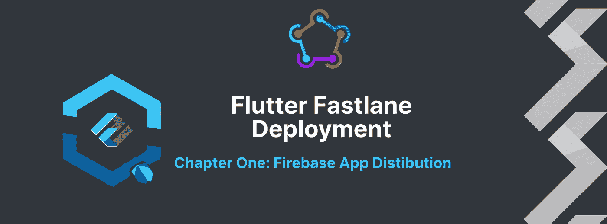
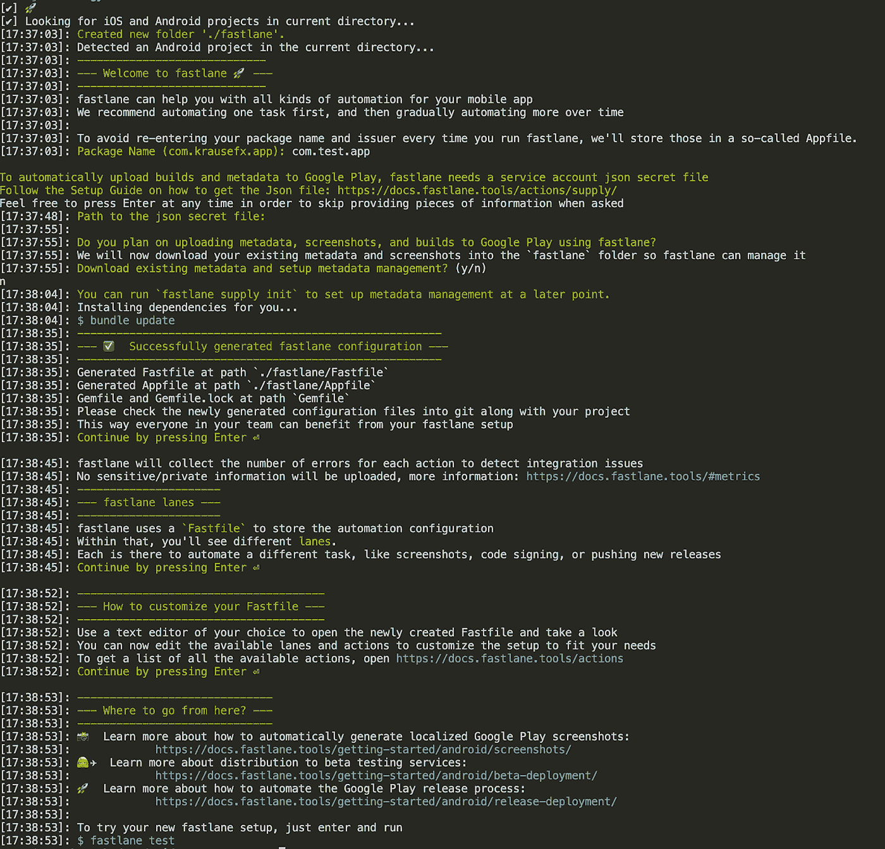
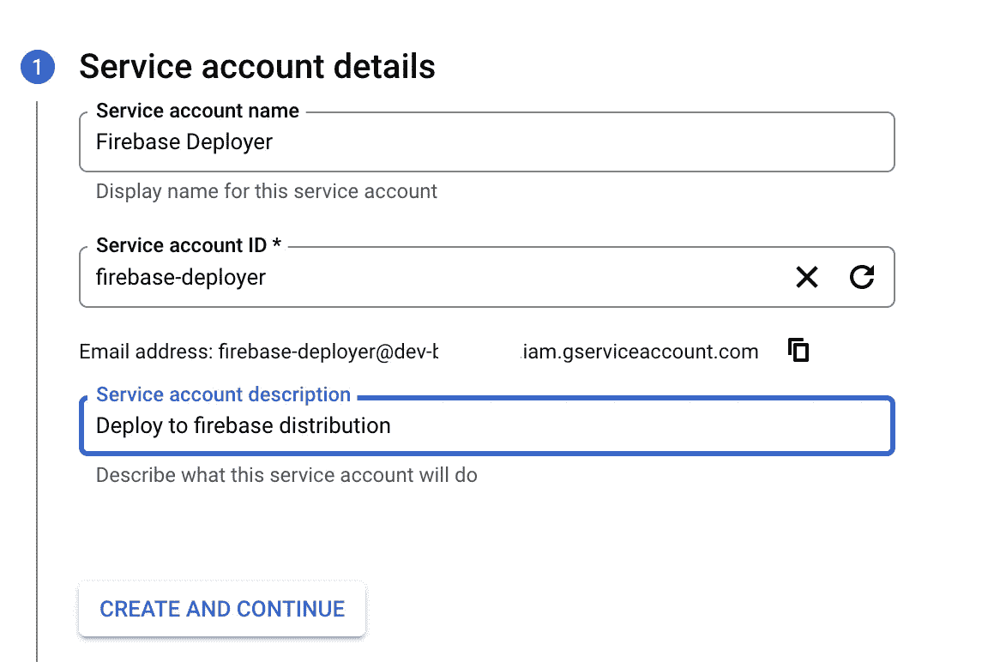
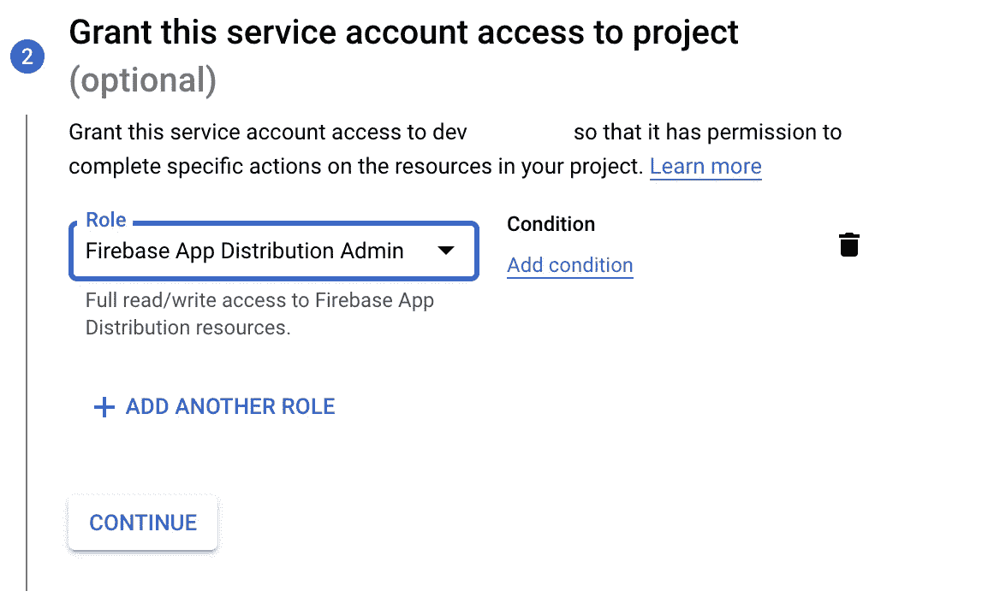
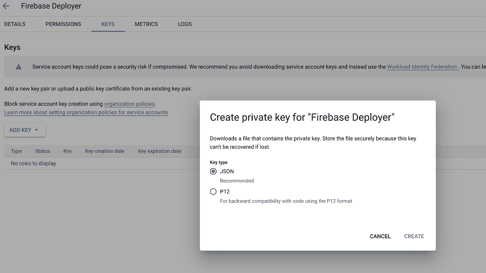
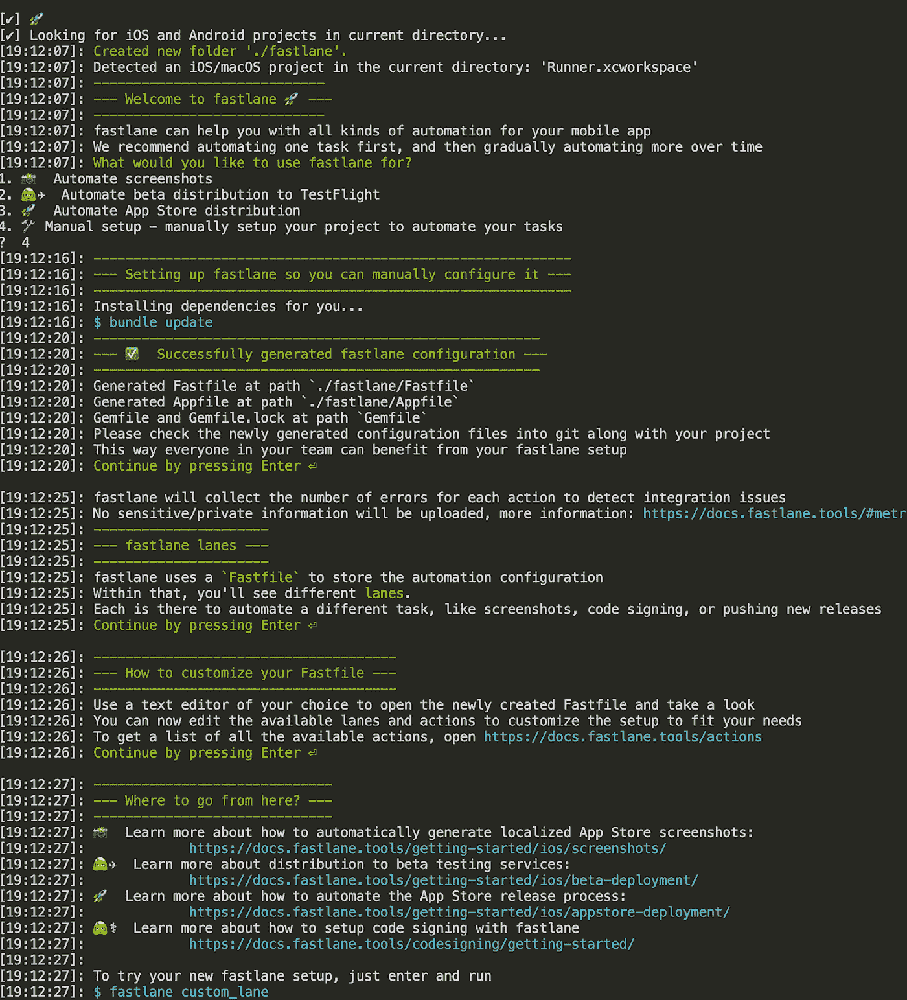

# 颤振浪子部署到 Firebase 应用程序发行版(简单的方式)

> 原文：<https://itnext.io/flutter-fastlane-deployment-to-the-firebase-app-distribution-easy-way-d5ca2fbdcdf9?source=collection_archive---------1----------------------->

> 因为时间是最重要的，我们都喜欢自动化过程

对于 Flutter 应用程序，有许多 ci/cd 的方法，但 fastlane 是免费的，简单的，并为您提供了您需要的每一种可能性，您也可以将 spare Mac 集成为 gitlab runner，并运行 dev 发行版或单击存储版本。

使用 fastlane 有些自动和容易是可能的，所以我决定将这篇文章分成三章:

**第一章**:(这一章)将是部署 Firebase 应用程序发行版的最简单方式

**第二章**:将最简单的方式部署到商店

**第三章:**将两者结合在一个多通道的快速文件中，并提供最佳实践

在上一篇文章[中，我写了如何设置一个新的 Flutter 应用程序，所以我们将在此基础上创建 fastlane 部署。](https://blog.devgenius.io/flutter-new-app-setup-with-flavors-in-one-go-331471b127e3)

# 安装 fastlane

我们需要安装浪子本身(我在 Mac 上，所以我用 brew 安装 Fastlane)，但你可以在 [fastlane 文档](https://docs.fastlane.tools/getting-started/android/setup/)中找到基于操作系统安装的详细信息。同样按照建议，我使用了版本管理器并安装了 ruby 版本 3.0.2。因为我们已经为我们的 flutter 应用程序使用了 fvm，所以这是它的先决条件。

# Android 部署

转到[project]/android 目录并运行 fastlane init，您应该会得到如下结果:

现在，我们将在当前目录中运行下一个命令，将 firebase 分发包添加到我们的快速通道中，该命令将安装其他依赖项:

*fast lane add _ plugin firebase _ app _ distribution*

然后，我们需要授予对我们的 [firebase 帐户](https://firebase.google.com/docs/app-distribution/ios/distribute-fastlane#service-acc-fastlane)的访问权限，您可以自己选择，但我选择了 firebase 服务帐户凭证方法

在[谷歌云控制台](https://console.cloud.google.com/projectselector2/iam-admin/serviceaccounts) e 中为您选择的应用程序创建新的服务帐户

然后在这个新的服务帐户下创建一个键，并下载 json 文件

我将该文件命名为 google-creds.json，并将其放入 *android/fastlane* 文件夹中，然后添加到 gitignore！

因为我们有 dev 和 prod 风格(现在我们将两者都部署到应用程序发行版，稍后 prod 将只进行内部测试或试飞)我们需要添加。env 文件，所以在 fastlane 根文件夹中添加. env.development 和. env.production:

> 重要提示:在为每个应用程序进行部署之前，您需要在 Firebase 控制台中进入应用程序分发，然后单击开始(对于 android 和 ios，对于开发和生产)

您可以创建相同的. env.development 文件，然后将您的 Fastfile 更新为:

*   它将建立 APK 与选定的颤振版本
*   将它部署到应用程序分发，并为选定的测试人员提供注释

然后在 fastlane 目录中运行 magic link，瞧，等待 android 应用程序版本的电子邮件邀请。

# iOS 部署

转到 *[project]/ios* 目录并运行 fastlane init，您应该会得到如下结果:

现在，我们将在当前目录中运行下一个命令，将 firebase 分发包添加到我们的快速通道中，该命令将安装其他依赖项:

*fast lane add _ plugin firebase _ app _ distribution*

再一次像在步骤中那样为 android 添加. env.development 和. env.production 文件，并添加一些额外的参数。在 *ios/fastlane* 文件夹中复制谷歌凭证，然后忽略它。

我也知道这里有重复的东西，但这样做的唯一目的是更好地理解这里发生的一切。正如我说过的，我们将在上一篇文章中清理这个问题。

然后以这种方式更新您的 Appfile 和 Fastfile:

*   应用文件

*   快速文件(在这里我们设置了最小的 ruby 版本，清理了所有的构建版本，构建并归档了 ipa，并将其发送到应用程序发行版)

然后在 fastlane 目录中运行 magic link，瞧，等待 ios 应用程序版本的电子邮件邀请。

# 第一章结束

这是通过 fastlane 自动部署到 Firebase 应用程序分发的第一个简单设置。您可以使用 gitlab runner 来处理这个问题，但是在添加商店部署之后的下一篇文章中，我们将创建一个更好的优化流程。在此之前，当你有更新时，只需在 pubspec.yaml 中提升应用版本，并将此脚本添加到项目根目录中，以便在一个步骤中将其交付给每个人。相信我，这非常值得！

同样，在上一篇文章中，我写得有点匆忙，所以对于每个问题或误解，请评论或直接联系我。希望会有帮助！