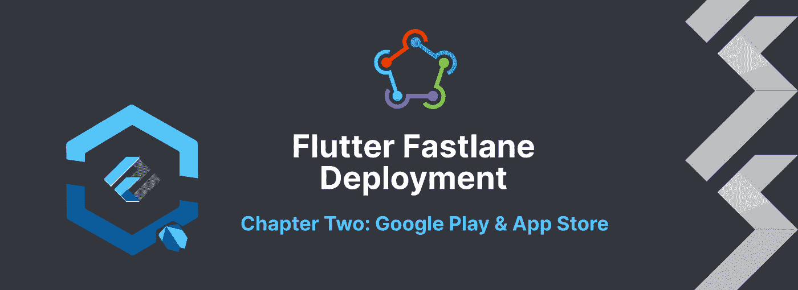
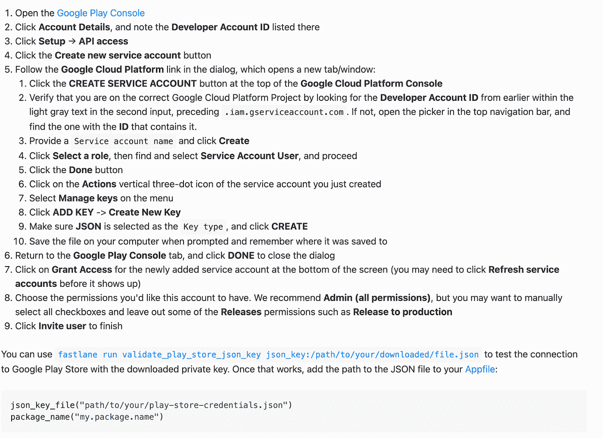

# 将浪子部署到 Google play & App store(简单方法)

> 原文：<https://itnext.io/flutter-fastlane-deployment-to-the-google-play-app-store-easy-way-baa1f491cc51?source=collection_archive---------1----------------------->

> 因为时间是至关重要的，我们都喜欢自动化流程

在[浪子部署](https://medium.com/itnext/flutter-fastlane-deployment-to-the-firebase-app-distribution-easy-way-d5ca2fbdcdf9)的上一篇文章中，我们介绍了 firebase 应用程序分发的部署。本文在很大程度上依赖于第一个，所以请在继续之前浏览第一章。这又是一个简单的方法，因为。env 文件和其他脚本可能没有优化，但我认为这是帮助初学者更好地理解它的方法。

我们将在 Google Play 和 App store 上的 Testflight 上讨论内部测试轨道的部署，因为我仍然认为应该从那里下载生产应用程序，并在更新上线前进行测试🙂

# Google Play 商店

我们已经有了带有凭证的. env.development 文件，它在上一篇文章中有所解释(如 firebase 凭证文件),所以现在我们只需添加. env.production 文件:

之后，我们需要一个 JSON 密钥文件，它可以让我们访问在[官方文件](https://docs.fastlane.tools/actions/supply/#setup)中解释的游戏商店，为了加快速度，我将添加一个截图:

我们已经为部署做好了准备，我们只需要用一个名为 deploy_beta 的新函数来更新 Fastfile，在这种情况下，该函数会将它上传到 google play 商店:

使用以下命令从 android 文件夹触发部署:

即使这样也应该以最基本的方式工作，正如你可以从脚本中看到的那样，只是部署了应用捆绑包，而不是图像、元数据、截图等。

# App Store 试飞

我们已经有了带有凭证的. env.development 文件，它在上一篇文章中有所解释(如 firebase 凭证文件),所以现在我们只需添加. env.production 文件:

正如我们在这里对 google play 所做的那样，我们还将创建一个 API 密钥来处理从 fastlane 到 app store 的认证，从 [testflight 文档](https://docs.fastlane.tools/app-store-connect-api/) :
创建一个 App Store Connect API 密钥

1.  在[用户页面](https://appstoreconnect.apple.com/access/api)中创建一个新的 App Store Connect API 密钥

*   有关更多信息，请访问[应用商店连接 API 文档](https://developer.apple.com/documentation/appstoreconnectapi/creating_api_keys_for_app_store_connect_api)
*   选择“密钥”选项卡
*   给你的 API 键一个合适的角色来完成手头的任务。你可以在 App Store Connect 的[权限中了解更多关于角色的信息](https://developer.apple.com/support/roles/)
*   记下发行者 ID，因为您将在下面的配置步骤中需要它

1.  下载新创建的 API 密钥文件(`.p8`)

*   页面刷新后，无法再次下载该文件

虽然应用程序管理员或开发人员角色应该足够了，但如果需要，您可以使用管理员权限创建一个密钥。

重要提示:将密钥存放在安全的地方！

我们现在已经拥有了凭证方面所需的一切，现在我们只需要用 deploy_beta 函数更新我们的 Fastfile。

使用以下命令从 ios 文件夹触发部署:

第二章结束

这是通过 fastlane 自动部署到 Google Play 和 App Store 分发的第一个简单设置。您已经可以使用 GitLab runner 来处理这个问题，但是在下一篇文章中，我们将介绍 GitLab runner 并优化我们的。环境文件和凭据。现在，我们已经介绍了通过从根文件夹运行命令部署到应用程序分发、Google Play 商店和应用程序商店。只要运行 deploy-prod.sh:)，第一次部署完成后，您就会看到笑脸