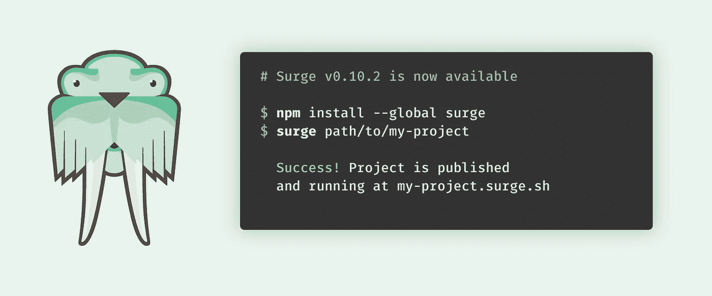
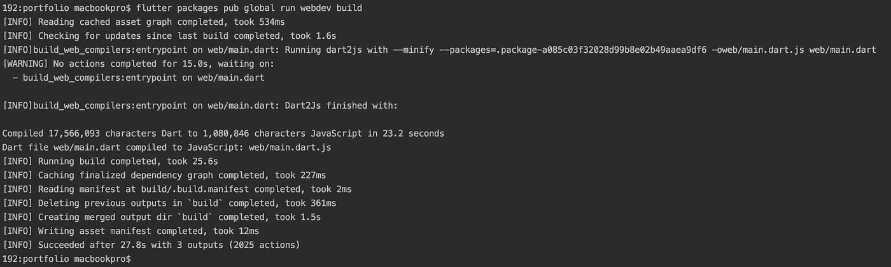
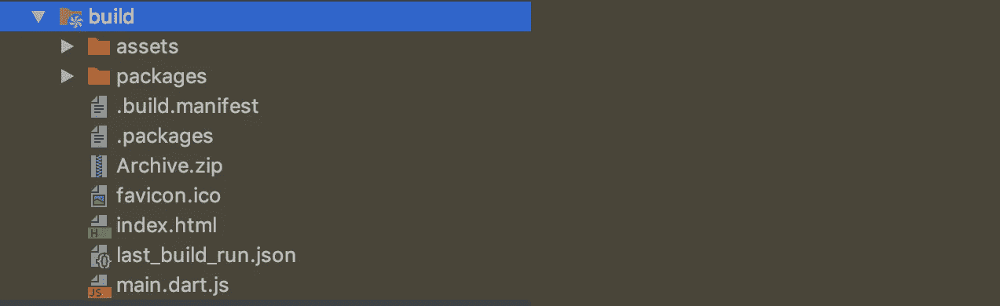
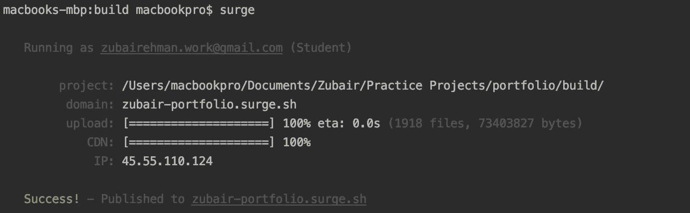

# Flutter For Web:部署 Web 应用程序的完整指南

> 原文：<https://itnext.io/flutter-for-web-a-complete-guide-to-deploy-a-web-application-3fa9463377a8?source=collection_archive---------2----------------------->



来源:[https://miro . medium . com/max/1838/1 * e 2 omusxltd 8 e 2 tjie 3 zcjg . png](https://miro.medium.com/max/1838/1*E2oMUSXlTD8E2TjIE3ZCJg.png)

Flutter 于 2017 年 5 月在谷歌 I/O 上首次宣布推出 alpha 工具包，并于 2018 年在谷歌 I/O 上推出了 1.0 版本，并推出了一款未来的新产品，名为*蜂鸟*。我们都很兴奋，迫不及待地等待它的发布日期，在 2019 年 5 月 7 日的 Google IO 2019 上，谷歌终于宣布了 Web 预览版 **Flutter 的上市。**

# 介绍

这篇文章是我第一篇关于 Web 的 [**Flutter:创建&运行 Web 应用程序**](https://medium.com/@zubairehman.work/flutter-for-web-c75011a41956) **的完整指南的延续。**在本文中，我们将学习如何在 [**Surge**](https://surge.sh/) **上为 web 应用程序构建和部署 flutter。Surge** 是一款面向前端开发者的静态网络发布工具。这是开发人员将静态 web 应用程序发布到产品中的最佳方式。

> *要了解更多关于 surge 的信息，请点击链接开始:* [***开始使用 Surge***](https://surge.sh/help/getting-started-with-surge)

# 构建和部署

所以不要再拖延了，让我们开始吧。

通过将当前目录更改为项目所在的目录，在终端中打开项目，并执行以下命令。

```
$ webdev build
```

> *注意:如果你配置* `*webdev*` *直接运行有问题，试试:* `*flutter packages pub global run webdev [command]*` *。*

终端的预期输出是这样的:



执行该命令后，您将能够看到在您的项目文件夹中创建了一个名为 **build** 的新文件夹，其中包含部署 web 应用程序所需的所有文件。



现在，我们将部署该文件夹。部署 flutter web 应用程序的方法有很多种，我将使用的方法是 S **敦促**。

它是一个 npm 包，帮助将静态站点部署到远程 URL。它又快又简单又免费。有了 Surge，你就可以轻松快速地上网了。

首先使用 **npm** 安装命令行工具，然后在你希望发布到网络上的任何目录中运行 surge。您需要做的就是开始:

1.  首先，确保你有一个最新版本的[](http://nodejs.org/)
2.  **然后，通过运行以下命令，使用 **npm** 安装 Surge:**

```
$ npm i -g surge
```

**这个命令将在您的系统上全局安装 surge，因此您可以在任何地方使用它。**

> ***您可能需要在该命令前加上* `*sudo*`**

**现在，从**构建**目录中运行`surge`，将该目录发布到 web 上。要将您的目录更改为 **build** 目录，首先执行以下命令:**

```
$ cd build
```

**然后运行`surge`发布 **build** 目录:**

```
$ surge
```

**现在将运行浪涌命令。第一次运行此命令时，会要求您创建一个帐户。输入您的电子邮件并选择密码。这是一次性要求。浪涌将显示一个自动生成的子域名。将光标移至域名，然后键入任何您想要的名称。完成后，按 enter 键，surge 将自动上传和部署网站，并将其映射到其 CDN。**

****

**恭喜你！你已经成功地用 Flutter 创建了一个网站，并将其部署在互联网上，让全世界都可以看到。你可以通过终端输出中的 surge 提供的远程 URL 来浏览你的网站，在我的例子中是这样的:[http://zubair-portfolio.surge.sh/#/](http://zubair-portfolio.surge.sh/#/)**

**如果您不希望项目的 url 包含 surge.sh 部分，您可以购买一个自定义域并配置您的项目来使用它。要了解更多关于添加自定义域名的信息，请点击链接:[https://surge.sh/help/adding-a-custom-domain](https://surge.sh/help/adding-a-custom-domain)**

**我迫不及待地想看到这项技术如何随着时间的推移而发展壮大。**

# **有用的资源**

**[](https://github.com/zubairehman/Portfolio-Demo) [## zubairehman/投资组合-演示

### 使用 flutter 为 web 构建投资组合。点击下面的链接，了解有关如何创建和部署 web…

github.com](https://github.com/zubairehman/Portfolio-Demo) [](https://github.com/zubairehman/Portfolio-Demo-1) [## 祖拜拉赫曼/投资组合-演示-1

### 使用 flutter 为 web 构建投资组合。点击下面的链接，了解有关如何创建和部署 web…

github.com](https://github.com/zubairehman/Portfolio-Demo-1) [](https://github.com/flutter/flutter_web) [## 颤动/颤动 _ 网

### 将您的 Flutter 代码带到 web 浏览器中。通过创建一个关于…的帐户，为 flutter/flutter_web 开发做出贡献

github.com](https://github.com/flutter/flutter_web) [](https://flutter.dev/web) [## 腹板颤振

### 宣布 web 版 Flutter 的预览版。

颤振. dev](https://flutter.dev/web) 

***这篇文章就到这里，如果你喜欢这篇文章，别忘了拍拍手👏尽可能多的表达你的支持，留下你的评论并与你的朋友分享。*****