# 颤振形式性能

> 原文：<https://itnext.io/flutter-form-performance-19c79da176a6?source=collection_archive---------1----------------------->


*我对一个简单形式如何在颤动中表现的看法*

> 关于颤振性能说了很多，真的那么好吗？让我们来找出答案。
> 
> 我已经做了一个表格，并对这些字段进行了验证，例如所有字段都是强制性的，我们将看看应用程序是否能一直保持 60fps 的承诺。60fps 通常转化为 16 毫秒的帧渲染。

# **先决条件**

> 你需要熟悉这种颤动。你需要了解颤振体系结构。必须注意抖动线程，尤其是 UI 和 GPU 线程。在系统中安装 Vysor 很好，它有助于镜像你的手机。

# ***你会做什么？***

我们将用一些基本的验证来制作这个表格星球上最简单的应用程序，然后试着保存它。我们将在应用程序的生命周期中监控其性能。

> `**Note:** We have used Nokia 8.1 for this test, it is possible in high-end devices it may perform even better.`

# ***app 最后看起来怎么样？***

这可能是你能想象到的最简单的应用程序，下面是它的样子


简单的颤振应用程序

# **您将使用什么工具来衡量绩效？**

为此，我将使用 flutter 开发工具。它有许多很棒的特性，可以很容易地集成到代码库中，没有太多的麻烦。

# **如何打开 Flutter dev 工具？**

为了打开开发工具，您需要在您的系统中安装开发工具，下面是在您的系统中安装开发工具的步骤，

## **第一步:**

创建一个`launch.json`文件，使颤振模式设置为`"Profile”`，样本文件如下所示。

```
{"version": "0.1.0","configurations": [ { "name": "Flutter", "request": "launch", "type": "dart", "flutterMode": "profile" } ]}
```

## **第二步:**

如果您的系统中安装了`pub`，请在您的终端中运行这个命令，

```
pub global activate devtools
```

如果您的系统中安装了`Flutter`，请在终端中运行这个命令，

```
flutter pub global activate devtools
```

## **第三步:**

启动开发工具应用服务器

这里给出了两种启动 dev 服务器的方法，

***方式一:***

```
pub global run devtools   # If you have `pub` on your path.
```

***方式二:***

```
flutter pub global run devtools   # If you have `flutter` on your path.
```

该命令成功后，您将看到如下所示的输出，

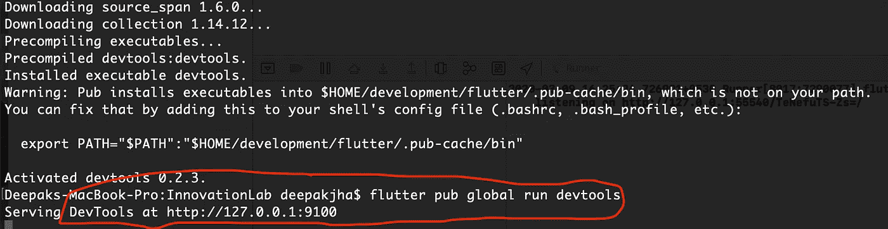

现在，这个 URL 必须在这样的浏览器中打开，

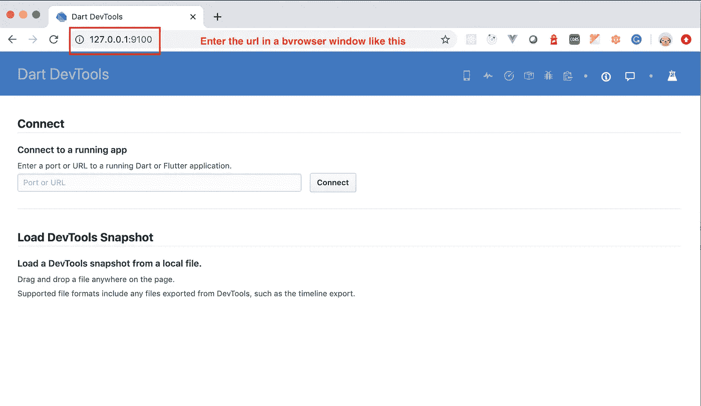

颤振开发工具

## **第四步:**

现在您需要运行您的应用程序进行调试，

```
cd path/to/flutter/app
flutter run --profile
```

运行此命令后，您将在控制台中看到如下所示的输出，因为下面屏幕截图中突出显示的文本显示了一个 URL，该 URL 将用于进一步调试应用程序。

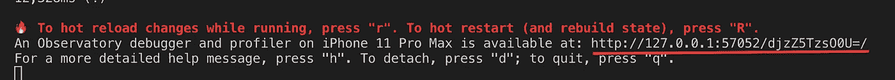

使用这个 URL 并将其输入到步骤 4 中打开的开发工具中，

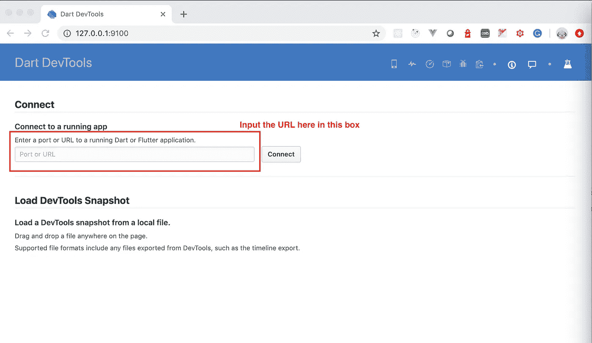

## **第五步:**

为了总结上面给出的步骤，下面是您需要打开下面给出的工具的顺序。

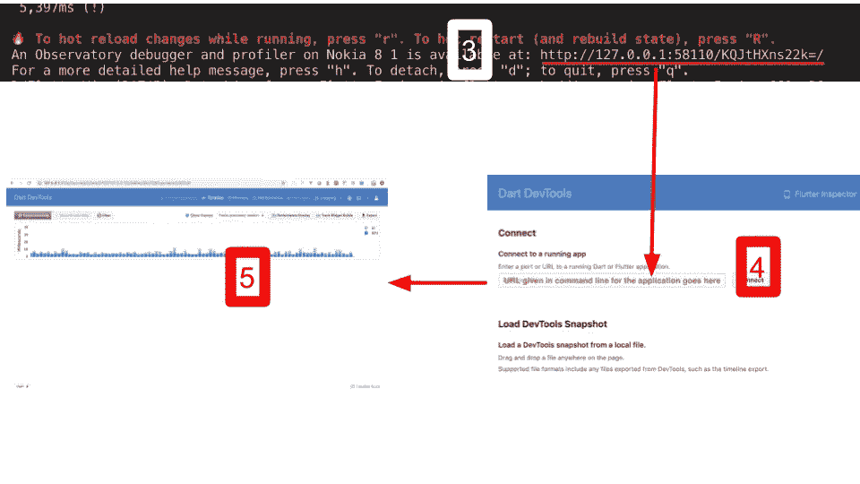

如何衡量未来的绩效

现在我们准备好了，让我们开始吧。让我们看看我们的应用程序在性能方面有多好。

# **我们将按照以下标准衡量绩效，**

1.  *滚动期间，*
2.  *验证期间，*
3.  *在弹出期间，*
4.  *在输入事件期间，*
5.  *航行中。*

此外，我们将看到这个小应用程序的内存配置文件，我们还将记下应用程序的大小。

# flutter 会达到我们的期望吗？让我们来找出答案。

1.  *滚动期间，*

我已经滚动应用程序，使 mi 可以在可用的视窗中看到所有的字段。我可以看到，在这种情况下，性能足够好。

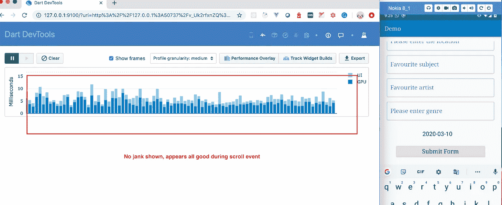

颤振涡卷性能

没有显示红色条。

2.*验证期间，*

应用程序中的所有字段都是必填的，我会运行一些测试，以便当一个必填字段为空，当所有必填字段为空。

所有必填字段都留空，总共有 6 个字段。两个红条还不错，

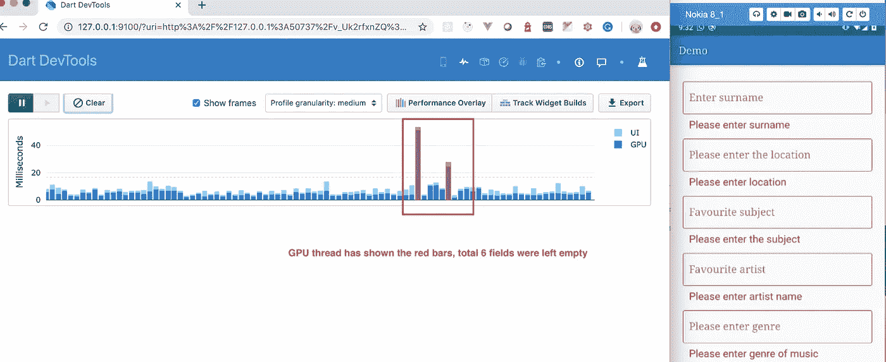

颤振验证性能

一个必填字段将留空，

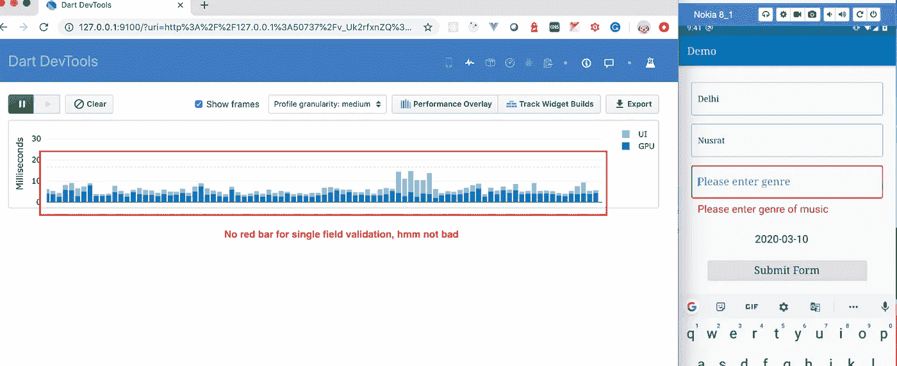

颤振验证性能

3.*弹出期间，*

我有一个在应用程序中输入日期的日期选择器，让我们看看当一个日期选择器弹出窗口显示时的性能如何，

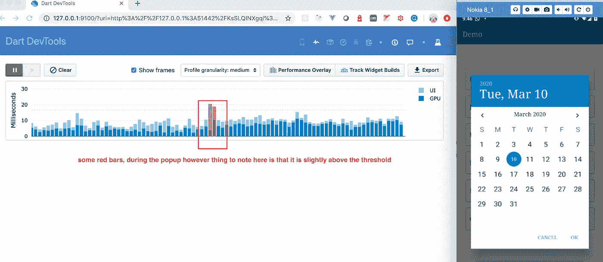

颤振弹出性能

值得注意的是，超过了 16fps 的阈值，这稍微超出了标记，但这并不是一个大问题。

4.*在输入事件期间，*

当我在第一个字段中输入六个字母长的名字(我的名字:)时，我看到没有显示红色条，

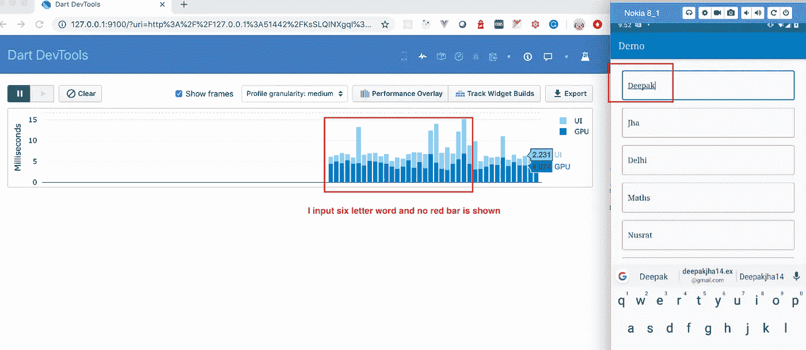

颤振输入事件性能

5.*航行期间，*

当所有的表单字段都被填写后，在表单提交时，它允许进入下一个详细页面，这被称为导航。

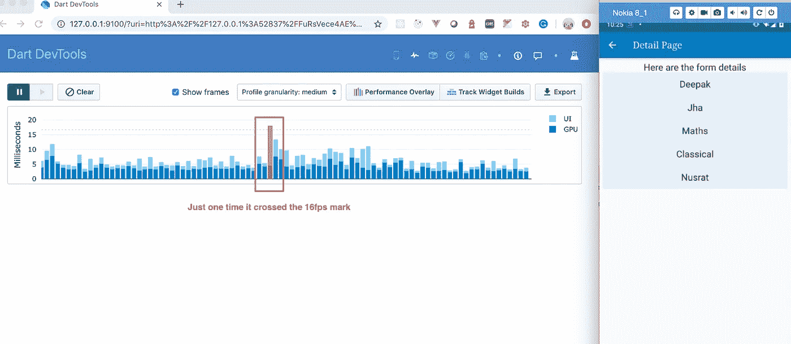

颤振导航性能

# 我们能看看这个应用程序背后的代码吗？

是的，代码可以在，

[](https://github.com/deepakjha14/simpleflutterapp) [## deepakjha14/simpleflutterapp

### 一个新的颤振项目。这个项目是颤振应用的起点。一些帮助您入门的资源…

github.com](https://github.com/deepakjha14/simpleflutterapp)