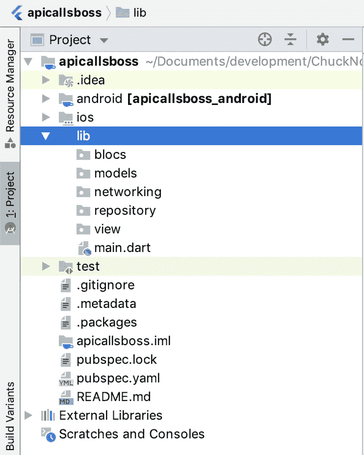
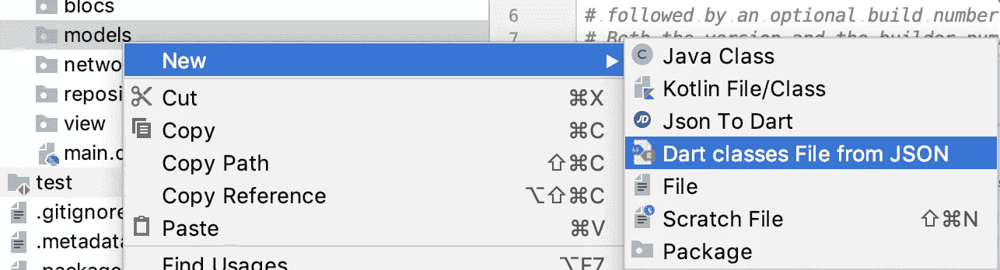
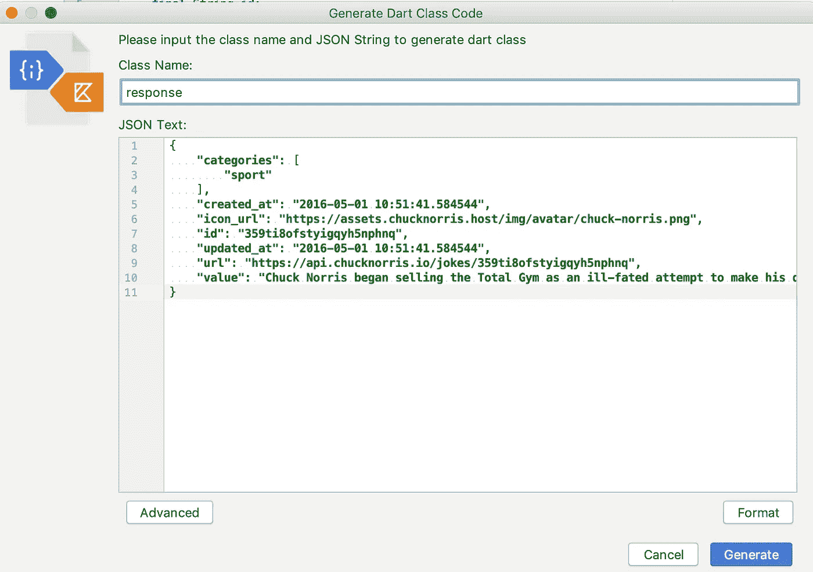

# 颤振:像老板一样处理你的网络 API 调用！

> 原文：<https://itnext.io/flutter-handling-your-network-api-calls-like-a-boss-936eef296547?source=collection_archive---------0----------------------->


如果说有一项技术真的让我起鸡皮疙瘩，那就是 Flutter。一种适用于所有平台的语言:桌面、网络、iOS 和 Android。谷歌真的做了一些不可思议的事情来创造这个。我坚信这项技术将会取代它，如果两年前它还没有出现的话。

OMG，扑！！

我想在这篇文章中介绍一些东西，这样任何开始使用 Flutter 的人都可以在您的项目中快速轻松地使用他们的 API 网络调用。

我们将在 Flutter 中使用[这个端点](https://api.chucknorris.io/)创建一个小而有趣的 Chuck Norris facts 应用程序。我将在下面的教程中介绍这些内容:

*   块架构和项目设置
*   API 调用设置
*   回购和集团
*   用户界面

好的——让我们直入主题吧。

**BLOC 架构和项目设置:** 所以，取代 MVVM 做颤振的基本架构模式是 BLOC。它们几乎是相同的，除了 BLOC 模式给你的是一个可以通过[流](https://dart.dev/tutorials/language/streams)而不是 ViewModel 添加新数据来更新的数据流——数据以这些[流](https://dart.dev/tutorials/language/streams)的形式从 BLOC 流向 UI，反之亦然。这里有一个关于 streams [的精彩介绍](https://medium.com/flutter-community/flutter-stream-basics-for-beginners-eda23e44e32f)。


集团架构

让我们希望你已经完成了几个令人激动的项目，并对它有所了解。使用您最喜欢的 IDE，无论是 Visual Studio 还是 Android Studio，启动您的新项目(您也可以通过终端*flutter create apicalls boss*来完成)。

```
flutter create apicallsboss
```

我个人的偏好是 Android Studio。因此，继续前进，在 Android Studio 中创建一个新的 Flutter 项目，并将其命名为您想要的任何名称。我称之为“apicallsboss”。

创建完项目后，我们需要设置我们的包:
命名为“blocs”、“models”、“networking”、“repository”和“view”，如下所示。他们所有人都很清楚他们将举办什么样的课程，随着我们的深入，这将变得更加清晰。我建议在所有新的 Flutter 项目中使用这种架构，因为您将能够正确、轻松地分离和管理所有的业务逻辑。



程序包结构

接下来，让我们添加依赖项。对于这个项目，我们需要的是我们的网络调用的 http 库。打开 **pubspec.yaml** 文件和
插件**http**；^0.12.0+1 如是说:

最后运行 flutter packages get 或者在 Android Studio 中做一个“packages get”。

**网络设置** :
现在是真正有趣的部分，女士们先生们。
我们将连接到这个 API[https://api.chucknorris.io/](https://api.chucknorris.io/)，它根据某些类别生成随机的查克·诺里斯笑话。

**从 JSON 生成你的模型** :
从 [***这个在线工具***](https://javiercbk.github.io/json_to_dart/) ***或者使用这个插件***for Android Studio[*此处*](https://plugins.jetbrains.com/plugin/11460-json2dart) *或者* [*此处*](https://github.com/typ0520/JsonToDartClass)*****(Preferences-Plugins)*我喜欢这个工具，因为几秒钟之内，您就可以从您的端点用大块 JSON 创建所有的模型，而无需编写一行代码。****

*我们只会到达两个终点。*

```
*[https://api.chucknorris.io/jokes/categories](https://api.chucknorris.io/jokes/categories)
and
[https://api.chucknorris.io/jokes/random?category={category}](https://api.chucknorris.io/jokes/random?category={category})*
```

*第一个只返回一个简单的字符串列表，所以只需要一个模型来保存字符串列表。*

*卡盘类别模型*

*好，让我们开始第二个终点。转到`[https://api.chucknorris.io/jokes/random?category={category}](https://api.chucknorris.io/jokes/random?category={category})`并弹出类别变量的 sport。您应该会看到类似这样的内容。*

*这里是一个小魔术发生的地方。进入在线转换器或简单地右击你的“模型”包。*

****

*这就是你的下场。如果你在你的类的顶部插入了一个“包模型”,只要把它去掉就好了。*

*chuckResponsemodel*

*好了，现在是有趣的网络部分。
为了让我们的应用程序和 API 之间的通信数据流畅通无阻，我们需要三个 API 类来帮助我们。进入你的网络包。
右击并创建一个新的 Dart 类，并将其命名为**‘API provider’**。*

*这是我们的主要 API 提供者类，目前有一个 **GET** 和一些异常处理。如果您需要为自己的应用程序添加额外的方法，如 Post、Delete 或 Put。*

*现在让我们创建我们的**【客户异常】**类:*

*为了处理 UI 线程上的所有 API 响应，我们需要一个 API 响应类(不是模型)。*

*…我们做到了！我们所有的网络层类完成。坐下来休息一下，欣赏一下你目前所做的事情。唷！难以置信，你是一个传奇。:)*

*现在，让我们去完成我们的应用程序的其余部分。*

*让我们添加存储库和块类。我们的存储库类充当我们数据源的“中间人”或“网关”,基本上充当 UI 和数据提供者(API)之间的抽象。*

*我们只需要 2 个存储库类和 2 个 blocs，因为如前所述，我们只需要 2 个端点。*

*第一个存储库类将用于我们的类别列表:*

*Chuck 类别库*

*我们的第二个将用于我们的主要 chuck 响应。*

*卡盘仓库*

*集团( **B** 业务 **Lo** gic **C** 组件)。BLoC 表示与小部件(UI)对话的事件流。加载数据的块将通知 UI 小部件数据是否被加载、完成或者是否有错误。*

*我们的集团:*

*卡盘类别块*

*卡盘块*

*酷，是时候使用 UI 了！！*

*我喜欢把我所有的视图放在一起，所以把 ***main.dart*** 放到你的视图包中，但这完全取决于你。*

*我们将在对 Chuck categories UI 屏幕的 main.dart 调用中启动我们的应用程序，如下所示。*

*chuck_categories_view.dart*

*一旦所有这些都实现了，我们的类别将调用我们的' ShowChuckyJoke '屏幕。*

*一旦所有事情都完成了，你应该以这样的方式结束。*

*完成的项目。*

*完成的项目可以在这里找到:*

*[](https://github.com/rgodlontonshaw/apicallsboss) [## rgodlontonshaw/apicallsboss

### API Flutter 调用教程像一个 Boss 演示应用程序，展示使用 Bloc 的 Flutter API 调用的用法…

github.com](https://github.com/rgodlontonshaw/apicallsboss) 

祝大家编码快乐，飘飘欲仙。:)我希望这对您的 API 调用有所帮助。

鸣谢:此处为最初的概念[向](https://medium.com/flutter-community/handling-network-calls-like-a-pro-in-flutter-31bd30c86be1)[和 **Sahil Kumar** 和](https://medium.com/@xsahil03x)致敬。

Ryan Godlonton-Shaw 是一名全职高级移动工程师@Platform45 和一名技术作家。

[](https://www.linkedin.com/in/ryangodlontonshaw/) [## Ryan Godlonton-Shaw -高级移动工程师-平台 45 | LinkedIn

### 查看 Ryan Godlonton-Shaw 在世界上最大的职业社区 LinkedIn 上的个人资料。Ryan 有一份工作列在…

www.linkedin.com](https://www.linkedin.com/in/ryangodlontonshaw/)*