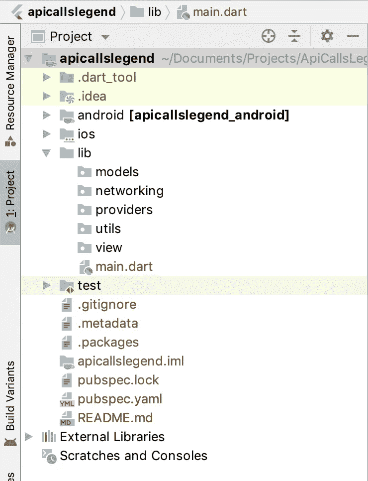
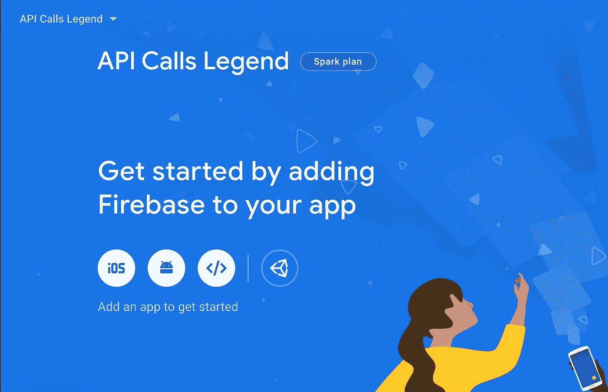
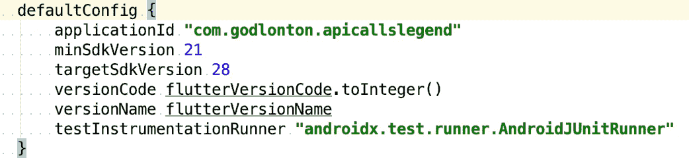
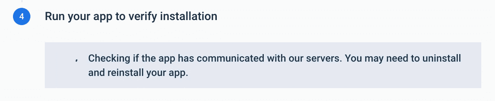
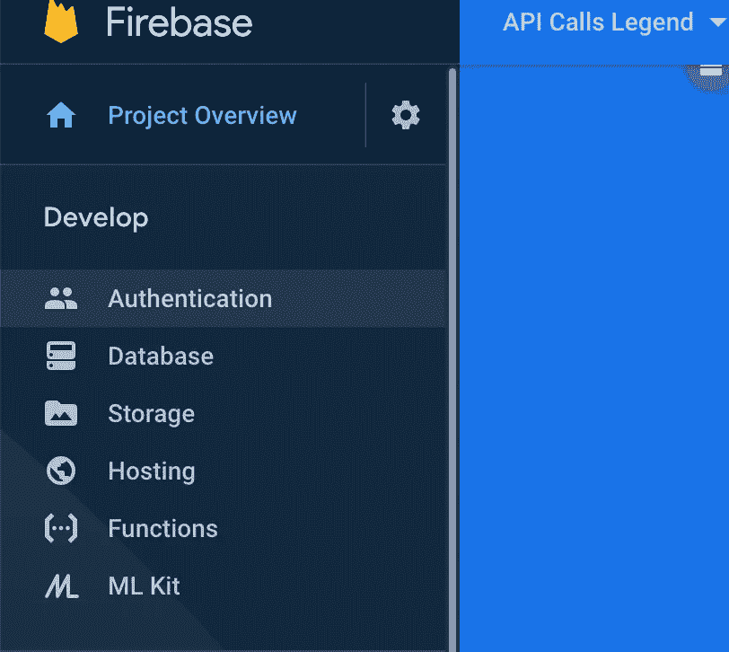
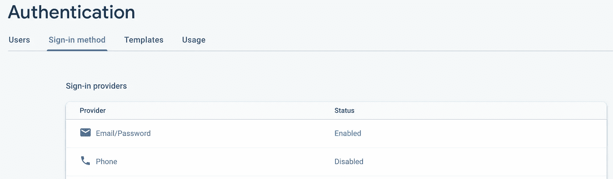

# Flutter:使用 Provider 像传奇一样处理网络 API 调用

> 原文：<https://itnext.io/flutter-handling-your-network-api-calls-like-a-legend-using-provider-8c652c0530e3?source=collection_archive---------0----------------------->


在我之前的 Flutter 文章中，我深入研究了利用 Bloc 架构和 Bloc 轻松处理和管理我们的 Flutter 网络 API 调用*。*

*在本文中，我想介绍一种不同的方法来管理和连接我们的 API 网络调用，使用 [**提供者**](https://pub.dev/packages/provider) **，**一个不可思议的状态管理库，即 ***更简单的*** 来使用 ***，更好的*** *来管理* 和 ***更简单的*** :)*

*如果我告诉你……*

***…有一种更好的方法来调用我们的 API。***

*有几个人要求我做一个 ***登录教程*** 。所以没有进一步的行动，让我们开始吧。我们将创建一个类似于我们之前创建的小应用程序，只是现在我们将使用 ***提供者*** 进行 API 调用，并使用[***Firebase***](https://firebase.google.com/)*和*几个很棒的附加组件添加*注册*和*登录认证*功能。***

*我将在本文中介绍的内容是:*

1.  ***供应商介绍***
2.  ***初始设置***
3.  ***Firebase 设置***
4.  ***Firebase 登录和注册***
5.  ***Chucky 车型***
6.  ***楚基供应商***
7.  ***卡盘供应商预装器***
8.  ***Chucky 用户界面屏幕***

***注意:**
在你自己的项目*和*[**已完成的项目这里**](https://github.com/rgodlontonshaw/apicallslegendprovider) 看完这篇文章是个好主意，这样你就能彻底了解*所有的部分*是如何组合在一起的。*

*[](https://github.com/rgodlontonshaw/apicallslegendprovider) [## rgodlontonshaw/apicallslegendprovider

### 演示应用程序展示了 Flutter API 调用使用提供者和 Firebase 认证…

github.com](https://github.com/rgodlontonshaw/apicallslegendprovider) 

# 1.提供商简介

[Provider](https://pub.dev/packages/provider) 是我迄今为止发现的 Flutter 工具箱中最实用、最明智的状态管理包之一。

```
“A mixture between dependency injection (DI) and state management, built with widgets for widgets. It purposefully uses widgets for DI/state management instead of dart-only classes like Stream. The reason is, widgets are very **simple** yet **robust and scalable.**"
```

简而言之，提供者允许人们在任何给定的时间点向应用程序的其余部分公开、创建、监听和处置新的对象实例。真的厉害！* 

# *2.初始设置*

*启动 Android Studio。🔥
文件- >新建- >新建 Flutter 项目- > Flutter 应用- >下一步- >项目名称(我称之为“***apicallslegend***”)-选择项目的位置- >下一步- >在公司域名下你可以只使用你的姓氏或‘任何东西’。点击下一步。*

*接下来，我们将创建将在该应用程序中使用的所有包。将它们命名为“模型”、“网络”、“提供者”、“实用程序”和“视图”，如下所示。*

**

*包装*

*接下来，让我们添加一些必需的依赖项。*

*在你项目的`pubspec.yaml`文件中，我已经把这些人加了进去。*

```
***provider**: ^4.0.5+1
**http**: ^0.12.0+4*
```

*运行 flutter 包 get 或做一个“包 get”*

*对于那些想跳过本教程的 Firebase 认证部分的人来说，你可以直接进入第五章。
我还在应用程序中添加了一个“跳过登录”按钮。*

# *3.Firebase 设置*

*现在让我们进入我们完整的 Firebase 设置。
在您项目的`pubspec.yaml`文件中，添加。*

```
***cloud_firestore**: ^0.13.5
**firebase_auth**: ^0.16.0
**firebase_core**: ^0.4.4+3*
```

*   *转到[https://firebase.google.com/](https://firebase.google.com/)*
*   *点击**开始***
*   *点击 **+添加项目***
*   *创建项目(第 1 步，共 3 步)→
    输入项目名称→ " **API 调用图例"** →
    继续→(第 2 步，共 3 步)→继续→
    (第 2 步，共 3 步)选择帐户→创建项目。
    “您的新项目准备好了”→继续，您现在应该会看到此屏幕。*

**

*您可以将您的应用程序添加到 iOS、Android、Web 或 Unity。
我们暂时选择安卓。*

*   *选择**安卓图标***
*   *进入*安卓->app->build . gradle**
*   *选择***application id***(也要确保你的 *minSdkVersion* 至少是 21)复制粘贴到**“注册 app”**部分。*

**

*   *点击**注册** → **下载**→*Google-services . JSON*配置文件，并将其复制粘贴到 android- > app 文件夹中。*
*   *在你的*Android->**build . gradle*文件中添加 Firebase SDK
    添加这些依赖项*

```
*dependencies {
 classpath **‘com.android.tools.build:gradle:3.5.0’** classpath **“org.jetbrains.kotlin:kotlin-gradle-plugin:**$kotlin_version**”** *// Add the google services classpath* classpath **‘com.google.gms:google-services:4.3.3’** }*
```

*把这个加到你的*Android->*app->*build . gradle*底部*

```
*apply plugin: ‘com.google.gms.google-services’*
```

*这在你的依赖关系中*

```
*implementation **'com.google.firebase:firebase-analytics:17.2.2'***
```

*点击下一个的**，您将看到下面的屏幕。👇***

**

*在模拟器或你的手机和 viola 上运行你的 Flutter 项目！您应该会看到这个屏幕。👇*

**

*嘣！！就是这样！！我们的项目现在可以使用我们的 Firebase 服务了，因为我们已经将它添加到控制台中，并将 Firebase SDK 添加到我们的项目中。*

*火焰基地。哇！*

# *4.Firebase 登录和注册*

*进入我们的下一步，实际实施。💪💪💪*

*我们现在需要去激活我们想要使用的登录方法。
在本教程中，我们将使用电子邮件和密码进行认证，尽管你*可以*使用电话、推特、谷歌等。*

*进入你的 Firebase 控制台，在你的项目面板中进行*认证*。*

**

*消防基地控制台*

*点击**登录方式，**然后启用**邮箱/密码**。*

**

***用户界面屏幕+功能***

*现在进入我们的两个 UI 屏幕，实现登录和注册的功能。除了一些细微的修改外，它们几乎是完全相同的。*

*注册屏幕*

*注册屏幕*

*登录屏幕*

*正如你在两个界面上看到的，我们初始化了 Firebase 实例，以备后用。很简单。*

***final _ authFirebase**= firebase auth。*实例*；*

***功能***

*注册:
所以在我们的注册界面中，你会在 GestureDetector 下的 _registerButton()中看到这段代码。*

```
***if** (**_formPageKey**.**currentState**.validate()) {
  setState(() {
    **isLoading** = **true**;
  });
  **try** {
    **final** newUser =
        **await _authFirebase**.createUserWithEmailAndPassword(
            email: **_userEmail**.**text**, password: **_userPassword**.**text**);
    **if** (newUser != **null**) {
      Navigator.*push*(
        **context**,
        MaterialPageRoute(builder: (context) => LoginScreen()),
      );
    }
  } **catch** (e) {
    setState(() => **isLoading** = **false**);
    Commons.*showError*(**context**, e.message);
    **_pageKey**.**currentState**.showSnackBar(
        SnackBar(content: Text(**"Could not register."**)));
  }
}*
```

*我们首先验证我们的文本字段，然后我们设置一个状态来告诉我们的页面我们正在加载。然后，我们使用我们的 **_authFirebase 实例**用电子邮件和密码注册我们的用户。一旦你从“utils”文件夹(来自原始项目)中获取了所有需要的类，并运行你的应用程序，你就可以通过应用程序在 Firebase 上创建一个新用户了！👍*

*对于我们的登录:*

```
***if** (**_formPageKey**.**currentState**.validate()) {
  setState(() {
    **isLoading** = **true**;
  });
  **try** {
    **final** newUser =
        **await _authFirebase**.signInWithEmailAndPassword(
            email: **_userEmail**.**text**, password: **_userPassword**.**text**);
    print(newUser.toString());
    **if** (newUser != **null**) {
      _login();
    }
  } **catch** (e) {
    Commons.*showError*(**context**, e.message);
    setState(() => **isLoading** = **false**);
    **_pageKey**.**currentState**.showSnackBar(
        SnackBar(content: Text(**"Could not login."**)));
  }
}*
```

*类似的过程，除了现在我们使用 Firebase 的*signingwithemailandpassword*方法。*

*现在去导入***initializeproviderdatascreen***，这是我们将数据预加载到 ChuckyProvider 中的启动类。*

*这就结束了我们的 Firebase 认证位！我打赌你没想到会这么简单，是吗？干得好。*

# *5.Chucky 模型*

*好吧，现在开始我们的恰奇部分。*

***从 JSON 生成你的模型** :
如前所述，你可以通过 ***利用这个插件*** 为 Android Studio [*此处*](https://plugins.jetbrains.com/plugin/11460-json2dart) *或* [*此处*](https://github.com/typ0520/JsonToDartClass) ***(首选项—插件)*** 。从您的端点用大块的 JSON 创建您的所有模型，而无需在几秒钟内编写一行代码。*

*我们只会到达两个终点。*

```
*[https://api.chucknorris.io/jokes/categories](https://api.chucknorris.io/jokes/categories)
and
[https://api.chucknorris.io/jokes/random?category={category}](https://api.chucknorris.io/jokes/random?category={category})*
```

*一旦安装了插件，通过右键单击您的“模型”包->
New->Dart classes from JSON->键入一个类名并点击 generate，从有效负载端点复制并粘贴 JSON 数据。对这两个类都这样做，不要忘记添加非空检查/默认值，这样你将得到如下所示的两个类。*

*卡盘类别*

*卡盘响应*

# *6.Chucky 提供商*

*在您的 main.dart 文件中，将它添加到 your _MyAppState:
这是在您的应用程序中注册您的提供者。*

```
*@override
Widget build(BuildContext context) {
  **return** MultiProvider(
      providers: [
        ChangeNotifierProvider(create: (context) => ChuckyProvider()),
        ChangeNotifierProvider(create: (context) => ChuckyJokeProvider()),
      ],
      child: MaterialApp(
          title: **'Api Calls like a Legend with Provider'**,
          theme: chuckyTheme,
          home: SplashScreen()));
}*
```

*Chucky 提供商*

*Chucky 笑话提供商*

*我们这里的提供者本质上做一件事，一个 API 调用，得到一个响应，然后将响应数据弹出到相关的保存变量中。一旦从 API 获取了数据，就可以随时调用这些函数。*

*您的提供商可能有许多功能。比如说，在我们的 ChuckyProvider 中，我们想要更新 chuckCategories。*

*我们可以有这样一个函数。*

```
***void** updateData(ChuckCategories data) {
  **chuckCategories** = data;
}*
```

# *7.Chucky 提供程序预加载程序(InitializeProviderDataScreen)*

*我们的 **InitializeDataScreen** 调用 ChuckyProvider 并获取初始的 chucky 类别数据。如果你想为你的应用批量下载数据，你可以使用多个函数来调用和加载多个提供商。*

# *8.Chucky 用户界面屏幕*

*因此，在我们的*chucky _ categories _ view . dart*
中，我希望您在这里记下我们的初始状态。好了，我们现在要做的就是(这是理解提供者用法的基本**)进入我们的 ChuckyProvider，获取我们的 chuckCategories，然后将它赋给我们类中的 chuckCategories 变量。重要的是要注意，当我们加载我们的 ***初始化 ProviderDataScreen*** ☝️.时，我们已经调用了端点 API 来获取 Chuck 类别因此，chuckCategories 已经从 chuck provider 获得了所有数据，现在它的美妙之处在于，我们可以在任何时候通过调用这一行代码—
*provider . of<chuck provider>(****context****，听:* ***，从应用程序中的**任何地方**访问**已经加载的 chuck categories 数据*** ***恰克类别。*** *不需要 StreamBuilders，不需要 FutureBuilders(本例)。******

***这就是使用提供商的好处和本质。***

```
***@override
**void** initState() {
  **chuckCategories** =
      Provider.*of*<ChuckyProvider>(**context**, listen: **false**).**chuckCategories**;
  **super**.initState();
}***
```

***然后，我们使用来自 chuckCategories 的数据来构建我们的屏幕。***

***卡盘类别***

***查克笑话***

***对于我们的 Chucky 笑话屏幕，我们将使用 FutureBuilder 从我们的 ChuckyJokeProvider 获取数据，因为我们还没有初始化来自我们的***IntializeProviderDataScreen***的数据，因为我们需要用户从选择的类别中输入。***

***这里的美妙之处在于，一旦提供商加载了数据，我们就可以在应用程序的任何地方访问这些数据。***

***您应该会得到这样的结果:***

***传奇的 Chucky 提供商应用程序***

***女士们先生们，本章到此结束。我希望你能从这篇文章中更深入地了解如何在你的应用中更好地使用提供商。***

***快乐的编码，最重要的是快乐的飞舞。:)***

***完成的项目可以在这里找到:***

***[](https://github.com/rgodlontonshaw/apicallslegendprovider) [## rgodlontonshaw/apicallslegendprovider

### 演示应用程序展示了 Flutter API 调用使用提供者和 Firebase 认证…

github.com](https://github.com/rgodlontonshaw/apicallslegendprovider) 

Ryan Godlonton-Shaw 是一名全职移动工程师。***