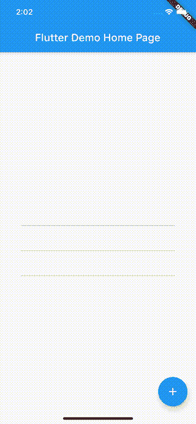

# 颤动——如何全局消除键盘

> 原文：<https://itnext.io/flutter-how-to-dismiss-keyboard-globally-a543452cfefa?source=collection_archive---------0----------------------->

当使用 Flutter 时，我们经常尝试模仿特定于平台的行为。例如，iOS 上的*键盘*通常会在用户点击文本字段之外的任何地方时自动隐藏。

复制这一点的一种方法是在包含 TextField 的每个屏幕中手动控制焦点；一旦它失去焦点，我们就放弃键盘。这是一个繁琐的解决方案，容易出错，并生成大量代码。

更好的方法是在我们的 Flutter 应用程序中全局设置此行为:

来自 **MaterialApp** 的**构建器**方法可用于在导航器上方和其他小部件下方插入小部件。我们简单地添加了一个“全局”**手势检测器**，它将为我们处理键盘解散。结果如下所示:

使用相同的“全局”手势检测器来关闭键盘的文本字段

☕️ [推特](https://twitter.com/GuiSilvaV)

☕️ [领英](https://www.linkedin.com/in/guilherme-silva-aa042a27/)

 [## guilherme-v -概述

### 北极代码库贡献者解散在 GitHub 上注册你自己的个人资料，托管代码，管理…

github.com](https://github.com/guilherme-v)