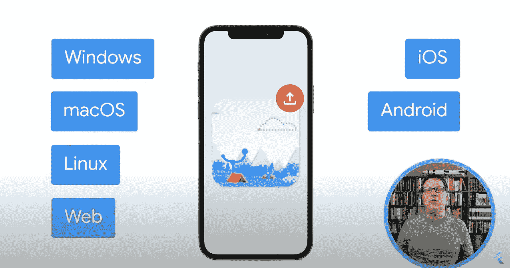

# Flutter 不再是一个跨平台的框架——它不仅仅是这样。

> 原文：<https://itnext.io/flutter-is-no-longer-a-cross-platform-framework-b53c87b14c39?source=collection_archive---------0----------------------->

嗨，我是卢克，我是软件开发人员。

因为我选择了一个非常大胆的标题，所以我需要详细阐述一下。仅供参考:我认为从技术上来说，Flutter 是一个跨平台的框架。

但是请容忍我...

自从 Flutter 2.0 发布以来，我开始看到炒作有点过头了。不要误解我，我是 Flutter 的忠实粉丝，我将永远是它的拥护者。

我在构建 iOS 和 Android 应用程序的日常工作中使用 Flutter。我每天都看到 Flutter 的优点和缺点，因为我正在开发的应用程序以前是用 Kotlin 和 Swift 原生编写的，具有你可以想象的所有额外功能:扫描/页面识别、pin/生物识别应用程序认证、通知、firebase 统计，以及非常先进的用户流。这就是为什么我觉得我可以对我们(飞人)的现状说几句话。

## 六个人

在今年的 Flutter Engage 中指出的一个主要问题是能够在六个平台上构建你的应用程序:iOS、Android、Mac、Windows、Linux 和 web。这真是个好消息！但是…

是的，你可以在 6 个平台上部署你的应用，但老实说，我不打算这样做。基本上，因为你应该根据平台使用不同的设计模式。我无法想象在不同的平台上部署我的应用程序。底部模态、应用程序栏、简单而清晰的列表会让人感觉很不协调？这不是用户对更大设备的期望。通常在移动设备上有效的东西在桌面上无效，反之亦然。

我们亲爱的朋友[菲利普·赫拉切克](https://medium.com/u/696ae61bc6e2?source=post_page-----b53c87b14c39--------------------------------)在他的 Flutter Engage 演讲中谈到了这位神秘的设计师兼开发商。在这件事上，我完全同意他的意见。更多的开发者应该意识到他们在做什么，而不是盲目地跟随他们的冲刺板。

> Scrum Sprint 是一个可重复的固定时间盒，在这个时间盒中，一个“完成的”最高价值的产品被创造出来。—维基百科

你绝对应该在这里看菲利普。回到 Flutter:

**不要再想你会创建一个应用程序，然后把它部署到任何地方。**

不如开始考虑如何模块化我可以写你的应用程序，以便在未来的项目中重用它们。给你举个例子。在我的公司，我们正在开发专注于用户数据的应用程序。这提出了创建自定义和高级调查的需要，我们不想每次都要添加新的问题来编写新的小部件。我们的方法——一个包含所有可能的调查逻辑的写作模块——允许我们在许多项目中使用它，而不需要每次都从头重写。

我举这个例子的意思是，当你在构建一个应用程序时，想想你的应用程序或整个业务关注的是什么。背后的商业逻辑是什么？

> 在计算机软件中，业务逻辑或域逻辑是程序的一部分，它对现实世界的业务规则进行编码，这些规则决定了如何创建、存储和更改数据。—维基百科

当你弄清楚了领域逻辑，你可以把它封装成模块，你可以在你的 Flutter 应用中使用。

> 但是卢克，为什么我需要这么大惊小怪？

问得好！很高兴你问了！

你可以构建**多个** Flutter 应用，它们拥有不同的用户流量，但关注相同的业务逻辑。

将你的 Flutter 应用程序分组(移动、桌面，如果需要的话，可能还有 web——可以让你专注于每个特定平台的最佳用户体验。

## 为什么我觉得你应该写多个 app？

Flutter 是一个很棒的工具，每个人都可以使用和构建他的应用程序，但它是一项相对较新的技术，主要用于小公司或个人开发人员。考虑到 Flutter 团队是如何向社区提问的，我认为这在不久的将来可能会改变。**【如果您想帮助他们，请填写一份** [**调查**](https://google.qualtrics.com/jfe/form/SV_eKYon5R5FfrS38G)

**我专业地开发了几个企业级应用。从我的经验来看，系统的每个部分都需要一个清晰的工作流程。后端、前端、开发运营等。但是为了这个论点，想象一下你的一个应用程序，为每一个平台构建，正在变得流行。由于它的高需求，你需要雇佣一个开发团队。将所有平台整合到一个应用程序中是不可能的。你能想象 10 多名程序员(在较小的公司中)在不同的平台上同时开发相同的代码库吗？这是一场管理噩梦。一个开发团队正在开发的桌面特性与移动团队正在开发的相冲突。**

**第二，应用程序的规模越来越大，有时每个平台都不需要软件包。现在在 Flutter 2.0 发布的时候，我第一次遇到了链式依赖的问题，因为不是所有的包都被更新到支持空安全或者有互斥的依赖。**

## **那么最后，为什么 Flutter 不是一个跨平台的框架？**

**看完这篇文章，你可以假设为什么我认为 Flutter 不是一个传统的跨平台框架。因为它是一个工具，为我们提供了为每个平台构建应用程序可能需要的一切。但我的拙见是，不应该是一个单独的应用程序，更像是由相同的业务逻辑驱动的一组应用程序。**

**另一件事是，当我们编写一个 Flutter 应用程序时，我们不会跨越任何平台😉如果我们用 Xamarin 或任何其他工具将它的代码翻译成本机元素，我们会这样做…但我们不会这样做。我们有一块空白的画布，在那里我们自己画一切。**

**如果我必须把 Flutter 比作其他东西，那就是游戏引擎，比如 Unity。我们不是专门写 Windows 或者 Mac 游戏的。我们是用 Unity 写，然后导出到特定平台。统一写作成了一件独立的事情。我们不会把每幅画都叫做跨家画布😉**

## **我保证这就是你等待的结局。**

**如果你正在读这篇文章:**谢谢！你太棒了！****

**在这篇文章的最后，我想说的是，这是我对多平台话题的想法，你的想法可以不同。如果你喜欢你所读到的，给这篇文章一些掌声，请在媒体上关注我，或者在:[推特](https://twitter.com/thatlukeurban)。**

****

**颤动接合艺术品**

**如果你错过了今年最大的颤振会议，你不知道我在这里说什么，你可以在这里找到整个事件。**

***让代码与你同在！***

**卢克(男子名)**

**我关于颤振的其他文章:**

*   **[doyouevenfutter？[EP.1]滚动到列表中的元素](https://blog.usejournal.com/doyouevenflutter-ep-1-b6f05c90b506)**
*   **[doyouevenfutter？[EP.2] API 枚举映射](https://luke-urban.medium.com/doyouevenflutter-ep-2-api-enum-mapping-888d2e72902c)**
*   **[doyouevenfutter[EP . 3]创建自定义图标字体](https://luke-urban.medium.com/doyouevenflutter-ep-3-creating-custom-icon-font-d892c4a2f21c)**
*   **[DoYouEvenFlutter [EP.4]在 2021 年使用这个 Flutter VSCode 设置提高您的编码效率](https://luke-urban.medium.com/doyouevenflutter-ep-4-boost-your-coding-productivity-with-this-flutter-vscode-setup-in-2021-60637f05a5c2)**