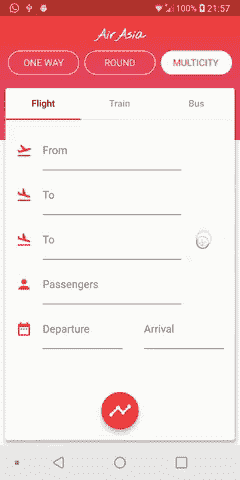
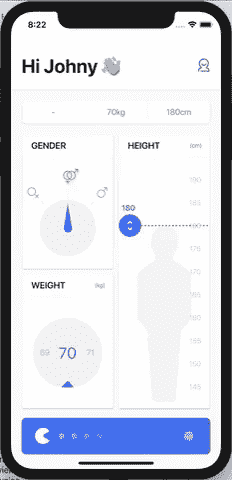
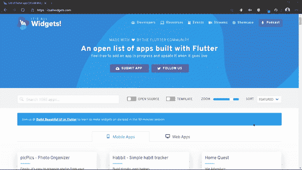
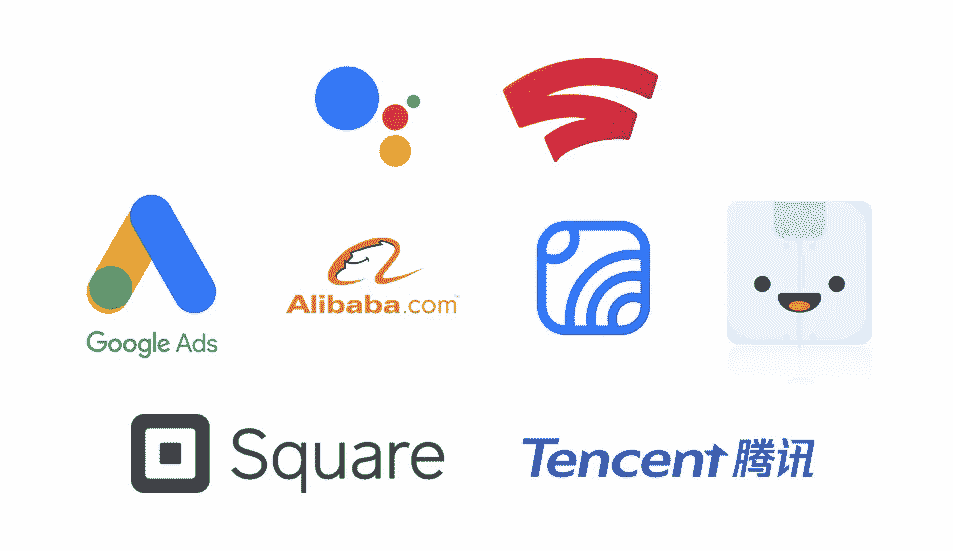

# Flutter 仅用于 UI 开发—改变我的想法！

> 原文：<https://itnext.io/flutter-is-only-for-ui-development-change-my-mind-f8ced7a6b57e?source=collection_archive---------0----------------------->

*“flutter 只针对 UI 吗？我看过所有关于创建 UI 和动画的教程和视频。Google 自称是 UI 工具包。那里的每门课程都在解释你可以使用 Flutter 开发 UI 的神奇之处…”*

我听到了很多类似上面的关于颤振的问题。所以，今天我将向你解释 Flutter 是否只适用于 UI？

# 让我们开始工作吧！

所以，这篇文章是关于与我们的 Flutter 社区的一位成员的对话，他正在搜索许多关于 Flutter 的答案，但是他不满意 Flutter 是只用于 UI 还是用于完整的移动应用程序开发。我写这篇文章是为了解释那次谈话😜

> 当你找不到任何话题时，你就是这样写文章的*😆*

# 什么是颤振？

如果你在谷歌上搜索这个问题，你可能会得到类似于*“Flutter 是谷歌开发跨平台应用的开源 UI 工具包”。*

我敢肯定，如果你突然出现在这个博客上，这意味着你完全知道什么是颤振。所以，这就是我不细说的原因。但是如果你是旋舞的新手，想要抢先一步，那么我会推荐你阅读这篇文章:)

# Flutter & UI 开发

考虑到所有这类困惑，让我们这么说吧。首先，我同意这种说法，YouTube 上的许多教程、课程和视频都在谈论如何创建这个动画和 UI 概念，以及如何创建一个漂亮的按钮等。嗯，那是因为 flutter 是专门开发来创建令人敬畏的 UI 设计的，这是使用 Flutter 的人的首要任务。这就是为什么他们更喜欢这种东西。

## 让我们看看 Flutter 只用于 UI

> 我们只用了大脑的 10 %~阿尔伯特·爱因斯坦

这种说法有两个问题。首先，阿尔伯特·爱因斯坦根本没这么说，其次，我们使用了大脑的 10%以上。但是你可能想知道为什么我要在这里引用这段话。嗯，你可以这样修改:

> 我们只用了 10%的颤动~马尔钦·萨莱克

如果你想形象化这种说法，那么请访问**，我相信你会惊讶于旋舞的实际潜力以及人们在做什么。但是这里仍然有几个例子可以帮助你😃**

****

**机票预订**

****

**动画**

****

**身体质量指数计算器**

> **归功于我最喜欢的 Flutter 开发者 MARCIN szaek**

**显然，在发现这样的设计后，我的反应是:**

**我😆**

# **Flutter 只针对 UI 吗？**

**是的，Flutter 是一个框架，它只用于完成 UI 或前端部分。**

> **那么人们是如何创建 Flutter 应用程序的呢？**

**事情是这样的， **Flutter** 是用 **Dart** 语言驱动的。所以，除了 UI，其他的都是纯 dart。也就是说，您为获取 API 响应或从数据库获取数据而编写的每个函数都将使用 Dart 编写。**

# **飞镖是飘起的先决条件？**

**有两种情况，如果你有计算机科学背景，并且你知道 OOP 之类的概念和少量的数据结构，那么没有必要专门学习 Dart，你可以和 Flutter 一起学习。然而，如果你不是技术背景，我会建议你学习 OOP 和其他语言的数据结构，比如 Java，或者你也可以学习 Dart，这样你就可以轻松地处理 Flutter。在我看来，这很容易做到:)**

> **那么人们只炫耀 UI 部分呢？不是任何后端故事**

**人们更喜欢使用 Flutter 的原因是，你需要有创造力来开发新的、漂亮的用户界面概念。考虑到数据库或 API 调用之类的东西，这个概念和其他语言一样，只是语法上有一点不同。每个人都知道有 https 请求，firebase 不是 SQL 数据库，它自己管理一切，SQLite 是本地数据库，你需要创建表和所有这些东西。因此，后端的工作几乎与任何其他平台相同，如 Android 或 iOS。这就是为什么 UI 上的教程比后端多的原因，因为 Flutter 的创意非常独特。**

**有道理吧？😃**

**是..！**

> **好吧！那么我们可以在我们的 flutter 应用中附加什么样的后端呢？**

**我知道以下是后端，但一如既往，你可以搜索更多:**

*   **Flutter 中的 Rest APIs**
*   **Firebase —云 Firestore 和实时数据库**
*   **MongoDB**
*   **sqf lite——类似于 SQLite，但它专用于 Flutter**
*   **SQLite—我们都知道的通用 SQLite 数据库**
*   **Hive —没有响应时间非常快的 SQL 本地数据库**

**还有更多…！**

# **颤振和移动应用程序开发**

**同样，如果你有兴趣知道你可以开发什么样的应用程序，拥有令人惊叹的 UI 和后端，请访问 [*它的所有小部件*](https://itsallwidgets.com/) ，你可以在 play store、apple store 和开源应用程序上找到应用程序，它们不仅仅是 UI showcase，而是人们使用 Flutter 开发的完整应用程序。**

****

**itsallwidgets.com**

**考虑到企业级，很多应用程序都是在 Flutter 中开发的，其中一些如下。**

****

**颤振被用于生产层面:)**

**现在，我希望你已经明白了:**

> **单独的 Flutter 只针对 UI 开发。**
> 
> **与 Dart 并肩作战可以让你获得完整的应用程序。**

**所以，每当有人说他/她是一个 Flutter 开发人员时，这并不意味着他们只为前端工作(或者他们确实是😜)一般来说，人们不会提到这样的事情，**

> **是的，我在 Dart 做手机应用开发。我用 Flutter 做 UI**

**这是因为没有省道的飘动就像在画布上绘画，现在每个人都知道没有省道的飘动几乎没有用。这就是为什么当我说我是一名 flutter 开发人员时，我是指我正在开发具有完整工作功能的 android 和 iOS 应用程序:)**

**所以，直接进入 [*flutter.dev*](https://flutter.dev/) 网站，开始为 android iOS 和网络开发一些漂亮的应用程序，这些应用程序拥有令人敬畏的用户界面和强大的后端，然后发布到 play store、apple store 上，当然也要和我分享😍**

## **结论**

**文章的目的不是讨论 Dart 是框架还是颤振？或者哪个是哪个的框架？要点是:**

> **人们使用 Flutter 开发 UI 如此之多，以至于看起来它的其他目的被忽略了，新手们认为 Flutter 就像 HTML 一样，只是帮助你完成前面的部分！**

**如果你对我是否开发了一个具有独特 UI 和后端的应用程序感兴趣。简而言之，一个完全成熟的工作应用程序。那好吧。可以阅读 [*文章*](/mvc-in-flutter-app-the-holy-quran-app-c0fd8ae31d67) 或者查阅 GitHub [*回购*](https://github.com/mhmzdev/The_Holy_Quran_App)**

**罚款我@mhmzdev**

****这就是所有的乡亲们…！用一些打我👏如果你认为我有所帮助，也许有一点点，只是一点点！😜****

# **谢谢大家和# happyFluttering💙**