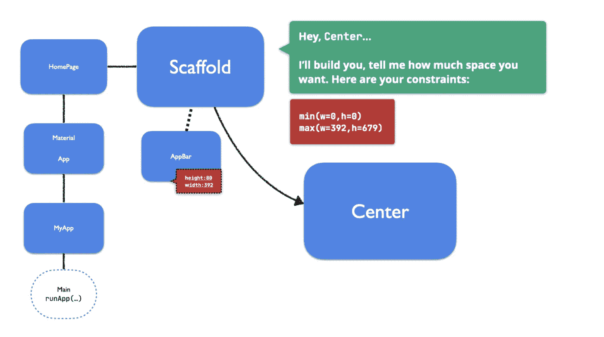
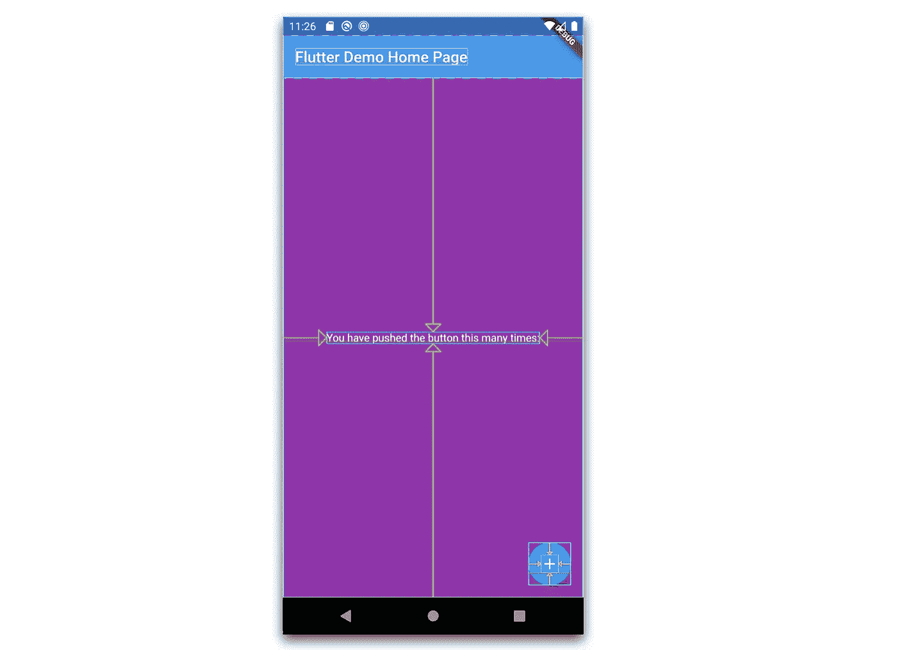
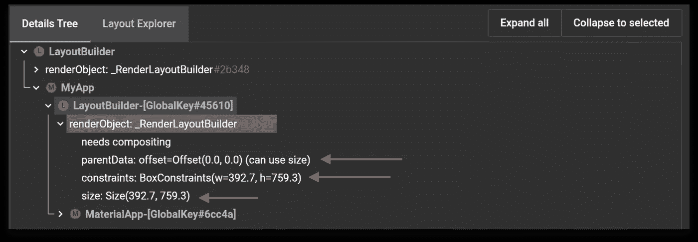
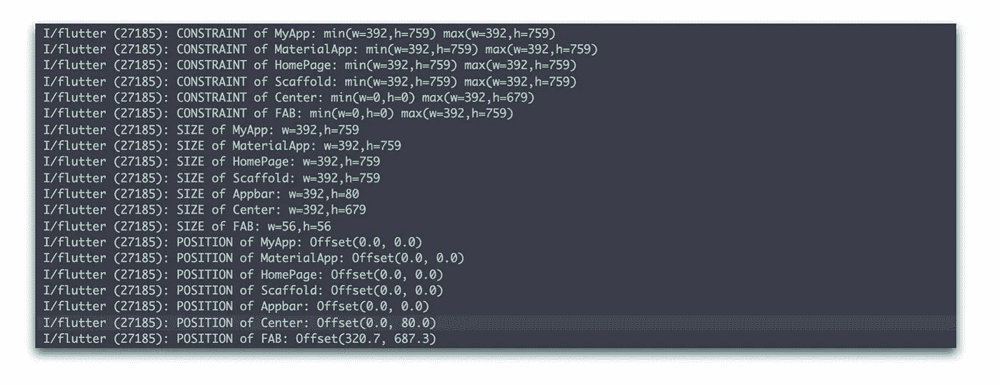
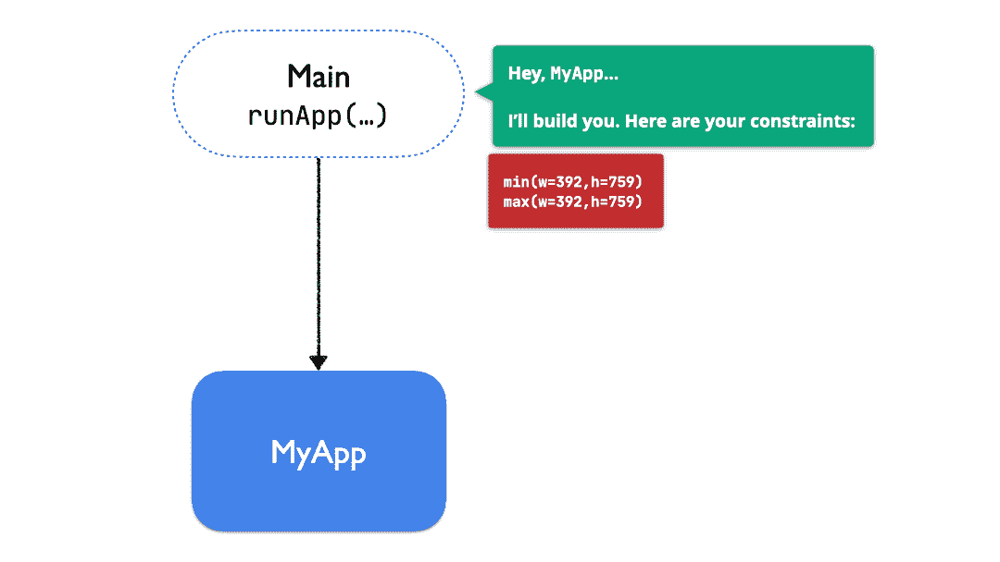
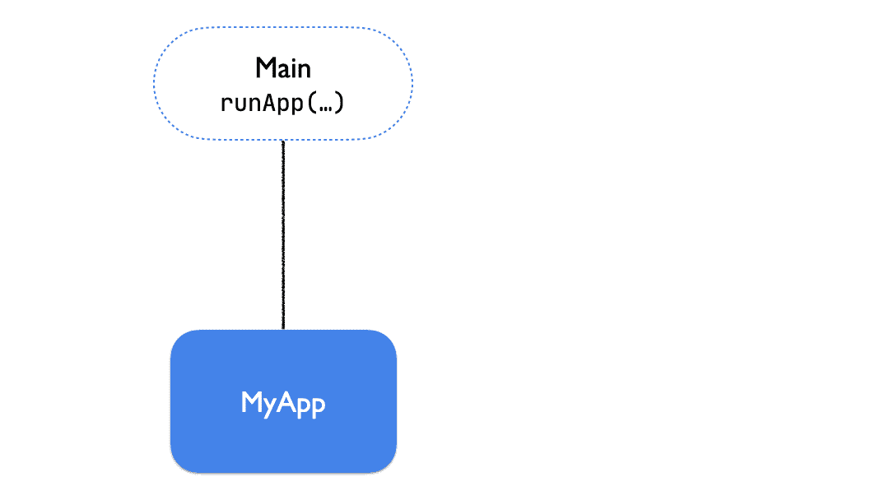
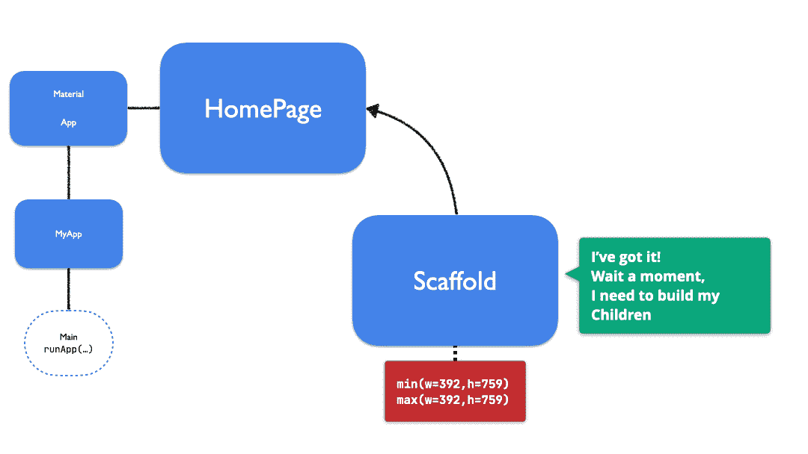
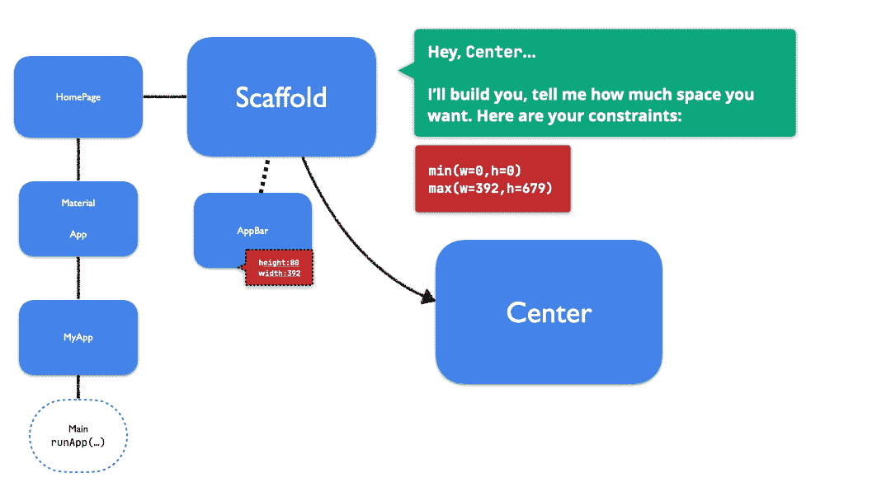
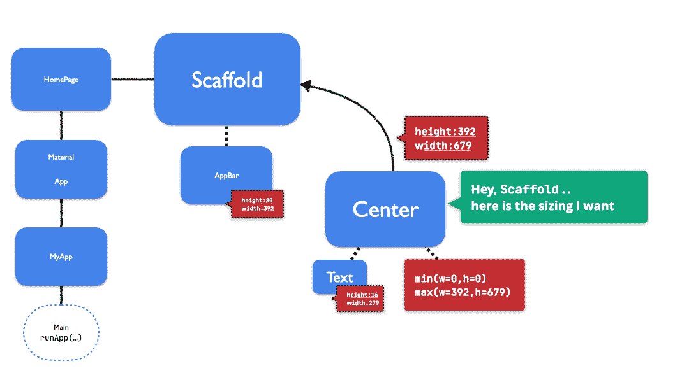
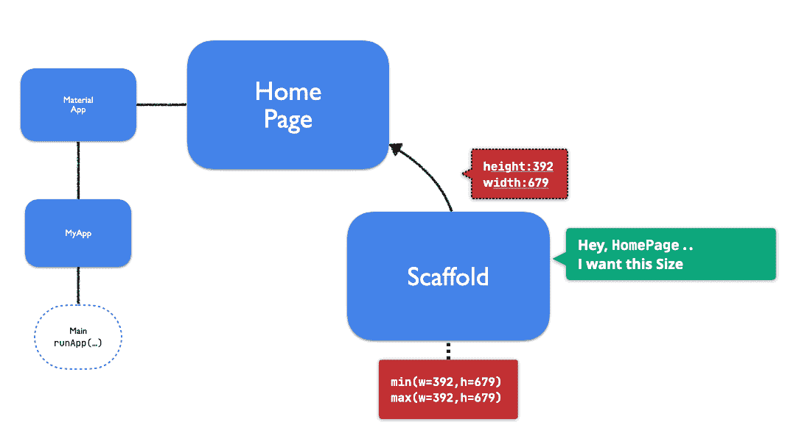

# 颤振——布局系统概述

> 原文：<https://itnext.io/flutter-layout-system-overview-c70bbe9ba909?source=collection_archive---------1----------------------->

最近，我决定专注于颤振的基本原理。这次我试图更好地理解“布局系统是如何工作的”，回答如下问题:

*   我的小工具的大小看起来不正确，这是怎么回事？
*   我只想把我的小部件放在一个特定的位置，但是没有任何属性来控制它，为什么？
*   我不断看到像`[BoxConstraints](https://api.flutter.dev/flutter/rendering/BoxConstraints-class.html)`、`[RenderBox](https://api.flutter.dev/flutter/rendering/RenderBox-class.html)`和`[*Size*](https://api.flutter.dev/flutter/dart-ui/Size-class.html)`这样的术语。这一切是如何联系在一起的？
*   有可能对布局系统如何工作有一个大致的概念？

本文无意对以上所有内容进行深入详细的描述。但是我们会对最重要的事情有一个很好的概述，试着想象任何可能的事情。

## “两阶段”布局系统和约束

首先，小部件是 Flutter SDK 的构建模块，但它们不负责将自己绘制到屏幕上。每个小部件都与一个负责该功能的`[RenderBox](https://api.flutter.dev/flutter/rendering/RenderBox-class.html)`对象相关联。这些框是 2D 笛卡尔坐标系，其中`[*Size*](https://api.flutter.dev/flutter/dart-ui/Size-class.html)`表示从原点的偏移。每个`[RenderBox](https://api.flutter.dev/flutter/rendering/RenderBox-class.html)`还将与一个`[BoxConstraints](https://api.flutter.dev/flutter/rendering/BoxConstraints-class.html)`对象相关联，该对象包含四个值:*最大|最小宽度*和*最大|最小高度*。一个`[RenderBox](https://api.flutter.dev/flutter/rendering/RenderBox-class.html)`可以选择拥有任何它想要的`[*Size*](https://api.flutter.dev/flutter/dart-ui/Size-class.html)`，但是它必须尊重那些价值观/约束。小部件的大小/位置完全取决于这些 RenderBox 的属性。与小部件构建小部件三的方式相同，渲染框构建渲染三。

我们可以认为 Flutter 的布局系统是一个 2 阶段系统。在第一阶段，框架遍历渲染树，将`[BoxConstraints](https://api.flutter.dev/flutter/rendering/BoxConstraints-class.html)`对象从父对象递归传递到子对象。它给了父母一种方式来决定/执行他们孩子的`[*Size*](https://api.flutter.dev/flutter/dart-ui/Size-class.html)`，按照他们喜欢的方式更新这些约束。换句话说，这是负责传播约束信息的阶段，让每个人都知道它的最大/最小可能大小。

一旦完成，第二阶段开始。这一次，每个`[RenderBox](https://api.flutter.dev/flutter/rendering/RenderBox-class.html)`将它选择的`[*Size*](https://api.flutter.dev/flutter/dart-ui/Size-class.html)`传递回它的父节点。父节点收集所有子节点的`[*Size*](https://api.flutter.dev/flutter/dart-ui/Size-class.html)`,然后使用这些几何信息在自己的笛卡尔系统中正确定位每个子节点。在这个阶段，父母知道每个孩子有多大，以及他们将被安置在哪里。

那么，最后，这一切意味着什么呢？

这意味着父母负责定义/限制/约束他们孩子的大小，并相对于其坐标系定位他们。换句话说，一个小部件可以选择它的大小，但是它必须始终遵守来自其父部件的约束。此外，小部件不知道它在屏幕上的位置，但它的父部件知道。

如果您对小部件的大小或位置有问题，请尝试查看(更新)其父级。

## 例子

好的，让我们想象一下，通过一个例子来理解发生了什么。但在此之前，这里有一些在调试约束时可能有用的术语:

*   如果****max(w | h)= min(w | h)***，那就是*紧紧约束着。**
*   **如果 ***min(w|h) = 0*** ，我们就有了*的宽松约束。***
*   ***If ***max(w|h)！*=无限**，约束为 ***有界。******
*   **若 ***max(w|h) =无穷大*** ，则约束为 ***无界。*****
*   **如果***【w | h】=无穷大*** ，则正好说成是**

******

***我们将使用的应用程序是初始应用程序模板的幻灯片修改版本。一般来说，您有两种简单的方法来检查小部件`[RenderBox](https://api.flutter.dev/flutter/rendering/RenderBox-class.html)`及其属性:***

1.  ***代码执行:我们可以在布局系统的第一阶段使用 LayoutBuilder 拦截`[BoxConstraints](https://api.flutter.dev/flutter/rendering/BoxConstraints-class.html)`传播，并检查约束。然后，在第二阶段完成后，我们使用键来获取小部件的`[RenderBox](https://api.flutter.dev/flutter/rendering/RenderBox-class.html)`，并能够检查`[*Size*](https://api.flutter.dev/flutter/dart-ui/Size-class.html)`、`Position`。***
2.  **或者使用 DevTools 小部件检查器:**

********

**打印常数**

**让我们一步一步来，看看发生了什么(这里我们将忽略`LayoutBuilders`)。**

****

**在我们的例子中发生的第一件事是`main`执行`runApp(..)`。这个函数检查屏幕的当前大小(在我们的例子中是 392:759 )，然后创建一个`[BoxConstraints](https://api.flutter.dev/flutter/rendering/BoxConstraints-class.html)`对象，保存将被发送到我们的第一个小部件(`MyApp`)的约束。注意 ***max|min 宽度和高度都等于***；因此，`runApp`使用了一个 ***紧*** 约束——通过这样做，`MyApp`在选择其尺寸时，除了填满屏幕上的全部可用空间之外，别无选择。**

****

**然后，约束沿着小部件树向下传播。`MyApp`、`MaterialApp`、`HomePage`和`Scaffold`都被告知相同的 ***紧*** 约束。所以所有将被强制填满整个屏幕。每个小部件都有机会向其子部件通知不同的`[BoxConstraints](https://api.flutter.dev/flutter/rendering/BoxConstraints-class.html)`(仍然尊重它已经收到的那个)。但是，在这种情况下，他们选择不这样做。**

****

**现在事情开始变得更有趣了。`Scaffold`通知`AppBar`它必须使用的`[BoxConstraints](https://api.flutter.dev/flutter/rendering/BoxConstraints-class.html)`，但是，这一次，它使用了一个 ***松散的*** 约束(min h = 0)。它给了`AppBar`一个机会去选择它想要的任何高度，但是它必须仍然使用 width = 390。**

**`AppBar`是一种特殊的小部件，叫做`PreferredSizeWidget`。这种类型的小部件*不会对其子部件施加任何约束。如果你试图使用`LayoutBuilder`来获得`Title`的约束，你会得到一个错误。相反，`AppBar`以首选/默认大小响应`Scaffold`:*高度= 80* ，*宽度= 392* (由接收到的约束强制)***

*在得到`AppBar`的`[*Size*](https://api.flutter.dev/flutter/dart-ui/Size-class.html)`的*后，*的`Scaffold`继续到它的下一个孩子:`Center`*

**

*好吧，这里发生了很多事情。让我们试着理解:*

1.  *`Scaffold`通知`Center`它的约束，让它选择 0 < w < 392 和 0 < h < 697 之间的任意尺寸。注意最大高度是 **759(屏幕最大高度)减去 80(app bar 选择的高度)***
2.  *`Center`转到其子节点`Text`，转发相同的约束/*
3.  *`Text`选择一个足以显示其数据的大小(279:16)，并回复`Center`。*
4.  *有了手中的几何信息`[*(Size*](https://api.flutter.dev/flutter/dart-ui/Size-class.html)*)*`,`Center`可以在笛卡尔坐标系中正确定位`Text`。作为父节点，`Center`有权选择它的子节点，在这种情况下，它决定将它集中起来。*

*流程继续进行:*

**

1.  *然后`Center`为自己选择一个尺寸，但是它不是只选择一个“足够”的尺寸(就像`Text`那样)，而是决定尽可能大，相应地，它已经收到的约束。*
2.  *`Scaffold`接收到`Center`想要的大小，然后流继续流向它的最后一个孩子:`FAB`*
3.  *`FAB`接收约束并将其首选尺寸(56:56)返回给`Scaffold`*
4.  *最后，`Scaffold`拥有在笛卡尔坐标系中定位每个孩子所需的所有几何信息。*

*最后，对`Scaffold`以上的所有微件重复该过程:*

**

1.  *尺寸信息继续沿着渲染树向上传播。*
2.  *每个小部件都使用这些信息在笛卡尔系统中定位每个孩子。*
3.  *`Scaffold`回答`HomePage`，那个回答`MaterialApp`，那个反过来回答`MyApp`。直到 if 最终再次到达`Main`。*
4.  *`Main`获得这个“最终”小部件，并最终将其绑定到屏幕上。*

*RenderBox 树最终绑定在屏幕上。我们有一个正在运行的应用程序。*

## *一些有趣的事情要记住*

*   *小部件不知道它在屏幕上的位置；它的母公司有。*
*   *小部件可以选择它想要的大小，但是它必须符合其父部件的限制。*
*   *约束向下传播，尺寸向上传播。*
*   *努力学习约束术语，它们以后可能会有用。*

*我希望这些能帮助你更好地理解颤振布局系统是如何工作的。如果这个帖子 cast🧙‍♂️是一个小光💡在这个阴影下，请考虑在 Twitter 上关注我:*

*☕️ [推特](https://twitter.com/GuiSilvaV)*

*☕️ [领英](https://www.linkedin.com/in/guilherme-silva-aa042a27/)*

* [## guilherme-v -概述

### 北极代码库贡献者解散在 GitHub 上注册你自己的个人资料，托管代码，管理…

github.com](https://github.com/guilherme-v)  [## 颤动——如何全局消除键盘

### 当使用 Flutter 时，我们经常尝试模仿特定于平台的行为。比如 iOS 上的键盘…

itnext.io](/flutter-how-to-dismiss-keyboard-globally-a543452cfefa)  [## flutter——检查 HTTP 请求/响应有效负载和共享引用

### 如果你是一个 Flutter 开发人员，你很有可能熟悉 DevTools，一套优秀的性能和…

medium.com](https://medium.com/@valiodas/flutter-inspecting-http-request-response-payloads-and-sharedpreferences-dbd3d0cc309e)  [## Dart 隔离

### 最近我决定试着更好地理解 Dart 是如何支持异步编程的——通过…

medium.com](https://medium.com/@valiodas/dart-isolates-and-computation-e6bbbb076d74)*