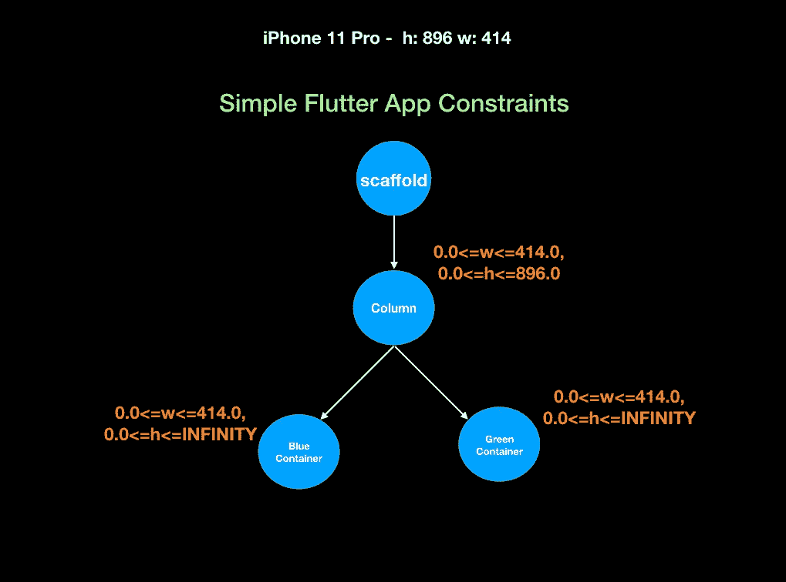
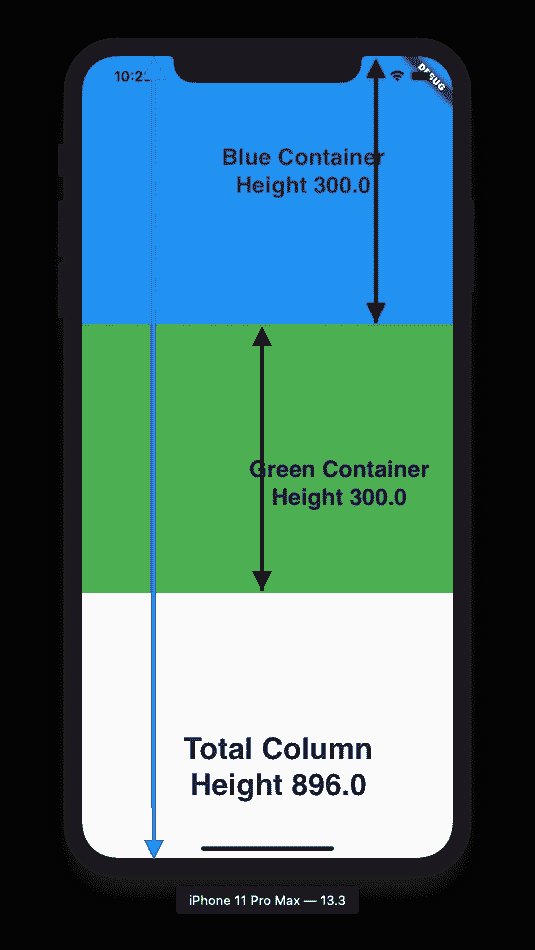
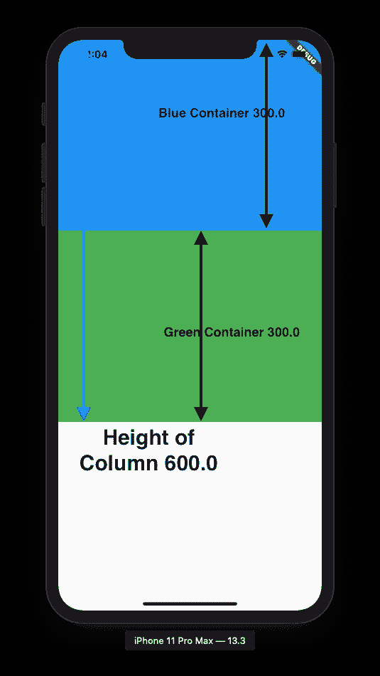
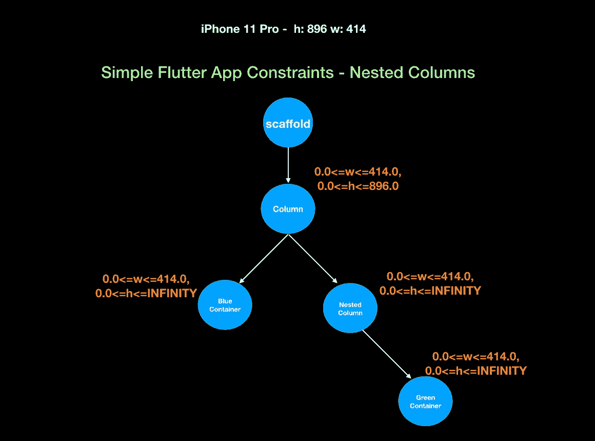

# 颤振最大值:最大值与最小值

> 原文：<https://itnext.io/flutter-mainaxissize-max-vs-min-d9095d8f7914?source=collection_archive---------0----------------------->

最基本的！

# 摘要

当您在列或行上使用 MainAxisSize 时，它们将确定列或行沿主轴的大小，即列的高度和行的宽度。

我们将查看几个示例，看看如果使用 MainAxisSize.max 和 MainAxisSize.min，主轴的最终大小是多少

# 说明

让我们使用下面的基本示例，一个包含一个父脚手架和两个 300 像素高的子容器的列。我将使用的模拟器是 iPhone 11 pro，高度为 896 像素，宽度为 414 像素。

引入框约束将是:

引入约束

# 最大

列的高度将根据来自其父列的*输入约束达到最大。例如，如果父对象的高度是一个脚手架，它将是屏幕尺寸，因为它们将框约束传递给列，所以当使用最大设置时，列的高度将是脚手架传递的高度约束，而不考虑子对象的高度。那是什么意思？*

因此，列的高度将是 896.0 像素。类似地，对于一行，其主轴宽度为 414.0。为了更好的可视化，请看下图。MainAxisSize.max 是默认设置。

# 福建话

列的高度将根据*其子代的组合高度*和*来确定，从父代传入的高度将被忽略*。因此，在我们的基本示例中，列的高度将是 600 像素。类似地，如果 Row 小部件有两个容器作为子容器，每个容器的宽度为 100.0 像素，那么具有 Min 设置的行的宽度将为 200 像素。Min 不是默认设置，您需要显式设置它才能工作。

但是，你在哪里使用这个设置呢？

当您想要将小部件水平或垂直地组合成一个小部件时，这非常有用。最小设置将确保生成的组合微件的大小与微件本身的组合大小一样小。

# 嵌套的列和行

对嵌套的列和行使用 MainAxisSize 设置很有趣，因为传入的主轴约束不会从父列/行传递到嵌套的列/行。下面是带有约束的基本示例代码，我们将使用它来解释当使用嵌套的列/行时 MainAxisSize 会发生什么。

所以有四种情况:

# 马克斯—马克斯

如果使用没有任何扩展或灵活的嵌套列，从父列到子列没有传入的高度约束*，因此 *Max 设置将被忽略，嵌套列的高度将是其子列*的高度。如果你想了解更多关于[嵌套的列和行框约束](https://medium.com/@sid.310/flutter-box-constraints-nested-column-s-row-s-3dfacada7361)，请阅读帖子和链接来了解更多关于[扩展和灵活的](https://medium.com/@sid.310/flutter-responsive-apps-flexible-vs-expanded-ff8cc92b468f)。*

当您对嵌套列使用 Expanded 时，嵌套列的高度将在其同级容器占据 300 个像素后达到最大值，因为 *Expanded 检查父列并将高度约束传递给嵌套列*。

当您使用 Flexible with fit loose 时，Flexible 将检查嵌套列，发现它还没有任何高度，但具有 MainAxisSize.max 设置，然后检查父列并获得剩余的 596 个可用像素。*所以嵌套列的高度将是 596 像素，类似于扩展的*。

# 最大值-最小值

如果没有扩展或灵活，按预期工作，嵌套列的高度将是子列的高度，但如果在嵌套列上使用扩展，*嵌套的高度将是最大的，因为扩展将尽可能地扩展而忽略子列的高度*。因此，在嵌套列 MainAxisSize.min 上使用 Expanded，*min 设置将被忽略*。

当您使用 Flexible with fit loose 时，Flexible 将检查嵌套列，并看到它还没有任何高度，但具有 MainAxisSize.min 设置。*因此嵌套列的高度将是 300 像素，即容器的高度*。父柱的高度将是脚手架传入约束的最大值。

# 最小—最大

如果没有扩展或灵活，嵌套列的*最大设置将被忽略，因为没有来自父列*的传入高度约束，因此高度将为最小设置。如果在嵌套列上使用 Expanded，父列的 Min 设置实际上并不重要，因为在子列上展开会根据父列的约束将其扩展到沿主轴的剩余可用空间，因此它实际上是 Max-Max 设置。

当您使用“灵活”和“适合松散”时，它将是“最小—最大”，但是由于嵌套列有“最大”设置并且想要尽可能地扩展，*父列的“最小”设置并不重要，因为嵌套列的高度将是可用的最大值*。

# 最小-最小

如果没有 Expanded 或 Flexible，按预期工作，它将是 Min-Min，但当您在嵌套列上使用 Expanded 时，它将是 Max-Max。你为什么会发生这种情况？*因为展开后会填满主轴上剩余的可用空间*。

如果你使用灵活和宽松的配合，这将是最小-最小设置。

编码快乐！

检查我用 flutter 创建的本机应用程序。**目前只部署到苹果的 App Store。由于 Covid 延迟，谷歌的 Play Store 需要更多时间进行审查。**

 [## 核对清单:带模板

### 通过将清单保存为模板来提高工作效率。如果需要，安排到期日期和提醒，并获取…

chklist.app](https://chklist.app) 

另外，如果可能的话，在 twitter 上关注我:

 [## 火星山羊

### marsgoat 的最新推文(@marsgoat1)。...来自火星的山羊媒介:https://t.co/BUAZThMhEn

twitter.com](https://twitter.com/marsgoat1)