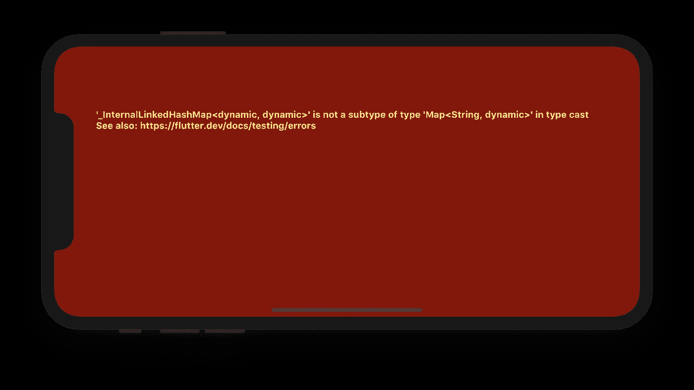

# 颤振方法渠道，省道一般和类型铸造

> 原文：<https://itnext.io/flutter-methodchannel-dart-generic-and-type-casting-54ca48e6d3ad?source=collection_archive---------2----------------------->

初学者明白了，或者说*type ' _ InternalLinkedHashMap<，dynamic >'不是 type 'Map < String，dynamic > '* 的子类型。



作为一个经常边做边学的人(*错*👻)而不是浏览官方的 [Dart 语言教程文档](https://dart.dev/guides/language/language-tour)，我最近在尝试[使用 Flutter**method channel**](https://flutter.dev/docs/development/platform-integration/platform-channels)执行特定于平台的调用时发现了一个错误

代码试图调用一个特定于平台的方法，将类似于`Map`的数据结构(Android 上的`HashMap`，iOS 上的`NSDictionary`)传回 Flutter 世界。通过`String`键可以访问返回数据中的每个条目。

为了了解实际错误是什么以及到底发生了什么，我四处搜寻，找到了这张[重要的纸条](https://dart.dev/guides/language/language-tour#generic-collections-and-the-types-they-contain)

> Dart 泛型类型是 ***具体化的*** ，这意味着它们在运行时携带它们的类型信息。
> 
> ***ℹ* 注:**相比之下，Java 中的泛型使用 ***erasure*** ，这意味着泛型类型参数在运行时被移除。在 Java 中，你可以测试一个对象是否是一个列表，但是你不能测试它是否是一个`List<String>`。

突然间，一切都变得有意义了💡即[如何支持平台通道数据类型和编解码器](https://flutter.dev/docs/development/platform-integration/platform-channels#codec)提到支持 Dart 的`List`和`Map`，但没有提到通用类型信息。
这是可以理解的，因为当从一个平台(Android)到另一个平台(Dart/Flutter)时，或者更具体地说，从`erasure`到`reified`，`Map`的`<Key, Value>`类型信息会被丢弃。

对上述错误的修复实际上非常简单，只需从泛型中删除特定的类型:

# 省道的铅字铸造

在 Dart 中，类型信息在运行时可用，这意味着我们可以执行以下操作:

注意`Map<dynamic, dynamic>`怎么会是**而不是**T1。
试图 [*向下转换*](https://en.wikipedia.org/wiki/Downcasting) 会导致我们在做`MethodChannel.invokeMethod`时观察到的同样的错误

回到`MethodChannel.invokeMethod`，现在我们知道我们必须将数据视为`Map<dynamic, dynamic>`，以访问值，并且由于我们已经通过*之前的 API 契约*知道了它的类型，我们可以使用`as`对它进行转换:

```
final intValue = dataFromPlatform[‘specificKey’] as int;
```

但是，如果您的数据包含嵌套的`Map<String, String>`呢？同样，你必须把它当作一个`Map<dynamic, dynamic>`🙃，而且继续使用`as`操作符来访问嵌套的值是令人厌烦的。
对我们来说幸运的是，`[Map](https://api.dart.dev/stable/2.9.3/dart-core/Map/cast.html)` [中的 Dart 自带了](https://api.dart.dev/stable/2.9.3/dart-core/Map/cast.html) `[cast](https://api.dart.dev/stable/2.9.3/dart-core/Map/cast.html)` [方法](https://api.dart.dev/stable/2.9.3/dart-core/Map/cast.html)这样就可以做到这一点:

```
final nestedMapValue = (dataFromPlatform['anotherSpecificKey'] as Map).**cast<String, String>**();final **stringValue** = nestedMapValue['key'];
print(**stringValue.length**); // stringValue is known as **String** at runtime at this point, so we can access its `**length**` property 🙌
```

# 最终想法

有着厚重的`TypeScript`和`Java`背景，看起来我对`erasure`泛型太熟悉了，把`Dart`中的类型转换`as`运算符想当然了！写这篇文章也让我想起了我使用`C++` `dynamic_cast`的时候，希望这能帮助将来遇到这个问题的人👍。

# 参考

[](https://github.com/dart-lang/site-www/issues/736) [## 有效飞镖:何时用“as”，“。重新键入“，”。cast "第 736 期 dart-lang/site-www

### 解散 GitHub 是超过 5000 万开发者的家园，他们一起工作来托管和审查代码，管理项目，以及…

github.com](https://github.com/dart-lang/site-www/issues/736) [](https://flutter.dev/docs/development/platform-integration/platform-channels#codec) [## 编写定制的特定于平台的代码

### 本指南描述了如何编写特定于平台的自定义代码。一些特定于平台的功能是可用的…

颤振. dev](https://flutter.dev/docs/development/platform-integration/platform-channels#codec) [](https://dart.dev/guides/language/language-tour) [## Dart 语言之旅

### 本页将向您展示如何使用 Dart 的每个主要功能，从变量和运算符到类和库，以及…

dart.dev](https://dart.dev/guides/language/language-tour)  [## cast 方法-映射类- dart:核心库- Dart API

### 如有必要，提供包含 RK 关键点和 RV 实例的贴图视图。如果这张地图已经是地图了，那它就是…

api.dart .开发](https://api.dart.dev/stable/2.9.3/dart-core/Map/cast.html)