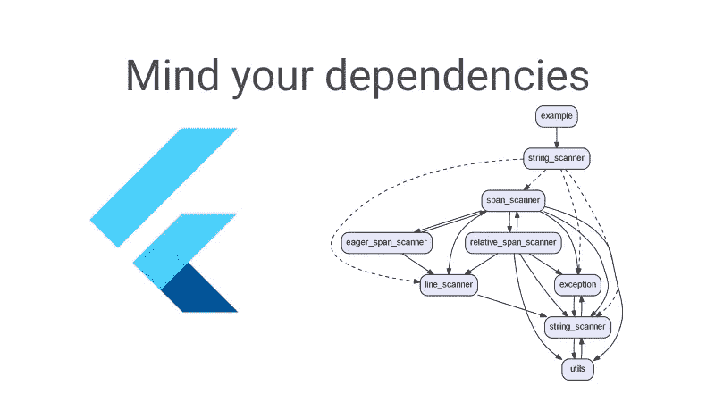
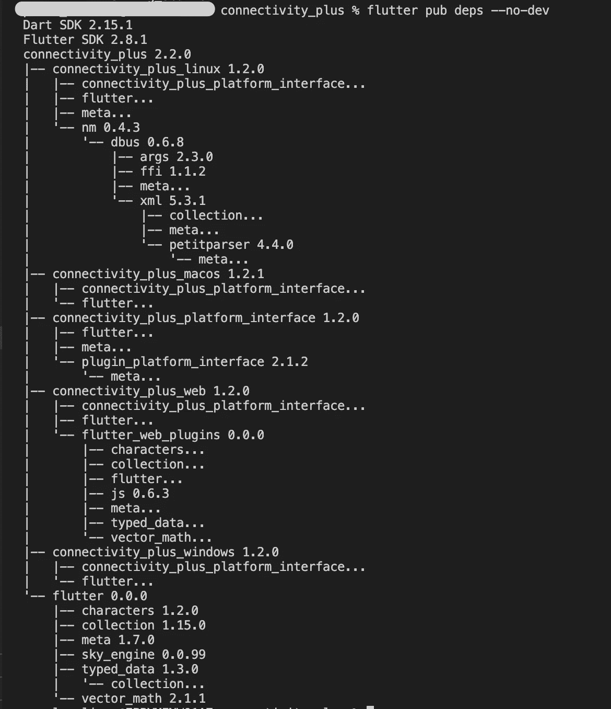
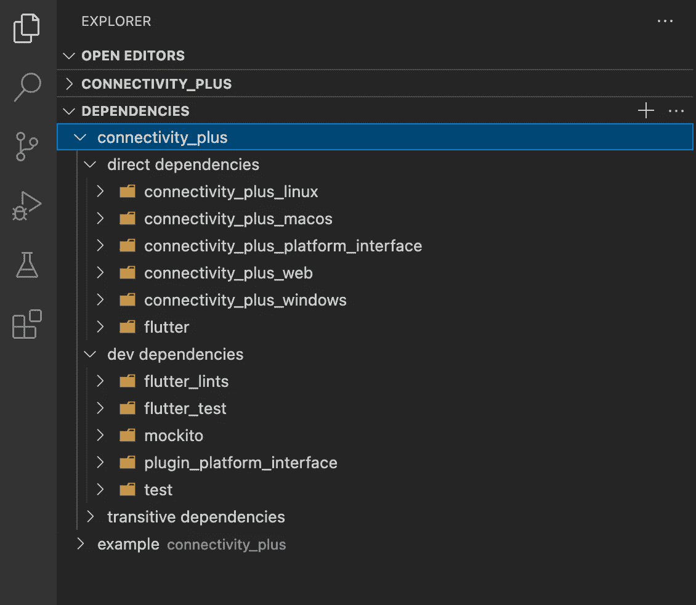

# 颤振:注意你的依赖

> 原文：<https://itnext.io/flutter-mind-your-dependencies-52072df6d96?source=collection_archive---------1----------------------->

你想对你的 flutter/dart 项目中的依赖关系有一个总体的了解，并保持它们的良好秩序吗？让我们看看有哪些工具可以帮助解决这个问题。



# `颤振 pub deps '命令

`flutter pub deps [--style=<style>] [--[no-]dev] [--executables]`

> 该命令打印包的依赖关系图。该图包括包使用的[直接依赖关系](https://dart.dev/tools/pub/glossary#immediate-dependency)(如 pubspec 中所指定的)，以及由直接依赖关系引入的[传递依赖关系](https://dart.dev/tools/pub/glossary#transitive-dependency)。

你可以在这里 阅读更多关于 [**命令的内容。这是针对`connectivity_plus`包的命令输出示例:**](https://dart.dev/tools/pub/cmd/pub-deps)



此外，您可以使用 VSCode 来分析相同的结果:



## 包依赖的风格

> Pub 支持两种类型的依赖:常规依赖和*开发依赖。*开发依赖不同于常规依赖，因为*您所依赖的包的开发依赖被忽略*。
> 
> 决定是常规依赖还是开发依赖的规则很简单:如果依赖是从您的`lib`或`bin`目录中导入的，那么它需要是常规依赖。如果只是从`test`、`example`等进口。它可以也应该是一个开发依赖项。

# `依赖项 _ 验证程序'工具

这是一个开源的[**工具**](https://github.com/Workiva/dependency_validator) ，它验证一个包的依赖项是否遵循[发布约定](https://dart.dev/tools/pub/dependencies)以及最佳实践。

> 通过比较在 pubspec.yaml 中声明的包的依赖项与通过 import 语句实际使用的依赖项，该工具能够识别各种与依赖项相关的问题:缺少依赖项、提升不足、提升过度和未使用的依赖项。

这个工具很酷的一点是，如果有人违反了最佳实践，你可以将它用作 CI 渠道中的验证步骤，并使 PR 失败。当你有一个里面有很多包的[单回购](https://en.wikipedia.org/wiki/Monorepo#:~:text=In%20version%20control%20systems%2C%20a,stored%20in%20the%20same%20repository.&text=Many%20attempts%20have%20been%20made,other%2C%20newer%20forms%20of%20monorepos.)时，这是非常有用的。

顺便说一下， [**美洛斯 CLI 工具**](https://melos.invertase.dev/) 对于 flutter/dart monorepo 项目非常方便。

# “lakos”工具

[**lakos**](https://pub.dev/packages/lakos) 是一个命令行工具和库，它可以:

*   在 Graphviz `dot`中可视化内部 Dart 库依赖关系。
*   检测依赖循环。
*   识别孤儿。
*   计算有用的依赖图度量。

下面是一个忽略测试，用指标在 lakos 上运行的例子:

```
lakos -o dot_images/lakos.metrics_no_test.dot -m -i test/** .
```


您还可以收集额外的指标，并在 CI 渠道中使用它们，尤其是在检测到依赖循环时。

# 来源

[](https://dart.dev/tools/pub/dependencies) [## 包依赖关系

### 依赖性是 pub 包管理器的核心概念之一。依赖项是您的包中的另一个包…

dart.dev](https://dart.dev/tools/pub/dependencies) [](https://dart.dev/tools/pub/cmd/pub-deps) [## dart 酒吧部门

### Deps 是 pub 工具的命令之一。$ dart pub deps[-style =][-[no-]dev][-executables]此命令…

dart.dev](https://dart.dev/tools/pub/cmd/pub-deps) [](https://pub.dev/packages/dependency_validator) [## 依赖项 _ 验证器| Dart 包

### 帮助您找到缺失、提升不足、提升过度和未使用的依赖项的工具。将以下内容添加到您的…

公共开发](https://pub.dev/packages/dependency_validator) [](https://www.workiva.com/careers/workiva-life-blog/validating-dart-dependencies-and-you) [## 正在验证 Dart 依赖关系和您！

### 让我们在一个名为 depenency_validator 的工具的帮助下，让您的 Dart 依赖项保持一致

www.workiva.com](https://www.workiva.com/careers/workiva-life-blog/validating-dart-dependencies-and-you) [](https://pub.dev/packages/lakos) [## lakos |飞镖包

### lakos 是一个命令行工具和库，可以:在 Graphviz dot 中可视化内部 Dart 库依赖关系。检测…

公共开发](https://pub.dev/packages/lakos)  [## 美洛斯

### 关于使用美洛斯许可证的项目#美洛斯是一个 CLI 工具，用于帮助管理具有多个包的 Dart 项目(也…

melos .转化酶. dev](https://melos.invertase.dev/) [](https://stackoverflow.com/questions/57174506/dependency-diagram-in-dart-flutter) [## Dart/Flutter 中的依赖图？

### 感谢贡献一个堆栈溢出的答案！请务必回答问题。提供详细信息并分享…

stackoverflow.com](https://stackoverflow.com/questions/57174506/dependency-diagram-in-dart-flutter)