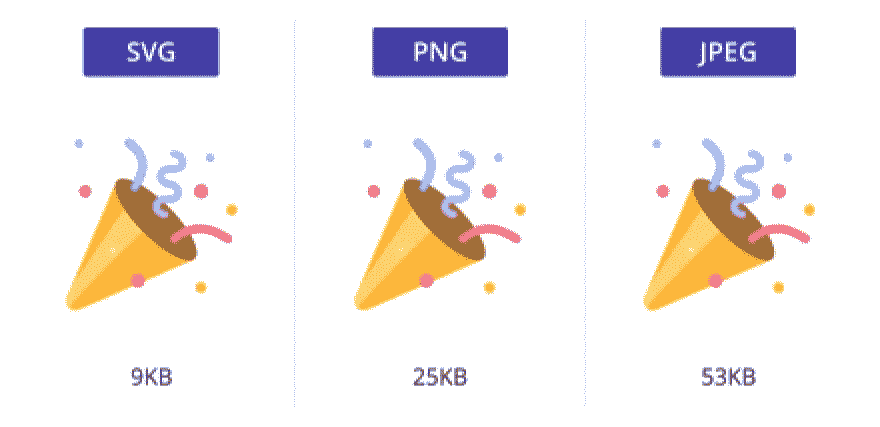
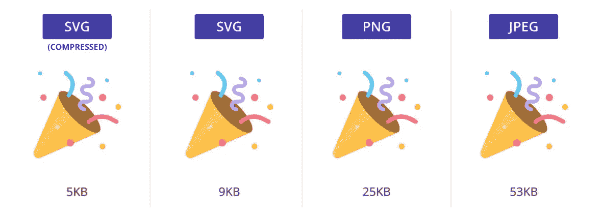
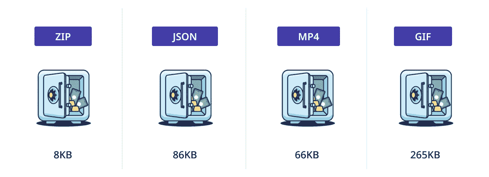

# 颤振最小化尖端

> 原文：<https://itnext.io/flutter-minimizing-tips-42113f02b678?source=collection_archive---------0----------------------->


## 颤振尺寸优化的最简指南

在这篇文章中，我将讨论如何在 Flutter 中减少 apk 的大小

# 1.对图标和矢量图像使用 SVG



# 2.使用 WEBP 而不是 JPG/PNG

## 简短解释

它类似于 JPG/巴布亚新几内亚，但尺寸要小 25%

## 冗长的解释

[](https://developers.google.com/speed/webp) [## 面向 Web | WebP | Google 开发人员的图像格式

### WebP 是一种现代图像格式，为网络上的图像提供卓越的无损和有损压缩。使用 WebP…

developers.google.com](https://developers.google.com/speed/webp) 

# 3.摇动你的图标

## 适用于 iOS

如果从 Xcode 构建，可以设置`TREE_SHAKE_ICONS`环境变量

## 适用于 Android

它将在`gradle.properties`中设置`tree-shake-icons`属性

## 简短解释

Flutter 有从 Material、Cupertino、FontAwesome 等抖掉不用图标的功能。字体。

## 冗长的解释

# 4.不管你用什么，压缩它！



每个人都知道他们可以并且应该压缩 JPG/PNG，但是有多少人知道你也可以压缩 SVG 和 WEBP 图像呢？

# 5.压缩你的动画！



[https://lottiefiles.com/77907-vault](https://lottiefiles.com/77907-vault)

# 6.使用 gzip 来最小化所有内容

例如 lang 文件

```
final String response = await rootBundle.loadString('assets/**en_us.json**');
List<int> original = **utf8.encode**(response);
List<int> compressed = **gzip.encode**(original);
List<int> decompress = **gzip.decode**(compressed);
final enUS = **utf8.decode**(decompress);
```

## 简短解释

您可以使用 gzip 压缩来保存大小

## 冗长的解释

[](https://abhishekdoshi26.medium.com/compression-algorithm-flutter-f628481cc4e0) [## 1300000 字节→ 2572 字节！99%压缩！

### 别浪费内存了！让我们看看如何将 1300000 字节减少到 2572 字节，即 99%的压缩率！

abhishekdoshi26.medium.com](https://abhishekdoshi26.medium.com/compression-algorithm-flutter-f628481cc4e0) 

# 7.使用 Proguard 规则

添加到文件`android/app/build.gradle`

```
android {
  buildTypes {
    getByName("release") {
      // Enables code shrinking, obfuscation, and optimization
      **minifyEnabled = true**
      // Enables resource shrinking
      **shrinkResources = true**
      // Enables proguard rules
      **proguardFiles(
        getDefaultProguardFile("proguard-android-optimize.txt")),
        "proguard-rules.pro"
      )**
    }
  }
}
```

添加到文件中`android/app/proguard-rules.pro`

```
## Flutter wrapper
-keep class io.flutter.app.** { *; }
-keep class io.flutter.plugin.** { *; }
-keep class io.flutter.util.** { *; }
-keep class io.flutter.view.** { *; }
-keep class io.flutter.** { *; }
-keep class io.flutter.plugins.** { *; }
-keep class com.google.firebase.** { *; } // uncomment this if you are using firebase in the project
-dontwarn io.flutter.embedding.**
-ignorewarnings
```

## 冗长的解释

[](https://www.geeksforgeeks.org/how-to-use-proguard-to-reduce-apk-size-in-android/) [## 如何在 Android 中使用 Proguard 减少 APK 大小？- GeeksforGeeks

### 构建任何应用程序时，应用程序的大小都很重要。如果应用程序太大，大多数用户不会下载…

www.geeksforgeeks.org](https://www.geeksforgeeks.org/how-to-use-proguard-to-reduce-apk-size-in-android/) 

# 8.混淆你的代码！

这个功能给你既安全又减小体积！以下是方法。


[https://proandroiddev . com/obfuscation-is-important-do-you-know-your-options-30 B3 ef 396 dfe？gi=a6606339a89b](https://proandroiddev.com/obfuscation-is-important-do-you-know-your-options-30b3ef396dfe?gi=a6606339a89b)

## **对于安卓系统**:

添加到文件`/android/gradle.properties`

```
extra-gen-snapshot-options=--obfuscate
```

## 对于 IOS:

 [## 如何混淆 Flutter 应用？纽别杰夫

### 混淆是需要的——一个 flutter 应用程序知道它的函数名，这可以使用 Dart 的 StackTrace 类来显示…

newbedev.com](https://newbedev.com/how-to-obfuscate-flutter-apps) 

# 9.使用谷歌字体

这个包会在 ***只使用的时候动态下载*** 字体。不是每一种字体

[](https://pub.dev/packages/google_fonts) [## google _ fonts | Flutter 包

### Flutter 的 google_fonts 包允许您轻松使用来自……的 977 种字体(及其变体)中的任何一种

公共开发](https://pub.dev/packages/google_fonts) 

# 10.使用缓存图像网络

它给你自动缓存图像，给你一些空间

[](https://pub.dev/packages/cached_network_image) [## cached _ network _ image | Flutter 包

### 一个 flutter 库，显示来自互联网的图像，并将它们保存在缓存目录中。缓存网络图像可以是…

公共开发](https://pub.dev/packages/cached_network_image) 

# 11.实现更积极的优化

`android/gradle.properties`

```
android.enableR8.fullMode=true
```

## 简短解释

删除未使用的代码，合并类以减小代码，等等。

## 冗长的解释

[https://developer . Android . com/studio/build/shrink-code #优化](https://developer.android.com/studio/build/shrink-code#optimization)

# 12.压缩本机库

`android/gradle.properties`

```
android.bundle.enableUncompressedNativeLibs=true
```

## 简短解释

减少下载量和设备上应用的大小

## 冗长的解释

[](https://stackoverflow.com/questions/56551036/native-libraries-not-found-in-applicationinfo-nativelibrarydir-when-building-app/56551499#56551499) [## 为 arm64 构建应用捆绑包时，在 application info . native library dir 中找不到本地库…

### 我正试图将我的应用程序从单片 APK 迁移到应用程序捆绑格式。我需要设置 LD_LIBRARY_PATH 环境…

stackoverflow.com](https://stackoverflow.com/questions/56551036/native-libraries-not-found-in-applicationinfo-nativelibrarydir-when-building-app/56551499#56551499) 

# 13.从代码中分离调试信息

```
flutter build appbundle --split-debug-info=/<path-to-export>
```

## 简短解释

这将调试信息从我们的代码中分离出来，帮助我们创建更小的 apk

# 14.递延成分

## 简短解释

Flutter 能够构建能够在运行时下载额外 Dart 代码和资产的应用程序。这允许应用程序减少安装 APK 的大小，并在用户需要时下载功能和资产。

## 冗长的解释

[](https://flutter.dev/docs/perf/deferred-components) [## 递延成分

### Flutter 能够构建能够在运行时下载额外 Dart 代码和资产的应用程序。这允许应用程序…

颤振. dev](https://flutter.dev/docs/perf/deferred-components) 

# 15.检测较重的包裹，如果可能的话，将其处理掉

**对于安卓的 AppBundle:**

`flutter build appbundle --target-platform android-arm64 --analyze-size`

**对于安卓的 APK:**

`flutter build apk --target-platform android-arm64 --analyze-size`

**对于 iOS:**

`flutter build ios --analyze-size`

## 冗长的解释

[](https://flutter.dev/docs/perf/app-size) [## 测量应用的大小

### 许多开发人员关心他们编译的应用程序的大小。作为 APK，应用捆绑，或 IPA 版本的一个扑…

颤振. dev](https://flutter.dev/docs/perf/app-size) 

# 奖金:第二部分

[](/flutter-performance-tips-part-2-7e37af5b0690) [## 颤振性能提示第二部分

### 变得更好

itnext.io](/flutter-performance-tips-part-2-7e37af5b0690) 

# 参考

[https://developer . Android . com/topic/performance/reduce-apk-size](https://developer.android.com/topic/performance/reduce-apk-size)

[](https://suryadevsingh24032000.medium.com/size-matters-reducing-flutter-app-size-best-practices-ca992207782) [## 大小很重要:减少抖动应用程序大小的最佳实践

### 今天 Google Play 商店中有 260 万个应用程序——难怪说服用户安装你的应用程序比以往任何时候都更…

suryadevsingh24032000.medium.com](https://suryadevsingh24032000.medium.com/size-matters-reducing-flutter-app-size-best-practices-ca992207782) 

[https://developer.android.com/studio/build/shrink-code](https://developer.android.com/studio/build/shrink-code)

[](/reducing-flutter-app-size-570db9810ebb) [## 减少抖动应用程序的大小

### 作为开发者，我们希望让应用程序变小，这样我们的应用程序就能获得尽可能多的分发。

itnext.io](/reducing-flutter-app-size-570db9810ebb)  [## 如何混淆 Flutter 应用？纽别杰夫

### 混淆是需要的——一个 flutter 应用程序知道它的函数名，这可以使用 Dart 的 StackTrace 类来显示…

newbedev.com](https://newbedev.com/how-to-obfuscate-flutter-apps) 

# 感谢您的阅读！

我试图在一个地方收集所有的解决方案。如果你知道关于最小化的任何其他事情，请与我们分享，让我在文章中添加

如果你喜欢这篇文章，请点击👏按钮(你知道你可以升到 50 吗？)