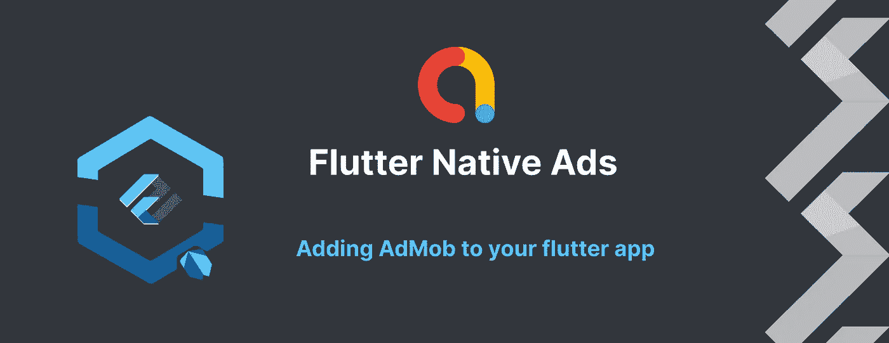
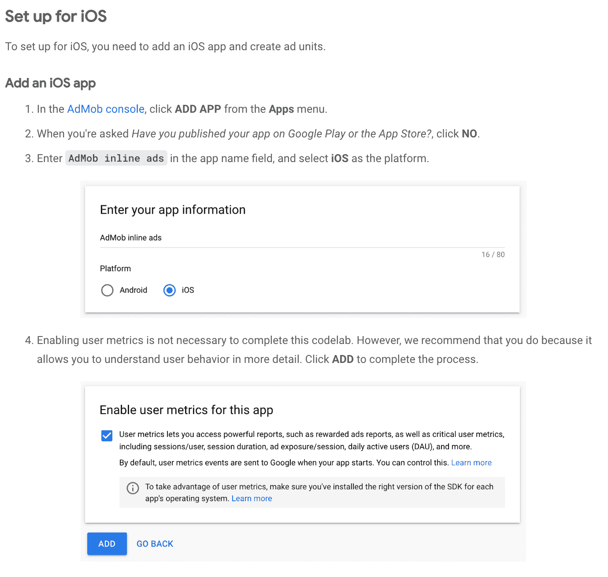
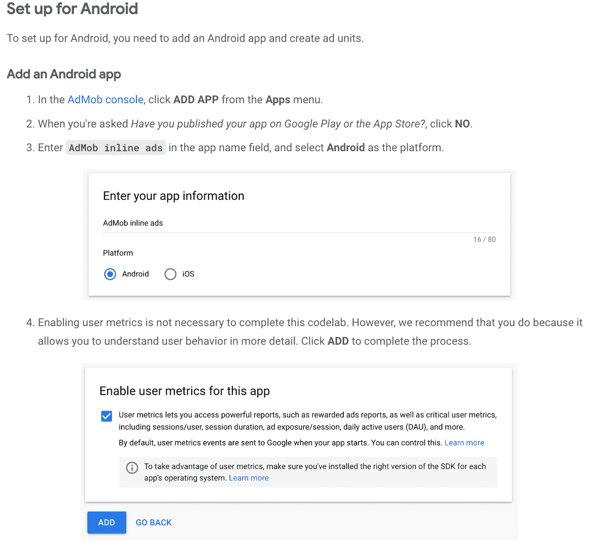
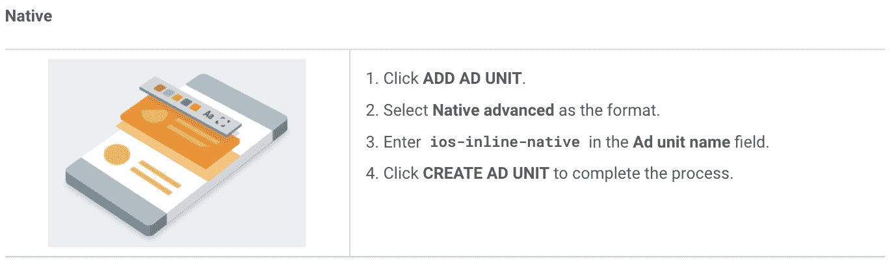
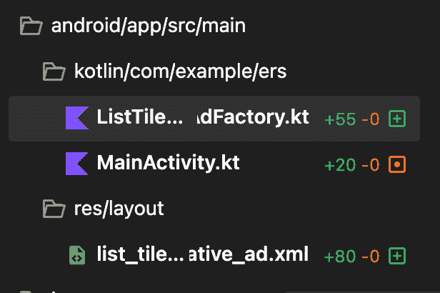

# 飘扬的本土广告

> 原文：<https://itnext.io/flutter-native-ads-92d802fbd927?source=collection_archive---------0----------------------->

有一些文档，甚至是我们将在本教程中遵循的 [codelab](https://codelabs.developers.google.com/codelabs/admob-inline-ads-in-flutter#0) ,但通常有一些没有注意到的零碎内容，可能会被跳过，最终，你会浪费很多时间去弄清楚这些。这就是为什么我们将重点放在原生广告上，因为其他人的教程看起来很好，而且简单得多。

为什么要使用原生广告呢？即使实现起来更复杂，答案也很简单——用户体验。没有人喜欢收到垃圾广告，通常免费应用程序会整合广告，以获得一些被动收入来维持项目的进行。因此，原生广告似乎是实现这一目标最不具侵入性的方式。

*重要提示:在构建和测试你的应用时，确保你使用的是* [*测试广告*](https://developers.google.com/admob/android/test-ads) *，而不是现场制作广告。否则可能会导致您的帐户被暂停*

# 步骤 1:广告群设置

设置你的 [ad mob](https://apps.admob.com/v2/home) 账户，添加 android 和 iOS 应用(截图来自 [codelab](https://codelabs.developers.google.com/codelabs/admob-inline-ads-in-flutter#0)

Foreach 创建本地添加单元:(截图来自 [codelab](https://codelabs.developers.google.com/codelabs/admob-inline-ads-in-flutter#0) )

要添加广告单元:

1.  从 AdMob 控制台的“应用”菜单中选择 AdMob 内联广告应用。
2.  单击广告单位菜单。

# 步骤 2:在 flutter 应用程序中添加 ad mob 集成

在你的 flutter 应用中添加并安装一个 [google_mobile_ads](https://pub.dev/packages/google_mobile_ads) 包，之后我们需要在 android 的 android manifest 和 iOS 的 Info.plist 中添加 ad mob 的凭证。这是来自 [codelab](https://codelabs.developers.google.com/codelabs/admob-inline-ads-in-flutter#0) 的简单实现，但是如果你使用了 flavor，记得在每个环境中使用变量。变量的例子在[颤振风味](/flutter-new-app-setup-with-flavors-in-one-go-331471b127e3)文章中。

# 步骤 3:初始化谷歌移动广告 SDK

首先，初始化你的 flutter ads 包，在主页加载之前初始化 SDK，你也可以创建一个 [AdHelper](https://codelabs.developers.google.com/codelabs/admob-inline-ads-in-flutter#4) 类，以便于管理。这是从后端触发生产 ad ids 以在 prod 和 test helper 之间切换的一种很好的方式。

# 步骤 4:实现原生广告

## 实现 Android 的 NativeAdFactory(kot Lin)，下面是我们接下来要提到的文件路径的截图。

首先，我们将创建一个名为 list_tile_native_ad.xml 的原生广告布局，这是一个基本的列表布局，请注意，该布局应符合其目标平台的用户体验的视觉设计。

# 创建 ListTileNativeAdFactory 类

工厂类负责创建用于呈现原生广告的视图对象。从代码中可以看出，factory 类创建了一个 NativeAdView，并用一个 NativeAd 对象填充它。

# 注册 ListTileNativeAdFactory 类

NativeAdFactory 的实例应该注册到 GoogleMobileAdsPlugin，然后才能从 Flutter 端使用它。因此，相应地更新您的 MainActivity.kt:

# 为 iOS 实施 NativeAdFactory(Swift)

# 准备原生广告布局

您需要一个自定义视图(*。xib)用于布局原生广告资产。这是一个由 codelab 组合而成的布局，我们一路上都会提到:

# 创建 ListTileNativeAdFactory 类

工厂类负责创建用于呈现原生广告的视图对象。从代码中可以看出，factory 类创建了一个 GADNativeAdView，并用一个 GADNativeAd 对象填充它。

# 注册 ListTileNativeAdFacotry 类

FLTNativeAdFactory 的实现应在 FLTGoogleMobileAdsPlugin 中注册，然后才能从 Flutter 端使用。因此，相应地更新 AppDelegate.swift:

注意:codelab 就是这样，但它给[网点](https://stackoverflow.com/questions/72870086/why-theres-no-iboutlet-on-gadnativeview-when-implementing-google-admob-native-a)带来了一个问题。为了解决这个问题，我们将在 AppDelegate swift 所在的文件夹中添加一个名为 GADNativeAd.h 的新文件:

# 步骤 5:将原生广告与 Flutter 小部件集成在一起

这是 dart 实现的一个示例，您可以在任何列表中调用它:

尽管你可以在本教程的几乎所有内容中使用 codelab，除了文件的出口和路径问题(特别是如果你没有使用 Android Studio 的话),但我认为如果你第一次在 Flutter 中实现原生广告，这将对你有所帮助。