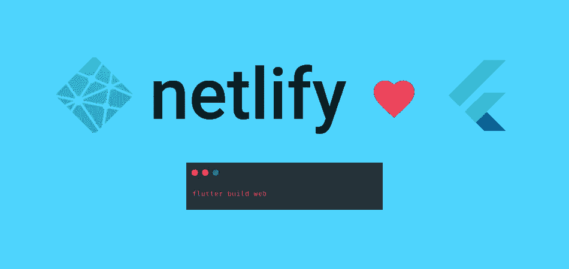
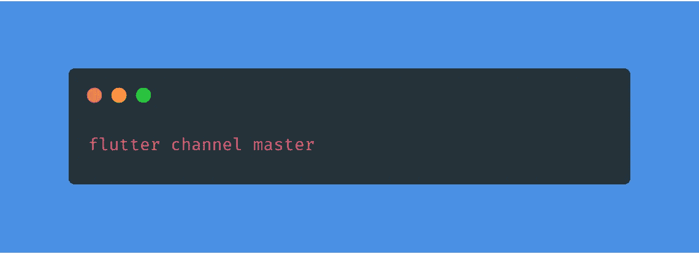
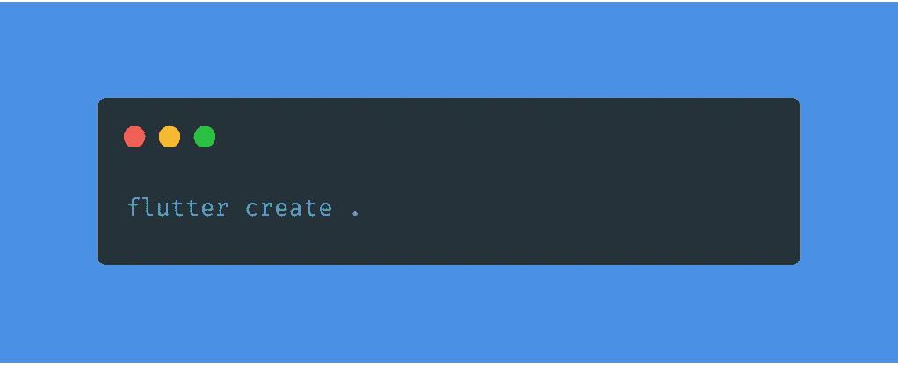
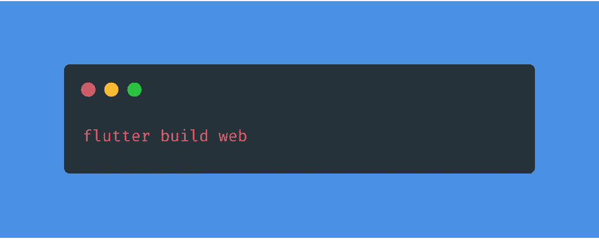
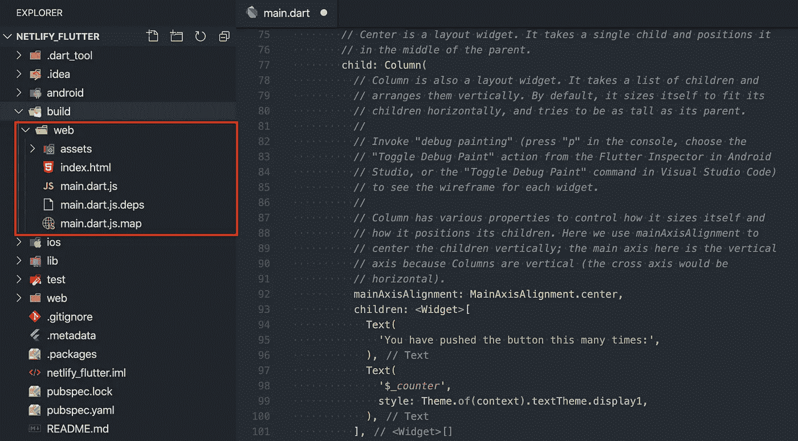
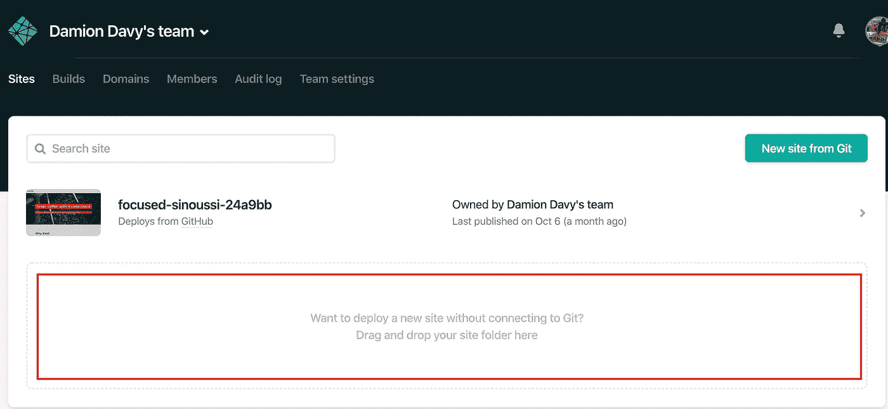
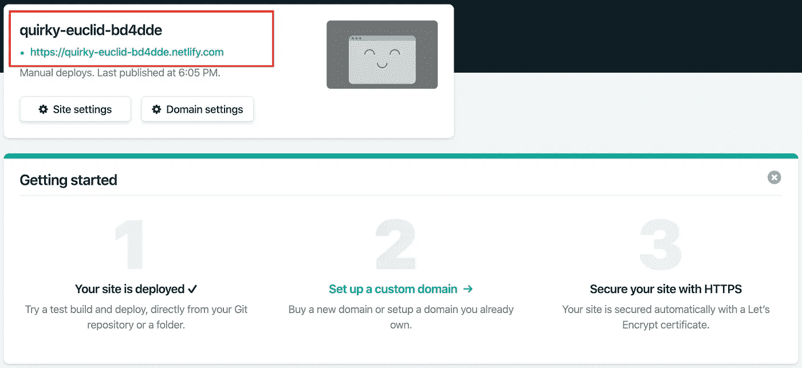
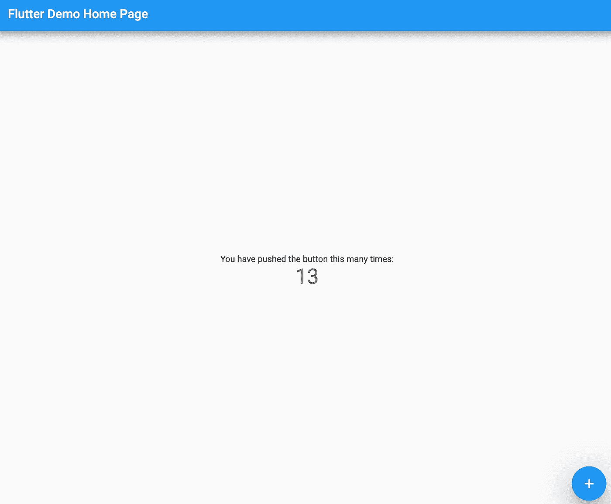

# Flutter + Netlify:分两步在 Netlify 上托管你的 Flutter 应用。

> 原文：<https://itnext.io/flutter-netlify-host-your-flutter-apps-on-netlify-in-two-steps-5e988ac1712e?source=collection_archive---------2----------------------->

在过去的几个月里，Flutter 像风暴一样席卷了整个开发世界；使用一个框架来构建移动、网络、桌面和物联网设备的用户界面是一个成功的公式。

他们的 GitHub 页面拥有超过 70，000 颗星星，并且每天都在增加。

在本帖中，我们将进行一次开发潜水，我将展示如何通过 4 个简单的步骤将 flutter web 和 Netlify 结合起来。

# 1.创建新的 flutter 应用程序

在主通道上创建一个新的颤振项目。

## 使用命令为 web 构建您的 flutter 项目

## 颤动构建 Web 结果

# 2.部署到网络

如果您还没有 Netlify 帐户，请使用免费计划创建一个。

将 build/web 的内容拖到下面的网站

给它几秒钟你会得到链接到你的颤振网站

# 搞定了。

[颤振网页制作链接](https://quirky-euclid-bd4dde.netlify.com/#/)

# 结论

如今部署静态网站超级简单方便。Netlify 让它变得非常简单。

您可以阅读 Netlify 文档并添加您的自定义域。

## 如果这有帮助的话:请给我一个掌声，它让我保持动力😀

⥅跟我上[中型](https://medium.com/@codememory101)。

⥅在推特上关注我。

📢在社交媒体上分享。