# 一气呵成的全新应用程序设置

> 原文：<https://itnext.io/flutter-new-app-setup-with-flavors-in-one-go-331471b127e3?source=collection_archive---------0----------------------->

如何创建一个新的跨平台项目并把它做好？我们将经历几个简单的步骤，创建一个具有特定 flutter 版本、开发和生产风格、不同图标和横幅的新应用程序。然后，我们将首先将两者连接到 firebase 进行应用程序分发，推送通知，动态链接，稍后可能会登录。

# 设置基本项目

创建一个新的项目，选择应用程序，添加应用程序名称(如果你只使用 flutter，在文件夹中创建一个文件，打开和关闭 vs 代码，它会在打开时生成一个新的应用程序)

在 VS 代码中创建新的颤振项目

现在我们只有一个 flutter 版本，随着时间的推移，我们会有更多的版本，所以我们将使用 flutter 版本管理器为这个应用程序设置特定的 flutter 版本。FVM 是我们的朋友。

在这个例子中，我们将使用 Flutter 2.10.3。完成此设置后，可能需要一段时间。fvm 文件夹出现，可能需要事件重新打开编辑器。

现在是初始提交的好时机，因为我们已经指定了新的应用程序和版本，所以请转到目录根文件夹，如果您在空存储库中，请键入“仅使用此快速分支”。

打开 MR 并合并到 master/main(如果默认情况下有一些自述文件，可能会有冲突)，然后切换回 master 进行后续步骤。

# 创建标识符

我们需要为我们的应用程序创建标识符，这意味着 iOS 的捆绑包/应用程序 id 和证书以及 android 的签名密钥:

## 机器人

首先，使用更新的命令创建 android 密钥文件，如下所示

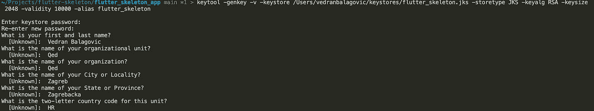

流动

好了，当我们有了一个密钥，我们检查我们可以获得 SHA，我们需要添加访问 android 应用程序内部 flutter 到这个密钥

在 android 文件夹中创建 key.properties 文件，该文件应该包含有关您的密钥、别名和密码的信息

此外，android 要访问 android/app/build.gradle 中的文件，我们需要添加这个文件&添加新的签名配置类型版本

## ios

如果您当前的机器上没有证书，您需要在您的苹果开发者帐户的[证书、标识符&配置文件](https://developer.apple.com/account/resources/certificates/list)中为苹果开发者创建证书

之后，您需要在[标识符](https://developer.apple.com/account/resources/identifiers/list)部分创建您的应用程序，如 com.example.app 标识符

使用 Xcode 打开 flutter 应用程序中的 ios 文件夹，添加上一步中创建的捆绑包标识符，并检查 Xcode 中的登录和功能部分是否为您提供了自动管理签名，如果您在帐户中添加了 apple developer 帐户。

现在你应该有一个最简单的 android 和 iOS 的应用程序设置，可能在 app/build.gradle 中更新 Xcode build 和 compileSdkVersion 的最小 iOS 目标，在根 android 文件夹 build.gradle 文件中更新 kotlin 版本。

> [fvm flutter run]将会给你关于以上所有东西的信息，以及在建造模拟器时需要的升级

# 设置口味

我们现在有一个功能演示应用程序，可以在 ios 和 android 上签名和构建/发布。我们现在将添加一些味道，以便更容易管理开发和生产版本，首先我们需要创建额外的标识符

## 机器人编队

在 android/app/build.gradle 中首次设置生产/通用应用 id

然后在同一个文件中为不同的风格添加特定的前缀或后缀

这将处理我们的应用程序标识符，现在我们仍然需要更新每个版本的名称，在 Android/app/src/main/Android manifest . XML 中添加 app_name

然后创建开发环境字符串:

路径:Android/app/src/dev/RES/values/strings . XML

和生产环境字符串:

路径:Android/app/src/prod/RES/values/strings . XML

> 你现在可以测试 Android 版本，应用程序应该有不同的名称和标识符

## iOS 形成

要再次在 iOS 中设置口味，我们需要切换到 Xcode 来管理方案。

在 Xcode-> Product-> Scheme-> New Scheme 中打开 flutter ios 文件夹，目标保持 Runner，添加两个方案 dev 和 prod。

之后，转到项目，运行并复制开发方案的调试/发布/概要文件配置。您可以将默认值重命名为 prod。

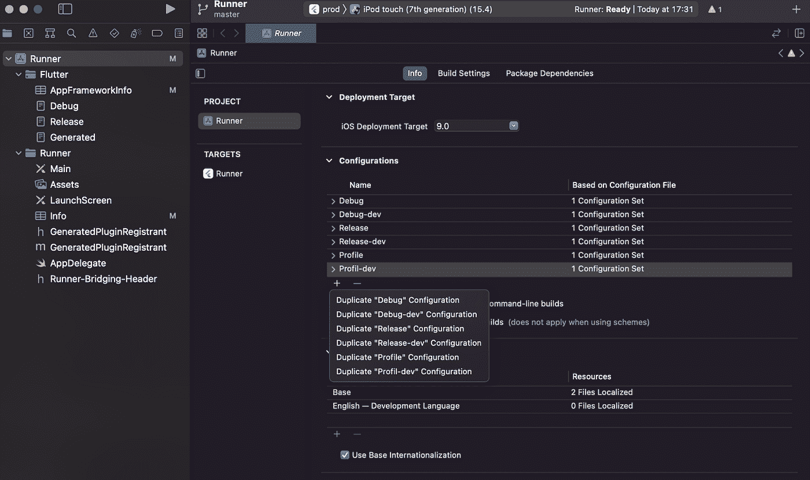

确保 schemes 现在指向正确的配置(只需右键单击 scheme 并编辑)

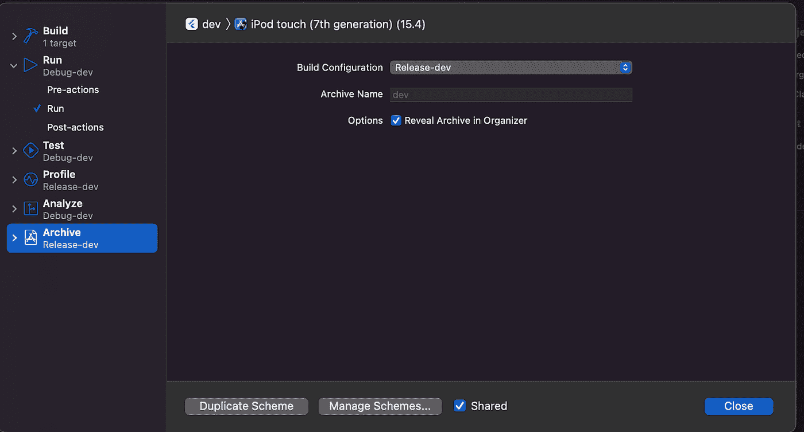

更新每种口味的捆绑包 id:

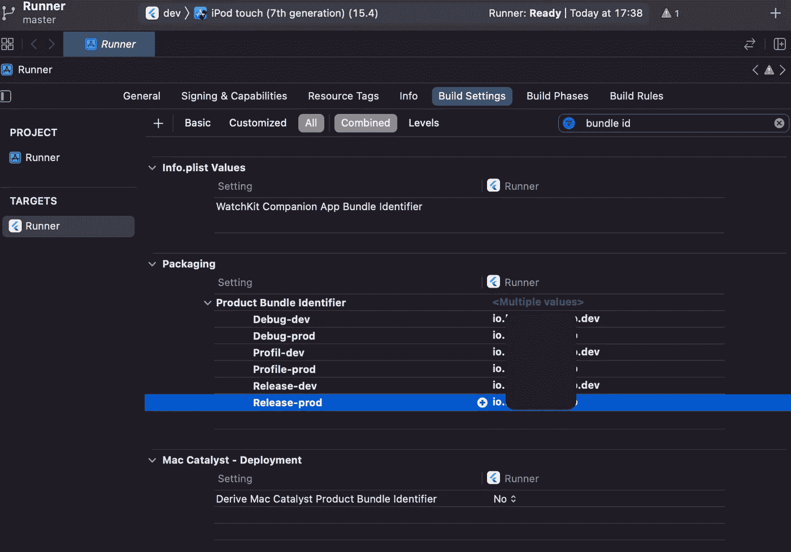

并添加新的用户定义的设置 APP_DISPLAY_NAME 和 update name per flavor。还要在 InfoPlist 中为包显示名称添加此变量。

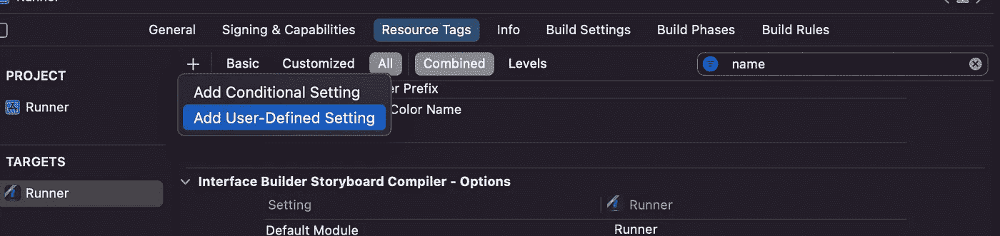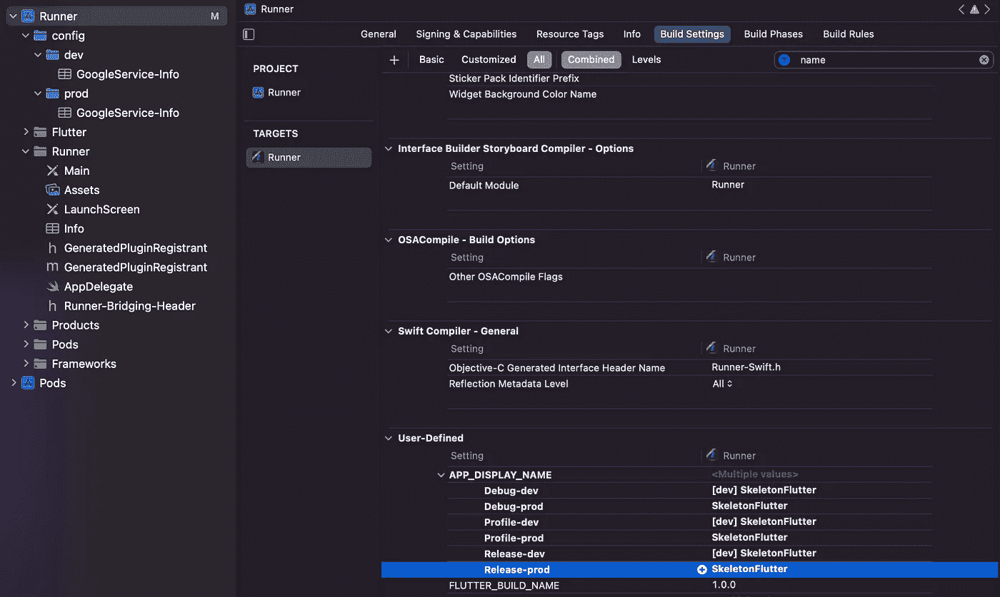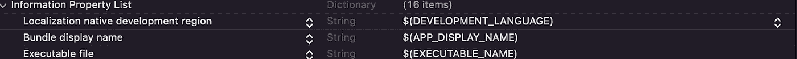

> 您可以在 ios 模拟器上运行再次测试

## 不同的图标

有趣的是，创建两个图标，其中一个带有一些开发人员注册，以便于识别，并安装 [flutter 启动器图标](https://pub.dev/packages/flutter_launcher_icons)包。

我在项目根目录中创建了 flutter _ launcher _ icons-dev . YAML 和 prod 版本 flutter _ launcher _ icons-prod . YAML。文件中唯一的区别是映像名称上的 dev/prod 后缀。

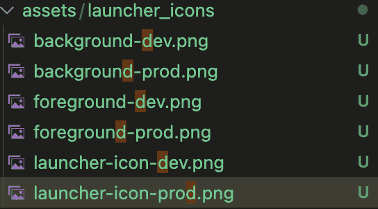

运行下一个命令，在你的 android 上运行构建应该相应地更新你的图标。我们需要为 ios 做这个手册。

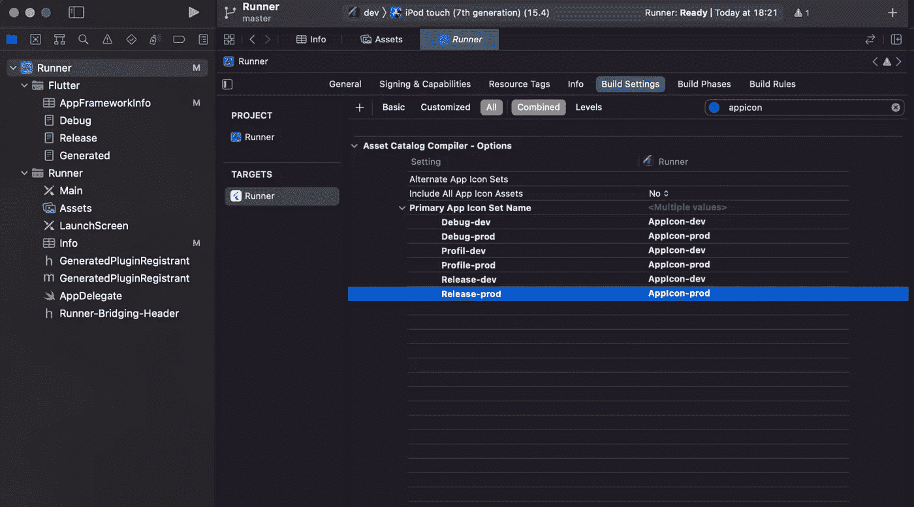

好了，现在我们有了不同的名称、id 和图标，是时候在应用程序中添加风格横幅和环境了，然后是不同的 firebase 设置。

# 设置风味横幅和环境

在 lib 文件夹中添加 flavor_config.dart

在同一文件夹中添加 flavor_banner.dart

在同一文件夹中创建 main_dev.dart 和 main_prod.dart

将 main.dart 重命名为 main_common.dart，并将其中的 main 函数重命名为 mainCommon()

*   安装颤振信息增强包
*   fvm flutter pub 添加包 _ 信息 _ 加

通过终端运行风味

# 设置风味火源

1.  为 flutter 安装 firebase_core 插件
2.  基于文档在 firebase 控制台上创建 2 个应用程序，所以开发 MYAPP 和 MYAPP，记住你已经安装了 firebase 核心包，所以你不必像文档中所说的那样单独添加它作为 iOS 的 SDK[https://firebase.google.com/docs/flutter/setup](https://firebase.google.com/docs/flutter/setup)
3.  每个应用都有自己的安卓和 iOS 版本
4.  对于 iOS，下载 GoogleServices-Info.plist，将其存储在这个结构中，然后将配置文件拖放到 Xcode 中

您的 Xcode 设置应该如下所示:

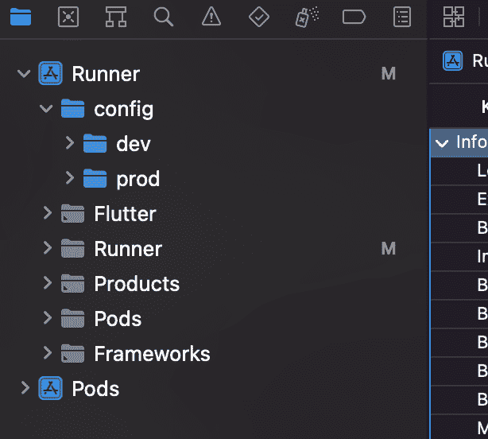

在 AppDelegate 中注册 Firebase 是您唯一需要做的事情:

然后我们需要添加一个脚本，它将在构建时复制正确的 firebase 文件，为此我感谢这个[脚本](https://gist.github.com/animeshjain/b7f754adee0a0a5ff1c41d698e6c6fb5#file-firebase-sh)，我将把它粘贴在下面

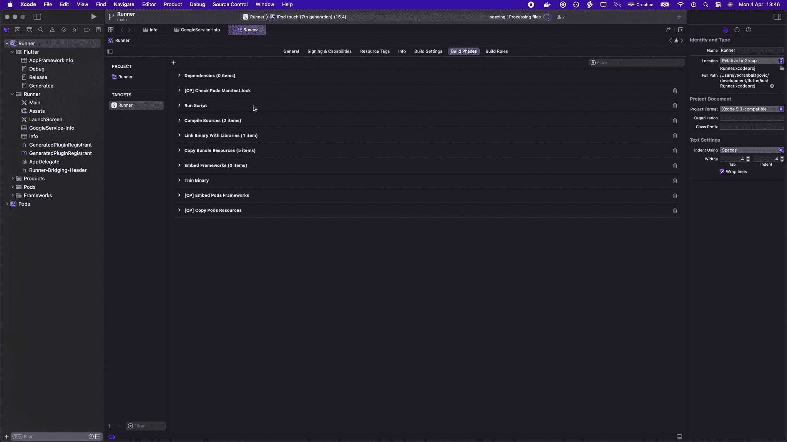

所以只需在构建阶段添加一个新的运行脚本，就在链接二进制文件的下面..有了上面的脚本。

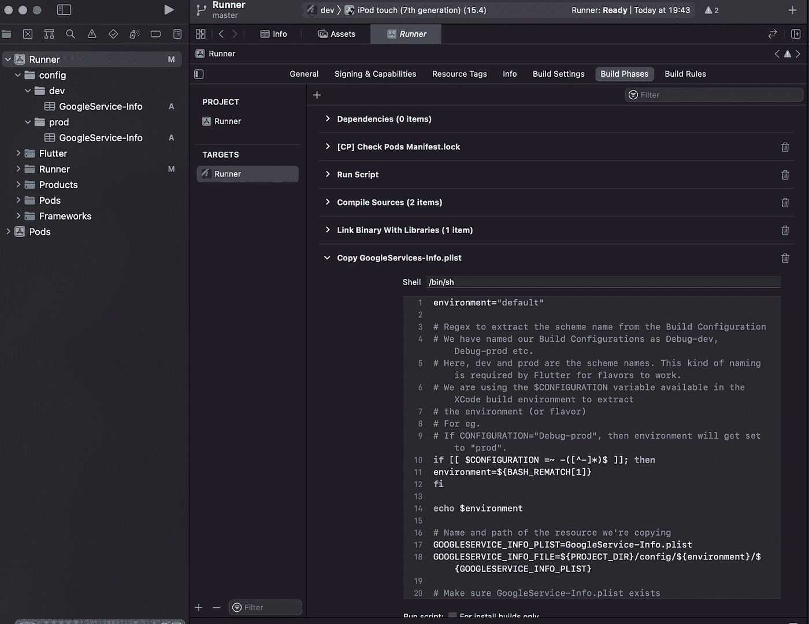

对于 Android，只需在 firebase 上创建新的应用程序，即可获得 SHA

你需要做的其他事情就是文档中提供的这两个步骤，然后把 dev GoogleServices.json 放到 android 的 dev src 文件夹中，把 prod 放到 prod 中

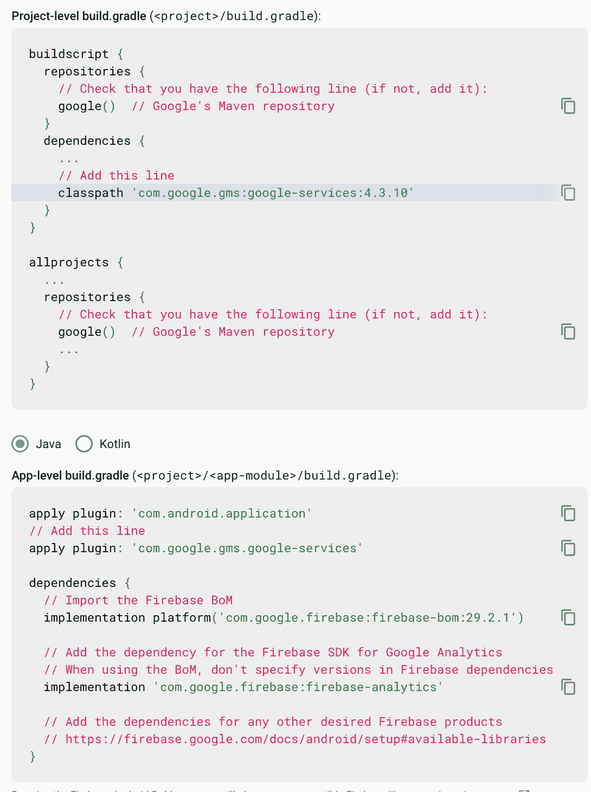

> Android/app/src/dev/Google-services . JSON
> 
> Android/app/src/prod/谷歌服务. json

# VS 代码设置

英寸 vscode 文件夹添加 launch.json 以便更容易地使用:

手动运行风味

> 要运行开发环境调试:

您可以添加 Firebase analytics，以便检查与 Firebase 的连接

> fvm flutter pub 添加 firebase_analytics

此外，不要忘记在安装分析软件之前清理 iOS 上的所有东西，因为它会更新所有的 pod 包

# 笔记

随着时间的推移和新软件包的安装，你可能需要更新 build.gradle 中的依赖项..只需阅读错误和更新版本。勇敢地:)

就是这样，[下一篇文章将讲述如何使用浪子的这种设置进行 firebase 应用程序分发](https://blog.devgenius.io/flutter-fastlane-deployment-to-the-firebase-app-distribution-easy-way-d5ca2fbdcdf9)和部署到商店。当我写这篇文章的时候已经很晚了，所以对于任何奇怪/错误的东西，请提前原谅我。如需任何更新、评论，请点击此处或 [Linkedin](https://www.linkedin.com/in/vedran-balagovi%C4%87-814968159/) 。

我也会尽快把整个骨架放到公共 github 回购上。我已经以这种方式开始了预设置应用程序的工作，所以你可以在这里查看:[https://github.com/vbalagovic/flutter-presetup](https://github.com/vbalagovic/flutter-presetup)