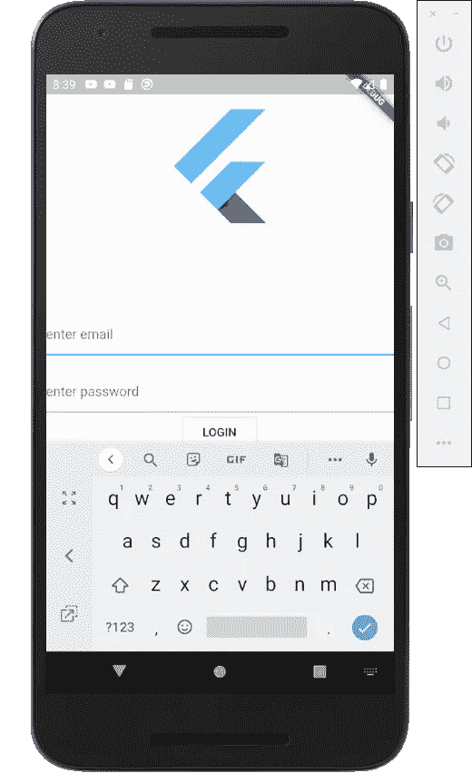

# 颤动溢出错误:单页视图

> 原文：<https://itnext.io/flutter-overflow-error-single-page-view-d4fab12684be?source=collection_archive---------5----------------------->

…例如登录页面

# 摘要

当您有一个包含电子邮件和密码的登录页面，并且当您点击文本字段时，会出现黑色和黄色条纹的溢出错误，因为键盘会推动 UI 并占用空间。因此，在本文中，我们将探讨如何使用 **SingleChildScrollView** 来解决这个问题。

# 说明

让我们以下面的例子为例，这是一个非常简单的登录页面，当您点击文本字段时，您会看到溢出错误。

## 固定

如上所述，解决方案是用 **SingleChildScrollView** 包装该列。 **SingleChildScrollView** 的目的是制作有时需要滚动的单一视图，比如我们的登录页面。用 SingleChildScrollView 包装我们的列的一个问题是没有框约束。要知道盒子约束为什么重要，请阅读这里的文章。为了添加盒子约束，我们使用 **LayoutBuilder** ，它提供屏幕的尺寸，传递给我们的列。以下是我们解决问题的方案:

如果你注意到，我们的**列**没有任何**扩展的**或**灵活的**小部件，如果我们有它们，那么我们会得到下面的错误。

> RenderFlex 子级具有非零 Flex，但引入的高度约束是无限制的。

为了修复这个错误，我们将在下一篇文章中讨论。

编码快乐！

检查我用 flutter 创建的本机应用程序。**目前只部署到苹果的 App Store。由于 Covid 延迟，谷歌的 Play Store 需要更多时间进行审查。**

 [## 核对清单:带模板

### 通过将清单保存为模板来提高工作效率。如果需要，安排到期日期和提醒，并获取…

chklist.app](https://chklist.app) 

此外，如果可能，请在 twitter 上关注我:

[https://twitter.com/marsgoat1](https://twitter.com/marsgoat1)