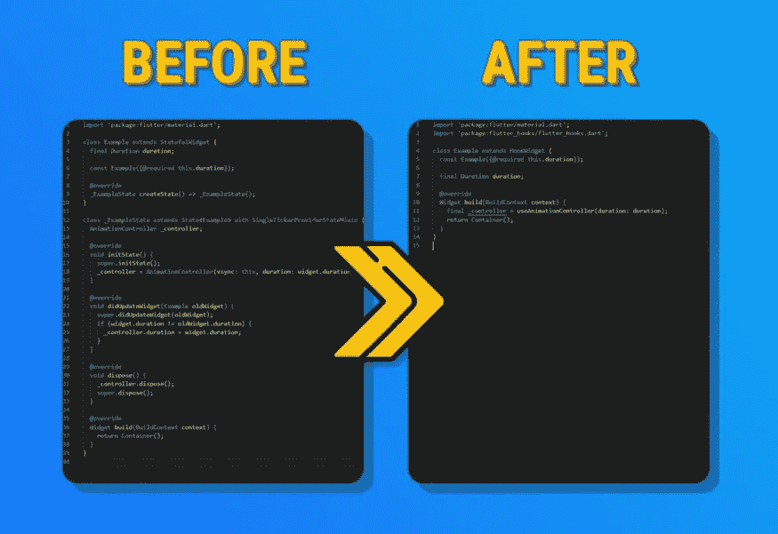
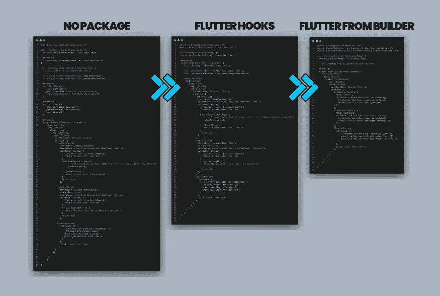
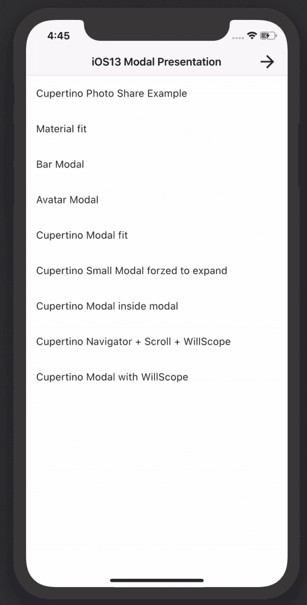
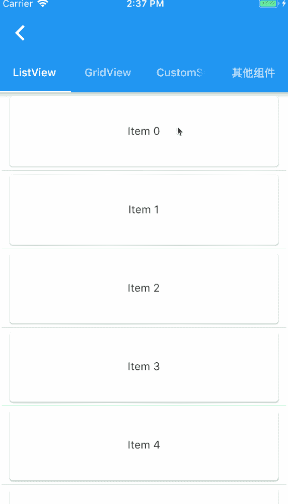

# 我在每个项目中使用的 Flutter 包

> 原文：<https://itnext.io/flutter-packages-that-i-use-in-every-project-b614cc54d256?source=collection_archive---------0----------------------->

## 以及为什么你也应该使用它们！！

在这篇文章里，我只是想把我喜欢的套餐介绍给新人。

我将讨论一些最好的 Flutter 软件包，它们可以缩短开发时间，并立即扩展您的 Flutter 应用程序的性能。

这些颤振包和库已经被用于颤振技术的各个方面。所以让我们继续前进

# 状态管理

我认为`riverpod`是最漂亮的状态管理解决方案。

它很快，很可靠，很完美！

为什么选择 Riverpod？
以下列出了您应该选择 Riverpod 的各种理由:

*   它不直接依赖于 Flutter SDK
*   Riverpod 可用于创建和实施具有不可变模型类的单向数据流(意味着它们不会改变)
*   Riverpod 不直接依赖于小部件树；其操作类似于服务定位器。这些提供程序是全局声明的，可以在应用程序中的任何地方使用
*   在编译时而不是运行时捕获编程错误
*   移除监听/组合对象的嵌套
*   确保代码是可测试的
*   自动处置支持
*   比较以前和新的状态
*   实现撤销-重做机制
*   调试应用程序状态

我给`riverpod`做了个指南。你可以去看看

 [## Riverpod 简约指南

### 颤振中最好的状态管理和依赖注入解决方案之一

itnext.io](/a-minimalist-guide-to-riverpod-4eb24b3386a1)  [## hooks_riverpod | Flutter 包

### 一个状态管理库:在编译时而不是运行时捕捉编程错误，为…移除嵌套

公共开发](https://pub.dev/packages/hooks_riverpod) 

# 清除器代码

`flutter_hooks`给了我们这么多干净的代码，摆脱了样板代码，为我们处理它们！

你可以查看[我的钩子文章](https://iisprey.medium.com/get-rid-of-all-kind-of-boilerplate-code-with-flutter-hooks-2e17eea06ca0)来获得一些想法

 [## 颤振 _ 挂钩|颤振包

### 英语|葡萄牙语是 React 钩子的一个抖动实现…

公共开发](https://pub.dev/packages/flutter_hooks) 

# 形式

我用它来获得更清晰和更好的颤动形式。这有助于我们摆脱这么多样板代码！

另外，我也有一篇关于这个包的文章！点击此处阅读[！](/building-forms-in-flutter-is-fun-now-bdcab1f31f87)

 [## 颤振 _ 表单 _ 生成器|颤振包

### 这个软件包通过删除构建表单所需的样板文件，帮助在 Flutter 中创建数据收集表单…

公共开发](https://pub.dev/packages/flutter_form_builder) 

# 建模

Dart 中的数据类糟透了

因为你需要手动处理 toJson-fromJson 函数，而且它是可变的，等等。

我知道，有像`[JSON to Dart](https://javiercbk.github.io/json_to_dart/)`和`[quicktype](https://app.quicktype.io)`这样的解决方案，但是它们给我们的配置和定制是有限的。

但是有两个包为我们提供了数据类的完整解决方案。

它们是高度可定制的，高度可靠的，摆脱了那么多样板代码。

他们是`json_serializable`和`freezed`

*   `json_serializable`帮助我们将模型转换成 JSON，反之亦然。
*   此外，帮助我们创建不可变的类，使我们的模型更加可靠。

`JSON Serializable + Freezed`是绝对的杀手。你再也不会和你的模特有任何争执了！

还有，你应该看看我的第一篇文章。我解释了为什么你应该使用它们

[https://IIS prey . medium . com/how-to-handle-complex-JSON-in-flutter-4982015 B4 fdf](https://iisprey.medium.com/how-to-handle-complex-json-in-flutter-4982015b4fdf)

 [## json_serializable | Dart 包

### 为处理 JSON 提供 Dart 构建系统生成器。构建器在找到用…注释的成员时会生成代码

公共开发](https://pub.dev/packages/json_serializable)  [## 冷冻| Dart 包装

### 欢迎使用 Freezed，这是另一个用于联合/模式匹配/复制的代码生成器。重要说明:从 0.14.0 和…

公共开发](https://pub.dev/packages/freezed) 

# HTTP 客户端

`dio`比`http`包好多了。

因为它有拦截器和高级功能和插件，如 [cache_interceptor](https://pub.dev/packages/dio_cache_interceptor) 、 [pretty_dio_logger](https://pub.dev/packages/pretty_dio_logger) 和 [cookie_manager](https://pub.dev/packages/dio_cookie_manager) ，你也可以制作自己的拦截器

 [## 飞镖包

### Language: English | 中文简体 A powerful Http client for Dart, which supports Interceptors, Global configuration, FormData…

公共开发](https://pub.dev/packages/dio) 

# 动画片

`Lottie`是一个轻量级动画包。您可以在 Adobe After Effects 上创建动画，并在 Flutter 上轻松制作动画！它又快又轻，你根本不用担心内存和 CPU 的问题。这使得你的应用程序更加用户友好

另外，你可以在这里找到很多来自[的动画](https://lottiefiles.com)

 [## 洛蒂|颤振包

### Lottie 是一个 Android 和 iOS 的移动库，它解析 Adobe After Effects 动画，导出为 json 格式，带有…

公共开发](https://pub.dev/packages/lottie) 

# 储存；储备

还可以，但是很慢，非常有限，太原始，被高估了。

我大多使用`hive`套装，但现在我感觉爱上了`objectbox`！

*   使用方便
*   相当快
*   它是安全的(高级加密支持)
*   不仅支持原语，还支持复杂对象

 [## 蜂巢|飞镖包

### Hive 是一个用纯 Dart 编写的轻量级、速度极快的键值数据库。灵感来自比特酒桶。如果你需要…

公共开发](https://pub.dev/packages/hive) 

*   甚至更快`hive`，支持跨设备自动数据同步

 [## 对象框| Dart 包

### 用于存储和同步 Dart 对象的超快速颤振数据库🏁高性能-提高响应速度和…

公共开发](https://pub.dev/packages/objectbox) 

还从`hive`作者那里获得了先进得多的新数据库系统。值得看一看

 [## Dart 包

### 快速入门*文档*示例应用程序*支持和想法* Pub.dev Isar [ee-zahr]:德国巴伐利亚的河流…

公共开发](https://pub.dev/packages/isar) 

# I18N & L10N

如果你的应用是多语言的，那么`intl`是必须的，因为它在本地化问题上为我们提供了很多帮助，比如

*   时区问题
*   数据时间格式
*   数字格式
*   货币格式
*   复数和性别..。

 [## 国际| Dart 包

### 提供国际化和本地化工具，包括消息翻译、复数和性别…

公共开发](https://pub.dev/packages/intl) 

# 生产助手

## 您不需要处理所有的本机代码和文件

创建一个本地闪屏，只需一行命令！

 [## flutter_native_splash |镖包

### 当你的应用程序打开时，会有一小段时间本机应用程序加载抖动。默认情况下，在此期间…

公共开发](https://pub.dev/packages/flutter_native_splash) 

只需一个神奇的命令就可以为每个设备创建启动图标！

详细信息请查看[这篇文章](/how-to-change-app-icon-in-flutter-ea259c9c2ed1)很有帮助！

 [## flutter_launcher_icons | Dart 包

### 一个命令行工具，简化了更新你的 Flutter 应用程序的启动器图标的任务。完全灵活，允许…

公共开发](https://pub.dev/packages/flutter_launcher_icons) 

# 航行

`auto_route`是导航系统需要的，因为

*   零样板文件(声明性)
*   基于 navigator v2.0
*   附带高级功能(中间件、深度链接等)。)
*   可以在没有上下文的情况下使用

 [## 最佳颤振导航包

### 在 Flutter with AutoRoute 中使用 Navigator v2.0 进行高级导航的简约指南

itnext.io](/the-best-flutter-navigation-package-c3c5ad201a50)  [## auto_route |颤振包

### 更多文档示例 https://autoroute.vercel.app 什么是 autoroute？这是一个颤振导航包，它…

公共开发](https://pub.dev/packages/auto_route) 

# 更好的用户界面/UX 体验

为什么不是默认的底层？

*   这给了我们更好的用户体验
*   支持内部滚动视图+向下拖动关闭
*   堆叠的原生底板支架
*   高度可定制

 [## modal_bottom_sheet |颤振包

### 1.0.0 中的重大更改在生成器参数中移除 scrollController 并使用 modalscrollcontroller . of(context)代替…

公共开发](https://pub.dev/packages/modal_bottom_sheet) 

`flash`包裹就像一把瑞士军刀。它是高度可定制和强大的！！

我用它来写对话、小吃和祝酒词。

 [## flash | Flutter 包

### ⚡️A 高度可定制，功能强大，易于使用的颤振警报库。网站…

公共开发](https://pub.dev/packages/flash) 

高度可定制和更加用户友好

 [## pull_to_refresh |颤振包

### 提供给 flutter scroll 组件下拉刷新和上拉加载的小部件。支持 android 和 ios。如果你…

公共开发](https://pub.dev/packages/pull_to_refresh) 

自动缓存图像并专业处理图像

 [## cached _ network _ image | Flutter 包

### 一个 flutter 库，显示来自互联网的图像，并将它们保存在缓存目录中。缓存网络图像可以是…

公共开发](https://pub.dev/packages/cached_network_image) 

## 感谢您的阅读！

那是一篇很长的文章，而你大老远跑来这里！你太棒了！请不要忘记鼓掌(也可能你不知道鼓掌可以达到 50 次，只是在你走的时候点击)